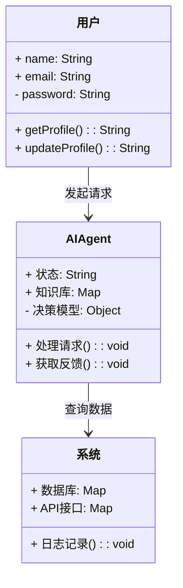
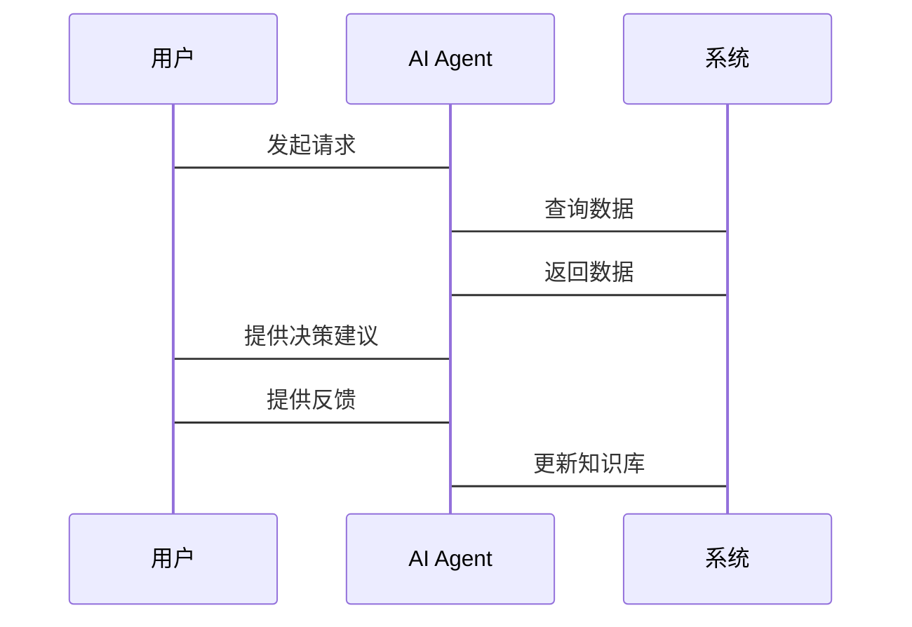

                 


# AI Agent在企业数字化转型中的关键角色与实施策略

## 关键词：AI Agent、数字化转型、企业智能化、智能决策、流程自动化、数据分析

## 摘要：  
AI Agent（人工智能代理）作为企业数字化转型的核心技术之一，正在改变企业的运营模式和决策方式。本文从AI Agent的基本概念、技术原理、应用场景、系统架构设计以及实施策略等方面进行深入分析，探讨其在企业数字化转型中的关键作用，并提供具体的实施路径和最佳实践。通过本文的阐述，读者能够全面理解AI Agent的价值，并掌握如何在企业中有效应用这一技术。

---

# 第一部分：AI Agent在企业数字化转型中的背景与概念

## 第1章：AI Agent的基本概念与数字化转型背景

### 1.1 AI Agent的定义与核心特征  
AI Agent是一种能够感知环境、自主决策并执行任务的智能实体。它具备以下核心特征：  
- **自主性**：能够在没有外部干预的情况下独立运行。  
- **反应性**：能够实时感知环境并做出反应。  
- **目标导向**：通过设定目标来驱动行为。  
- **学习能力**：能够通过数据和经验不断优化自身的决策能力。  

### 1.2 数字化转型的背景与挑战  
- **数字化转型的定义与目标**：  
  数字化转型是指企业利用数字技术（如人工智能、大数据、云计算等）重构业务模式、流程和决策方式，以提高效率、降低成本并创造新的价值。  
- **企业数字化转型中的主要挑战**：  
  - 数据孤岛问题：企业内部数据分散，难以实现高效整合与共享。  
  - 业务流程复杂：传统流程缺乏灵活性，难以适应快速变化的市场需求。  
  - 技术与业务的结合：技术团队与业务团队之间的沟通不畅，导致技术难以真正落地。  

### 1.3 AI Agent在数字化转型中的作用  
AI Agent能够通过自动化处理、智能决策和实时反馈，帮助企业实现以下目标：  
- 提高业务流程的效率。  
- 优化资源配置。  
- 支持智能决策，提升企业竞争力。  

---

## 第2章：AI Agent在企业数字化转型中的关键角色

### 2.1 AI Agent在企业中的主要角色  
- **智能决策支持**：AI Agent能够通过分析大量数据，为企业提供基于数据的决策支持。  
- **流程自动化**：AI Agent能够自动执行重复性任务，减少人工干预，提高效率。  
- **数据分析与洞察**：AI Agent能够从海量数据中提取有价值的信息，为企业提供深度洞察。  

### 2.2 AI Agent在不同业务场景中的应用  
- **销售与客户服务**：AI Agent可以作为智能客服，为客户提供个性化的服务。  
- **运营与供应链管理**：AI Agent可以通过预测需求优化库存管理。  
- **产品开发与创新**：AI Agent可以帮助企业快速分析市场需求，推动产品创新。  

### 2.3 AI Agent在企业数字化转型中的价值  
- **提高效率**：通过自动化处理减少人工操作，降低时间成本。  
- **降低成本**：减少人力资源投入，降低运营成本。  
- **优化决策**：基于数据分析提供精准的决策支持。  

---

# 第二部分：AI Agent的核心概念与技术原理

## 第3章：AI Agent的核心概念与理论基础

### 3.1 AI Agent的基本原理  
- **知识表示与推理**：通过知识图谱和逻辑推理，AI Agent能够理解和分析复杂问题。  
- **行为规划与决策**：基于目标，AI Agent会制定行动计划并执行。  
- **人机交互与反馈机制**：AI Agent能够通过自然语言处理与用户交互，并根据反馈优化自身行为。  

### 3.2 AI Agent的架构与设计  
- **分层架构**：AI Agent通常采用感知层、决策层和执行层的分层设计。  
- **模块化设计**：不同功能模块（如数据采集、分析、决策等）独立运行，便于维护和扩展。  
- **可扩展性与灵活性**：AI Agent的架构设计需要支持功能的扩展和适应性调整。  

### 3.3 AI Agent的核心技术  
- **自然语言处理（NLP）**：用于实现人机交互和文本理解。  
- **机器学习（ML）**：用于数据挖掘和模式识别，支持智能决策。  
- **知识图谱**：用于构建知识库，支持复杂的推理和分析。  

---

## 第4章：AI Agent与相关技术的对比分析

### 4.1 AI Agent与传统自动化工具的对比  
| 对比维度         | AI Agent                          | 传统自动化工具                  |
|------------------|-----------------------------------|--------------------------------|
| 功能             | 智能决策、数据分析、人机交互      | 任务执行、流程自动化            |
| 技术实现         | 基于机器学习、NLP                | 基于规则引擎或脚本             |
| 适用场景         | 复杂决策、动态环境               | 固定流程、规则明确的场景        |

### 4.2 AI Agent与RPA（机器人流程自动化）的对比  
- **概念对比**：RPA专注于流程自动化，而AI Agent具备更强的智能性和适应性。  
- **技术实现对比**：RPA依赖规则引擎，AI Agent依赖机器学习和NLP。  
- **适用场景对比**：RPA适用于重复性任务，AI Agent适用于需要智能决策的任务。  

### 4.3 AI Agent与AI推理引擎的对比  
- **概念对比**：AI推理引擎专注于逻辑推理，AI Agent是一个综合性的智能实体。  
- **技术实现对比**：AI Agent结合了推理引擎、NLP和机器学习等多种技术。  
- **适用场景对比**：AI Agent适用于复杂的业务场景，AI推理引擎适用于特定的逻辑推理任务。  

---

# 第三部分：AI Agent的算法原理与数学模型

## 第5章：AI Agent的核心算法原理

### 5.1 决策树算法  
决策树是一种常用的机器学习算法，用于分类和回归问题。  
**算法流程**：  
1. 数据预处理：清洗数据，处理缺失值。  
2. 特征选择：基于信息增益选择最优特征。  
3. 决策树构建：递归地划分数据集，直到满足停止条件。  
4. 剪枝优化：防止过拟合，提升模型泛化能力。  
5. 模型评估：使用测试数据评估模型性能。  

**数学模型**：  
信息增益公式：  
$$ \text{信息增益}(D, A) = H(D) - H(D|A) $$  
其中，$H(D)$是数据集的熵，$H(D|A)$是基于特征$A$的条件熵。  

### 5.2 强化学习算法  
强化学习是一种通过试错方式优化决策策略的算法。  
**算法流程**：  
1. 状态识别：识别当前环境状态。  
2. 动作选择：基于当前状态选择一个动作。  
3. 状态转移：执行动作，观察新的状态。  
4. 奖励计算：根据新状态计算奖励值。  
5. 策略优化：基于奖励值优化策略。  

**数学模型**：  
Q-learning算法的更新公式：  
$$ Q(s, a) = Q(s, a) + \alpha \left[ r + \gamma \max Q(s', a') - Q(s, a) \right] $$  
其中，$\alpha$是学习率，$\gamma$是折扣因子。  

---

## 第6章：AI Agent的系统架构设计

### 6.1 系统功能设计  
- **领域模型**：通过Mermaid类图展示系统中的实体及其关系。  



### 6.2 系统架构设计  
- **架构图**：通过Mermaid展示系统的分层架构。  


### 6.3 系统接口设计  
- **API接口**：定义AI Agent与外部系统的交互接口。  

### 6.4 系统交互流程图  
- **交互流程**：通过Mermaid序列图展示用户与AI Agent的交互流程。  



---

# 第四部分：AI Agent的项目实战

## 第7章：AI Agent在企业中的项目实战

### 7.1 环境配置  
- **Python版本**：Python 3.8及以上  
- **依赖库安装**：`pip install numpy pandas scikit-learn`  

### 7.2 核心代码实现  
```python
# 决策树算法实现
from sklearn.tree import DecisionTreeClassifier
from sklearn.model_selection import train_test_split
from sklearn.metrics import accuracy_score

# 数据加载与预处理
data = pd.read_csv('data.csv')
X = data.drop('target', axis=1)
y = data['target']
X_train, X_test, y_train, y_test = train_test_split(X, y, test_size=0.2)

# 模型训练
clf = DecisionTreeClassifier()
clf.fit(X_train, y_train)

# 模型预测
y_pred = clf.predict(X_test)
print("Accuracy:", accuracy_score(y_test, y_pred))
```

### 7.3 代码应用解读与分析  
- **数据加载与预处理**：读取数据集并进行特征与标签的分离。  
- **模型训练**：使用训练数据训练决策树模型。  
- **模型预测**：使用测试数据进行预测，并计算准确率。  

### 7.4 实际案例分析  
- **案例背景**：某企业希望通过AI Agent优化客户服务流程。  
- **实施步骤**：  
  1. 数据收集：收集客户反馈和历史数据。  
  2. 模型训练：训练客户满意度预测模型。  
  3. 系统集成：将模型集成到客户服务系统中，实现智能客服。  

### 7.5 项目小结  
通过项目实战，展示了AI Agent在实际中的应用价值，验证了其在提高效率和优化决策方面的优势。  

---

## 第8章：总结与展望

### 8.1 总结  
AI Agent作为一种智能化工具，正在为企业数字化转型提供强有力的支持。通过自动化处理、智能决策和实时反馈，AI Agent能够帮助企业优化流程、降低成本并提升竞争力。  

### 8.2 未来展望  
- **技术进步**：AI Agent将更加智能化，具备更强的学习和推理能力。  
- **应用场景扩展**：AI Agent将应用于更多领域，如智能制造、智慧城市等。  
- **人机协作增强**：AI Agent与人类的协作将更加 seamless，用户体验将进一步提升。  

### 8.3 最佳实践 tips  
- 在实施AI Agent之前，企业需要明确目标和需求。  
- 数据是AI Agent的核心，企业需要重视数据质量管理。  
- AI Agent的实施需要跨部门协作，确保技术与业务的深度结合。  

---

通过本文的详细阐述，读者能够全面理解AI Agent在企业数字化转型中的关键角色，并掌握其实施策略。希望本文能够为企业的数字化转型提供有价值的参考和指导。

