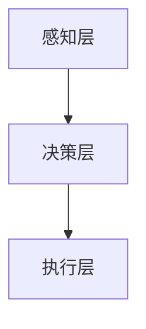
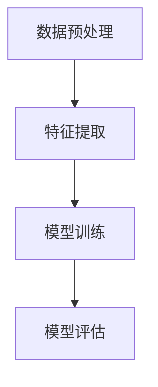
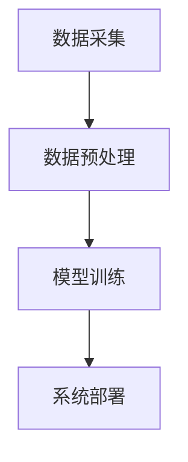
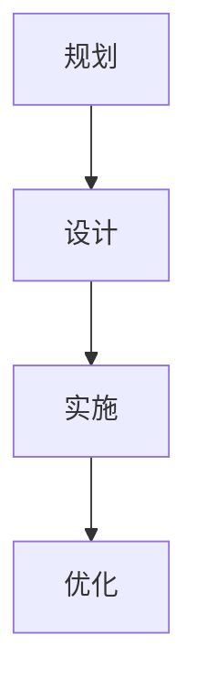
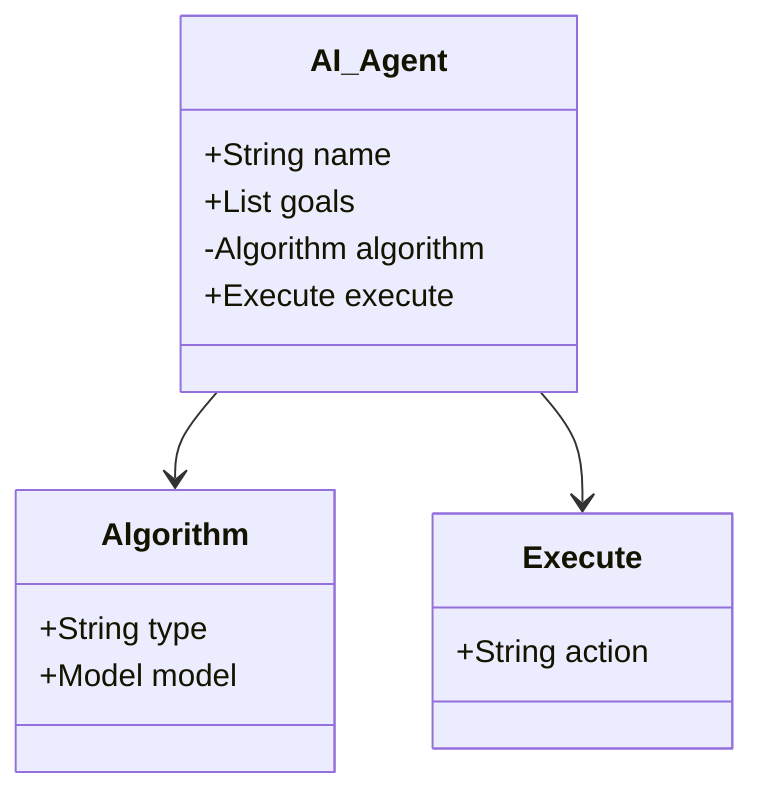

                 

# AI Agent在企业数字化转型中的战略定位与实施路径

> 关键词：AI Agent，企业数字化转型，战略定位，实施路径，人工智能技术

> 摘要：本文详细探讨了AI Agent在企业数字化转型中的战略定位与实施路径。首先介绍了AI Agent的基本概念与核心原理，分析了企业数字化转型的背景与挑战，随后深入讲解了AI Agent的架构与实现原理。接着，从战略定位的角度分析了AI Agent在企业数字化转型中的价值与关键能力，并提出了具体的实施路径。最后，通过实际案例展示了AI Agent在系统架构设计与项目实战中的应用，总结了最佳实践与未来展望。

---

## 第1章: AI Agent 的基本概念与核心原理

### 1.1 AI Agent 的定义与特点

AI Agent（人工智能代理）是一种能够感知环境、自主决策并执行任务的智能实体。它通过与环境交互，利用传感器获取信息，利用推理引擎做出决策，并通过执行器完成目标。AI Agent 的特点包括：

- **自主性**：能够自主决策，无需人工干预。
- **反应性**：能够实时感知环境变化并做出反应。
- **目标导向性**：以实现特定目标为导向。
- **学习能力**：通过机器学习算法不断优化自身行为。

与传统AI相比，AI Agent 更加注重与环境的动态交互，能够在复杂环境中适应和进化。

### 1.2 AI Agent 的核心原理

AI Agent 的核心原理可以分为感知、决策和执行三个层面：

1. **感知层**：通过传感器或数据接口获取环境信息，如图像、文本、语音等。
2. **决策层**：基于感知到的信息，利用机器学习算法进行推理和决策，选择最优行动方案。
3. **执行层**：通过执行器或API将决策结果转化为具体行动。

**AI Agent 的工作流程**：

1. 数据采集：通过传感器或API获取环境数据。
2. 数据预处理：清洗、归一化等处理，为后续分析做准备。
3. 模型训练：利用机器学习算法（如监督学习、无监督学习、强化学习）训练模型。
4. 决策推理：基于训练好的模型，推理出最优决策。
5. 任务执行：通过执行器或API完成任务。
6. 反馈优化：根据执行结果调整模型或策略。

---

## 第2章: 企业数字化转型的背景与挑战

### 2.1 数字化转型的定义与目标

数字化转型是指企业利用数字技术（如人工智能、大数据、云计算等）优化业务流程、提升效率、创造新价值的过程。其核心目标包括：

- 提升企业运营效率
- 优化资源配置
- 支持创新业务模式

### 2.2 企业数字化转型中的主要挑战

企业在数字化转型过程中面临的主要挑战包括：

1. **数据孤岛问题**：各部门之间数据分散，难以统一管理和利用。
2. **技术与组织协同**：新技术引入后，组织结构和文化需要相应调整，否则可能导致技术落地困难。
3. **人才短缺**：缺乏具备技术背景和业务理解力的复合型人才。

### 2.3 AI Agent 在数字化转型中的作用

AI Agent 在企业数字化转型中的作用主要体现在以下几个方面：

1. **提升效率**：通过自动化处理业务流程，减少人工干预，提升效率。
2. **优化决策**：基于实时数据和机器学习模型，提供更精准的决策支持。
3. **创新模式**：支持企业探索新的业务模式，如智能化客服、自动化供应链管理等。

---

## 第3章: AI Agent 的架构与实现原理

### 3.1 AI Agent 的整体架构

AI Agent 的架构通常分为三层：感知层、决策层和执行层。

1. **感知层**：负责数据的采集与预处理。
2. **决策层**：基于感知层提供的数据，利用机器学习模型进行推理和决策。
3. **执行层**：根据决策层的指令，通过执行器完成任务。

**AI Agent 的架构图**：

### 3.2 AI Agent 的核心算法与技术

AI Agent 的核心算法包括：

1. **机器学习算法**：如监督学习、无监督学习、强化学习。
2. **自然语言处理（NLP）技术**：用于处理文本数据。
3. **规则引擎与知识图谱**：用于构建业务规则和知识库。

**监督学习流程图**：

### 3.3 AI Agent 的实现流程

AI Agent 的实现流程包括：

1. 数据采集与预处理
2. 模型训练与优化
3. 系统集成与部署

**AI Agent 的实现流程图**：

---

## 第4章: AI Agent 在企业数字化转型中的战略定位

### 4.1 AI Agent 的价值分析

AI Agent 在企业数字化转型中的价值体现在以下几个方面：

1. **提升效率**：通过自动化处理重复性任务，提升企业运营效率。
2. **优化决策**：基于实时数据和机器学习模型，提供更精准的决策支持。
3. **创新模式**：支持企业探索新的业务模式，如智能化客服、自动化供应链管理等。

### 4.2 AI Agent 的关键能力

AI Agent 的关键能力包括：

1. **数据处理能力**：能够高效处理大规模数据。
2. **决策能力**：基于数据和模型进行智能决策。
3. **执行能力**：能够通过API或执行器完成任务。

---

## 第5章: AI Agent 的实施路径

### 5.1 AI Agent 的实施阶段

AI Agent 的实施通常分为以下几个阶段：

1. **规划阶段**：明确目标、范围和资源。
2. **设计阶段**：设计系统架构、算法和接口。
3. **实施阶段**：开发、测试和部署。
4. **优化阶段**：监控、反馈和优化。

**AI Agent 的实施路径图**：

---

## 第6章: 系统架构设计与项目实战

### 6.1 系统架构设计

系统架构设计包括以下几个部分：

1. **系统功能设计**：基于领域模型设计功能模块。
2. **系统架构设计**：设计系统的整体架构。
3. **系统接口设计**：设计模块之间的接口。

**系统功能设计类图**：

---

## 第7章: 总结与展望

### 7.1 总结

AI Agent 在企业数字化转型中具有重要的战略地位。通过提升效率、优化决策和创新模式，AI Agent 能够帮助企业实现数字化转型的目标。

### 7.2 展望

随着人工智能技术的不断发展，AI Agent 的应用前景将更加广阔。未来，AI Agent 将在更多领域发挥重要作用，如智能制造、智慧城市等。

---

## 附录: AI Agent 相关术语表

- AI Agent：人工智能代理，能够感知环境、自主决策并执行任务的智能实体。
- 机器学习：一种人工智能技术，通过数据训练模型，实现对新数据的预测或分类。
- 自然语言处理（NLP）：一种人工智能技术，用于处理和理解人类语言。

---

以上是《AI Agent在企业数字化转型中的战略定位与实施路径》的完整目录和内容概述。

