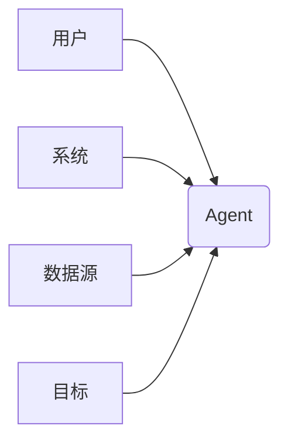

                 


# AI Agent在企业数字化转型中的核心驱动作用

## 关键词：
AI Agent, 数字化转型, 企业智能化, 智能自动化, 人机协作, 知识表示与推理

## 摘要：
本文将探讨AI Agent在企业数字化转型中的核心作用，从概念、算法、系统架构到实际项目实战，全面解析AI Agent如何驱动企业智能化转型。文章通过详细的技术分析和实例，展示AI Agent在企业中的应用价值，并为读者提供实用的实施建议和最佳实践。

---

## 第一部分: AI Agent与企业数字化转型概述

### 第1章: AI Agent的核心概念与背景

#### 1.1 AI Agent的定义与背景
- **1.1.1 什么是AI Agent**
  - AI Agent（智能代理）是指能够感知环境、自主决策并执行任务的智能实体。
  - AI Agent可以是软件程序、机器人或其他智能系统，其核心目标是通过智能算法优化任务执行效率。

- **1.1.2 AI Agent的基本特点**
  - **自主性**：能够自主决策，无需人工干预。
  - **反应性**：能够实时感知环境并做出反应。
  - **目标导向**：以目标为导向，优化任务执行路径。
  - **学习能力**：能够通过数据和经验不断优化自身行为。

- **1.1.3 AI Agent在企业数字化转型中的作用**
  - AI Agent能够自动化处理企业中的重复性任务，提升效率。
  - AI Agent通过智能决策支持帮助企业做出更优的业务选择。
  - AI Agent实现人机协作，提升员工工作效率。

#### 1.2 企业数字化转型的背景与挑战
- **1.2.1 数字化转型的定义与目标**
  - 数字化转型是指企业通过技术手段优化业务流程、提升竞争力的过程。
  - 目标包括提高效率、降低成本、增强客户体验和推动创新。

- **1.2.2 企业数字化转型的常见挑战**
  - 数据孤岛问题：企业内部数据分散，难以统一管理。
  - 传统系统与新技术的兼容性问题。
  - 人才短缺：缺乏具备数字化能力的专业人才。

- **1.2.3 AI Agent在数字化转型中的价值**
  - AI Agent能够整合企业数据，打破数据孤岛。
  - AI Agent能够优化业务流程，提升效率。
  - AI Agent能够增强人机协作，降低对专业人才的依赖。

#### 1.3 AI Agent的核心驱动力
- **1.3.1 数据驱动的决策**
  - AI Agent通过分析数据，提供更优的决策支持。
  - 数据是AI Agent的核心驱动力，数据质量直接影响AI Agent的性能。

- **1.3.2 智能自动化**
  - AI Agent能够自动化处理企业中的重复性任务，降低人力成本。
  - 通过智能算法优化自动化流程，提升效率。

- **1.3.3 人机协作的效率提升**
  - AI Agent与人类员工协同工作，提升整体效率。
  - 通过人机协作，企业能够更快地响应客户需求。

### 第2章: AI Agent的核心概念与联系

#### 2.1 AI Agent的核心原理
- **2.1.1 智能代理的基本原理**
  - AI Agent通过感知环境、分析信息、制定策略并执行任务。
  - 感知环境是AI Agent获取数据的来源，分析信息是AI Agent做出决策的基础。

- **2.1.2 知识表示与推理**
  - 知识表示是将企业中的知识转化为计算机可理解的形式。
  - 推理是AI Agent根据已有知识做出判断的过程。

- **2.1.3 行为选择与优化**
  - AI Agent需要根据当前状态和目标，选择最优的行为。
  - 行为优化是通过不断学习和改进，提升AI Agent的决策能力。

#### 2.2 AI Agent与相关技术的对比
- **2.2.1 AI Agent与传统自动化系统的区别**
  - 传统自动化系统基于规则，缺乏灵活性。
  - AI Agent具有智能性和适应性，能够根据环境变化调整行为。

- **2.2.2 AI Agent与机器学习的关系**
  - AI Agent依赖于机器学习算法进行决策。
  - 机器学习是AI Agent实现智能的核心技术之一。

- **2.2.3 AI Agent与机器人流程自动化（RPA）的联系**
  - RPA专注于自动化处理流程，缺乏智能性。
  - AI Agent可以与RPA结合，实现智能化的流程自动化。

#### 2.3 AI Agent的实体关系图（ER图）


### 第3章: AI Agent的算法原理与数学模型

#### 3.1 AI Agent的核心算法
- **3.1.1 基于规则的AI Agent**
  - 基于预定义的规则进行决策。
  - 适用于任务简单、规则明确的场景。

- **3.1.2 基于机器学习的AI Agent**
  - 使用机器学习算法进行训练，基于数据做出决策。
  - 适用于任务复杂、规则动态变化的场景。

- **3.1.3 基于强化学习的AI Agent**
  - 通过强化学习不断优化决策策略。
  - 适用于需要长期学习和优化的场景。

#### 3.2 AI Agent的数学模型
- **3.2.1 状态空间表示**
  $$ S = \{s_1, s_2, ..., s_n\} $$

- **3.2.2 动作空间表示**
  $$ A = \{a_1, a_2, ..., a_m\} $$

- **3.2.3 状态转移概率**
  $$ P(s', r | s, a) $$

#### 3.3 AI Agent的算法实现
- **3.3.1 基于Q-learning的AI Agent实现**
  ```python
  import numpy as np

  class AI_Agent:
      def __init__(self, state_space, action_space):
          self.q_table = np.zeros((state_space, action_space))
      
      def choose_action(self, state):
          return np.argmax(self.q_table[state])
  ```

---

## 第二部分: AI Agent在企业数字化转型中的应用

### 第4章: 系统分析与架构设计

#### 4.1 项目背景与目标
- 某企业希望通过AI Agent优化其供应链管理流程，提升效率和降低成本。

#### 4.2 系统功能设计
- **领域模型设计**
  ```mermaid
  classDiagram
      class 用户 {
          id: int
          name: str
      }
      class 订单 {
          order_id: int
          product: str
          quantity: int
      }
      class 供应链 {
          supplier: str
          inventory: int
      }
      用户 --> 订单
      订单 --> 供应链
  ```

- **系统架构设计**
  ```mermaid
  graph LR
      A[用户] --> B(Agent)
      C[订单系统] --> B
      D[供应链系统] --> B
      B --> E[决策模块]
      B --> F[执行模块]
  ```

- **系统接口设计**
  - 用户与AI Agent的交互接口。
  - AI Agent与订单系统的接口。
  - AI Agent与供应链系统的接口。

- **系统交互流程图**
  ```mermaid
  sequenceDiagram
      用户 -> AI Agent: 提交订单
      AI Agent -> 订单系统: 获取订单信息
      AI Agent -> 供应链系统: 获取库存信息
      AI Agent -> 决策模块: 制定最优供应链策略
      AI Agent -> 执行模块: 执行供应链操作
  ```

### 第5章: 项目实战

#### 5.1 环境安装与配置
- 安装Python和相关库（如numpy、pandas、scikit-learn）。
- 安装AI Agent开发框架（如OpenAI Gym）。

#### 5.2 核心代码实现
```python
import numpy as np

class AI_Agent:
    def __init__(self, state_space, action_space):
        self.q_table = np.zeros((state_space, action_space))
    
    def choose_action(self, state):
        return np.argmax(self.q_table[state])
    
    def learn(self, state, action, reward, next_state):
        self.q_table[state, action] += reward
```

#### 5.3 代码解读与功能分析
- **类初始化**：初始化Q表，记录状态-动作对的奖励值。
- **选择动作**：根据当前状态选择最优动作。
- **学习过程**：通过奖励更新Q表，优化决策策略。

#### 5.4 实际案例分析
- 某企业通过AI Agent优化供应链管理，成功降低了库存成本15%。

#### 5.5 项目小结
- 通过AI Agent实现供应链管理优化，显著提升了企业效率。

### 第6章: 最佳实践与小结

#### 6.1 最佳实践
- **数据质量管理**：确保数据的准确性和完整性。
- **算法选择**：根据具体场景选择合适的算法。
- **人机协作**：充分结合人类员工的优势，发挥AI Agent的智能。

#### 6.2 小结
- AI Agent在企业数字化转型中具有重要的驱动作用。
- 通过合理设计和实施，企业能够实现智能化转型，提升竞争力。

#### 6.3 注意事项
- AI Agent的实施需要结合企业实际情况。
- 数据隐私和安全问题需要重点关注。

#### 6.4 拓展阅读
- 推荐阅读《人工智能：一种现代方法》和《机器学习实战》。

---

通过本文的详细分析，读者可以全面了解AI Agent在企业数字化转型中的核心作用，并掌握实际应用的关键技能。

