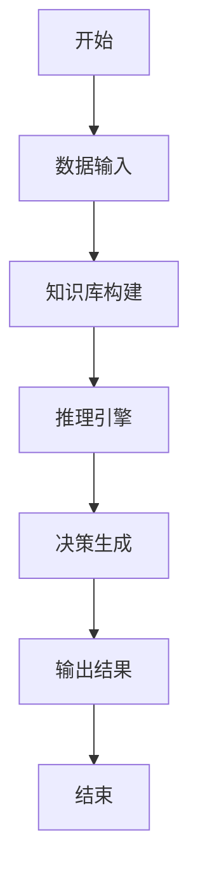
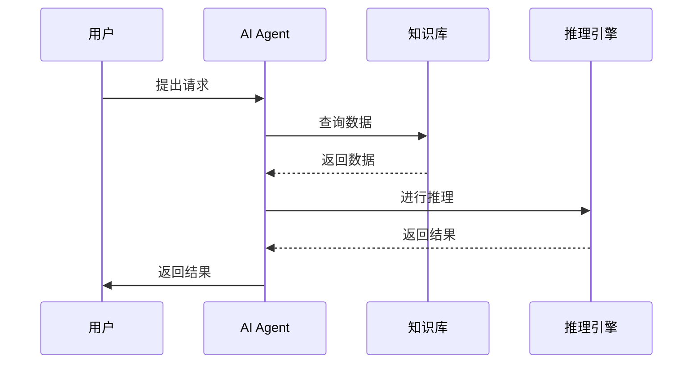

                 


# AI Agent在企业数字化转型中的角色：从战略到执行

## 关键词：
- AI Agent, 企业数字化转型, 智能化, 人工智能, 系统架构, 项目实战

## 摘要：
本文深入探讨AI Agent在企业数字化转型中的关键作用，从战略规划到技术实现，结合实际案例，分析其对企业业务流程的优化和创新，为企业提供AI Agent的系统架构设计、算法原理和实施策略，助力企业实现高效转型。

---

## 第1章：AI Agent与企业数字化转型概述

### 1.1 AI Agent的基本定义
- **AI Agent**是能够感知环境、自主决策并执行任务的智能实体，涵盖软件、硬件和数据接口。
- 与传统软件相比，AI Agent具备自适应、学习和推理能力，能处理动态环境中的复杂问题。
- **核心特征**包括自主性、反应性、主动性、社会性、持续性和安全性。

### 1.2 企业数字化转型的背景
- **定义**：利用数字技术优化业务流程、模式和决策，提升竞争力和效率。
- **驱动因素**：技术进步、市场竞争和客户需求。
- **目标与挑战**：实现业务流程自动化、数据驱动决策和创新，但面临数据孤岛、技术选型和人才短缺等挑战。

### 1.3 AI Agent在数字化转型中的作用
- **核心价值**：通过自动化和智能化提升效率，优化决策，增强客户体验。
- **应用场景**：客户服务、供应链管理、风险管理等领域。
- **关键能力**：数据处理、知识表示和推理能力，能有效解决复杂问题。

## 第2章：AI Agent的技术原理与算法

### 2.1 AI Agent的结构
- **知识库与数据源**：包括结构化数据、文档和API，支持实时信息处理。
- **推理引擎**：通过逻辑推理和模式匹配生成解决方案。
- **行为决策模块**：基于推理结果和外部反馈调整策略。

### 2.2 AI Agent的核心算法
- **知识表示**：使用谓词逻辑和语义网络，通过特征提取和本体论建模处理数据。
- **逻辑推理**：运用规则推理和逻辑演算，解决复杂问题。
- **机器学习**：利用监督学习、强化学习优化决策模型。

### 2.3 算法流程图


### 2.4 逻辑推理算法实现
```python
def logical_inference(data, rules):
    # 数据处理和规则匹配
    for rule in rules:
        if matches(rule['condition'], data):
            return apply_rule(rule['action'], data)
    return None
```

## 第3章：AI Agent的系统架构与实施

### 3.1 系统架构设计
- **分层架构**：数据层、知识层、推理层和交互层，各层协同工作。
- **微服务架构**：独立的服务模块，支持高可用性和扩展性。

### 3.2 系统功能设计
- **数据采集**：从多源获取数据，清洗和预处理。
- **知识库管理**：构建和维护知识库，确保准确性和完整性。
- **推理与决策**：实时推理和动态调整策略。

### 3.3 系统架构图


## 第4章：AI Agent的接口与交互设计

### 4.1 系统接口设计
- **API接口规范**：定义输入输出格式和调用方式。
- **调用流程**：用户请求、处理、返回结果。

### 4.2 用户交互设计
- **界面设计**：直观的操作界面，支持多种交互方式。
- **流程优化**：简化操作步骤，提升用户体验。

### 4.3 交互流程图


## 第5章：项目实战与未来展望

### 5.1 项目实战
- **环境安装**：安装Python和相关库，配置开发环境。
- **系统实现**：编写数据采集、知识库构建和推理模块。
- **代码示例**：展示关键部分的实现，解释功能和优势。

### 5.2 项目小结
- **成功经验**：项目实现的关键点和解决的技术难点。
- **注意事项**：数据质量、模型优化和系统维护的重要性。

### 5.3 未来展望
- **技术趋势**：AI Agent的持续进化，人机协作的深化。
- **挑战与机遇**：技术进步带来的新挑战和商业机会。

---

## 结语
AI Agent在企业数字化转型中扮演着至关重要的角色，从战略规划到技术实现，为企业带来了显著的效益。通过系统化的方法和最佳实践，企业能够有效利用AI Agent推动业务创新，实现可持续发展。

---

## 参考文献
- 《人工智能：一种现代的方法》
- 《企业数字化转型：策略与实践》
- 相关学术论文和行业报告

