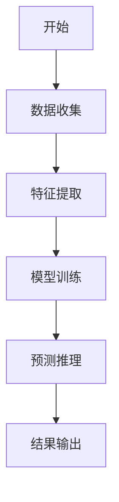
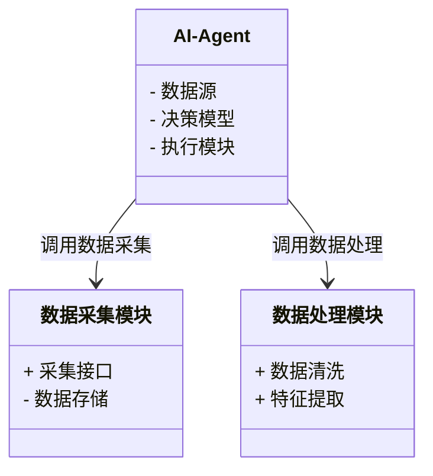
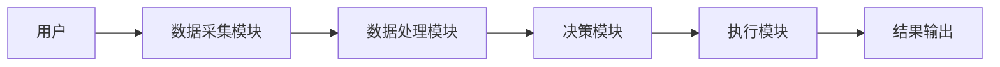

                 


# AI Agent在企业数字化转型评估中的应用

## 关键词：AI Agent，企业数字化转型，评估模型，数据驱动，智能化决策

## 摘要：本文深入探讨AI Agent在企业数字化转型评估中的应用，分析其核心概念、算法原理、系统架构，并通过实际案例展示其在企业数字化转型中的价值。文章结合理论与实践，为企业提供AI Agent在数字化转型中的最佳实践建议。

---

## 第1章 引言

### 1.1 AI Agent的基本概念
AI Agent是一种智能体，能够感知环境并自主决策，执行任务以实现目标。在企业数字化转型中，AI Agent能够自动化处理复杂问题，提高效率。

### 1.2 企业数字化转型的背景
随着数字化转型的推进，企业需要更高效的方法来评估转型进展。AI Agent通过数据驱动和智能化决策，为企业提供实时反馈和优化建议。

---

## 第2章 AI Agent的核心概念与原理

### 2.1 AI Agent的核心原理
AI Agent通过感知环境、分析数据、制定策略并执行行动来实现目标。其核心在于数据处理和智能决策。

### 2.2 AI Agent的算法原理
AI Agent的算法通常包括数据收集、特征提取、模型训练和预测推理四个步骤。以下是一个简单的AI Agent算法流程图：



### 2.3 AI Agent的数学模型
AI Agent的决策模型通常基于概率论和优化算法。例如，使用概率分布模型来预测结果：

$$ P(y|x) = \frac{P(x|y)P(y)}{P(x)} $$

其中，$P(y|x)$ 是在给定$x$的情况下，$y$发生的概率。

---

## 第3章 AI Agent在企业数字化转型中的应用

### 3.1 数字化转型评估的核心要素
企业数字化转型评估通常包括业务流程优化、技术实现、数据管理等方面。AI Agent可以通过分析这些要素，提供优化建议。

### 3.2 AI Agent在评估中的具体应用
AI Agent可以用于实时监控企业运营状态，识别瓶颈并提出解决方案。例如，通过分析销售数据，AI Agent可以预测市场需求并优化库存管理。

---

## 第4章 系统架构与设计

### 4.1 系统功能设计
AI Agent系统通常包括数据采集模块、数据处理模块、决策模块和执行模块。以下是一个系统功能设计的类图：



### 4.2 系统架构设计
以下是AI Agent系统的整体架构图：



### 4.3 系统接口设计
AI Agent系统通常通过API接口与其他系统交互。以下是一个简单的API接口设计：

```http
POST /api/agent/analyze
Content-Type: application/json

{
    "input_data": {
        "param1": value1,
        "param2": value2
    }
}
```

---

## 第5章 项目实战：AI Agent的应用案例

### 5.1 环境安装
要使用AI Agent进行数字化转型评估，首先需要安装必要的库，如TensorFlow、Scikit-learn等。

### 5.2 核心代码实现
以下是一个简单的AI Agent代码示例：

```python
import numpy as np
from sklearn.model_selection import train_test_split
from sklearn.linear_model import LogisticRegression

# 数据准备
X = np.array([[feature1, feature2], ...])
y = np.array([label1, label2, ...])

# 数据分割
X_train, X_test, y_train, y_test = train_test_split(X, y, test_size=0.2)

# 模型训练
model = LogisticRegression()
model.fit(X_train, y_train)

# 预测推理
predictions = model.predict(X_test)
```

### 5.3 案例分析
通过分析销售数据，AI Agent可以帮助企业预测市场需求，优化库存管理。例如，使用回归模型预测销售额，并根据预测结果调整库存策略。

---

## 第6章 最佳实践与总结

### 6.1 最佳实践
- **数据质量**：确保数据的准确性和完整性。
- **模型选择**：根据具体问题选择合适的模型。
- **持续优化**：定期更新模型，适应变化。

### 6.2 小结
AI Agent在企业数字化转型评估中具有重要作用，能够显著提高效率和准确性。

### 6.3 注意事项
- AI Agent的应用需要结合企业实际情况。
- 数据隐私和安全问题需严格把控。
- 持续监控和优化模型性能。

### 6.4 拓展阅读
- 推荐阅读《机器学习实战》和《深度学习》等书籍，深入了解AI Agent的技术细节。

---

## 结语

AI Agent作为企业数字化转型的重要工具，通过数据驱动和智能化决策，帮助企业优化运营、提高效率。随着技术的不断进步，AI Agent将在企业转型中发挥越来越重要的作用。

---

## 作者简介

作者是[您的名字]，一名在人工智能和软件架构领域拥有丰富经验的技术专家。欢迎关注我的技术博客，获取更多关于AI Agent和企业数字化转型的深度解析。

