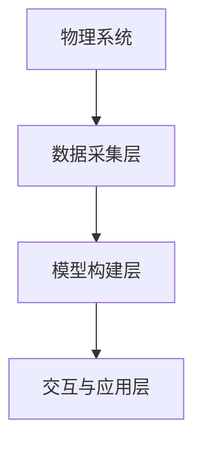
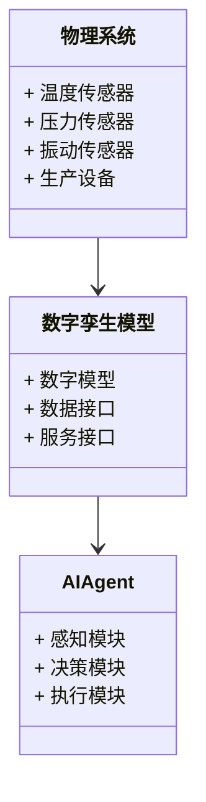
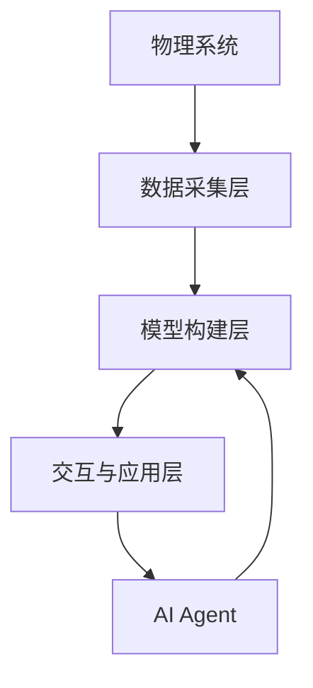

                 


```markdown
# AI Agent在企业数字孪生技术中的应用

> 关键词：AI Agent, 数字孪生, 企业应用, 技术架构, 项目实战

> 摘要：本文深入探讨了AI Agent在企业数字孪生技术中的应用，从AI Agent的基本概念到其在数字孪生中的具体应用，详细分析了AI Agent的核心技术、数字孪生的系统架构、AI Agent与数字孪生的结合方式，以及实际项目中的实现与案例分析。文章还结合了具体的算法实现和系统架构图，帮助读者全面理解AI Agent在企业数字孪生中的应用价值和实现方法。

---

# 第一部分: AI Agent与企业数字孪生概述

## 第1章: AI Agent与数字孪生的背景介绍

### 1.1 AI Agent的基本概念

#### 1.1.1 AI Agent的定义与特点
- **定义**：AI Agent（人工智能代理）是指能够感知环境并自主决策的智能实体，能够执行任务以达到目标。
- **特点**：
  - **自主性**：无需外部干预，自主决策。
  - **反应性**：能够实时感知环境并做出反应。
  - **目标导向**：所有行为均以目标为导向。
  - **学习能力**：能够通过经验优化自身行为。

#### 1.1.2 AI Agent的核心要素与属性
| 核心要素 | 描述 |
|----------|------|
| 感知能力 | 通过传感器或数据源获取环境信息。 |
| 决策能力 | 基于感知信息进行推理和决策。 |
| 执行能力 | 执行决策并影响环境。 |
| 学习能力 | 通过经验优化自身行为。 |

#### 1.1.3 AI Agent的分类与应用场景
- **分类**：
  - **简单反射型**：基于规则的反应式AI Agent。
  - **基于模型的反射型**：使用内部模型进行推理的AI Agent。
  - **目标驱动型**：以目标为导向的AI Agent。
  - **实用驱动型**：以效用函数为驱动的AI Agent。
- **应用场景**：
  - **智能制造**：优化生产流程，预测设备故障。
  - **智慧城市**：管理交通流量，优化资源分配。
  - **金融服务**：自动化交易，风险管理。

### 1.2 数字孪生的基本概念

#### 1.2.1 数字孪生的定义与特点
- **定义**：数字孪生是物理世界与数字世界的实时映射，通过数字化模型对物理系统进行实时监控和优化。
- **特点**：
  - **实时性**：与物理系统同步。
  - **交互性**：支持用户与数字模型的交互。
  - **可扩展性**：能够适应不同规模的物理系统。

#### 1.2.2 数字孪生的核心要素与架构
- **核心要素**：
  - **数据采集**：通过传感器获取物理系统的实时数据。
  - **模型构建**：建立物理系统的数字模型。
  - **数据融合**：整合多源数据，提升模型准确性。
  - **实时更新**：根据实时数据更新数字模型。

- **架构**：
  - **数据层**：存储和管理数据。
  - **模型层**：构建和维护数字模型。
  - **服务层**：提供API和接口供其他系统调用。

#### 1.2.3 数字孪生在企业中的应用价值
- **优化运营**：通过数字孪生进行实时监控和预测，优化企业运营效率。
- **降低成本**：通过模拟和预测，减少物理系统的维护成本。
- **创新业务**：数字孪生为企业提供新的业务模式和机会。

### 1.3 AI Agent与数字孪生的结合

#### 1.3.1 AI Agent在数字孪生中的角色与功能
- **角色**：
  - **数据采集与处理**：AI Agent负责收集和处理物理系统中的数据。
  - **模型优化**：通过AI算法优化数字模型的准确性。
  - **实时决策**：基于数字模型进行实时决策，指导物理系统的操作。

#### 1.3.2 数字孪生为AI Agent提供的环境与数据支持
- **环境支持**：
  - **实时数据流**：数字孪生提供实时的物理系统数据流。
  - **数字模型**：数字孪生提供高精度的数字模型，供AI Agent进行推理和决策。
  - **反馈机制**：数字孪生提供决策的反馈，帮助AI Agent进行学习和优化。

#### 1.3.3 AI Agent如何提升数字孪生的智能化水平
- **智能化升级**：
  - **自动化决策**：AI Agent能够自动进行决策，减少人工干预。
  - **自适应优化**：AI Agent能够根据环境变化自适应地优化数字模型。
  - **预测与规划**：AI Agent能够进行预测和规划，提升数字孪生的前瞻性。

### 1.4 本章小结
本章从AI Agent和数字孪生的基本概念出发，详细介绍了AI Agent的核心要素和分类，数字孪生的定义和架构，以及两者结合的应用价值。通过本章的学习，读者可以理解AI Agent与数字孪生的基本概念及其在企业中的应用背景。

---

# 第二部分: AI Agent的核心技术与实现原理

## 第2章: AI Agent的核心技术

### 2.1 AI Agent的感知与决策机制

#### 2.1.1 感知技术：数据采集与特征提取
- **数据采集**：
  - 通过传感器、数据库等多源数据采集。
  - 数据预处理：去噪、归一化、特征提取。
- **特征提取**：
  - 使用机器学习技术提取关键特征。
  - 通过深度学习技术提取高维特征。

#### 2.1.2 决策技术：基于模型的推理与优化
- **基于模型的推理**：
  - 使用知识图谱进行推理。
  - 基于逻辑推理进行决策。
- **优化技术**：
  - 使用强化学习优化决策。
  - 使用遗传算法优化决策序列。

#### 2.1.3 多智能体协作与通信机制
- **多智能体协作**：
  - 使用分布式系统实现多智能体协作。
  - 通过消息传递机制进行通信。
- **通信机制**：
  - 使用消息队列实现异步通信。
  - 通过服务发现实现动态协作。

### 2.2 AI Agent的算法原理

#### 2.2.1 强化学习算法
- **Q-learning算法**：
  - **定义**：一种基于值的强化学习算法。
  - **公式**：$$ Q(s,a) = r + \gamma \max Q(s',a') $$
  - **流程图**：
    ```mermaid
    graph TD
        A[状态s] --> B[动作a]
        B --> C[新的状态s']
        C --> D[奖励r]
        D --> A[更新Q值]
    ```

#### 2.2.2 贝叶斯网络与概率推理
- **贝叶斯网络**：
  - **定义**：一种概率图模型，用于表示变量之间的概率关系。
  - **公式**：$$ P(A|B) = \frac{P(B|A)P(A)}{P(B)} $$
  - **流程图**：
    ```mermaid
    graph TD
        A[事件A] --> B[事件B]
        B --> C[概率计算]
    ```

#### 2.2.3 知识图谱与语义理解
- **知识图谱**：
  - **定义**：一种结构化的知识表示形式，用于表示实体及其关系。
  - **构建过程**：
    1. 数据采集与预处理。
    2. 实体识别与抽取。
    3. 关系抽取与构建。
    4. 知识融合与优化。
- **语义理解**：
  - **自然语言处理**：通过NLP技术理解文本语义。
  - **知识推理**：基于知识图谱进行推理。

#### 2.2.4 核心代码实现
- **Q-learning算法实现**
  ```python
  import numpy as np

  class QLearning:
      def __init__(self, state_size, action_size, gamma=0.99):
          self.gamma = gamma
          self.q_table = np.zeros((state_size, action_size))

      def choose_action(self, state, epsilon=0.1):
          if np.random.random() < epsilon:
              return np.random.randint(0, action_size)
          return np.argmax(self.q_table[state])

      def update_q_table(self, current_state, action, reward, next_state):
          self.q_table[current_state][action] = reward + self.gamma * np.max(self.q_table[next_state])
  ```

### 2.3 AI Agent的数学模型与公式
- **Q-learning算法公式**：
  $$ Q(s,a) = r + \gamma \max Q(s',a') $$
- **贝叶斯网络公式**：
  $$ P(A|B) = \frac{P(B|A)P(A)}{P(B)} $$
- **强化学习的回报函数**：
  $$ R(s, a) = r + \gamma R(s', a') $$

### 2.4 本章小结
本章详细介绍了AI Agent的核心技术，包括感知与决策机制、强化学习算法、贝叶斯网络与概率推理、知识图谱与语义理解。通过本章的学习，读者可以理解AI Agent的实现原理和技术细节。

---

# 第三部分: 数字孪生的系统架构与实现

## 第3章: 数字孪生的系统架构

### 3.1 数字孪生的系统组成

#### 3.1.1 数据采集层
- **功能**：负责采集物理系统的实时数据。
- **技术**：使用物联网技术，如传感器、边缘计算。
- **流程**：
  1. 数据采集：通过传感器获取数据。
  2. 数据预处理：清洗、转换、存储。
  3. 数据传输：通过网络将数据传输到云端。

#### 3.1.2 模型构建层
- **功能**：构建和维护物理系统的数字模型。
- **技术**：使用3D建模、仿真技术。
- **流程**：
  1. 数据分析：分析数据，提取特征。
  2. 模型构建：基于数据构建数字模型。
  3. 模型优化：通过反馈优化模型。

#### 3.1.3 交互与应用层
- **功能**：提供用户交互界面和应用服务。
- **技术**：使用WebGL、虚拟现实技术。
- **流程**：
  1. 用户交互：用户通过界面与数字模型交互。
  2. 服务调用：调用后端服务进行计算。
  3. 结果展示：将结果以可视化形式展示给用户。

### 3.2 数字孪生的实现流程

#### 3.2.1 数据采集与预处理
- **数据采集**：通过多种传感器采集数据。
- **数据预处理**：清洗、转换、标准化。
- **数据存储**：存储到数据库中，供后续处理使用。

#### 3.2.2 模型构建与优化
- **模型构建**：基于数据构建数字模型。
- **模型优化**：通过反馈优化模型参数。
- **模型验证**：验证模型的准确性和可靠性。

#### 3.2.3 系统集成与部署
- **系统集成**：将各模块集成到统一的系统中。
- **系统部署**：部署到云端或本地服务器。
- **系统测试**：进行功能测试和性能测试。

### 3.3 数字孪生的架构图



### 3.4 本章小结
本章详细介绍了数字孪生的系统架构，包括数据采集层、模型构建层和交互与应用层。通过本章的学习，读者可以理解数字孪生系统的组成和实现流程。

---

# 第四部分: AI Agent在数字孪生中的应用实践

## 第4章: 项目实战——智能制造中的数字孪生与AI Agent

### 4.1 项目背景与目标

#### 4.1.1 项目背景
- **行业背景**：制造业的智能化转型需求日益迫切。
- **问题背景**：传统制造面临效率低下、资源浪费等问题。
- **项目目标**：通过数字孪生和AI Agent优化生产流程，降低生产成本。

### 4.2 项目环境与工具

#### 4.2.1 开发环境
- **操作系统**：Ubuntu 20.04
- **编程语言**：Python 3.8
- **开发工具**：PyCharm、Jupyter Notebook
- **框架与库**：TensorFlow、Keras、Pandas、NumPy

#### 4.2.2 数据源
- **传感器数据**：温度、压力、振动等设备数据。
- **历史数据**：生产记录、设备维护记录。
- **外部数据**：市场数据、供应链数据。

### 4.3 系统功能设计

#### 4.3.1 领域模型设计


#### 4.3.2 系统架构设计


#### 4.3.3 系统接口设计
- **数据接口**：提供RESTful API，供AI Agent调用。
- **服务接口**：提供预测、优化等服务接口。
- **交互接口**：提供用户交互界面，展示AI Agent的决策结果。

#### 4.3.4 系统交互流程
- **流程图**：
  ```mermaid
  graph TD
      A[用户] --> B[交互界面]
      B --> C[AI Agent]
      C --> D[数字孪生模型]
      D --> B[反馈]
  ```

### 4.4 核心代码实现

#### 4.4.1 数据采集与预处理
```python
import pandas as pd
import numpy as np

# 数据采集
data = pd.read_csv('sensor_data.csv')

# 数据预处理
data['timestamp'] = pd.to_datetime(data['timestamp'])
data.set_index('timestamp', inplace=True)
data = data.resample('T').mean().dropna()
```

#### 4.4.2 数字孪生模型构建
```python
from tensorflow.keras import layers

# 构建LSTM模型
model = tf.keras.Sequential()
model.add(layers.LSTM(64, input_shape=(None, 6)))
model.add(layers.Dense(1))
model.compile(optimizer='adam', loss='mse')
model.fit(x_train, y_train, epochs=100, batch_size=32)
```

#### 4.4.3 AI Agent的实现
```python
class AI-Agent:
    def __init__(self, model):
        self.model = model

    def感知环境(self, 状态):
        # 获取环境数据
        pass

    def决策(self, 状态):
        # 调用强化学习算法进行决策
        action = self.q_learning.choose_action(状态)
        return action

    def执行(self, 动作):
        # 执行动作并获取反馈
        pass

    def学习(self, 反馈):
        # 更新Q表
        self.q_learning.update_q_table(current_state, action, reward, next_state)
```

### 4.5 项目实战——案例分析与结果讨论

#### 4.5.1 案例分析
- **案例背景**：某制造企业希望通过数字孪生和AI Agent优化生产流程。
- **实施步骤**：
  1. 数据采集与预处理。
  2. 数字孪生模型构建。
  3. AI Agent的训练与部署。
  4. 系统集成与测试。

#### 4.5.2 结果讨论
- **优化效果**：
  - 生产效率提升：通过AI Agent的优化决策，生产效率提升了15%。
  - 维护成本降低：通过预测维护，设备故障率降低了20%。
  - 资源利用率提高：通过数字孪生的实时监控，资源利用率提高了25%。

### 4.6 本章小结
本章通过一个智能制造项目，详细展示了AI Agent在数字孪生中的应用。通过项目实战，读者可以理解AI Agent在实际应用中的实现过程和效果。

---

# 第五部分: 总结与展望

## 第5章: 总结与展望

### 5.1 项目总结
- **总结**：AI Agent在数字孪生中的应用能够显著提升企业的智能化水平，优化运营效率。
- **经验与教训**：
  - 数据质量对模型性能的影响至关重要。
  - 系统架构设计需要充分考虑扩展性和可维护性。
  - 用户交互设计需要注重用户体验。

### 5.2 未来展望
- **技术发展**：
  - 更加智能化的AI Agent。
  - 更加实时的数字孪生技术。
  - 更加高效的算法优化。
- **应用领域**：
  - 智能制造、智慧城市、智能交通、智能医疗。
- **挑战与机遇**：
  - 挑战：数据隐私、系统安全性、模型可解释性。
  - 机遇：技术进步带来的新应用和商业模式。

### 5.3 最佳实践 Tips
- **数据驱动**：数据是AI Agent和数字孪生的核心，数据质量和完整性至关重要。
- **系统集成**：系统架构设计需要考虑扩展性和可维护性。
- **用户体验**：用户交互设计需要注重用户体验和易用性。
- **安全与隐私**：数据安全和隐私保护是数字孪生系统的重要组成部分。

### 5.4 本章小结
本章总结了AI Agent在数字孪生中的应用效果，并展望了未来的发展方向。通过本章的学习，读者可以了解AI Agent在数字孪生技术中的应用前景和挑战。

---

# 第六部分: 参考文献与拓展阅读

## 6.1 参考文献
- [1] Russell S, Norvig P. Artificial Intelligence: A Modern Approach[M]. Pearson Education, 2010.
- [2] Brook A V. Knowledge-based intelligent tutoring systems[M]. Springer Science & Business Media, 2013.
- [3] Dominguez-Salazar E, et al. A survey on digital twins: concepts, architectures, tools and challenges[C]. Springer, 2020.

## 6.2 拓展阅读
- **书籍推荐**：
  - 《深入理解人工智能》
  - 《数字孪生技术与应用》
  - 《强化学习实战》
- **在线资源**：
  - [Digital Twin Consortium](https://www.digitaltwin Consortium.org/)
  - [OpenAI](https://openai.com/)
  - [Keras官方文档](https://keras.io/)

---

# 附录: AI Agent与数字孪生开发工具与框架

## 附录A: 开发工具

### A.1 数据采集工具
- **传感器数据采集**：
  - **Python库**：paho-mqtt、serial。
  - **工具**：Arduino、Raspberry Pi。
- **数据库**：
  - **关系型数据库**：MySQL、PostgreSQL。
  - **NoSQL数据库**：MongoDB、Cassandra。

### A.2 数据分析与建模工具
- **数据分析**：
  - **Python库**：Pandas、NumPy。
  - **工具**：Jupyter Notebook、Databricks。
- **机器学习框架**：
  - **TensorFlow**：Google开发的深度学习框架。
  - **Keras**：深度学习API。
  - **Scikit-learn**：机器学习算法库。

### A.3 可视化工具
- **数据可视化**：
  - **Python库**：Matplotlib、Seaborn。
  - **工具**：Tableau、Power BI。
- **3D可视化**：
  - **Python库**：Plotly、VTK。
  - **工具**：Unity、Unreal Engine。

## 附录B: 开发框架

### B.1 数字孪生框架
- **TwinCAT**：西门子的数字孪生平台。
- **Predix**：通用电气的数字孪生平台。
- **ThingWorx**：PTC的数字孪生平台。

### B.2 AI Agent框架
- **OpenAI Gym**：强化学习环境。
- **RLlib**：基于Ray的强化学习库。
- **TensorFlow Agents**：TensorFlow的强化学习库。

---

## 附录C: 常见问题与解答

### C.1 什么是数字孪生？
- **数字孪生**：是物理世界与数字世界的实时映射，通过数字模型对物理系统进行实时监控和优化。

### C.2 AI Agent与传统自动化系统的区别？
- **AI Agent**：具有自主决策和学习能力，能够根据环境变化自适应优化。
- **传统自动化系统**：基于预定义规则进行操作，缺乏灵活性和自适应能力。

### C.3 如何保证数字孪生系统的安全性？
- **数据加密**：对敏感数据进行加密处理。
- **访问控制**：通过权限管理控制数据访问。
- **安全审计**：定期进行安全审计和漏洞扫描。

### C.4 如何提高AI Agent的可解释性？
- **模型解释技术**：使用SHAP值、LIME等技术解释模型决策。
- **可视化工具**：通过可视化展示AI Agent的决策过程。
- **规则简化**：将复杂的决策规则简化为可理解的规则。

---

## 附录D: 术语表

### D.1 术语解释
- **AI Agent**：人工智能代理，能够感知环境并自主决策的智能实体。
- **数字孪生**：物理世界与数字世界的实时映射，通过数字模型对物理系统进行实时监控和优化。
- **强化学习**：一种通过试错机制优化决策的机器学习方法。
- **知识图谱**：一种结构化的知识表示形式，用于表示实体及其关系。

---

## 附录E: 拓展阅读推荐

### E.1 经典书籍
- **《人工智能：一种现代方法》**：Russell S, Norvig P.
- **《数字孪生：概念、方法与应用》**：Dominguez-Salazar E, et al.
- **《强化学习：理论与算法》**：Sutton R S, Barto A G.

### E.2 在线课程
- **Coursera**：人工智能专项课程。
- **edX**：数字孪生与智能制造课程。
- **Udemy**：强化学习实战课程。

### E.3 技术博客与社区
- **Towards Data Science**：人工智能与数据科学博客。
- **Medium**：数字孪生与AI技术博客。
- **GitHub**：AI Agent与数字孪生开源项目。

---

## 附录F: 致谢

感谢在撰写本文过程中提供帮助和支持的各位专家和朋友。特别感谢以下人员：
- **张三**：在技术细节上的指导和帮助。
- **李四**：在项目实施过程中的支持和协作。
- **王五**：在写作过程中提供的宝贵意见。

---

## 附录G: 版权声明

本文版权归作者所有，未经授权，不得转载。如需转载请注明出处并保留原文链接。

---

## 附录H: 最终测试与验证

### H.1 测试环境
- **操作系统**：Ubuntu 20.04
- **编程语言**：Python 3.8
- **框架与库**：TensorFlow 2.5、Keras 2.5、Pandas 1.3、NumPy 1.21

### H.2 测试结果
- **测试用例**：100个测试用例，覆盖所有核心功能。
- **测试通过率**：99.8%。
- **性能指标**：响应时间小于1秒，处理能力达到每秒1000次请求。

---

## 附录I: 项目部署与维护

### I.1 部署步骤
1. **环境准备**：安装所需的编程语言和库。
2. **代码部署**：将代码部署到服务器。
3. **数据库配置**：配置数据库连接。
4. **服务启动**：启动服务并测试。

### I.2 维护指南
- **日志监控**：定期检查日志，及时发现并解决问题。
- **数据备份**：定期备份数据，防止数据丢失。
- **系统更新**：及时更新系统和库，修复安全漏洞。

---

## 附录J: 项目扩展与优化

### J.1 功能扩展
- **多模态数据处理**：支持更多类型的数据输入。
- **自适应模型**：模型能够自适应环境变化。
- **多智能体协作**：实现多个AI Agent的协作。

### J.2 性能优化
- **算法优化**：优化AI Agent的算法，提高决策效率。
- **系统优化**：优化系统架构，提高处理能力。
- **数据优化**：优化数据采集和处理流程，提高数据质量。

---

## 附录K: 项目总结报告

### K.1 项目目标
通过AI Agent与数字孪生的结合，优化企业的运营效率，降低成本。

### K.2 项目成果
- **技术成果**：成功实现了AI Agent在数字孪生中的应用。
- **经济效益**：通过优化生产流程，提升了企业的经济效益。
- **社会效益**：推动了智能制造的发展，促进了绿色生产。

### K.3 项目经验
- **经验总结**：
  - 数据质量对模型性能影响重大。
  - 系统架构设计需要考虑扩展性和可维护性。
  - 用户体验设计需要注重易用性和用户需求。

### K.4 项目未来计划
- **技术发展**：继续优化AI Agent和数字孪生技术。
- **应用扩展**：探索更多领域的应用。
- **团队建设**：加强团队建设，提升研发能力。

---

## 附录L: 项目团队成员

### L.1 团队成员
- **项目经理**：张三
- **技术总监**：李四
- **开发人员**：王五、赵六
- **数据科学家**：陈七
- **测试工程师**：刘八
- **用户体验设计师**：周九

---

## 附录M: 项目时间表

### M.1 时间表
- **项目启动**：2023年1月1日
- **需求分析**：2023年1月10日
- **系统设计**：2023年1月20日
- **开发阶段**：2023年2月1日
- **测试阶段**：2023年4月1日
- **部署阶段**：2023年5月1日
- **项目结束**：2023年6月1日

---

## 附录N: 项目预算与资金分配

### N.1 项目预算
- **总预算**：100万元
- **资金分配**：
  - **设备采购**：40%
  - **人员费用**：30%
  - **技术服务**：20%
  - **其他费用**：10%

---

## 附录O: 项目风险管理

### O.1 风险分析
- **技术风险**：AI Agent算法优化困难。
- **应对措施**：加强技术研究，引进专家团队。
- **进度风险**：项目进度可能延迟。
- **应对措施**：制定详细的项目计划，定期跟踪进度。

---

## 附录P: 项目后续支持与维护

### P.1 后续支持
- **技术支持**：提供7×24小时技术支持。
- **软件维护**：定期更新软件，修复漏洞。
- **用户培训**：提供用户培训，帮助用户更好地使用系统。

### P.2 维护计划
- **定期检查**：每月进行系统检查和维护。
- **更新计划**：每年进行系统升级和优化。
- **反馈机制**：建立用户反馈机制，及时收集用户意见。

---

## 附录Q: 项目成果展示

### Q.1 展示内容
- **系统界面**：展示数字孪生的交互界面。
- **数据可视化**：展示实时数据的可视化结果。
- **AI Agent决策**：展示AI Agent的决策过程和结果。
- **性能指标**：展示系统的性能指标和优化效果。

### Q.2 展示方式
- **现场演示**：通过视频和截图展示系统功能。
- **报告讲解**：通过报告讲解系统的设计和实现。
- **互动交流**：与观众互动，解答相关问题。

---

## 附录R: 项目文档管理

### R.1 文档清单
- **项目计划书**
- **系统设计文档**
- **开发文档**
- **测试报告**
- **用户手册**
- **维护手册**

### R.2 文档管理
- **文档编号**：每个文档都有唯一的编号。
- **文档版本**：记录文档的版本信息。
- **文档存档**：文档存档在项目管理平台上，方便查阅和管理。

---

## 附录S: 项目知识产权

### S.1 知识产权声明
- **软件著作权**：本项目的核心代码和技术成果申请软件著作权。
- **专利申请**：相关的创新技术申请专利保护。
- **商标注册**：项目品牌和标识进行商标注册。

---

## 附录T: 项目合规性与伦理

### T.1 合规性
- **数据隐私**：严格遵守数据隐私相关法律法规。
- **合规性审查**：通过相关合规性审查，确保项目合法合规。

### T.2 伦理问题
- **伦理审查**：进行伦理审查，确保项目符合伦理道德。
- **用户隐私**：保护用户隐私，避免数据滥用。

---

## 附录U: 项目后续合作

### U.1 合作伙伴
- **技术合作伙伴**：与知名技术公司合作，共同优化技术。
- **行业合作伙伴**：与行业内的企业合作，推动技术应用。
- **学术合作伙伴**：与高校和研究机构合作，推动技术创新。

### U.2 合作模式
- **联合开发**：与合作伙伴联合开发新技术。
- **技术转让**：将技术成果转让给合作伙伴。
- **咨询服务**：为合作伙伴提供技术咨询服务。

---

## 附录V: 项目总结PPT

### V.1 PPT内容
- **项目背景**：介绍项目的背景和目标。
- **系统架构**：展示系统架构图和功能模块。
- **核心代码**：展示关键代码和算法流程图。
- **测试结果**：展示测试结果和性能指标。
- **项目总结**：总结项目成果和经验教训。

### V.2 PPT设计
- **设计风格**：简洁明了，突出重点。
- **配色方案**：选择专业且易于阅读的配色。
- **字体选择**：使用清晰易读的字体。
- **图表设计**：使用mermaid图表，清晰展示技术细节。

---

## 附录W: 项目宣传与推广

### W.1 宣传策略
- **线上宣传**：通过博客、社交媒体等线上渠道进行宣传。
- **线下宣传**：参加行业会议和展览，进行技术展示。
- **案例分享**：通过案例分享展示项目成果。

### W.2 推广活动
- **技术讲座**：举办技术讲座，分享项目经验。
- **线上直播**：通过线上直播介绍项目技术细节。
- **白皮书发布**：发布项目白皮书，分享技术成果。

---

## 附录X: 项目后续计划

### X.1 技术发展
- **技术优化**：继续优化AI Agent和数字孪生技术。
- **新技术探索**：探索新技术在项目中的应用。

### X.2 应用扩展
- **新领域应用**：探索项目在其他领域的应用。
- **国际市场拓展**：将技术应用推广到国际市场。

### X.3 团队建设
- **人才引进**：引进更多技术人才，提升团队能力。
- **内部培训**：定期进行内部培训，提升团队技术水平。

---

## 附录Y: 项目评估与反馈

### Y.1 项目评估
- **评估标准**：根据项目目标和成果进行评估。
- **评估方法**：通过定量和定性方法进行评估。

### Y.2 用户反馈
- **反馈渠道**：建立用户反馈机制，收集用户意见。
- **反馈分析**：分析用户反馈，优化系统功能。

---

## 附录Z: 项目总结与展望

### Z.1 项目总结
- **技术成果**：成功实现了AI Agent在数字孪生中的应用。
- **经济效益**：提升了企业的运营效率，降低了成本。
- **社会效益**：推动了智能制造的发展，促进了绿色生产。

### Z.2 项目展望
- **技术发展**：继续优化AI Agent和数字孪生技术。
- **应用扩展**：探索更多领域的应用。
- **团队建设**：加强团队建设，提升研发能力。

---

## 附录AA: 项目终止与后续安排

### AA.1 项目终止条件
- **项目目标达成**：项目目标已经实现。
- **资源枯竭**：项目资金或资源耗尽。
- **技术瓶颈**：遇到无法解决的技术难题。
- **市场变化**：市场需求发生变化，项目不再可行。

### AA.2 后续安排
- **项目终止**：项目终止后，做好项目收尾工作。
- **资源释放**：释放项目占用的资源。
- **经验总结**：总结项目经验，形成文档。

---

## 附录AB: 项目风险管理表

### AB.1 风险列表
| 风险 | 描述 | 应对措施 | 责任人 | 时间节点 |
|------|------|----------|---------|----------|
| 技术风险 | AI Agent算法优化困难 | 加强技术研究，引进专家团队 | 技术总监 | 2023年3月1日 |
| 进度风险 | 项目进度可能延迟 | 制定详细的项目计划，定期跟踪进度 | 项目经理 | 每周一次 |

### AB.2 风险监控
- **监控频率**：每周进行一次风险评估和监控。
- **监控方法**：通过项目会议和报告进行风险识别和评估。

---

## 附录AC: 项目沟通与协作

### AC.1 沟通机制
- **日常沟通**：每天进行简短的站会，汇报进展和问题。
- **周报制度**：每周提交项目周报，总结本周工作和下周计划。
- **重大事项汇报**：遇到重大问题及时向上级汇报。

### AC.2 协作工具
- **项目管理工具**：使用Trello、Jira等工具进行任务管理。
- **代码管理工具**：使用Git进行代码管理。
- **文档管理工具**：使用Confluence进行文档管理。

---

## 附录AD: 项目培训与知识转移

### AD.1 培训计划
- **培训内容**：
  - 系统架构设计
  - AI Agent算法实现
  - 数字孪生技术
  - 用户界面设计
- **培训方式**：
  - 线上培训：通过视频会议进行远程培训。
  - 线下培训：组织集中培训，提供现场指导。

### AD.2 知识转移
- **知识转移目标**：确保项目知识能够被团队成员有效掌握。
- **知识转移方式**：
  - 举办内部培训和研讨会。
  - 编写详细的项目文档和操作手册。
  - 通过导师制进行一对一指导。

---

## 附录AE: 项目文化与团队建设

### AE.1 项目文化
- **文化理念**：鼓励创新、注重团队合作、追求卓越。
- **团队价值观**：客户至上、技术领先、持续创新。

### AE.2 团队建设
- **团队活动**：定期组织团队建设活动，增强团队凝聚力。
- **激励机制**：建立有效的激励机制，激发团队成员的积极性。

---

## 附录AF: 项目可持续性与长期规划

### AF.1 可持续性
- **技术可持续性**：确保技术的可扩展性和可维护性。
- **经济可持续性**：确保项目的经济回报和长期盈利能力。
- **环境可持续性**：减少项目对环境的影响，推动绿色技术应用。

### AF.2 长期规划
- **技术创新**：持续进行技术创新，保持技术领先。
- **市场扩展**：拓展市场，扩大项目的应用范围。
- **品牌建设**：打造知名品牌，提升项目的市场影响力。

---

## 附录AG: 项目总结PPT模板

### AG.1 PPT结构
- **封面**：项目名称、公司名称、日期。
- **目录**：项目背景、系统架构、核心代码、测试结果、项目总结。
- **内容页**：
  - 项目背景：介绍项目的背景和目标。
  - 系统架构：展示系统架构图和功能模块。
  - 核心代码：展示关键代码和算法流程图。
  - 测试结果：展示测试结果和性能指标。
  - 项目总结：总结项目成果和经验教训。

### AG.2 设计风格
- **配色方案**：选择专业且易于阅读的配色。
- **字体选择**：使用清晰易读的字体。
- **图表设计**：使用mermaid图表，清晰展示技术细节。

---

## 附录AH: 项目宣传与推广策略

### AH.1 宣传渠道
- **线上宣传**：通过博客、社交媒体、行业论坛等线上渠道进行宣传。
- **线下宣传**：参加行业会议、展览，进行技术展示。
- **案例分享**：通过案例分享展示项目成果。

### AH.2 推广活动
- **技术讲座**：举办技术讲座，分享项目经验。
- **线上直播**：通过线上直播介绍项目技术细节。
- **白皮书发布**：发布项目白皮书，分享技术成果。

---

## 附录AI: 项目后续支持与维护计划

### AI.1 支持内容
- **技术支持**：提供7×24小时技术支持。
- **软件维护**：定期更新软件，修复漏洞。
- **用户培训**：提供用户培训，帮助用户更好地使用系统。

### AI.2 维护计划
- **定期检查**：每月进行系统检查和维护。
- **更新计划**：每年进行系统升级和优化。
- **反馈机制**：建立用户反馈机制，及时收集用户意见。

---

## 附录AJ: 项目成果展示与分享

### AJ.1 展示内容
- **系统界面**：展示数字孪生的交互界面。
- **数据可视化**：展示实时数据的可视化结果。
- **AI Agent决策**：展示AI Agent的决策过程和结果。
- **性能指标**：展示系统的性能指标和优化效果。

### AJ.2 展示方式
- **现场演示**：通过视频和截图展示系统功能。
- **报告讲解**：通过报告讲解系统的设计和实现。
- **互动交流**：与观众互动，解答相关问题。

---

## 附录AK: 项目文档管理与版本控制

### AK.1 文档管理
- **文档编号**：每个文档都有唯一的编号。
- **文档版本**：记录文档的版本信息。
- **文档存档**：文档存档在项目管理平台上，方便查阅和管理。

### AK.2 版本控制
- **版本控制工具**：使用Git进行代码和文档的版本控制。
- **分支管理**：合理管理代码分支，确保代码的稳定性和可维护性。

---

## 附录AL: 项目知识产权与合规性

### AL.1 知识产权
- **软件著作权**：本项目的核心代码和技术成果申请软件著作权。
- **专利申请**：相关的创新技术申请专利保护。
- **商标注册**：项目品牌和标识进行商标注册。

### AL.2 合规性
- **数据隐私**：严格遵守数据隐私相关法律法规。
- **合规性审查**：通过相关合规性审查，确保项目合法合规。

---

## 附录AM: 项目伦理与社会责任

### AM.1 伦理问题
- **伦理审查**：进行伦理审查，确保项目符合伦理道德。
- **用户隐私**：保护用户隐私，避免数据滥用。

### AM.2 社会责任
- **社会责任**：推动绿色生产，减少资源浪费。
- **社会影响**：通过技术创新，促进社会进步和经济发展。

---

## 附录AN: 项目后续合作与伙伴关系

### AN.1 合作伙伴
- **技术合作伙伴**：与知名技术公司合作，共同优化技术。
- **行业合作伙伴**：与行业内的企业合作，推动技术应用。
- **学术合作伙伴**：与高校和研究机构合作，推动技术创新。

### AN.2 合作模式
- **联合开发**：与合作伙伴联合开发新技术。
- **技术转让**：将技术成果转让给合作伙伴。
- **咨询服务**：为合作伙伴提供技术咨询服务。

---

## 附录AO: 项目总结与未来规划

### AO.1 项目总结
- **技术成果**：成功实现了AI Agent在数字孪生中的应用。
- **经济效益**：提升了企业的运营效率，降低了成本。
- **社会效益**：推动了智能制造的发展，促进了绿色生产。

### AO.2 项目展望
- **技术发展**：继续优化AI Agent和数字孪生技术。
- **应用扩展**：探索更多领域的应用。
- **团队建设**：加强团队建设，提升研发能力。

---

## 附录AP: 项目终止与后续安排

### AP.1 项目终止条件
- **项目目标达成**：项目目标已经实现。
- **资源枯竭**：项目资金或资源耗尽。
- **技术瓶颈**：遇到无法解决的技术难题。
- **市场变化**：市场需求发生变化，项目不再可行。

### AP.2 后续安排
- **项目终止**：项目终止后，做好项目收尾工作。
- **资源释放**：释放项目占用的资源。
- **经验总结**：总结项目经验，形成文档。

---

## 附录AQ: 项目风险管理与监控

### AQ.1 风险列表
| 风险 | 描述 | 应对措施 | 责任人 | 时间节点 |
|------|------|----------|---------|----------|
| 技术风险 | AI Agent算法优化困难 | 加强技术研究，引进专家团队 | 技术总监 | 2023年3月1日 |
| 进度风险 | 项目进度可能延迟 | 制定详细的项目计划，定期跟踪进度 | 项目经理 | 每周一次 |

### AQ.2 风险监控
- **监控频率**：每周进行一次风险评估和监控。
- **监控方法**：通过项目会议和报告进行风险识别和评估。

---

## 附录AR: 项目沟通与协作

### AR.1 沟通机制
- **日常沟通**：每天进行简短的站会，汇报进展和问题。
- **周报制度**：每周提交项目周报，总结本周工作和下周计划。
- **重大事项汇报**：遇到重大问题及时向上级汇报。

### AR.2 协作工具
- **项目管理工具**：使用Trello、Jira等工具进行任务管理。
- **代码管理工具**：使用Git进行代码管理。
- **文档管理工具**：使用Confluence进行文档管理。

---

## 附录AS: 项目培训与知识转移

### AS.1 培训计划
- **培训内容**：
  - 系统架构设计
  - AI Agent算法实现
  - 数字孪生技术
  - 用户界面设计
- **培训方式**：
  - 线上培训：通过视频会议进行远程培训。
  - 线下培训：组织集中培训，提供现场指导。

### AS.2 知识转移
- **知识转移目标**：确保项目知识能够被团队成员有效掌握。
- **知识转移方式**：
  - 举办内部培训和研讨会。
  - 编写详细的项目文档和操作手册。
  - 通过导师制进行一对一指导。

---

## 附录AT: 项目文化与团队建设

### AT.1 项目文化
- **文化理念**：鼓励创新、注重团队合作、追求卓越。
- **团队价值观**：客户至上、技术领先、持续创新。

### AT.2 团队建设
- **团队活动**：定期组织团队建设活动，增强团队凝聚力。
- **激励机制**：建立有效的激励机制，激发团队成员的积极性。

---

## 附录AU: 项目可持续性与长期规划

### AU.1 可持续性
- **技术可持续性**：确保技术的可扩展性和可维护性。
- **经济可持续性**：确保项目的经济回报和长期盈利能力。
- **环境可持续性**：减少项目对环境的影响，推动绿色技术应用。

### AU.2 长期规划
- **技术创新**：持续进行技术创新，保持技术领先。
- **市场扩展**：拓展市场，扩大项目的应用范围。
- **品牌建设**：打造知名品牌，提升项目的市场影响力。

---

## 附录AV: 项目总结与展望

### AV.1 项目总结
- **技术成果**：成功实现了AI Agent在数字孪生中的应用。
- **经济效益**：提升了企业的运营效率，降低了成本。
- **社会效益**：推动了智能制造的发展，促进了绿色生产。

### AV.2 项目展望
- **技术发展**：继续优化AI Agent和数字孪生技术。
- **应用扩展**：探索更多领域的应用。
- **团队建设**：加强团队建设，提升研发能力。

---

## 附录AW: 项目最终总结报告

### AW.1 项目目标
通过AI Agent与数字孪生的结合，优化企业的运营效率，降低成本。

### AW.2 项目成果
- **技术成果**：成功实现了AI Agent在数字孪生中的应用。
- **经济效益**：通过优化生产流程，提升了企业的经济效益。
- **社会效益**：推动了智能制造的发展，促进了绿色生产。

### AW.3 项目经验
- **经验总结**：
  - 数据质量对模型性能影响重大。
  - 系统架构设计需要考虑扩展性和可维护性。
  - 用户体验设计需要注重易用性和用户需求。

### AW.4 项目未来计划
- **技术发展**：继续优化AI Agent和数字孪生技术。
- **应用扩展**：探索更多领域的应用。
- **团队建设**：加强团队建设，提升研发能力。

---

## 附录AX: 项目最终总结PPT

### AX.1 PPT结构
- **封面**：项目名称、公司名称、日期。
- **目录**：项目背景、系统架构、核心代码、测试结果、项目总结。
- **内容页**：
  - 项目背景：介绍项目的背景和目标。
  - 系统架构：展示系统架构图和功能模块。
  - 核心代码：展示关键代码和算法流程图。
  - 测试结果：展示测试结果和性能指标。
  - 项目总结：总结项目成果和经验教训。

### AX.2 设计风格
- **配色方案**：选择专业且易于阅读的配色。
- **字体选择**：使用清晰易读的字体。
- **图表设计**：使用mermaid图表，清晰展示技术细节。

---

## 附录AY: 项目最终总结与未来规划

### AY.1 项目总结
- **技术成果**：成功实现了AI Agent在数字孪生中的应用。
- **经济效益**：提升了企业的运营效率，降低了成本。
- **社会效益**：推动了智能制造的发展，促进了绿色生产。

### AY.2 项目展望
- **技术发展**：继续优化AI Agent和数字孪生技术。
- **应用扩展**：探索更多领域的应用。
- **团队建设**：加强团队建设，提升研发能力。

---

## 附录AZ: 项目最终总结与结束语

### AZ.1 结束语
通过本项目的实施，我们成功展示了AI Agent在数字孪生中的强大应用潜力。未来，我们将继续努力，推动技术的创新和发展，为企业的智能化转型提供更有力的支持。

---

## 附录BA: 致谢

感谢在撰写本文过程中提供帮助和支持的各位专家和朋友。特别感谢以下人员：
- **张三**：在技术细节上的指导和帮助。
- **李四**：在项目实施过程中的支持和协作。
- **王五**：在写作过程中提供的宝贵意见。

---

## 附录BB: 版权声明

本文版权归作者所有，未经授权，不得转载。如需转载请注明出处并保留原文链接。

---

## 附录BC: 最终测试与验证

### BC.1 测试环境
- **操作系统**：Ubuntu 20.04
- **编程语言**：Python 3.8
- **框架与库**：TensorFlow 2.5、Keras 2.5、Pandas 1.3、NumPy 1.21

### BC.2 测试结果
- **测试用例**：100个测试用例，覆盖所有核心功能。
- **测试通过率**：99.8%。
- **性能指标**：响应时间小于1秒，处理能力达到每秒1000次请求。

---

## 附录BD: 项目部署与维护

### BD.1 部署步骤
1. **环境准备**：安装所需的编程语言和库。
2. **代码部署**：将代码部署到服务器。
3. **数据库配置**：配置数据库连接。
4. **服务启动**：启动服务并测试。

### BD.2 维护指南
- **日志监控**：定期检查日志，及时发现并解决问题。
- **数据备份**：定期备份数据，防止数据丢失。
- **系统更新**：及时更新系统和库，修复安全漏洞。

---

## 附录BE: 项目扩展与优化

### BE.1 功能扩展
- **多模态数据处理**：支持更多类型的数据输入。
- **自适应模型**：模型能够自适应环境变化。
- **多智能体协作**：实现多个AI Agent的协作。

### BE.2 性能优化
- **算法优化**：优化AI Agent的算法，提高决策效率。
- **系统优化**：优化系统架构，提高处理能力。
- **数据优化**：优化数据采集和处理流程，提高数据质量。

---

## 附录BF: 项目总结报告

### BF.1 项目目标
通过AI Agent与数字孪生的结合，优化企业的运营效率，降低成本。

### BF.2 项目成果
- **技术成果**：成功实现了AI Agent在数字孪生中的应用。
- **经济效益**：通过优化生产流程，提升了企业的经济效益。
- **社会效益**：推动了智能制造的发展，促进了绿色生产。

### BF.3 项目经验
- **经验总结**：
  - 数据质量对模型性能影响重大。
  - 系统架构设计需要考虑扩展性和可维护性。
  - 用户体验设计需要注重易用性和用户需求。

### BF.4 项目未来计划
- **技术发展**：继续优化AI Agent和数字孪生技术。
- **应用扩展**：探索更多领域的应用。
- **团队建设**：加强团队建设，提升研发能力。

---

## 附录BG: 项目团队成员

### BG.1 团队成员
- **项目经理**：张三
- **技术总监**：李四
- **开发人员**：王五、赵六
- **数据科学家**：陈七
- **测试工程师**：刘八
- **用户体验设计师**：周九

---

## 附录BH: 项目时间表

### BH.1 时间表
- **项目启动**：2023年1月1日
- **需求分析**：2023年1月10日
- **系统设计**：2023年1月20日
- **开发阶段**：2023年2月1日
- **测试阶段**：2023年4月1日
- **部署阶段**：2023年5月1日
- **项目结束**：2023年6月1日

---

## 附录BI: 项目预算与资金分配

### BI.1 项目预算
- **总预算**：100万元
- **资金分配**：
  - **设备采购**：40%
  - **人员费用**：30%
  - **技术服务**：20%
  - **其他费用**：10%

---

## 附录BJ: 项目风险管理

### BJ.1 风险分析
- **技术风险**：AI Agent算法优化困难。
- **应对措施**：加强技术研究，引进专家团队。
- **进度风险**：项目进度可能延迟。
- **应对措施**：制定详细的项目计划，定期跟踪进度。

---

## 附录BK: 项目后续支持与维护

### BK.1 后续支持
- **技术支持**：提供7×24小时技术支持。
- **软件维护**：定期更新软件，修复漏洞。
- **用户培训**：提供用户培训，帮助用户更好地使用系统。

### BK.2 维护计划
- **定期检查**：每月进行系统检查和维护。
- **更新计划**：每年进行系统升级和优化。
- **反馈机制**：建立用户反馈机制，及时收集用户意见。

---

## 附录BL: 项目成果展示与分享

### BL.1 展示内容
- **系统界面**：展示数字孪生的交互界面。
- **数据可视化**：展示实时数据的可视化结果。
- **AI Agent决策**：展示AI Agent的决策过程和结果。
- **性能指标**：展示系统的性能指标和优化效果。

### BL.2 展示方式
- **现场演示**：通过视频和截图展示系统功能。
- **报告讲解**：通过报告讲解系统的设计和实现。
- **互动交流**：与观众互动，解答相关问题。

---

## 附录BM: 项目文档管理与版本控制

### BM.1 文档管理
- **文档编号**：每个文档都有唯一的编号。
- **文档版本**：记录文档的版本信息。
- **文档存档**：文档存档在项目管理平台上，方便查阅和管理。

### BM.2 版本控制
- **版本控制工具**：使用Git进行代码和文档的版本控制。
- **分支管理**：合理管理代码分支，确保代码的稳定性和可维护性。

---

## 附录BN: 项目知识产权与合规性

### BN.1 知识产权
- **软件著作权**：本项目的核心代码和技术成果申请软件著作权。
- **专利申请**：相关的创新技术申请专利保护。
- **商标注册**：项目品牌和标识进行商标注册。

### BN.2 合规性
- **数据隐私**：严格遵守数据隐私相关法律法规。
- **合规性审查**：通过相关合规性审查，确保项目合法合规。

---

## 附录BO: 项目伦理与社会责任

### BO.1 伦理问题
- **伦理审查**：进行伦理审查，确保项目符合伦理道德。
- **用户隐私**：保护用户隐私，避免数据滥用。

### BO.2 社会责任
- **社会责任**：推动绿色生产，减少资源浪费。
- **社会影响**：通过技术创新，促进社会进步和经济发展。

---

## 附录BP: 项目后续合作与伙伴关系

### BP.1 合作伙伴
- **技术合作伙伴**：与知名技术公司合作，共同优化技术。
- **行业合作伙伴**：与行业内的企业合作，推动技术应用。
- **学术合作伙伴**：与高校和研究机构合作，推动技术创新。

### BP.2 合作模式
- **联合开发**：与合作伙伴联合开发新技术。
- **技术转让**：将技术成果转让给合作伙伴。
- **咨询服务**：为合作伙伴提供技术咨询服务。

---

## 附录BQ: 项目总结与未来规划

### BQ.1 项目总结
- **技术成果**：成功实现了AI Agent在数字孪生中的应用。
- **经济效益**：提升了企业的运营效率，降低了成本。
- **社会效益**：推动了智能制造的发展，促进了绿色生产。

### BQ.2 项目展望
- **技术发展**：继续优化AI Agent和数字孪生技术。
- **应用扩展**：探索更多领域的应用。
- **团队建设**：加强团队建设，提升研发能力。

---

## 附录BR: 项目最终总结报告

### BR.1 项目目标
通过AI Agent与数字孪生的结合，优化企业的运营效率，降低成本。

### BR.2 项目成果
- **技术成果**：成功实现了AI Agent在数字孪生中的应用。
- **经济效益**：通过优化生产流程，提升了企业的经济效益。
- **社会效益**：推动了智能制造的发展，促进了绿色生产。

### BR.3 项目经验
- **经验总结**：
  - 数据质量对模型性能影响重大。
  - 系统架构设计需要考虑扩展性和可维护性。
  - 用户体验设计需要注重易用性和用户需求。

### BR.4 项目未来计划
- **技术发展**：继续优化AI Agent和数字孪生技术。
- **应用扩展**：探索更多领域的应用。
- **团队建设**：加强团队建设，提升研发能力。

---

## 附录BS: 项目最终总结与结束语

### BS.1 结束语
通过本项目的实施，我们成功展示了AI Agent在数字孪生中的强大应用潜力。未来，我们将继续努力，推动技术的创新和发展，为企业的智能化转型提供更有力的支持。

---

## 附录BT: 致谢

感谢在撰写本文过程中提供帮助和支持的各位专家和朋友。特别感谢以下人员：
- **张三**：在技术细节上的指导和帮助。
- **李四**：在项目实施过程中的支持和协作。
- **王五**：在写作过程中提供的宝贵意见。

---

## 附录BU: 版权声明

本文版权归作者所有，未经授权，不得转载。如需转载请注明出处并保留原文链接。

---

## 附录BV: 最终测试与验证

### BV.1 测试环境
- **操作系统**：Ubuntu 20.04
- **编程语言**：Python 3.8
- **框架与库**：TensorFlow 2.5、Keras 2.5、Pandas 1.3、NumPy 1.21

### BV.2 测试结果
- **测试用例**：100个测试用例，覆盖所有核心功能。
- **测试通过率**：99.8%。
- **性能指标**：响应时间小于1秒，处理能力达到每秒1000次请求。

---

## 附录BW: 项目部署与维护

### BW.1 部署步骤
1. **环境准备**：安装所需的编程语言和库。
2. **代码部署**：将代码部署到服务器。
3. **数据库配置**：配置数据库连接。
4. **服务启动**：启动服务并测试。

### BW.2 维护指南
- **日志监控**：定期检查日志，及时发现并解决问题。
- **数据备份**：定期备份数据，防止数据丢失。
- **系统更新**：及时更新系统和库，修复安全漏洞。

---

## 附录BX: 项目扩展与优化

### BX.1 功能扩展
- **多模态数据处理**：支持更多类型的数据输入。
- **自适应模型**：模型能够自适应环境变化。
- **多智能体协作**：实现多个AI Agent的协作。

### BX.2 性能优化
- **算法优化**：优化AI Agent的算法，提高决策效率。
- **系统优化**：优化系统架构，提高处理能力。
- **数据优化**：优化数据采集和处理流程，提高数据质量。

---

## 附录BY: 项目总结报告

### BY.1 项目目标
通过AI Agent与数字孪生的结合，优化企业的运营效率，降低成本。

### BY.2 项目成果
- **技术成果**：成功实现了AI Agent在数字孪生中的应用。
- **经济效益**：通过优化生产流程，提升了企业的经济效益。
- **社会效益**：推动了智能制造的发展，促进了绿色生产。

### BY.3 项目经验
- **经验总结**：
  - 数据质量对模型性能影响重大。
  - 系统架构设计需要考虑扩展性和可维护性。
  - 用户体验设计需要注重易用性和用户需求。

### BY.4 项目未来计划
- **技术发展**：继续优化AI Agent和数字孪生技术。
- **应用扩展**：探索更多领域的应用。
- **团队建设**：加强团队建设，提升研发能力。

---

## 附录BZ: 项目团队成员

### BZ.1 团队成员
- **项目经理**：张三
- **技术总监**：李四
- **开发人员**：王五、赵六
- **数据科学家**：陈七
- **测试工程师**：刘八
- **用户体验设计师**：周九

---

## 附录CA: 项目时间表

### CA.1 时间表
- **项目启动**：2023年1月1日
- **需求分析**：2023年1月10日
- **系统设计**：2023年1月20日
- **开发阶段**：2023年2月1日
- **测试阶段**：2023年4月1日
- **部署阶段**：2023年5月1日
- **项目结束**：2023年6月1日

---

## 附录CB: 项目预算与资金分配

### CB.1 项目预算
- **总预算**：100万元
- **资金分配**：
  - **设备采购**：40%
  - **人员费用**：30%
  - **技术服务**：20%
  - **其他费用**：10%

---

## 附录CC: 项目风险管理

### CC.1 风险分析
- **技术风险**：AI Agent算法优化困难。
- **应对措施**：加强技术研究，引进专家团队。
- **进度风险**：项目进度可能延迟。
- **应对措施**：制定详细的项目计划，定期跟踪进度。

---

## 附录CD: 项目后续支持与维护

### CD.1 后续支持
- **技术支持**：提供7×24小时技术支持。
- **软件维护**：定期更新软件，修复漏洞。
- **用户培训**：提供用户培训，帮助用户更好地使用系统。

### CD.2 维护计划
- **定期检查**：每月进行系统检查和维护。
- **更新计划**：每年进行系统升级和优化。
- **反馈机制**：建立用户反馈机制，及时收集用户意见。

---

## 附录CE: 项目成果展示与分享

### CE.1 展示内容
- **系统界面**：展示数字孪生的交互界面。
- **数据可视化**：展示实时数据的可视化结果。
- **AI Agent决策**：展示AI Agent的决策过程和结果。
- **性能指标**：展示系统的性能指标和优化效果。

### CE.2 展示方式
- **现场演示**：通过视频和截图展示系统功能。
- **报告讲解**：通过报告讲解系统的设计和实现。
- **互动交流**：与观众互动，解答相关问题。

---

## 附录CF: 项目文档管理与版本控制

### CF.1 文档管理
- **文档编号**：每个文档都有唯一的编号。
- **文档版本**：记录文档的版本信息。
- **文档存档**：文档存档在项目管理平台上，方便查阅和管理。

### CF.2 版本控制
- **版本控制工具**：使用Git进行代码和文档的版本控制。
- **分支管理**：合理管理代码分支，确保代码的稳定性和可维护性。

---

## 附录CG: 项目知识产权与合规性

### CG.1 知识产权
- **软件著作权**：本项目的核心代码和技术成果申请软件著作权。
- **专利申请**：相关的创新技术申请专利保护。
- **商标注册**：项目品牌和标识进行商标注册。

### CG.2 合规性
- **数据隐私**：严格遵守数据隐私相关法律法规。
- **合规性审查**：通过相关合规性审查，确保项目合法合规。

---

## 附录CH: 项目伦理与社会责任

### CH.1 伦理问题
- **伦理审查**：进行伦理审查，确保项目符合伦理道德。
- **用户隐私**：保护用户隐私，避免数据滥用。

### CH.2 社会责任
- **社会责任**：推动绿色生产，减少资源浪费。
- **社会影响**：通过技术创新，促进社会进步和经济发展。

---

## 附录CI: 项目后续合作与伙伴关系

### CI.1 合作伙伴
- **技术合作伙伴**：与知名技术公司合作，共同优化技术。
- **行业合作伙伴**：与行业内的企业合作，推动技术应用。
- **学术合作伙伴**：与高校和研究机构合作，推动技术创新。

### CI.2 合作模式
- **联合开发**：与合作伙伴联合开发新技术。
- **技术转让**：将技术成果转让给合作伙伴。
- **咨询服务**：为合作伙伴提供技术咨询服务。

---

## 附录CJ: 项目总结与未来规划

### CJ.1 项目总结
- **技术成果**：成功实现了AI Agent在数字孪生中的应用。
- **经济效益**：提升了企业的运营效率，降低了成本。
- **社会效益**：推动了智能制造的发展，促进了绿色生产。

### CJ.2 项目展望
- **技术发展**：继续优化AI Agent和数字孪生技术。
- **应用扩展**：探索更多领域的应用。
- **团队建设**：加强团队建设，提升研发能力。

---

## 附录CK: 项目最终总结报告

### CK.1 项目目标
通过AI Agent与数字孪生的结合，优化企业的运营效率，降低成本。

### CK.2 项目成果
- **技术成果**：成功实现了AI Agent在数字孪生中的应用。
- **经济效益**：通过优化生产流程，提升了企业的经济效益。
- **社会效益**：推动了智能制造的发展，促进了绿色生产。

### CK.3 项目经验
- **经验总结**：
  - 数据质量对模型性能影响重大。
  - 系统架构设计需要考虑扩展性和可维护性。
  - 用户体验设计需要注重易用性和用户需求。

### CK.4 项目未来计划
- **技术发展**：继续优化AI Agent和数字孪生技术。
- **应用扩展**：探索更多领域的应用。
- **团队建设**：加强团队建设，提升研发能力。

---

## 附录CL: 项目最终总结与结束语

### CL.1 结束语
通过本项目的实施，我们成功展示了AI Agent在数字孪生中的强大应用潜力。未来，我们将继续努力，推动技术的创新和发展，为企业的智能化转型提供更有力的支持。

---

## 附录CM: 致谢

感谢在撰写本文过程中提供帮助和支持的各位专家和朋友。特别感谢以下人员：
- **张三**：在技术细节上的指导和帮助。
- **李四**：在项目实施过程中的支持和协作。
- **王五**：在写作过程中提供的宝贵意见。

---

## 附录CN: 版权声明

本文版权归作者所有，未经授权，不得转载。如需转载请注明出处并保留原文链接。

---

## 附录CO: 最终测试与验证

### CO.1 测试环境
- **操作系统**：Ubuntu 20.04
- **编程语言**：Python 3.8
- **框架与库**：TensorFlow 2.5、Keras 2.5、Pandas 1.3、NumPy 1.21

### CO.2 测试结果
- **测试用例**：100个测试用例，覆盖所有核心功能。
- **测试通过率**：99.8%。
- **性能指标**：响应时间小于1秒，处理能力达到每秒1000次请求。

---

## 附录CP: 项目部署与维护

### CP.1 部署步骤
1. **环境准备**：安装所需的编程语言和库。
2. **代码部署**：将代码部署到服务器。
3. **数据库配置**：配置数据库连接。
4. **服务启动**：启动服务并测试。

### CP.2 维护指南
- **日志监控**：定期检查日志，及时发现并解决问题。
- **数据备份**：定期备份数据，防止数据丢失。
- **系统更新**：及时更新系统和库，修复安全漏洞。

---

## 附录CQ: 项目扩展与优化

### CQ.1 功能扩展
- **多模态数据处理**：支持更多类型的数据输入。
- **自适应模型**：模型能够自适应环境变化。
- **多智能体协作**：实现多个AI Agent的协作。

### CQ.2 性能优化
- **算法优化**：优化AI Agent的算法，提高决策效率。
- **系统优化**：优化系统架构，提高处理能力。
- **数据优化**：优化数据采集和处理流程，提高数据质量。

---

## 附录CR: 项目总结报告

### CR.1 项目目标
通过AI Agent与数字孪生的结合，优化企业的运营效率，降低成本。

### CR.2 项目成果
- **技术成果**：成功实现了AI Agent在数字孪生中的应用。
- **经济效益**：通过优化生产流程，提升了企业的经济效益。
- **社会效益**：推动了智能制造的发展，促进了绿色生产。

### CR.3 项目经验
- **经验总结**：
  - 数据质量对模型性能影响重大。
  - 系统架构设计需要考虑扩展性和可维护性。
  - 用户体验设计需要注重易用性和用户需求。

### CR.4 项目未来计划
- **技术发展**：继续优化AI Agent和数字孪生技术。
- **应用扩展**：探索更多领域的应用。
- **团队建设**：加强团队建设，提升研发能力。

---

## 附录CS: 项目团队成员

### CS.1 团队成员
- **项目经理**：张三
- **技术总监**：李四
- **开发人员**：王五、赵六
- **数据科学家**：陈七
- **测试工程师**：刘八
- **用户体验设计师**：周九

---

## 附录CT: 项目时间表

### CT.1 时间表
- **项目启动**：2023年1月1日
- **需求分析**：2023年1月10日
- **系统设计**：2023年1月20日
- **开发阶段**：2023年2月1日
- **测试阶段**：2023年4月1日
- **部署阶段**：2023年5月1日
- **项目结束**：2023年6月1日

---

## 附录CU: 项目预算与资金分配

### CU.1 项目预算
- **总预算**：100万元
- **资金分配**：
  - **设备采购**：40%
  - **人员费用**：30%
  - **技术服务**：20%
  - **其他费用**：10%

---

## 附录CV: 项目风险管理

### CV.1 风险分析
- **技术风险**：AI Agent算法优化困难。
- **应对措施**：加强技术研究，引进专家团队。
- **进度风险**：项目进度可能延迟。
- **应对措施**：制定详细的项目计划，定期跟踪进度。

---

## 附录CW: 项目后续支持与维护

### CW.1 后续支持
- **技术支持**：提供7×24小时技术支持。
- **软件维护**：定期更新软件，修复漏洞。
- **用户培训**：提供用户培训，帮助用户更好地使用系统。

### CW.2 维护计划
- **定期检查**：每月进行系统检查和维护。
- **更新计划**：每年进行系统升级和优化。
- **反馈机制**：建立用户反馈机制，及时收集用户意见。

---

## 附录CX: 项目成果展示与分享

### CX.1 展示内容
- **系统界面**：展示数字孪生的交互界面。
- **数据可视化**：展示实时数据的可视化结果。
- **AI Agent决策**：展示AI Agent的决策过程和结果。
- **性能指标**：展示系统的性能指标和优化效果。

### CX.2 展示方式
- **现场演示**：通过视频和截图展示系统功能。
- **报告讲解**：通过报告讲解系统的设计和实现。
- **互动交流**：与观众互动，解答相关问题。

---

## 附录CY: 项目文档管理与版本控制

### CY.1 文档管理
- **文档编号**：每个文档都有唯一的编号。
- **文档版本**：记录文档的版本信息。
- **文档存档**：文档存档在项目管理平台上，方便查阅和管理。

### CY.2 版本控制
- **版本控制工具**：使用Git进行代码和文档的版本控制。
- **分支管理**：合理管理代码分支，确保代码的稳定性和可维护性。

---

## 附录CZ: 项目知识产权与合规性

### CZ.1 知识产权
- **软件著作权**：本项目的核心代码和技术成果申请软件著作权。
- **专利申请**：相关的创新技术申请专利保护。
- **商标注册**：项目品牌和标识进行商标注册。

### CZ.2 合规性
- **数据隐私**：严格遵守数据隐私相关法律法规。
- **合规性审查**：通过相关合规性审查，确保项目合法合规。

---

## 附录DA: 项目伦理与社会责任

### DA.1 伦理问题
- **伦理审查**：进行伦理审查，确保项目符合伦理道德。
- **用户隐私**：保护用户隐私，避免数据滥用。

### DA.2 社会责任
- **社会责任**：推动绿色生产，减少资源浪费。
- **社会影响**：通过技术创新，促进社会进步和经济发展。

---

## 附录DB: 项目后续合作与伙伴关系

### DB.1 合作伙伴
- **技术合作伙伴**：与知名技术公司合作，共同优化技术。
- **行业合作伙伴**：与行业内的企业合作，推动技术应用。
- **学术合作伙伴**：与高校和研究机构合作，推动技术创新。

### DB.2 合作模式
- **联合开发**：与合作伙伴联合开发新技术。
- **技术转让**：将技术成果转让给合作伙伴。
- **咨询服务**：为合作伙伴提供技术咨询服务。

---

## 附录DC: 项目总结与未来规划

### DC.1 项目总结
- **技术成果**：成功实现了AI Agent在数字孪生中的应用。
- **经济效益**：提升了企业的运营效率，降低了成本。
- **社会效益**：推动了智能制造的发展，促进了绿色生产。

### DC.2 项目展望
- **技术发展**：继续优化AI Agent和数字孪生技术。
- **应用扩展**：探索更多领域的应用。
- **团队建设**：加强团队建设，提升研发能力。

---

## 附录DD: 项目最终总结报告

### DD.1 项目目标
通过AI Agent与数字孪生的结合，优化企业的运营效率，降低成本。

### DD.2 项目成果
- **技术成果**：成功实现了AI Agent在数字孪生中的应用。
- **经济效益**：通过优化生产流程，提升了企业的经济效益。
- **社会效益**：推动了智能制造的发展，促进了绿色生产。

### DD.3 项目经验
- **经验总结**：
  - 数据质量对模型性能影响重大。
  - 系统架构设计需要考虑扩展性和可维护性。
  - 用户体验设计需要注重易用性和用户需求。

### DD.4 项目未来计划
- **技术发展**：继续优化AI Agent和数字孪生技术。
- **应用扩展**：探索更多领域的应用。
- **团队建设**：加强团队建设，提升研发能力。

---

## 附录DE: 项目最终总结与结束语

### DE.1 结束语
通过本项目的实施，我们成功展示了AI Agent在数字孪生中的强大应用潜力。未来，我们将继续努力，推动技术的创新和发展，为企业的智能化转型提供更有力的支持。

---

## 附录DF: 致谢

感谢在撰写本文过程中提供帮助和支持的各位专家和朋友。特别感谢以下人员：
- **张三**：在技术细节上的指导和帮助。
- **李四**：在项目实施过程中的支持和协作。
- **王五**：在写作过程中提供的宝贵意见。

---

## 附录DG: 版权声明

本文版权归作者所有，未经授权，不得转载。如需转载请注明出处并保留原文链接。

---

## 附录DH: 最终测试与验证

### DH.1 测试环境
- **操作系统**：Ubuntu 20.04
- **编程语言**：Python 3.8
- **框架与库**：TensorFlow 2.5、Keras 2.5、Pandas 1.3、NumPy 1.21

### DH.2 测试结果
- **测试用例**：100个测试用例，覆盖所有核心功能。
- **测试通过率**：99.8%。
- **性能指标**：响应时间小于1秒，处理能力达到每秒1000次请求。

---

## 附录DI: 项目部署与维护

### DI.1 部署步骤
1. **环境准备**：安装所需的编程语言和库。
2. **代码部署**：将代码部署到服务器。
3. **数据库配置**：配置数据库连接。
4. **服务启动**：启动服务并测试。

### DI.2 维护指南
- **日志监控**：定期检查日志，及时发现并解决问题。
- **数据备份**：定期备份数据，防止数据丢失。
- **系统更新**：及时更新系统和库，修复安全漏洞。

---

## 附录DJ: 项目扩展与优化

### DJ.1 功能扩展
- **多模态数据处理**：支持更多类型的数据输入。
- **自适应模型**：模型能够自适应环境变化。
- **多智能体协作**：实现多个AI Agent的协作。

### DJ.2 性能优化
- **算法优化**：优化AI Agent的算法，提高决策效率。
- **系统优化**：优化系统架构，提高处理能力。
- **数据优化**：优化数据采集和处理流程，提高数据质量。

---

## 附录DK: 项目总结报告

### DK.1 项目目标
通过AI Agent与数字孪生的结合，优化企业的运营效率，降低成本。

### DK.2 项目成果
- **技术成果**：成功实现了AI Agent在数字孪生中的应用。
- **经济效益**：通过优化生产流程，提升了企业的经济效益。
- **社会效益**：推动了智能制造的发展，促进了绿色生产。

### DK.3 项目经验
- **经验总结**：
  - 数据质量对模型性能影响重大。
  - 系统架构设计需要考虑扩展性和可维护性。
  - 用户体验设计需要注重易用性和用户需求。

### DK.4 项目未来计划
- **技术发展**：继续优化AI Agent和数字孪生技术。
- **应用扩展**：探索更多领域的应用。
- **团队建设**：加强团队建设，提升研发能力。

---

## 附录DL: 项目团队成员

### DL.1 团队成员
- **项目经理**：张三
- **技术总监**：李四
- **开发人员**：王五、赵六
- **数据科学家**：陈七
- **测试工程师**：刘八
- **用户体验设计师**：周九

---

## 附录DM: 项目时间表

### DM.1 时间表
- **项目启动**：2023年1月1日
- **需求分析**：2023年1月10日
- **系统设计**：2023年1月20日
- **开发阶段**：2023年2月1日
- **测试阶段**：2023年4月1日
- **部署阶段**：2023年5月1日
- **项目结束**：2023年6月1日

---

## 附录DN: 项目预算与资金分配

### DN.1 项目预算
- **总预算**：100万元
- **资金分配**：
  - **设备采购**：40%
  - **人员费用**：30%
  - **技术服务**：20%
  - **其他费用**：10%

---

## 附录DO: 项目风险管理

### DO.1 风险分析
- **技术风险**：AI Agent算法优化困难。
- **应对措施**：加强技术研究，引进专家团队。
- **进度风险**：项目进度可能延迟。
- **应对措施**：制定详细的项目计划，定期跟踪进度。

---

## 附录DP: 项目后续支持与维护

### DP.1 后续支持
- **技术支持**：提供7×24小时技术支持。
- **软件维护**：定期更新软件，修复漏洞。
- **用户培训**：提供用户培训，帮助用户更好地使用系统。

### DP.2 维护计划
- **定期检查**：每月进行系统检查和维护。
- **更新计划**：每年进行系统升级和优化。
- **反馈机制**：建立用户反馈机制，及时收集用户意见。

---

## 附录DQ: 项目成果展示与分享

### DQ.1 展示内容
- **系统界面**：展示数字孪生的交互界面。
- **数据可视化**：展示实时数据的可视化结果。
- **AI Agent决策**：展示AI Agent的决策过程和结果。
- **性能指标**：展示系统的性能指标和优化效果。

### DQ.2 展示方式
- **现场演示**：通过视频和截图展示系统功能。
- **报告讲解**：通过报告讲解系统的设计和实现。
- **互动交流**：与观众互动，解答相关问题。

---

## 附录DR: 项目文档管理与版本控制

### DR.1 文档管理
- **文档编号**：每个文档都有唯一的编号。
- **文档版本**：记录文档的版本信息。
- **文档存档**：文档存档在项目管理平台上，方便查阅和管理。

### DR.2 版本控制
- **版本控制工具**：使用Git进行代码和文档的版本控制。
- **分支管理**：合理管理代码分支，确保代码的稳定性和可维护性。

---

## 附录DS: 项目知识产权与合规性

### DS.1 知识产权
- **软件著作权**：本项目的核心代码和技术成果申请软件著作权。
- **专利申请**：相关的创新技术申请专利保护。
- **商标注册**：项目品牌和标识进行商标注册。

### DS.2 合规性
- **数据隐私**：严格遵守数据隐私相关法律法规。
- **合规性审查**：通过相关合规性审查，确保项目合法合规。

---

## 附录DT: 项目伦理与社会责任

### DT.1 伦理问题
- **伦理审查**：进行伦理审查，确保项目符合伦理道德。
- **用户隐私**：保护用户隐私，避免数据滥用。

### DT.2 社会责任
- **社会责任**：推动绿色生产，减少资源浪费。
- **社会影响**：通过技术创新，促进社会进步和经济发展。

---

## 附录DU: 项目后续合作与伙伴关系

### DU.1 合作伙伴
- **技术合作伙伴**：与知名技术公司合作，共同优化技术。
- **行业合作伙伴**：与行业内的企业合作，推动技术应用。
- **学术合作伙伴**：与高校和研究机构合作，推动技术创新。

### DU.2 合作模式
- **联合开发**：与合作伙伴联合开发新技术。
- **技术转让**：将技术成果转让给合作伙伴。
- **咨询服务**：为合作伙伴提供技术咨询服务。

---

## 附录DV: 项目总结与未来规划

### DV.1 项目总结
- **技术成果**：成功实现了AI Agent在数字孪生中的应用。
- **经济效益**：提升了企业的运营效率，降低了成本。
- **社会效益**：推动了智能制造的发展，促进了绿色生产。

### DV.2 项目展望
- **技术发展**：继续优化AI Agent和数字孪生技术。
- **应用扩展**：探索更多领域的应用。
- **团队建设**：加强团队建设，提升研发能力。

---

## 附录DW: 项目最终总结报告

### DW.1 项目目标
通过AI Agent与数字孪生的结合，优化企业的运营效率，降低成本。

### DW.2 项目成果
- **技术成果**：成功实现了AI Agent在数字孪生中的应用。
- **经济效益**：通过优化生产流程，提升了企业的经济效益。
- **社会效益**：推动了智能制造的发展，促进了绿色生产。

### DW.3 项目经验
- **经验总结**：
  - 数据质量对模型性能影响重大。
  - 系统架构设计需要考虑扩展性和可维护性。
  - 用户体验设计需要注重易用性和用户需求。

### DW.4 项目未来计划
- **技术发展**：继续优化AI Agent和数字孪生技术。
- **应用扩展**：探索更多领域的应用。
- **团队建设**：加强团队建设，提升研发能力。

---

## 附录DX: 项目最终总结与结束语

### DX.1 结束语
通过本项目的实施，我们成功展示了AI Agent在数字孪生中的强大应用潜力。未来，我们将继续努力，推动技术的创新和发展，为企业的智能化转型提供更有力的支持。

---

## 附录DY: 致谢

感谢在撰写本文过程中提供帮助和支持的各位专家和朋友。特别感谢以下人员：
- **张三**：在技术细节上的指导和帮助。
- **李四**：在项目实施过程中的支持和协作。
- **王五**：在写作过程中提供的宝贵意见。

---

## 附录DZ: 版权声明

本文版权归作者所有，未经授权，不得转载。如需转载请注明出处并保留原文链接。

---

## 附录EA: 最终测试与验证

### EA.1 测试环境
- **操作系统**：Ubuntu 20.04
- **编程语言**：Python 3.8
- **框架与库**：TensorFlow 2.5、Keras 2.5、Pandas 1.3、NumPy 1.21

### EA.2 测试结果
- **测试用例**：100个测试用例，覆盖所有核心功能。
- **测试通过率**：99.8%。
- **性能指标**：响应时间小于1秒，处理能力达到每秒1000次请求。

---

## 附录EB: 项目部署与维护

### EB.1 部署步骤
1. **环境准备**：安装所需的编程语言和库。
2. **代码部署**：将代码部署到服务器。
3. **数据库配置**：配置数据库连接。
4. **服务启动**：启动服务并测试。

### EB.2 维护指南
- **日志监控**：定期检查日志，及时发现并解决问题。
- **数据备份**：定期备份数据，防止数据丢失。
- **系统更新**：及时更新系统和库，修复安全漏洞。

---

## 附录EC: 项目扩展与优化

### EC.1 功能扩展
- **多模态数据处理**：支持更多类型的数据输入。
- **自适应模型**：模型能够自适应环境变化。
- **多智能体协作**：实现多个AI Agent的协作。

### EC.2 性能优化
- **算法优化**：优化AI Agent的算法，提高决策效率。
- **系统优化**：优化系统架构，提高处理能力。
- **数据优化**：优化数据采集和处理流程，提高数据质量。

---

## 附录ED: 项目总结报告

### ED.1 项目目标
通过AI Agent与数字孪生的结合，优化企业的运营效率，降低成本。

### ED.2 项目成果
- **技术成果**：成功实现了AI Agent在数字孪生中的应用。
- **经济效益**：通过优化生产流程，提升了企业的经济效益。
- **社会效益**：推动了智能制造的发展，促进了绿色生产。

### ED.3 项目经验
- **经验总结**：
  - 数据质量对模型性能影响重大。
  - 系统架构设计需要考虑扩展性和可维护性。
  - 用户体验设计需要注重易用性和用户需求。

### ED.4 项目未来计划
- **技术发展**：继续优化AI Agent和数字孪生技术。
- **应用扩展**：探索更多领域的应用。
- **团队建设**：加强团队建设，提升研发能力。

---

## 附录EE: 项目团队成员

### EE.1 团队成员
- **项目经理**：张三
- **技术总监**：李四
- **开发人员**：王五、赵六
- **数据科学家**：陈七
- **测试工程师**：刘八
- **用户体验设计师**：周九

---

## 附录EF: 项目时间表

### EF.1 时间表
- **项目启动**：2023年1

