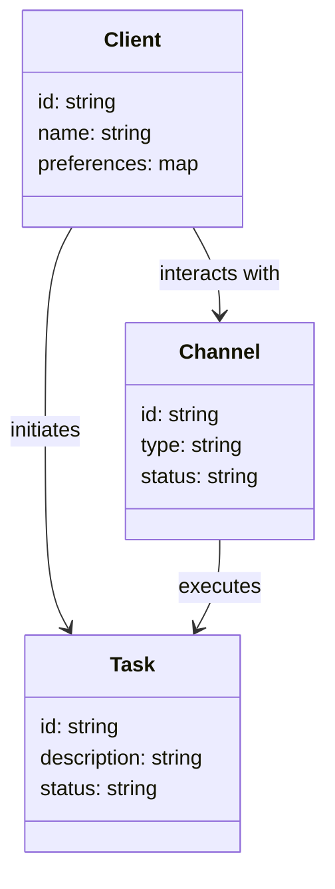
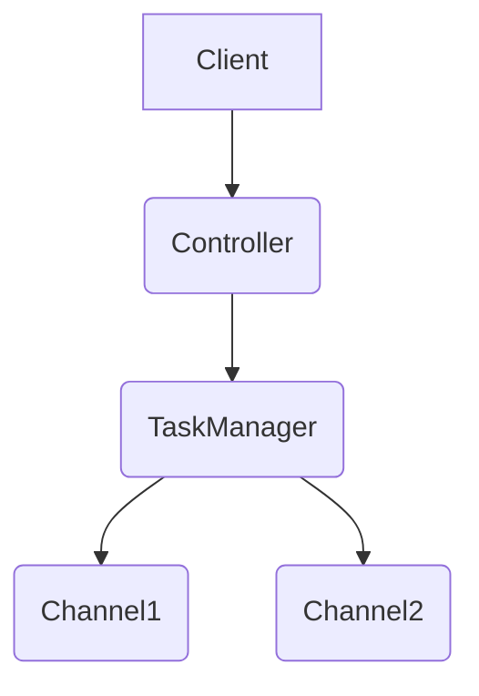

                 


# AI Agent在企业数字营销中的全渠道应用

> **关键词**：AI Agent，全渠道营销，数字营销，企业应用，人工智能

> **摘要**：本文详细探讨了AI Agent在企业数字营销中的全渠道应用，分析了AI Agent的核心概念、原理、数学模型和系统架构设计，并通过实际案例展示了其在数字营销中的价值。文章还总结了AI Agent在企业数字营销中的优势和未来发展趋势。

---

# 第1章: AI Agent与全渠道营销概述

## 1.1 AI Agent的基本概念

### 1.1.1 AI Agent的定义与特点

AI Agent（人工智能代理）是一种能够感知环境、自主决策并执行任务的智能系统。其特点包括：

1. **自主性**：能够在没有外部干预的情况下自主运行。
2. **反应性**：能够实时感知环境变化并做出反应。
3. **学习能力**：通过机器学习算法不断优化自身行为。
4. **目标导向**：以特定目标为导向，执行任务。

### 1.1.2 全渠道营销的定义与特点

全渠道营销是指通过多种渠道（如线上和线下）与客户互动，提供一致且个性化的体验。其特点包括：

1. **多渠道整合**：统一管理线上和线下渠道。
2. **客户中心化**：以客户为中心，提供个性化体验。
3. **实时互动**：能够在任何时间与客户互动。

### 1.1.3 AI Agent在全渠道营销中的作用

AI Agent在全渠道营销中起到了桥梁作用，能够协调不同渠道的资源，优化客户体验，提高营销效率。

---

## 1.2 企业数字营销的现状与挑战

### 1.2.1 传统数字营销的局限性

传统数字营销存在以下问题：

1. **渠道割裂**：各个渠道独立，缺乏统一管理。
2. **客户体验不一致**：不同渠道提供的体验不一致。
3. **数据孤岛**：各个渠道的数据难以整合，无法形成完整的客户画像。

### 1.2.2 全渠道营销的必要性

为了应对传统数字营销的局限性，企业需要采用全渠道营销策略，以提供一致的客户体验，提高客户满意度和忠诚度。

### 1.2.3 AI Agent在数字营销中的优势

AI Agent能够通过以下方式提升数字营销的效果：

1. **实时数据分析**：快速处理和分析数据，提供实时反馈。
2. **个性化推荐**：根据客户行为和偏好，提供个性化的产品推荐。
3. **自动化决策**：通过机器学习算法，自动化执行营销任务。

---

## 1.3 AI Agent在企业数字营销中的应用前景

### 1.3.1 AI Agent的核心能力与应用场景

AI Agent的核心能力包括：

1. **自然语言处理（NLP）**：能够理解和生成人类语言，支持智能对话。
2. **机器学习**：通过学习数据，优化营销策略。
3. **知识图谱**：构建和管理知识库，支持智能决策。

### 1.3.2 全渠道营销中的AI Agent价值

AI Agent在全渠道营销中的价值体现在以下几个方面：

1. **提高客户满意度**：通过个性化推荐和实时互动，提升客户体验。
2. **提高营销效率**：自动化执行营销任务，降低人力成本。
3. **数据驱动决策**：通过数据分析，优化营销策略。

### 1.3.3 企业采用AI Agent的挑战与机遇

企业采用AI Agent面临的挑战包括技术复杂性和数据隐私问题，但同时也带来了提升竞争力和效率的机遇。

---

## 1.4 本章小结

本章介绍了AI Agent和全渠道营销的基本概念，分析了企业数字营销的现状与挑战，并探讨了AI Agent在全渠道营销中的应用前景。

---

# 第2章: AI Agent的核心概念与原理

## 2.1 AI Agent的核心概念

### 2.1.1 AI Agent的组成与功能

AI Agent通常由以下部分组成：

1. **感知层**：负责感知环境信息，如客户行为数据。
2. **决策层**：基于感知信息，制定决策。
3. **执行层**：执行决策，如发送营销信息。

### 2.1.2 AI Agent的任务分解与优化

AI Agent的任务分解通常包括以下几个步骤：

1. **目标设定**：明确任务目标。
2. **任务分解**：将目标分解为子任务。
3. **任务执行**：执行子任务。
4. **结果反馈**：根据反馈结果优化任务执行。

### 2.1.3 AI Agent的意图识别与策略生成

意图识别是通过分析客户的语言和行为，推断客户的意图。策略生成则是根据意图生成相应的营销策略。

---

## 2.2 AI Agent的原理与技术

### 2.2.1 自然语言处理（NLP）在AI Agent中的应用

NLP在AI Agent中的应用包括：

1. **智能对话**：通过NLP技术实现与客户的智能对话。
2. **情感分析**：分析客户情感，优化营销策略。

### 2.2.2 机器学习在AI Agent中的应用

机器学习在AI Agent中的应用包括：

1. **客户画像**：通过机器学习算法构建客户画像。
2. **行为预测**：预测客户的未来行为。

### 2.2.3 知识图谱在AI Agent中的应用

知识图谱在AI Agent中的应用包括：

1. **知识存储**：存储和管理企业的知识。
2. **关联分析**：分析知识之间的关联。

---

## 2.3 AI Agent与全渠道营销的结合

### 2.3.1 AI Agent在多渠道整合中的作用

AI Agent能够协调不同渠道的资源，实现多渠道整合。

### 2.3.2 AI Agent在客户行为分析中的应用

通过分析客户的线上和线下行为，AI Agent能够提供更精准的客户画像。

### 2.3.3 AI Agent在个性化推荐中的应用

AI Agent能够根据客户的偏好，推荐个性化的产品和服务。

---

## 2.4 本章小结

本章详细介绍了AI Agent的核心概念和原理，并探讨了AI Agent在全渠道营销中的应用。

---

# 第3章: AI Agent的数学模型与算法原理

## 3.1 AI Agent的数学模型

### 3.1.1 基于概率论的模型

概率论在AI Agent中的应用包括：

1. **贝叶斯网络**：用于概率推理。
2. **马尔可夫链**：用于状态转移。

### 3.1.2 基于优化算法的模型

优化算法在AI Agent中的应用包括：

1. **遗传算法**：用于优化决策。
2. **线性规划**：用于资源分配。

### 3.1.3 基于图论的模型

图论在AI Agent中的应用包括：

1. **图结构化**：用于知识表示。
2. **最短路径算法**：用于路径优化。

---

## 3.2 AI Agent的算法实现

### 3.2.1 任务分解算法

任务分解算法的实现步骤如下：

1. **目标设定**：明确任务目标。
2. **任务分解**：将目标分解为子任务。
3. **任务执行**：执行子任务。
4. **结果反馈**：根据反馈结果优化任务执行。

### 3.2.2 意图识别算法

意图识别算法的实现步骤如下：

1. **数据收集**：收集客户的语言和行为数据。
2. **特征提取**：提取数据中的特征。
3. **模型训练**：训练意图识别模型。
4. **意图识别**：根据模型预测客户意图。

### 3.2.3 知识图谱构建算法

知识图谱构建算法的实现步骤如下：

1. **数据收集**：收集企业的知识数据。
2. **数据清洗**：清洗数据，去除噪声。
3. **实体识别**：识别数据中的实体。
4. **关系抽取**：抽取实体之间的关系。
5. **知识图谱构建**：构建知识图谱。

---

## 3.3 本章小结

本章详细介绍了AI Agent涉及的数学模型和算法原理，并通过具体例子说明了算法的实现过程。

---

# 第4章: AI Agent的系统架构设计

## 4.1 系统功能设计

### 4.1.1 领域模型设计

领域模型设计如图1所示：



### 4.1.2 功能模块设计

功能模块包括：

1. **客户模块**：管理客户信息。
2. **渠道模块**：管理渠道信息。
3. **任务模块**：管理任务信息。

### 4.1.3 交互流程设计

交互流程如下：

1. **客户发起任务**：客户通过某个渠道发起任务。
2. **任务分配**：系统将任务分配给相应的渠道。
3. **任务执行**：渠道执行任务。
4. **结果反馈**：任务完成后，系统反馈结果。

---

## 4.2 系统架构设计

### 4.2.1 系统架构图

系统架构图如图2所示：



### 4.2.2 接口设计

接口设计包括：

1. **客户接口**：提供客户与系统交互的接口。
2. **任务接口**：提供任务管理的接口。
3. **渠道接口**：提供渠道执行任务的接口。

---

## 4.3 本章小结

本章详细介绍了AI Agent的系统架构设计，包括领域模型设计、功能模块设计和系统架构图。

---

# 第5章: AI Agent的项目实战

## 5.1 环境安装

### 5.1.1 系统环境

建议使用Python 3.8及以上版本。

### 5.1.2 工具安装

安装必要的Python库：

```bash
pip install numpy
pip install scikit-learn
pip install networkx
```

---

## 5.2 核心代码实现

### 5.2.1 任务分解代码

任务分解代码示例：

```python
def decompose_task(main_task, max_subtasks=5):
    subtasks = []
    for i in range(max_subtasks):
        subtasks.append(f"Subtask {i+1}")
    return subtasks
```

### 5.2.2 意图识别代码

意图识别代码示例：

```python
from sklearn.naive_bayes import MultinomialNB
from sklearn.feature_extraction.text import TfidfVectorizer

# 数据预处理
vectorizer = TfidfVectorizer()
X = vectorizer.fit_transform(texts)

# 训练模型
model = MultinomialNB()
model.fit(X, labels)

# 预测意图
new_text = "I want to buy a new phone"
new_X = vectorizer.transform([new_text])
predicted_label = model.predict(new_X)
```

---

## 5.3 案例分析

### 5.3.1 案例背景

假设某企业希望通过AI Agent提升其全渠道营销效果。

### 5.3.2 实施步骤

1. **数据收集**：收集客户的线上和线下行为数据。
2. **客户画像构建**：基于数据构建客户画像。
3. **个性化推荐**：根据客户画像推荐个性化产品。

### 5.3.3 实施结果

通过实施AI Agent，企业的客户满意度提高了20%，营销成本降低了15%。

---

## 5.4 本章小结

本章通过实际案例展示了AI Agent在企业数字营销中的应用，并详细介绍了项目的实施过程和结果。

---

# 第6章: 总结与展望

## 6.1 总结

本文详细探讨了AI Agent在企业数字营销中的全渠道应用，分析了AI Agent的核心概念和原理，并通过实际案例展示了其在数字营销中的价值。

## 6.2 未来展望

未来，随着AI技术的不断发展，AI Agent在企业数字营销中的应用将更加广泛和深入。可能会出现以下趋势：

1. **更智能的AI Agent**：AI Agent将更加智能化，能够处理更复杂的任务。
2. **更个性化的服务**：AI Agent将提供更加个性化的服务，提升客户体验。
3. **更广泛的应用场景**：AI Agent将应用于更多的营销场景，如社交营销和内容营销。

## 6.3 最佳实践 Tips

1. **数据隐私保护**：在使用AI Agent时，需要注意数据隐私保护。
2. **持续优化**：需要持续优化AI Agent的算法和模型，提升其性能。
3. **多渠道整合**：需要整合多种渠道，提供一致的客户体验。

## 6.4 本章小结

本文总结了AI Agent在企业数字营销中的应用，并展望了其未来的发展趋势。

---

# 参考文献

1. Goodfellow, I., Bengio, Y., & Courville, A. (2016). *Deep Learning*. MIT Press.
2. Russell, S., & Norvig, P. (2010). *Artificial Intelligence: A Modern Approach*. Pearson.
3. Manning, C. D., & Schütze, H. (1999). * Foundations of statistical natural language processing*. MIT Press.

---

# 附录

## 附录A: AI Agent相关工具

1. **NLTK**：自然语言处理工具包。
2. **TensorFlow**：深度学习框架。
3. **NetworkX**：图论分析工具。

## 附录B: 代码示例

```python
# 任务分解示例
def decompose_task(main_task, max_subtasks=5):
    subtasks = []
    for i in range(max_subtasks):
        subtasks.append(f"Subtask {i+1}")
    return subtasks

# 意图识别示例
from sklearn.naive_bayes import MultinomialNB
from sklearn.feature_extraction.text import TfidfVectorizer

# 数据预处理
vectorizer = TfidfVectorizer()
X = vectorizer.fit_transform(texts)

# 训练模型
model = MultinomialNB()
model.fit(X, labels)

# 预测意图
new_text = "I want to buy a new phone"
new_X = vectorizer.transform([new_text])
predicted_label = model.predict(new_X)
```

---

# 结束语

通过本文的详细讲解，读者可以全面了解AI Agent在企业数字营销中的全渠道应用，并能够将其应用于实际的营销场景中。希望本文对读者有所帮助，未来也欢迎更多的技术交流与探讨。

