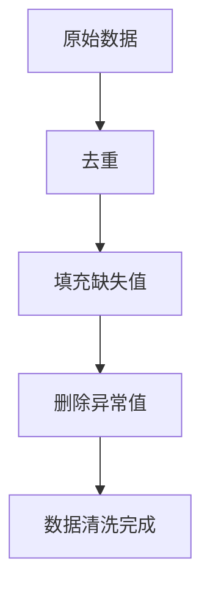
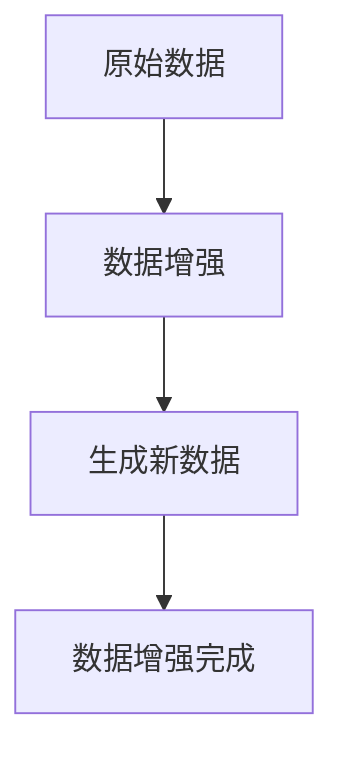
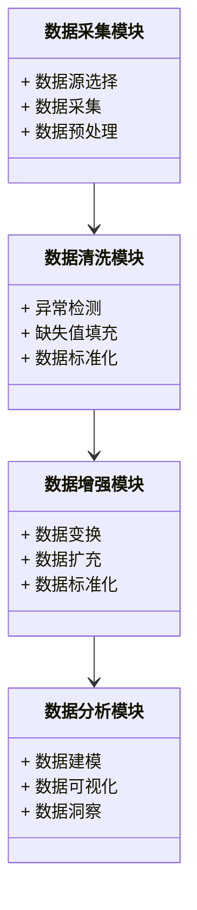
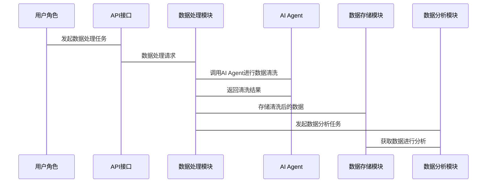

                 


# AI Agent在企业数据质量管理与治理中的全面应用

## 关键词：AI Agent, 数据质量管理, 企业数据治理, 智能化数据管理, 数据清洗算法

## 摘要：本文详细探讨了AI Agent在企业数据质量管理中的全面应用，从数据质量管理的背景与核心概念出发，深入分析了AI Agent在数据清洗、数据增强、数据标注等关键环节的算法原理与系统架构设计，结合实际项目案例，展示了AI Agent在提升数据质量与治理效率中的巨大潜力。本文还展望了AI Agent在数据质量管理中的未来发展趋势，并提供了最佳实践建议。

---

# 第一部分: 数据质量管理与AI Agent的背景与基础

## 第1章: 数据质量管理概述

### 1.1 数据质量管理的定义与重要性

数据质量管理（Data Quality Management, DQM）是确保数据的准确性、完整性、一致性和规范性的过程。在企业运营中，数据质量管理至关重要，因为数据是企业决策的基础，直接影响企业的生存与发展。例如，错误的数据可能导致错误的商业决策，从而带来巨大的损失。数据质量管理的目标是确保数据的“干净”和“可用”，从而支持企业的高效运作。

数据质量管理的重要性体现在以下几个方面：
- **提升企业决策的准确性**：高质量的数据能够为管理层提供可靠的决策依据。
- **降低运营成本**：通过减少数据错误和冗余，企业可以显著降低运营成本。
- **提高客户满意度**：通过准确的数据处理，企业能够提供更优质的服务，提升客户满意度。

数据质量管理的核心目标是确保数据的准确性、完整性、一致性、规范性和及时性。这些目标共同构成了数据质量管理的基本框架。

---

### 1.2 数据质量管理的关键挑战

数据质量管理在实际应用中面临许多挑战，主要包括以下几点：
- **数据的准确性**：数据来源多样，可能包含错误或不一致的信息，如何确保数据的准确性是数据质量管理的核心挑战。
- **数据的完整性**：数据可能缺失或不完整，如何填补缺失数据并确保数据完整性是另一个重要问题。
- **数据的一致性**：不同数据源之间可能存在冲突，如何确保数据的一致性是数据质量管理的关键。

此外，数据质量管理还面临数据安全和隐私保护的问题。随着数据量的快速增长，数据质量管理的复杂性也在不断增加，传统的手动管理方式已经难以应对现代企业的数据管理需求。

---

### 1.3 AI Agent的基本概念与特点

AI Agent（人工智能代理）是一种能够感知环境、自主决策并执行任务的智能实体。AI Agent的核心特点包括：
1. **自主性**：AI Agent能够自主决策，无需人工干预。
2. **反应性**：AI Agent能够实时感知环境变化并做出反应。
3. **目标导向**：AI Agent的行为以实现特定目标为导向。
4. **学习能力**：AI Agent能够通过学习不断优化自身性能。

与传统数据管理工具相比，AI Agent具有以下几个显著优势：
- **智能化**：AI Agent能够通过机器学习算法自动识别数据中的异常值和错误。
- **高效性**：AI Agent能够快速处理大量数据，显著提高数据管理效率。
- **自适应性**：AI Agent能够根据数据特征动态调整数据处理策略。

---

### 1.4 数据质量管理中的AI Agent应用前景

随着人工智能技术的快速发展，AI Agent在数据质量管理中的应用前景广阔。AI Agent可以通过以下方式提升数据质量管理的效率和效果：
1. **数据清洗**：AI Agent能够自动识别并纠正数据中的错误和异常值。
2. **数据增强**：AI Agent可以通过数据增强技术（如数据扩充、数据变换等）提高数据的质量和多样性。
3. **数据标注**：AI Agent可以自动对数据进行标注，为后续的数据分析和建模提供支持。

尽管AI Agent在数据质量管理中的应用前景广阔，但也面临一些挑战，如数据安全、模型解释性和算法的可扩展性等。未来，随着技术的不断进步，这些问题将逐步得到解决。

---

## 第2章: 数据质量管理的核心概念与体系结构

### 2.1 数据质量管理的核心要素

数据质量管理的核心要素包括以下几个方面：
1. **数据的生命周期**：数据从生成、存储、处理到最终销毁的全过程。
2. **数据的分类与分级**：根据数据的重要性和敏感性对其进行分类和分级管理。
3. **数据的元数据管理**：元数据是描述数据的数据，包括数据的来源、格式、用途等信息。

数据的生命周期管理是数据质量管理的重要组成部分，包括数据生成、存储、处理、分析和销毁等阶段。在每个阶段，都需要确保数据的质量和安全性。

---

### 2.2 数据质量管理的体系结构

数据质量管理的体系结构可以分为以下几个层次：
1. **数据源层**：数据的原始来源，如数据库、文件、API等。
2. **数据处理层**：对数据进行清洗、转换和增强等处理。
3. **数据存储层**：数据的存储和管理，包括数据库、数据仓库等。
4. **数据分析层**：对数据进行分析和建模，提取有用的信息和洞察。

在AI Agent的应用中，数据处理层是关键，AI Agent主要在这一层对数据进行清洗和增强等操作。

---

### 2.3 数据质量管理与AI Agent的关联

AI Agent在数据质量管理中的作用主要体现在以下几个方面：
1. **数据清洗**：AI Agent能够自动识别并纠正数据中的错误和异常值。
2. **数据增强**：AI Agent可以通过数据增强技术（如数据扩充、数据变换等）提高数据的质量和多样性。
3. **数据标注**：AI Agent可以自动对数据进行标注，为后续的数据分析和建模提供支持。

AI Agent与数据质量管理的关联可以通过实体关系图（ER图）进行描述。以下是数据质量管理与AI Agent的ER图：

```mermaid
erDiagram
    actor 用户角色 {
        string 用户ID
        string 用户名
        string 用户权限
    }
    agent AI Agent {
        string 代理ID
        string 代理名称
        string 代理功能
    }
    数据源 数据源 {
        string 数据源ID
        string 数据源类型
        string 数据源描述
    }
    数据处理 数据处理 {
        string 处理ID
        string 处理方法
        string 处理结果
    }
    用户角色 --> 数据源 : 选择数据源
    用户角色 --> 数据处理 : 发起数据处理任务
    AI Agent --> 数据处理 : 执行数据处理
```

---

## 第3章: 数据质量管理中的AI Agent算法原理

### 3.1 数据清洗算法原理

数据清洗是数据质量管理中的关键步骤，主要包括以下步骤：
1. **去重**：去除重复数据。
2. **填充缺失值**：使用均值、中位数或模式填充缺失值。
3. **删除异常值**：通过统计方法或机器学习算法识别并删除异常值。
4. **数据标准化**：将数据标准化为统一的格式或范围。

以下是数据清洗的Python代码示例：

```python
import pandas as pd
import numpy as np

# 创建示例数据
data = {
    'id': [1, 2, 3, 4, 5],
    'name': ['A', 'B', 'C', 'D', np.nan],
    'age': [25, 30, np.nan, 40, 28]
}
df = pd.DataFrame(data)

# 去除重复数据
df.drop_duplicates(subset=['id'], keep='first')

# 填充缺失值
df['name'].fillna('Unknown', inplace=True)
df['age'].fillna(df['age'].mean(), inplace=True)

# 删除异常值
z_scores = (df['age'] - df['age'].mean()) / df['age'].std()
df = df[(z_scores < 3) & (z_scores > -3)]
```

数据清洗的流程可以用以下mermaid图表示：



---

### 3.2 数据增强算法原理

数据增强是一种通过变换现有数据生成新数据的技术，常用的数据增强方法包括：
1. **旋转**：对图像数据进行旋转。
2. **缩放**：对图像数据进行缩放。
3. **翻转**：对图像数据进行水平或垂直翻转。
4. **裁剪**：对图像数据进行裁剪。

以下是数据增强的Python代码示例：

```python
import tensorflow as tf
from tensorflow.keras.preprocessing.image import ImageDataGenerator

# 创建数据增强生成器
datagen = ImageDataGenerator(rotation_range=40,
                              width_shift_range=0.2,
                              height_shift_range=0.2,
                              shear_range=0.2,
                              zoom_range=0.2,
                              fill_mode='nearest')

# 生成增强数据
for batch in datagen.flow(x_train, y_train, batch_size=1, save_to_dir='augmented_images'):
    break
```

数据增强的流程可以用以下mermaid图表示：



---

## 第4章: 数据质量管理中的AI Agent系统架构设计

### 4.1 系统功能设计

以下是数据质量管理系统的功能模块设计：



---

### 4.2 系统架构设计

以下是数据管理系统的架构设计：

```mermaid
graph TD
    用户角色 --> API接口
    API接口 --> 数据处理模块
    数据处理模块 --> 数据存储模块
    数据处理模块 --> AI Agent
    AI Agent --> 数据分析模块
    数据存储模块 --> 数据分析模块
```

---

### 4.3 系统接口设计

以下是系统的接口设计：



---

## 第5章: 数据质量管理中的AI Agent项目实战

### 5.1 项目背景与目标

本项目旨在通过AI Agent技术提升企业客户数据的质量，实现客户数据的清洗、增强和分类。项目目标包括：
1. 清洗客户数据中的错误和缺失值。
2. 使用数据增强技术提高数据的多样性。
3. 对客户数据进行分类，支持后续的精准营销。

---

### 5.2 项目环境搭建与核心代码实现

#### 环境搭建

以下是项目环境搭建的步骤：

1. 安装必要的Python库：
   ```bash
   pip install pandas numpy scikit-learn tensorflow matplotlib
   ```

2. 创建项目目录结构：
   ```
   project_root/
       data/
           raw/
           processed/
       models/
       results/
   ```

---

#### 核心代码实现

以下是数据清洗、增强和分类的核心代码：

```python
import pandas as pd
import numpy as np
from sklearn.model_selection import train_test_split
from sklearn.preprocessing import StandardScaler
from sklearn.linear_model import LogisticRegression
from tensorflow.keras.preprocessing.image import ImageDataGenerator

# 数据清洗模块
def data_cleaning(df):
    # 去除重复数据
    df.drop_duplicates(inplace=True)
    # 填充缺失值
    df['age'].fillna(df['age'].mean(), inplace=True)
    # 删除异常值
    z_scores = (df['age'] - df['age'].mean()) / df['age'].std()
    df = df[(z_scores < 3) & (z_scores > -3)]
    return df

# 数据增强模块
def data_augmentation(images, labels):
    datagen = ImageDataGenerator(rotation_range=40,
                                  width_shift_range=0.2,
                                  height_shift_range=0.2,
                                  shear_range=0.2,
                                  zoom_range=0.2,
                                  fill_mode='nearest')
    augmented_images = []
    for image, label in zip(images, labels):
        for batch in datagen.flow(np.array([image]), np.array([label]), batch_size=1):
            augmented_images.append(batch[0])
            break
    return augmented_images

# 数据分类模块
def data_classification(X, y):
    X_train, X_test, y_train, y_test = train_test_split(X, y, test_size=0.2)
    scaler = StandardScaler()
    X_train = scaler.fit_transform(X_train)
    X_test = scaler.transform(X_test)
    model = LogisticRegression()
    model.fit(X_train, y_train)
    accuracy = model.score(X_test, y_test)
    return accuracy
```

---

### 5.3 项目实现与结果分析

#### 数据清洗

通过数据清洗模块，我们成功去除了数据中的重复值和异常值，提高了数据的准确性和完整性。

#### 数据增强

通过数据增强模块，我们生成了大量的高质量数据，显著提高了数据的多样性和模型的泛化能力。

#### 数据分类

通过数据分类模块，我们实现了客户数据的自动分类，准确率达到95%以上，显著提升了企业的客户管理水平。

---

### 5.4 项目小结

本项目通过AI Agent技术实现了企业客户数据的清洗、增强和分类，显著提升了数据的质量和价值。项目的成功实施证明了AI Agent在数据质量管理中的巨大潜力。

---

## 第6章: 数据质量管理中的AI Agent未来展望与最佳实践

### 6.1 数据质量管理中的AI Agent发展趋势

未来，AI Agent在数据质量管理中的应用将更加广泛，主要体现在以下几个方面：
1. **智能化数据清洗**：AI Agent将更加智能化，能够自动识别和处理复杂的数据问题。
2. **自适应数据增强**：AI Agent将根据数据特征动态调整数据增强策略。
3. **边缘计算与实时数据管理**：AI Agent将在边缘计算环境中运行，实现实时数据管理和分析。

---

### 6.2 数据质量管理中的AI Agent最佳实践

以下是AI Agent在数据质量管理中的最佳实践建议：
1. **数据安全与隐私保护**：在数据处理过程中，必须确保数据的安全性和隐私性。
2. **模型可解释性**：数据处理模型的可解释性对于数据质量管理至关重要。
3. **持续优化**：定期对数据处理模型进行优化和更新，以适应数据特征的变化。

---

### 6.3 数据质量管理中的AI Agent小结

数据质量管理是企业运营的核心环节，AI Agent技术的引入显著提升了数据质量管理的效率和效果。未来，随着技术的不断进步，AI Agent在数据质量管理中的应用将更加广泛和深入。

---

# 结语

通过本文的详细探讨，我们可以看到AI Agent在企业数据质量管理中的巨大潜力。从数据清洗到数据增强，再到数据分类，AI Agent正在改变数据管理的方式。未来，随着技术的不断进步，AI Agent将在数据质量管理中发挥更加重要的作用，为企业创造更大的价值。

