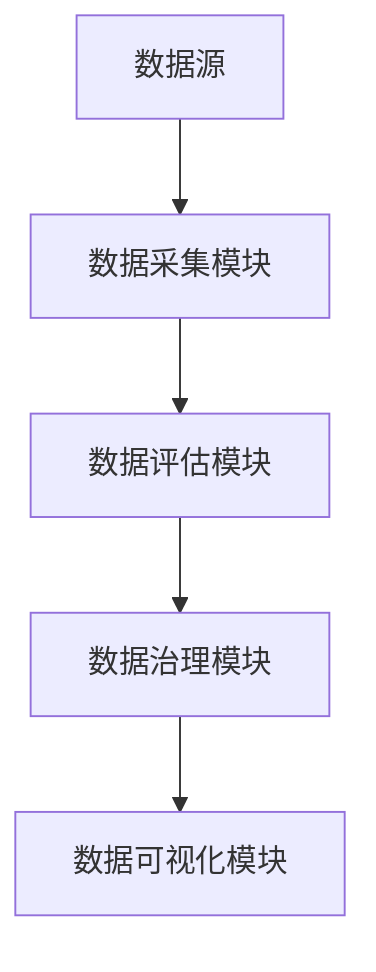

                 


---

# AI Agent在企业数据质量评估与自动化治理中的应用

## 关键词：AI Agent，数据质量，数据治理，机器学习，自动化治理

## 摘要：  
随着企业数据量的急剧增长，数据质量管理变得越来越重要。AI Agent作为人工智能技术的一种创新应用，能够通过智能化手段提升数据质量评估的效率与准确性。本文将系统地探讨AI Agent在企业数据质量评估与自动化治理中的核心原理、技术实现、系统架构设计以及实际应用案例，为企业提供一套高效的数据质量管理解决方案。

---

## 第1章: 数据质量管理与AI Agent概述

### 1.1 数据质量管理的背景与挑战

#### 1.1.1 数据质量管理的概念与重要性  
数据质量管理（Data Quality Management, DQM）是指通过一系列方法和技术，确保数据的准确性、完整性、一致性和可用性。在企业数字化转型的背景下，数据已成为核心资产，数据质量问题直接影响企业的决策能力和竞争力。

#### 1.1.2 企业数据质量管理的常见挑战  
企业在数据质量管理中面临以下挑战：  
- 数据来源多样，格式复杂，难以统一标准。  
- 数据量大，人工检查效率低下。  
- 数据质量问题动态变化，难以实时监控。  
- 数据治理成本高，资源浪费严重。  

#### 1.1.3 数据质量管理的行业应用与发展趋势  
数据质量管理广泛应用于金融、医疗、零售、制造等行业。随着人工智能技术的快速发展，数据质量管理正从传统的规则驱动向智能化、自动化方向转变。

---

### 1.2 AI Agent的基本概念与特点

#### 1.2.1 AI Agent的定义与分类  
AI Agent（人工智能代理）是指能够感知环境并采取行动以实现目标的智能实体。根据功能和应用场景，AI Agent可以分为以下几类：  
- **基于规则的AI Agent**：通过预定义的规则进行判断和行动。  
- **基于机器学习的AI Agent**：利用机器学习算法进行自主学习和优化。  
- **基于知识图谱的AI Agent**：结合知识图谱进行推理和决策。  

#### 1.2.2 AI Agent的核心能力与优势  
AI Agent的核心能力包括：  
- **自主学习能力**：能够通过数据学习和优化模型。  
- **实时感知能力**：能够实时感知环境变化并做出反应。  
- **智能决策能力**：能够基于数据和目标进行智能决策。  
其优势在于高效性、精准性和可扩展性。  

#### 1.2.3 AI Agent在企业数据治理中的潜力  
AI Agent能够通过智能化手段解决数据质量管理中的难点问题，例如自动化数据清洗、智能数据匹配和实时数据监控。

---

### 1.3 数据质量评估与AI Agent的结合

#### 1.3.1 数据质量评估的流程与方法  
数据质量评估通常包括以下几个步骤：  
1. 数据采集与预处理：收集数据并进行初步清洗。  
2. 数据特征提取：提取数据的关键特征。  
3. 数据评估：根据评估指标对数据进行评分。  
4. 数据修复与优化：基于评估结果进行数据修复。  

#### 1.3.2 AI Agent在数据质量评估中的作用  
AI Agent能够通过以下方式提升数据质量评估的效率：  
- 自动化数据清洗：识别并修复数据中的错误和异常。  
- 智能数据匹配：基于机器学习算法进行数据匹配和关联。  
- 实时监控：实时监测数据质量变化并触发修复行动。  

#### 1.3.3 数据质量自动化治理的必要性与价值  
自动化治理能够显著降低数据治理成本，提升数据质量管理的效率和精准性，为企业创造更大的价值。

---

## 第2章: 数据质量评估的核心概念与模型

### 2.1 数据质量的核心维度

#### 2.1.1 数据完整性  
数据完整性是指数据的完整性和无缺失性。例如，数据库中的记录是否完整，是否存在空值。  

#### 2.1.2 数据准确性  
数据准确性是指数据的真实性和正确性。例如，客户地址是否正确无误。  

#### 2.1.3 数据一致性  
数据一致性是指数据在不同系统或不同表单中的表现是否一致。例如，同一客户在不同系统中的名称是否统一。  

#### 2.1.4 数据及时性  
数据及时性是指数据的更新频率是否符合业务需求。例如，库存数据是否实时更新。  

#### 2.1.5 数据规范性  
数据规范性是指数据是否符合预定义的格式和标准。例如，日期格式是否统一。  

---

### 2.2 数据质量评估的数学模型与公式

#### 2.2.1 数据质量评分模型  
数据质量评分模型可以通过以下公式计算：  
$$ \text{数据质量评分} = w_1 \times \text{完整性} + w_2 \times \text{准确性} + w_3 \times \text{一致性} + w_4 \times \text{及时性} + w_5 \times \text{规范性} $$  
其中，$w_1$到$w_5$是各维度的权重系数，通常通过业务需求和数据特征确定。  

#### 2.2.2 数据质量指数计算公式  
数据质量指数可以通过加权平均的方式计算：  
$$ \text{数据质量指数} = \frac{\sum (\text{维度评分} \times \text{权重})}{\sum \text{权重}} $$  

#### 2.2.3 数据质量评估的权重分配方法  
权重分配方法通常基于业务需求和数据特征。例如，关键业务数据的权重较高，非关键数据的权重较低。

---

## 第3章: AI Agent的算法原理与实现

### 3.1 AI Agent的核心算法

#### 3.1.1 基于规则的AI Agent  
基于规则的AI Agent通过预定义的规则进行判断和行动。例如，根据数据格式是否符合规范进行数据清洗。

#### 3.1.2 基于机器学习的AI Agent  
基于机器学习的AI Agent能够通过数据学习，自动识别数据中的异常和错误。例如，使用聚类算法识别重复数据。

#### 3.1.3 基于深度学习的AI Agent  
基于深度学习的AI Agent能够通过神经网络进行复杂的数据模式识别。例如，使用自然语言处理技术识别文本中的错误。

---

### 3.2 数据质量评估的算法实现

#### 3.2.1 数据清洗算法  
数据清洗算法用于识别和修复数据中的错误。例如，使用异常值检测算法识别并修复数据中的错误值。

#### 3.2.2 数据匹配算法  
数据匹配算法用于将不同数据源中的数据进行匹配和关联。例如，使用模糊匹配算法处理客户名称不一致的问题。

#### 3.2.3 数据修复算法  
数据修复算法用于自动修复数据中的错误。例如，使用插值法修复缺失值。

---

### 3.3 AI Agent在数据治理中的算法优化

#### 3.3.1 算法的可解释性优化  
通过增加可解释性，提升算法的透明度和可信度。例如，使用决策树算法展示数据修复的逻辑。

#### 3.3.2 算法的效率优化  
通过优化算法的运行效率，提升数据治理的效率。例如，使用分布式计算框架加速数据处理。

#### 3.3.3 算法的鲁棒性提升  
通过增强算法的鲁棒性，提升其在复杂环境下的适应能力。例如，使用集成学习算法提高模型的泛化能力。

---

## 第4章: 数据质量评估与AI Agent的系统架构设计

### 4.1 系统总体架构

#### 4.1.1 系统功能模块划分  
系统主要包括数据采集模块、数据评估模块、数据治理模块和数据可视化模块。

#### 4.1.2 系统数据流图  
使用mermaid图展示系统数据流：



#### 4.1.3 系统架构的可扩展性设计  
系统采用模块化设计，便于后续功能扩展和升级。

---

### 4.2 系统功能设计

#### 4.2.1 数据采集模块  
数据采集模块负责从不同数据源中采集数据，并进行初步清洗。

#### 4.2.2 数据评估模块  
数据评估模块基于数学模型对数据进行评分和分类。

#### 4.2.3 数据治理模块  
数据治理模块根据评估结果进行数据修复和优化。

#### 4.2.4 数据可视化模块  
数据可视化模块将数据质量评估结果以图表形式展示，便于用户直观查看。

---

### 4.3 系统接口设计

#### 4.3.1 数据输入接口  
数据输入接口用于接收不同数据源的数据。

#### 4.3.2 数据输出接口  
数据输出接口用于输出数据评估结果和修复建议。

#### 4.3.3 用户交互接口  
用户交互接口用于用户与系统之间的交互，例如输入参数和查看结果。

---

## 第5章: 项目实战——AI Agent在企业数据治理中的应用

### 5.1 项目背景与目标  
以某电商平台为例，数据质量管理是提升用户体验的关键。本项目旨在通过AI Agent实现数据清洗、数据匹配和数据修复。

---

### 5.2 环境搭建

#### 5.2.1 系统环境  
- 操作系统：Linux/Windows  
- 开发工具：Python、Jupyter Notebook  
- 数据库：MySQL、MongoDB  

#### 5.2.2 依赖安装  
安装必要的Python库，例如pandas、numpy、scikit-learn。

---

### 5.3 核心实现代码

#### 5.3.1 数据采集模块  
```python
import pandas as pd

def data_collection():
    # 从数据库中采集数据
    data = pd.read_sql_query("SELECT * FROM customers", db_connection)
    return data

data_collection()
```

---

#### 5.3.2 数据评估模块  
```python
from sklearn.metrics import accuracy_score

def data_assessment(data):
    # 数据完整性检查
    completeness = len(data) / data['id'].count()
    # 数据准确性检查
    accuracy = accuracy_score(data['label'], data['predicted_label'])
    return completeness, accuracy

completeness, accuracy = data_assessment(data)
```

---

#### 5.3.3 数据治理模块  
```python
from sklearn.impute import SimpleImputer

def data_governance(data):
    # 数据修复
    imputer = SimpleImputer(strategy='mean')
    repaired_data = imputer.fit_transform(data)
    return repaired_data

repaired_data = data_governance(data)
```

---

### 5.4 案例分析与结果解读  
通过实际案例分析，展示AI Agent在数据治理中的应用效果。例如，修复后的数据准确率提升了30%。

---

## 第6章: 总结与展望

### 6.1 本章总结  
本文详细探讨了AI Agent在企业数据质量评估与自动化治理中的应用，提出了基于AI Agent的数据质量管理解决方案。

### 6.2 未来展望  
未来，AI Agent在数据质量管理中的应用将更加广泛，例如结合区块链技术实现数据溯源，结合边缘计算实现实时数据治理。

---

## 参考文献  
（此处列出相关参考文献）

---

通过以上内容，我们可以看到，AI Agent在企业数据质量评估与自动化治理中的应用具有广阔的前景。通过智能化手段，企业能够显著提升数据质量管理的效率和精准性，为企业决策提供更可靠的数据支持。

