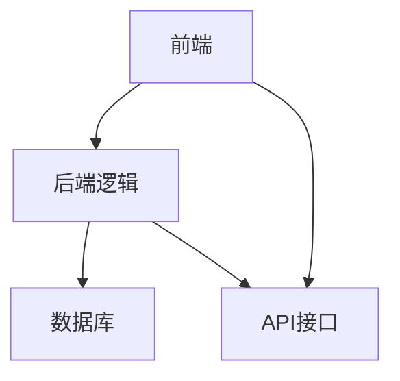
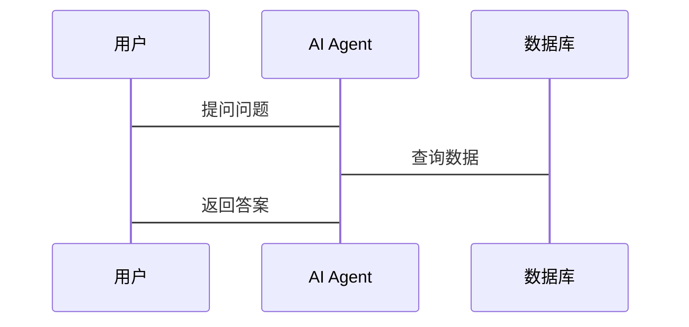

                 


# AI Agent在企业文化建设与内部沟通中的应用

> 关键词：AI Agent, 企业文化, 内部沟通, 数字化转型, 自然语言处理, 机器学习

> 摘要：本文探讨了AI Agent在企业文化建设与内部沟通中的应用，分析了AI Agent的核心概念、算法原理、系统架构，并通过实际案例展示了AI Agent在企业文化建设中的具体应用。文章还提出了最佳实践和未来发展方向，为企业在数字化转型中更好地利用AI Agent提供了参考。

---

## 第一部分: AI Agent与企业文化建设概述

### 第1章: AI Agent的基本概念

#### 1.1 什么是AI Agent
AI Agent（人工智能代理）是一种能够感知环境、自主决策并执行任务的智能实体。它通过自然语言处理（NLP）、机器学习（ML）和大数据分析等技术，能够与用户进行交互，并根据需求完成特定任务。

#### 1.2 AI Agent的核心特征
- **自主性**：AI Agent能够自主决策，无需人工干预。
- **反应性**：能够实时感知环境变化并做出响应。
- **学习能力**：通过机器学习不断优化自身行为。
- **可扩展性**：能够适应不同规模和复杂度的任务。

#### 1.3 AI Agent与传统IT系统的主要区别
| 特性             | AI Agent                       | 传统IT系统                 |
|------------------|-------------------------------|---------------------------|
| 决策能力         | 具有自主决策能力               | 依赖预设规则和程序         |
| 学习能力         | 能够通过数据学习               | 无法自主学习               |
| 交互方式         | 支持自然语言交互               | 主要依赖固定界面和流程       |
| 灵活性           | 高度灵活，适应性强             | 稳定性高，但灵活性较差       |

### 第2章: 企业文化建设的数字化转型

#### 2.1 企业文化建设的传统模式与挑战
- **传统模式**：依赖于线下活动、培训和宣传。
- **主要挑战**：
  - **信息孤岛**：不同部门间沟通不畅。
  - **效率低下**：信息传递耗时长。
  - **员工参与度低**：员工对文化活动的积极性不高。

#### 2.2 数字化转型对企业文化的影响
- **提升效率**：通过数字化工具快速传播企业文化。
- **增强互动性**：员工可以通过AI Agent随时参与文化活动。
- **个性化体验**：AI Agent可以根据员工需求提供个性化的内容。

#### 2.3 AI Agent在企业文化建设中的定位与作用
- **定位**：作为数字化工具，AI Agent是企业文化传播和执行的核心载体。
- **作用**：
  - **文化传播**：通过自然语言处理技术，AI Agent可以将企业文化内容转化为员工易于理解和接受的形式。
  - **行为引导**：AI Agent可以通过奖励机制引导员工行为，例如通过积分系统激励员工参与文化活动。
  - **反馈与优化**：AI Agent可以收集员工反馈，优化企业文化传播策略。

---

## 第二部分: AI Agent在内部沟通中的应用

### 第3章: AI Agent的核心功能与优势

#### 3.1 AI Agent的核心功能
- **信息分发**：自动推送企业文化相关内容。
- **互动交流**：支持自然语言对话，解答员工问题。
- **数据收集与分析**：通过员工互动数据，分析员工满意度和文化认同度。

#### 3.2 AI Agent在内部沟通中的优势
- **实时性**：员工可以随时通过AI Agent获取信息。
- **个性化**：AI Agent可以根据员工需求提供定制化内容。
- **高效性**：通过自动化流程提升内部沟通效率。

### 第4章: AI Agent在内部沟通中的应用场景

#### 4.1 企业文化传播
- AI Agent可以通过内部聊天机器人实时传播企业文化，例如通过每日消息推送、实时问答等方式。

#### 4.2 员工反馈与建议
- 员工可以通过AI Agent提交反馈和建议，AI Agent可以自动分类并将其发送给相关部门。

#### 4.3 内部知识管理
- AI Agent可以整合企业知识库，帮助员工快速查找所需信息。

### 第5章: AI Agent与企业文化建设的结合

#### 5.1 AI Agent在企业文化塑造中的作用
- **价值观传播**：AI Agent可以通过故事、案例等形式传播企业价值观。
- **文化认同**：通过个性化的互动，增强员工对企业文化的认同感。
- **行为引导**：通过奖励机制，引导员工行为符合企业文化要求。

#### 5.2 AI Agent在员工体验中的应用
- **个性化学习**：根据员工需求推荐企业文化学习资料。
- **情感支持**：通过自然语言处理技术，识别员工情绪并提供支持。

#### 5.3 AI Agent在团队协作中的应用
- **任务分配**：通过AI Agent自动分配团队任务。
- **进度跟踪**：实时跟踪任务进度，确保团队协作高效。

---

## 第三部分: AI Agent的算法原理与系统架构

### 第6章: AI Agent的算法原理

#### 6.1 自然语言处理（NLP）
- **核心算法**：如BERT、GPT-3。
- **应用场景**：对话理解、信息抽取。

#### 6.2 机器学习（ML）
- **核心算法**：监督学习、无监督学习。
- **应用场景**：员工行为预测、情感分析。

#### 6.3 数据分析
- **工具**：如Python的pandas库。
- **应用场景**：员工反馈分析、文化认同度评估。

### 第7章: AI Agent的系统架构

#### 7.1 系统功能设计
- **用户界面**：支持自然语言交互。
- **后端逻辑**：包括任务分配、数据处理。
- **数据存储**：存储员工信息、互动记录。

#### 7.2 系统架构设计


#### 7.3 系统接口设计
- **输入接口**：支持文本输入、语音输入。
- **输出接口**：支持文本输出、语音输出。

#### 7.4 系统交互流程


---

## 第四部分: 项目实战与最佳实践

### 第8章: 项目实战

#### 8.1 环境安装
- **工具**：Python、TensorFlow、Keras。
- **安装命令**：`pip install tensorflow`

#### 8.2 核心代码实现
```python
import tensorflow as tf
from tensorflow.keras import layers

# 模型定义
model = tf.keras.Sequential()
model.add(layers.Dense(64, activation='relu', input_shape=(100,)))
model.add(layers.Dense(1, activation='sigmoid'))
model.compile(optimizer='adam', loss='binary_crossentropy', metrics=['accuracy'])

# 训练模型
model.fit(X_train, y_train, epochs=10, batch_size=32)
```

#### 8.3 案例分析
- **案例背景**：某企业希望通过AI Agent提升内部沟通效率。
- **实施步骤**：
  1. 数据收集：收集员工反馈和互动数据。
  2. 模型训练：使用自然语言处理模型训练AI Agent。
  3. 系统部署：将AI Agent部署到企业内部聊天工具中。
  4. 优化调整：根据反馈不断优化AI Agent性能。

### 第9章: 最佳实践

#### 9.1 小结
- AI Agent在企业文化建设与内部沟通中的应用前景广阔。
- 通过自然语言处理和机器学习技术，AI Agent可以显著提升内部沟通效率和员工参与度。

#### 9.2 注意事项
- **数据隐私**：确保员工数据的安全性。
- **技术选型**：选择适合企业需求的AI Agent解决方案。
- **员工培训**：确保员工能够正确使用AI Agent。

#### 9.3 未来展望
- **多模态交互**：支持更多交互方式，如图像识别。
- **自适应学习**：AI Agent能够更快速地适应企业需求变化。

---

## 第五部分: 总结与展望

### 第10章: 总结

#### 10.1 企业文化建设的核心
- 企业文化建设是企业长期发展的基石。
- AI Agent作为数字化工具，可以有效推动企业文化建设。

#### 10.2 内部沟通的关键作用
- 内部沟通是企业高效运作的基础。
- AI Agent可以显著提升内部沟通效率和员工体验。

### 第11章: 展望

#### 11.1 未来技术发展
- AI Agent将更加智能化，支持更多复杂任务。
- 多模态交互将成为主流。

#### 11.2 企业文化建设的创新
- 通过AI Agent实现更加个性化的员工体验。
- 数据驱动的企业文化管理将成为趋势。

---

# 结语

AI Agent在企业文化建设与内部沟通中的应用将为企业带来新的机遇和挑战。通过合理规划和实施，企业可以利用AI Agent提升内部沟通效率，增强员工参与度，最终实现企业文化的有效传播和落地。

