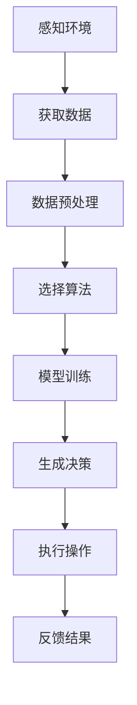
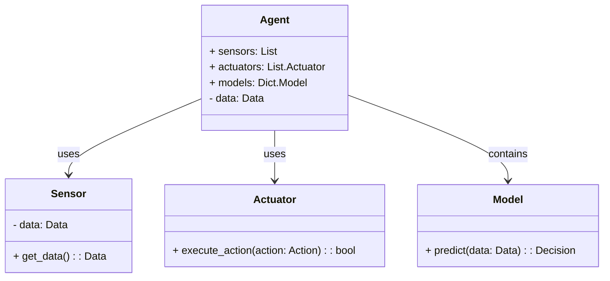
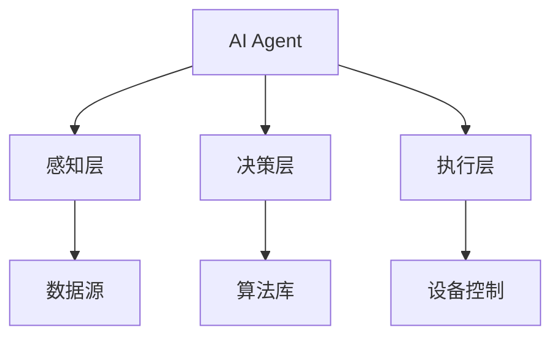
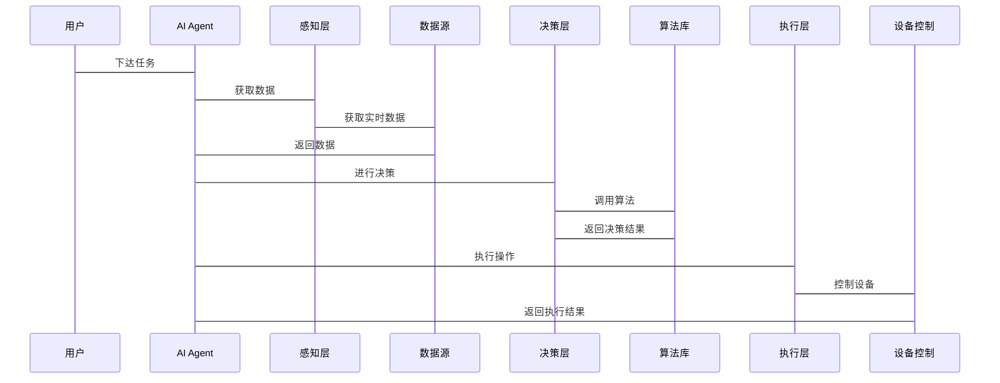

                 


# AI Agent在企业智能工厂管理中的全面应用

> 关键词：AI Agent，智能工厂，企业数字化，工业智能化，智能制造

> 摘要：本文深入探讨了AI Agent在企业智能工厂管理中的全面应用，从核心概念、算法原理、系统架构到项目实战，系统性地分析了AI Agent如何赋能智能工厂的生产优化、质量控制和决策支持。通过案例分析和实际代码实现，详细展示了AI Agent在智能制造中的具体应用场景和实施方法。

---

## 第1章 AI Agent概述

### 1.1 AI Agent的基本概念

#### 1.1.1 什么是AI Agent
AI Agent（人工智能代理）是一种能够感知环境、做出决策并执行任务的智能实体。它通过与环境交互，实现特定目标，通常用于自动化决策、问题求解和动态适应。

#### 1.1.2 AI Agent的核心特点
1. **自主性**：能够在没有外部干预的情况下独立运行。
2. **反应性**：能够实时感知环境变化并做出反应。
3. **目标导向**：以实现特定目标为导向，优化决策过程。
4. **学习能力**：通过经验或数据不断优化自身行为。

#### 1.1.3 AI Agent与传统自动化的区别
传统自动化依赖固定的程序和逻辑，而AI Agent具备学习和适应能力，能够根据环境动态调整行为。例如，在智能工厂中，AI Agent可以根据实时生产数据优化排产计划，而传统自动化系统无法实现这种动态调整。

### 1.2 AI Agent的工作原理

#### 1.2.1 AI Agent的基本工作流程
1. **感知**：通过传感器、数据库或其他数据源获取环境信息。
2. **决策**：基于感知信息，利用算法和模型做出决策。
3. **执行**：根据决策结果执行操作，并将结果反馈给环境。
4. **学习**：通过反馈不断优化自身模型和决策策略。

#### 1.2.2 AI Agent的感知与决策机制
- **感知**：AI Agent通过多种传感器和数据源获取环境信息，例如温度、湿度、设备状态等。
- **决策**：基于感知信息，AI Agent利用强化学习、决策树等算法，生成最优决策。

#### 1.2.3 AI Agent的执行与反馈机制
- **执行**：AI Agent根据决策结果调用相关系统或设备执行操作。
- **反馈**：执行结果被反馈到系统中，用于后续优化和调整。

### 1.3 AI Agent在企业中的应用价值

#### 1.3.1 提高生产效率
AI Agent可以通过优化排产计划和资源分配，提高工厂的生产效率。

#### 1.3.2 优化资源配置
AI Agent能够动态调整资源分配，降低浪费，提高资源利用率。

#### 1.3.3 提升决策能力
通过实时数据和历史数据分析，AI Agent能够提供更精准的决策支持，帮助企业在复杂环境中做出最优决策。

---

## 第2章 AI Agent的核心概念与联系

### 2.1 核心概念原理

#### 2.1.1 AI Agent的感知层
感知层负责获取环境信息，包括传感器数据、历史记录和实时监控数据。

#### 2.1.2 AI Agent的决策层
决策层基于感知信息，利用算法和模型做出决策。

#### 2.1.3 AI Agent的执行层
执行层负责将决策转化为具体操作，并将结果反馈给系统。

### 2.2 核心概念属性特征对比表格

| 特性 | 描述 |
|------|------|
| 感知能力 | 通过传感器或数据源获取信息 |
| 决策能力 | 基于感知信息做出决策 |
| 执行能力 | 执行决策并反馈结果 |
| 自适应能力 | 根据环境变化调整行为 |

### 2.3 ER实体关系图架构

```mermaid
er
  actor: 用户
  agent: AI Agent
  task: 任务
  environment: 环境
  action: 行动
  relation: 关系
  actor --> task: 下达任务
  agent --> environment: 感知环境
  agent --> task: 执行任务
  environment --> action: 反馈结果
```

---

## 第3章 AI Agent的算法原理

### 3.1 算法原理概述

#### 3.1.1 算法流程图


#### 3.1.2 算法实现代码
```python
class AI_Agent:
    def __init__(self, sensors, actuators):
        self.sensors = sensors
        self.actuators = actuators
        self.models = {}

    def perceive(self):
        # 获取传感器数据
        data = self.sensors.get_data()
        return data

    def decide(self, data):
        # 数据预处理
        processed_data = self.preprocess(data)
        # 选择算法
        algorithm = self.select_algorithm(processed_data)
        # 模型训练
        model = self.train_model(algorithm, processed_data)
        # 生成决策
        decision = self.make_decision(model, processed_data)
        return decision

    def execute(self, decision):
        # 执行操作
        self.actuators.execute_action(decision)
        return True

    def preprocess(self, data):
        # 数据预处理逻辑
        return data

    def select_algorithm(self, data):
        # 根据数据选择算法
        return 'reinforcement_learning'

    def train_model(self, algorithm, data):
        # 训练模型
        pass

    def make_decision(self, model, data):
        # 生成决策
        pass
```

#### 3.1.3 算法的数学模型

$$ P(s_t | s_{t-1}, a_{t-1}) $$

$$ Q(s, a) = \sum_{k=1}^{N} \lambda^k \cdot R(s, a) $$

### 3.2 算法实现细节

#### 3.2.1 状态转移模型
- 状态表示：$$ s_t \in S $$
- 行动表示：$$ a_t \in A $$
- 奖励函数：$$ R(s, a) $$

#### 3.2.2 决策树模型
- 决策树构建：基于历史数据构建决策树。
- 决策路径选择：根据当前状态选择最优路径。

---

## 第4章 AI Agent的系统架构设计

### 4.1 问题场景介绍

### 4.2 系统功能设计

#### 4.2.1 领域模型类图


### 4.3 系统架构设计

#### 4.3.1 系统架构图


### 4.4 系统接口设计

#### 4.4.1 系统接口
- **输入接口**：传感器数据、用户指令
- **输出接口**：决策结果、执行反馈

### 4.5 系统交互流程

#### 4.5.1 交互流程图


---

## 第5章 AI Agent的项目实战

### 5.1 环境搭建

#### 5.1.1 环境要求
- Python 3.8+
- NumPy、Pandas、Scikit-learn等库
- AI Agent框架（如TensorFlow、PyTorch）

### 5.2 系统核心实现源代码

#### 5.2.1 AI Agent实现代码
```python
class AI_Agent:
    def __init__(self):
        self.sensors = []
        self.actuators = []
        self.models = {}

    def add_sensor(self, sensor):
        self.sensors.append(sensor)

    def add_actuator(self, actuator):
        self.actuators.append(actuator)

    def perceive(self):
        data = {}
        for sensor in self.sensors:
            data.update(sensor.get_data())
        return data

    def decide(self, data):
        processed_data = self.preprocess(data)
        algorithm = self.select_algorithm(processed_data)
        model = self.train_model(algorithm, processed_data)
        decision = self.make_decision(model, processed_data)
        return decision

    def execute(self, decision):
        for actuator in self.actuators:
            actuator.execute_action(decision)
        return True

    def preprocess(self, data):
        # 示例：数据标准化
        return data

    def select_algorithm(self, data):
        # 示例：选择强化学习算法
        return 'reinforcement_learning'

    def train_model(self, algorithm, data):
        # 示例：训练强化学习模型
        pass

    def make_decision(self, model, data):
        # 示例：基于模型做出决策
        return 'execute_operation'
```

### 5.3 代码应用解读与分析

#### 5.3.1 代码解读
- **AI_Agent类**：封装了AI Agent的核心功能，包括感知、决策和执行。
- **感知层**：通过传感器获取数据。
- **决策层**：选择算法并训练模型，生成决策。
- **执行层**：调用执行器执行操作。

### 5.4 实际案例分析

#### 5.4.1 案例背景
某智能工厂需要优化生产排产计划，采用AI Agent技术进行实时调整。

#### 5.4.2 案例分析
通过AI Agent感知生产数据，优化排产计划，提升生产效率。

### 5.5 项目小结

---

## 第6章 最佳实践与总结

### 6.1 最佳实践 tips
1. **数据质量**：确保数据的实时性和准确性。
2. **算法选择**：根据具体场景选择合适的算法。
3. **系统架构**：设计灵活可扩展的系统架构。

### 6.2 小结
AI Agent在智能工厂中的应用前景广阔，能够显著提升生产效率和决策能力。

### 6.3 注意事项
1. **数据隐私**：确保数据的安全性和隐私性。
2. **系统稳定性**：保证系统的高可用性和容错能力。
3. **人机协作**：实现人与AI Agent的有效协作。

### 6.4 拓展阅读
推荐学习强化学习、决策树算法等相关技术，深入理解AI Agent的工作原理和应用场景。

---

通过以上内容，我们系统性地探讨了AI Agent在企业智能工厂管理中的全面应用，从理论到实践，为读者提供了详尽的指导和参考。

