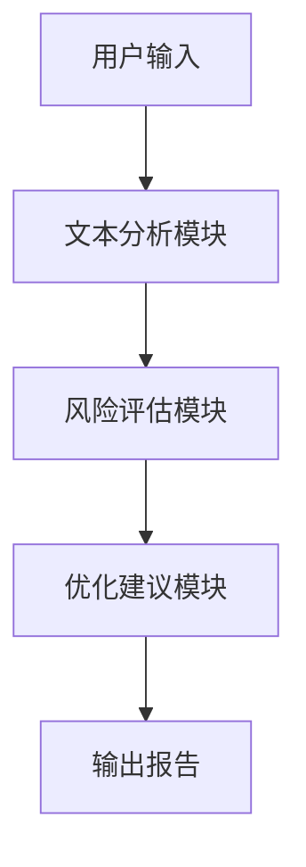
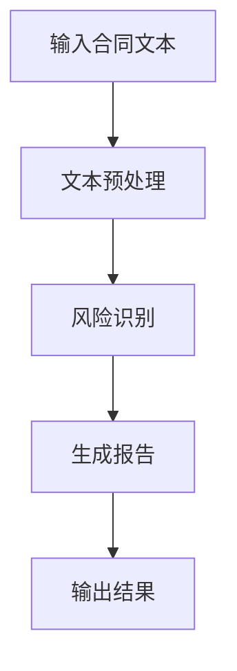
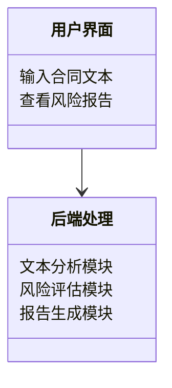
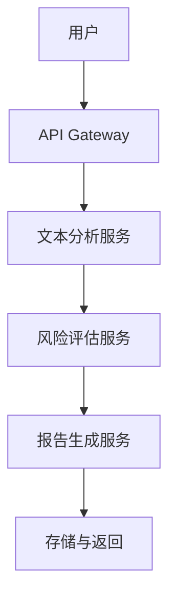

                 


# AI Agent在企业法律风险评估与合同审查中的应用

## 关键词：AI Agent，法律风险评估，合同审查，自然语言处理，法律科技，风险缓解

## 摘要：本文探讨AI Agent在企业法律风险评估与合同审查中的应用，分析其核心算法与系统架构，结合实际案例，展示AI技术如何提升法律工作效率与准确性。文章详细阐述了AI Agent在法律领域的核心概念、算法原理、系统设计及项目实战，旨在为企业法务部门提供高效解决方案。

---

# 第一部分：引言

## 第1章：AI Agent与法律科技的背景介绍

### 1.1 企业法律风险评估的背景与挑战

#### 1.1.1 企业法律风险的主要来源
企业面临多种法律风险，包括合同违约、知识产权纠纷、劳动争议等。这些风险可能影响企业的正常运营和财务健康。

#### 1.1.2 传统法律风险评估的局限性
传统评估方法依赖人工审查，耗时长、成本高且容易出错。此外，法律知识的专业性和复杂性使得非专业人员难以有效识别风险。

#### 1.1.3 AI Agent如何解决这些问题
AI Agent通过自动化处理和大数据分析，能够快速识别潜在风险，提高评估效率和准确性，同时降低成本。

### 1.2 合同审查的痛点与需求

#### 1.2.1 传统合同审查的效率问题
合同审查通常需要大量人工劳动，尤其是处理大量重复性工作时，效率低下。

#### 1.2.2 企业合同审查的标准化需求
企业需要统一的审查标准，确保所有合同符合法律法规，避免因审查不一致而引发风险。

#### 1.2.3 AI在合同审查中的潜在价值
AI Agent能够快速分析合同内容，识别关键条款和潜在风险点，辅助律师做出决策，提高审查效率和质量。

---

# 第二部分：AI Agent的核心概念与工作原理

## 第2章：AI Agent的核心概念

### 2.1 AI Agent的基本概念

#### 2.1.1 定义与分类
AI Agent是一种智能代理，能够感知环境、自主决策并执行任务。在法律领域，AI Agent主要用于数据处理和风险评估。

#### 2.1.2 在法律领域的应用特点
AI Agent在法律领域具有无偏见性、高效性和可扩展性。它能够快速处理大量法律文本，提供客观的分析结果。

#### 2.1.3 与传统法律工具的区别
AI Agent能够自主学习和优化，而传统工具需要手动调整参数。此外，AI Agent能够处理非结构化数据，如文本和文档。

### 2.2 法律风险评估的AI Agent模型

#### 2.2.1 模型输入与输出
- **输入**：法律文本、合同条款、企业历史数据。
- **输出**：风险评分、风险点标记、风险缓解建议。

#### 2.2.2 模型的核心算法与流程
模型通常采用自然语言处理（NLP）和机器学习算法，从文本中提取特征，进行分类和预测。

#### 2.2.3 训练数据与特征提取
训练数据包括历史合同案例和相关法律法规。特征提取涉及关键词识别、句法分析和实体识别。

---

## 第3章：AI Agent在法律风险评估中的应用

### 3.1 风险评估的流程与框架

#### 3.1.1 风险识别与分类
AI Agent通过分析合同文本，识别潜在风险点并进行分类，如违约风险、知识产权风险等。

#### 3.1.2 风险评估的量化方法
采用概率模型，评估每个风险点的发生概率，并综合各点得出整体风险评分。

#### 3.1.3 风险缓解的策略制定
基于评估结果，AI Agent提供风险缓解建议，如修改合同条款、增加担保措施等。

### 3.2 基于AI Agent的风险评估系统

#### 3.2.1 系统功能模块
- 文本分析模块：处理法律文本，提取关键信息。
- 风险评估模块：计算风险评分并生成报告。
- 优化建议模块：提供风险缓解策略。

#### 3.2.2 系统架构图


---

## 第4章：AI Agent在合同审查中的具体应用

### 4.1 合同审查的关键环节

#### 4.1.1 合同条款识别与分类
AI Agent能够识别合同中的关键条款，如违约条款、知识产权条款等。

#### 4.1.2 风险点自动识别
通过NLP技术，AI Agent可以识别潜在的法律风险点，如不清晰的条款或可能引发争议的内容。

#### 4.1.3 合同对比与相似度分析
AI Agent可以将待审查合同与大量已知案例进行对比，分析合同的相似性，帮助识别潜在风险。

### 4.2 基于AI Agent的合同审查系统

#### 4.2.1 系统模块划分
- 文本预处理模块：清洗和格式化合同文本。
- 风险识别模块：识别并标记风险点。
- 结果解释模块：生成审查报告并提供优化建议。

#### 4.2.2 系统实现流程


---

## 第5章：算法原理与数学模型

### 5.1 基于自然语言处理的文本分析

#### 5.1.1 文本预处理与特征提取
- **文本预处理**：包括分词、去停用词、词干提取等。
- **特征提取**：利用词嵌入（如Word2Vec）生成文本向量。

#### 5.1.2 文本分类与聚类
- **分类算法**：如支持向量机（SVM）、随机森林（Random Forest）。
- **聚类算法**：如K-means、层次聚类。

### 5.2 风险评估的数学模型

#### 5.2.1 风险评分模型
使用逻辑回归模型预测风险概率：
$$ P(r) = \frac{1}{1 + e^{-\beta x}} $$
其中，$x$是输入特征向量，$\beta$是模型参数。

#### 5.2.2 模型训练与优化
采用梯度下降法优化模型参数，通过交叉验证选择最优模型。

---

## 第6章：系统架构与设计

### 6.1 问题场景与项目介绍

#### 6.1.1 问题场景
企业需要快速、准确地评估法律风险，审查大量合同。

#### 6.1.2 项目目标
开发一个基于AI Agent的法律风险评估与合同审查系统，提高效率和准确性。

### 6.2 系统功能设计

#### 6.2.1 功能模块
- 用户界面：输入合同文本，查看风险报告。
- 后端处理：文本分析、风险评估、生成报告。

#### 6.2.2 领域模型


### 6.3 系统架构设计

#### 6.3.1 架构图


### 6.4 系统接口设计

#### 6.4.1 接口定义
- 输入接口：接收合同文本。
- 输出接口：返回风险报告。

#### 6.4.2 交互流程
```mermaid
sequenceDiagram
    participant 用户
    participant API Gateway
    participant 文本分析服务
    participant 风险评估服务
    participant 报告生成服务
    用户->API Gateway: 发送合同文本
    API Gateway->文本分析服务: 分析文本
    文本分析服务->风险评估服务: 评估风险
    风险评估服务->报告生成服务: 生成报告
    报告生成服务->API Gateway: 返回报告
    用户<-API Gateway: 获取报告
```

---

## 第7章：项目实战

### 7.1 环境搭建

#### 7.1.1 安装Python环境
使用Anaconda安装Python 3.8以上版本。

#### 7.1.2 安装依赖库
安装NLP库如spaCy、NLTK，机器学习库如scikit-learn。

### 7.2 核心代码实现

#### 7.2.1 文本预处理
```python
import spacy

nlp = spacy.load("en_core_web_sm")
doc = nlp("This is a sample text for processing.")
```

#### 7.2.2 风险识别
```python
from sklearn.feature_extraction.text import TfidfVectorizer
from sklearn.svm import SVC

vectorizer = TfidfVectorizer()
X = vectorizer.fit_transform(docs)
model = SVC()
model.fit(X, labels)
```

### 7.3 案例分析

#### 7.3.1 案例背景
某企业需要审查一份长期合作协议，涉及多个法律风险点。

#### 7.3.2 分析过程
AI Agent识别出潜在的知识产权风险，并建议修改相关条款。

### 7.4 代码解读

#### 7.4.1 文本分析模块
```python
def preprocess(text):
    # 分词、去停用词等预处理步骤
    pass
```

#### 7.4.2 风险评估模块
```python
def assess_risk(doc):
    # 使用机器学习模型评估风险
    pass
```

---

## 第8章：最佳实践与小结

### 8.1 最佳实践

#### 8.1.1 数据质量
确保训练数据的多样性和代表性，避免模型过拟合。

#### 8.1.2 模型优化
定期更新模型参数，保持模型的准确性和高效性。

### 8.2 小结

本文详细探讨了AI Agent在企业法律风险评估与合同审查中的应用，展示了其在提高效率和准确性方面的巨大潜力。通过结合自然语言处理和机器学习技术，AI Agent能够有效识别和评估法律风险，为企业提供可靠的决策支持。

### 8.3 注意事项

- 数据隐私保护：处理法律文本时，需遵守相关隐私法规。
- 模型解释性：确保模型结果可解释，便于法务人员理解。
- 持续学习：定期更新模型，适应法律法规的变化。

### 8.4 拓展阅读

- 《人工智能在法律领域的应用》
- 《机器学习在合同审查中的实践》
- 《自然语言处理技术与法律文本分析》

---

# 结语

随着AI技术的不断进步，AI Agent在企业法律领域的应用将更加广泛和深入。通过本文的分析，企业可以更好地利用AI技术优化法律工作流程，降低法律风险，提升整体竞争力。

