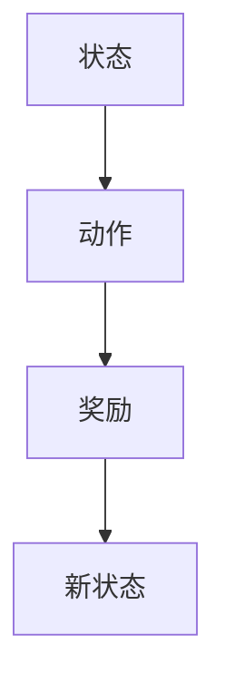
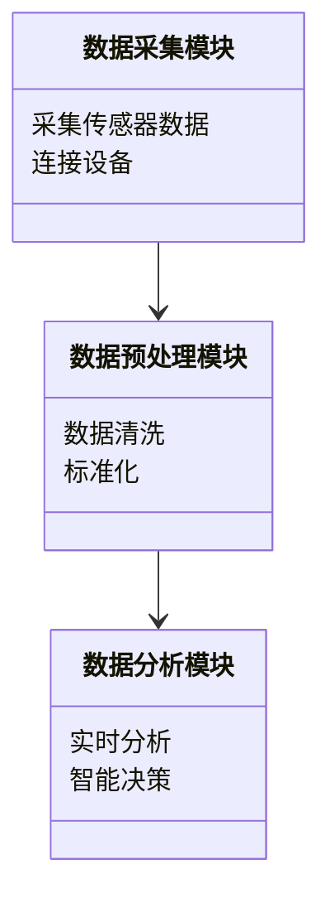
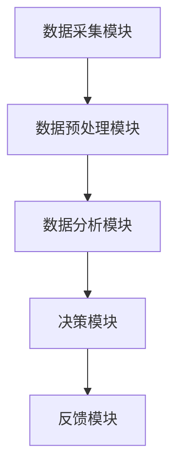
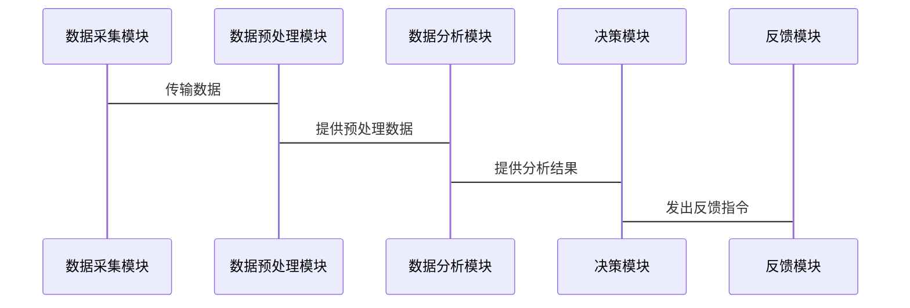

                 


# AI Agent在企业物联网数据分析中的应用前景

## 关键词：
AI Agent, 物联网, 数据分析, 强化学习, 系统架构

## 摘要：
随着物联网技术的快速发展，企业物联网数据呈现出海量、实时性和多样性的特点。传统的数据分析方法在处理这些数据时显得力不从心，无法满足实时决策和智能优化的需求。AI Agent作为一种智能体，能够通过自主学习和决策，有效提升物联网数据分析的效率和准确性。本文从AI Agent的核心概念出发，深入探讨其在物联网数据分析中的应用前景，结合实际案例和系统架构设计，分析其在企业中的应用价值和未来发展方向。

---

## 第一部分: AI Agent与企业物联网数据分析的背景

### 第1章: AI Agent与物联网数据分析概述

#### 1.1 AI Agent的基本概念
##### 1.1.1 AI Agent的定义与特点
AI Agent（人工智能代理）是一种智能实体，能够感知环境、自主决策并执行任务。其特点包括：
- **自主性**：无需外部干预，自主完成任务。
- **反应性**：能够实时感知环境并做出反应。
- **学习能力**：通过数据学习和优化，提升决策能力。
- **协作性**：能够与其他Agent或系统协同工作。

##### 1.1.2 物联网数据分析的基本概念
物联网（IoT）通过传感器和设备收集海量数据，涉及数据的采集、传输、存储和分析。数据分析的目标是从这些数据中提取有价值的信息，支持决策和优化。

##### 1.1.3 AI Agent在物联网数据分析中的作用
AI Agent能够通过分析物联网数据，实时识别异常、预测趋势并优化资源分配，从而提升企业的运营效率。

#### 1.2 企业物联网数据分析的背景与挑战
##### 1.2.1 物联网数据的特点与规模
物联网数据具有以下特点：
- **海量性**：数据量大，来源多样。
- **实时性**：需要实时处理和反馈。
- **多样性**：数据类型包括结构化和非结构化数据。

##### 1.2.2 传统数据分析方法的局限性
传统数据分析方法在处理海量实时数据时，存在效率低下、响应时间长等问题，难以满足企业对实时决策的需求。

##### 1.2.3 AI Agent在物联网数据分析中的应用前景
AI Agent通过智能化分析和自主决策，能够有效应对物联网数据的复杂性和实时性挑战，为企业提供高效的数据分析和决策支持。

### 第2章: AI Agent与物联网数据分析的核心概念

#### 2.1 AI Agent的核心原理
##### 2.1.1 知识表示与推理
AI Agent通过知识表示（如符号逻辑、概率模型）和推理算法（如逻辑推理、贝叶斯推理）来理解和分析数据。

##### 2.1.2 行为决策机制
AI Agent基于感知到的环境信息，通过决策模型（如强化学习、规则引擎）做出最优决策。

##### 2.1.3 自适应学习能力
AI Agent能够通过机器学习算法（如深度学习、强化学习）不断优化自身的知识库和决策模型。

#### 2.2 物联网数据分析的关键技术
##### 2.2.1 数据采集与预处理
物联网数据的采集和预处理是数据分析的基础，包括数据清洗、标准化和特征提取。

##### 2.2.2 数据存储与管理
物联网数据通常采用分布式存储和大数据技术（如Hadoop、Kafka）进行管理和存储。

##### 2.2.3 数据分析与挖掘
通过机器学习和数据挖掘技术，从海量数据中提取有价值的信息和模式。

#### 2.3 AI Agent与物联网数据分析的结合点
##### 2.3.1 数据驱动的智能决策
AI Agent通过分析物联网数据，提供实时的决策支持。

##### 2.3.2 实时数据分析与反馈
AI Agent能够实时处理物联网数据，并快速反馈结果，提升响应速度。

##### 2.3.3 多 Agent 协作与优化
通过多个AI Agent的协作，实现数据的分布式分析和优化。

---

## 第二部分: AI Agent在物联网数据分析中的算法原理

### 第3章: AI Agent的核心算法

#### 3.1 强化学习算法
##### 3.1.1 Q-learning算法
Q-learning是一种经典的强化学习算法，通过状态-动作-奖励机制，学习最优策略。



##### 3.1.2 Deep Q-Networks (DQN)
DQN通过深度神经网络近似Q值函数，实现端到端的学习。

##### 3.1.3 策略梯度方法
策略梯度方法通过优化策略直接最大化奖励。

#### 3.2 监督学习与无监督学习
##### 3.2.1 回归与分类算法
回归用于预测数值型数据，分类用于分类数据。

##### 3.2.2 聚类分析
通过聚类算法发现数据中的潜在结构。

##### 3.2.3 异常检测
识别数据中的异常点，用于实时监控。

#### 3.3 自然语言处理与知识图谱
##### 3.3.1 Transformer模型
用于自然语言处理任务，提升数据理解能力。

##### 3.3.2 知识表示学习
通过知识图谱表示数据，支持语义理解。

##### 3.3.3 实体识别与链接
识别文本中的实体并建立关联。

### 第4章: 算法实现与优化

#### 4.1 算法实现的数学模型
##### 4.1.1 损失函数与优化目标
常用损失函数包括均方误差（MSE）和交叉熵损失。

$$ \text{MSE} = \frac{1}{n}\sum_{i=1}^{n}(y_i - \hat{y}_i)^2 $$

##### 4.1.2 神经网络结构设计
设计神经网络的层数和节点数，优化模型结构。

##### 4.1.3 模型训练与评估
通过训练数据优化模型参数，并通过验证集评估性能。

#### 4.2 算法优化策略
##### 4.2.1 参数调优
通过网格搜索或随机搜索优化模型参数。

##### 4.2.2 并行计算与分布式训练
利用并行计算加速模型训练过程。

##### 4.2.3 模型压缩与轻量化
通过剪枝和量化技术减少模型大小，提升运行效率。

#### 4.3 实验结果与分析
##### 4.3.1 实验设计
设计实验对比不同算法的性能。

##### 4.3.2 对比分析
分析不同算法在物联网数据分析中的表现。

##### 4.3.3 性能优化总结
总结优化策略的有效性，并提出未来改进方向。

---

## 第三部分: 系统架构与设计

### 第5章: 系统分析与架构设计

#### 5.1 问题场景介绍
##### 5.1.1 企业物联网数据的复杂性
企业物联网数据来自多个设备和系统，具有异构性和多样性。

##### 5.1.2 数据分析的实时性要求
需要快速处理和反馈实时数据。

##### 5.1.3 AI Agent的智能化需求
要求AI Agent具备自主学习和决策能力。

#### 5.2 系统功能设计
##### 5.2.1 领域模型设计
通过领域模型类图（Mermaid）展示系统功能模块。



##### 5.2.2 系统架构设计
通过系统架构图（Mermaid）展示系统各模块之间的关系。



##### 5.2.3 接口设计和交互
通过交互序列图（Mermaid）展示系统各模块的交互过程。



---

## 第四部分: 项目实战

### 第6章: 项目实战与分析

#### 6.1 环境安装
##### 6.1.1 安装Python与相关库
安装Python和TensorFlow、Keras等机器学习库。

##### 6.1.2 安装物联网数据采集工具
安装Kafka、Flafka等工具。

#### 6.2 系统核心实现
##### 6.2.1 数据采集模块
实现传感器数据的采集和传输。

##### 6.2.2 数据预处理模块
对采集的数据进行清洗和标准化处理。

##### 6.2.3 数据分析模块
实现机器学习模型的训练和部署。

##### 6.2.4 决策模块
基于分析结果，生成决策指令。

##### 6.2.5 反馈模块
将决策指令反馈到物联网设备。

#### 6.3 代码实现与解读
##### 6.3.1 数据采集模块
```python
import kafka
def collect_data():
    # 数据采集逻辑
    pass
```

##### 6.3.2 数据预处理模块
```python
def preprocess(data):
    # 数据清洗和标准化
    pass
```

##### 6.3.3 数据分析模块
```python
def analyze(data):
    # 机器学习模型训练
    pass
```

##### 6.3.4 决策模块
```python
def make_decision(data):
    # 基于模型输出决策
    pass
```

##### 6.3.5 反馈模块
```python
def feedback(action):
    # 反馈到物联网设备
    pass
```

#### 6.4 案例分析与结果解读
##### 6.4.1 实际案例分析
分析一个具体案例，展示AI Agent在物联网数据分析中的应用效果。

##### 6.4.2 代码实现解读
详细解读代码实现，说明每一步的作用和意义。

#### 6.5 项目小结
总结项目实现的关键点，提出改进建议。

---

## 第五部分: 最佳实践与总结

### 第7章: 最佳实践与总结

#### 7.1 小结
总结AI Agent在物联网数据分析中的核心价值和应用前景。

#### 7.2 注意事项
提醒读者在实际应用中需要注意的问题，如数据隐私、模型优化等。

#### 7.3 拓展阅读
推荐相关的书籍和资源，供读者深入学习。

---

通过以上结构，本文详细探讨了AI Agent在企业物联网数据分析中的应用前景，从理论到实践，从算法到系统设计，为读者提供了全面的视角和深入的分析。

