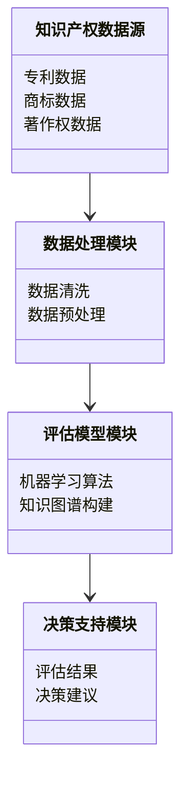

                 


```markdown
# AI Agent在企业知识产权价值评估与运营中的应用

> 关键词：AI Agent，知识产权评估，企业价值，技术实现，系统架构

> 摘要：随着人工智能技术的飞速发展，AI Agent（人工智能代理）在企业知识产权价值评估与运营中的应用越来越广泛。本文将详细探讨AI Agent在知识产权评估中的技术实现、系统架构设计、项目实战等内容，结合实际案例分析，深入解读AI Agent在知识产权价值评估中的核心作用及其对企业运营的深远影响。

---

## 第一部分：AI Agent与知识产权基础

### 第1章：AI Agent与知识产权概述

#### 1.1 知识产权的基本概念
- **1.1.1 知识产权的定义与范围**
  - 知识产权是指依法保护的智力成果，包括专利权、商标权、著作权、商业秘密等。
  - 知识产权的保护范围涉及法律、技术和经济等多个方面。

- **1.1.2 知识产权的主要类型**
  - 专利权：保护发明创造的独占权。
  - 商标权：保护商品或服务的标识。
  - 著作权：保护文学、艺术和科学作品的创作者的权益。
  - 商业秘密：保护未公开的技术和商业信息。

- **1.1.3 知识产权在企业中的价值**
  - 知识产权是企业核心竞争力的重要组成部分。
  - 知识产权的价值直接影响企业的市场地位和盈利能力。

#### 1.2 AI Agent的基本概念
- **1.2.1 AI Agent的定义与特点**
  - AI Agent是一种智能主体，能够感知环境并采取行动以实现目标。
  - AI Agent的特点包括自主性、反应性、目标导向和学习能力。

- **1.2.2 AI Agent的核心功能与应用场景**
  - 数据采集与处理：从多种来源获取知识产权相关数据。
  - 智能分析：利用机器学习算法对数据进行分析和预测。
  - 自动决策：基于分析结果，提供最优决策建议。

- **1.2.3 AI Agent与传统技术的区别**
  - 传统技术依赖于固定规则，而AI Agent具有自适应和学习能力。
  - AI Agent能够处理复杂问题，提供更精准的解决方案。

#### 1.3 AI Agent在知识产权中的应用背景
- **1.3.1 知识产权评估的传统方法与局限性**
  - 传统方法依赖人工评估，效率低且容易受到主观因素的影响。
  - 数据来源单一，难以全面评估知识产权的市场价值。

- **1.3.2 AI Agent在知识产权评估中的优势**
  - 高效性：AI Agent能够快速处理大量数据，提高评估效率。
  - 精准性：基于机器学习算法，AI Agent能够提供更准确的评估结果。
  - 智能性：AI Agent能够实时监控市场动态，提供动态评估支持。

- **1.3.3 企业知识产权管理的新趋势**
  - 数据驱动的知识产权管理。
  - 智能化、个性化的知识产权策略。

---

## 第二部分：AI Agent的技术原理与算法实现

### 第2章：AI Agent的核心算法原理

#### 2.1 自然语言处理模型
- **2.1.1 Transformer模型的原理**
  - Transformer模型通过自注意力机制，能够捕捉文本中的长距离依赖关系。
  - 模型结构包括编码器和解码器，能够实现高效的文本生成和理解。

- **2.1.2 注意力机制的实现**
  - 注意力机制通过计算输入序列中每个位置的重要性，确定模型应关注的部分。
  - 通过权重矩阵和Softmax函数，实现对输入序列的加权求和。

- **2.1.3 多层感知机的应用**
  - 多层感知机（MLP）是一种前馈神经网络，能够对输入数据进行非线性变换。
  - 在知识产权评估中，MLP可以用于分类和回归任务。

#### 2.2 知识图谱构建与推理
- **2.2.1 知识图谱的构建方法**
  - 通过数据抽取、清洗和融合，构建结构化的知识图谱。
  - 知识图谱的构建过程包括实体识别、关系抽取和属性提取。

- **2.2.2 基于图的推理算法**
  - 使用图遍历算法（如BFS、DFS）进行路径推理。
  - 基于规则的推理和基于学习的推理方法。

- **2.2.3 知识图谱的更新与维护**
  - 定期更新知识图谱，确保数据的准确性和及时性。
  - 使用版本控制和冲突解决机制，管理知识图谱的变化。

#### 2.3 强化学习与决策优化
- **2.3.1 强化学习的基本原理**
  - 强化学习通过试错机制，学习最优的决策策略。
  - 环境、状态、动作和奖励是强化学习的核心要素。

- **2.3.2 状态空间与动作空间的定义**
  - 状态空间描述系统的当前状态。
  - 动作空间定义系统可能采取的行动。

- **2.3.3 奖励函数的设计与优化**
  - 奖励函数用于衡量决策的优劣。
  - 通过调整奖励函数，优化决策策略。

### 第3章：知识产权价值评估的数学模型

#### 3.1 评估模型的基本框架
- **3.1.1 线性回归模型**
  - 线性回归模型用于预测知识产权的市场价值。
  - 模型公式：$y = \beta_0 + \beta_1x_1 + \beta_2x_2 + \dots + \beta_nx_n + \epsilon$
  - 通过最小二乘法估计回归系数。

- **3.1.2 支持向量机模型**
  - 支持向量机（SVM）用于分类和回归任务。
  - SVM通过最大化间隔，找到最优的分割超平面。

- **3.1.3 随机森林模型**
  - 随机森林是一种基于树的集成学习方法。
  - 通过构建多个决策树，提高模型的泛化能力。

#### 3.2 基于深度学习的评估模型
- **3.2.1 卷积神经网络（CNN）的应用**
  - CNN用于处理图像和序列数据。
  - 在知识产权评估中，CNN可以用于分析专利的图像特征。

- **3.2.2 注意力机制的实现**
  - 注意力机制通过计算输入序列中每个位置的重要性，确定模型应关注的部分。
  - 通过权重矩阵和Softmax函数，实现对输入序列的加权求和。

- **3.2.3 图神经网络（GNN）的应用**
  - GNN用于处理图结构数据。
  - 在知识产权评估中，GNN可以用于分析知识图谱中的关系和实体。

---

## 第三部分：系统分析与架构设计

### 第4章：系统功能设计

#### 4.1 项目介绍
- 系统名称：AI Agent知识产权价值评估系统
- 开发目标：利用AI技术，实现知识产权的自动评估和管理。
- 项目范围：涵盖专利、商标、著作权等多种知识产权类型。

#### 4.2 系统功能模块
- 数据采集模块：负责采集知识产权相关数据。
- 数据处理模块：对数据进行清洗和预处理。
- 评估模型模块：基于机器学习算法，实现知识产权价值评估。
- 决策支持模块：根据评估结果，提供决策建议。

#### 4.3 系统功能设计（领域模型）


#### 4.4 系统架构设计


#### 4.5 系统接口设计
- 输入接口：接收知识产权数据和用户查询请求。
- 输出接口：返回评估结果和决策建议。
- API接口：与其他系统进行数据交互。

#### 4.6 系统交互设计
```mermaid
sequenceDiagram
    用户 --> 输入接口：提交知识产权数据
    输入接口 --> 数据处理模块：进行数据清洗
    数据处理模块 --> 评估模型模块：运行评估算法
    评估模型模块 --> 决策支持模块：生成决策建议
    决策支持模块 --> 用户：返回评估结果和建议
```

---

## 第四部分：项目实战

### 第5章：环境安装与代码实现

#### 5.1 环境安装
- 安装Python和相关库：
  ```bash
  pip install numpy pandas scikit-learn tensorflow
  ```

#### 5.2 代码实现
- 知识产权数据预处理：
  ```python
  import pandas as pd
  df = pd.read_csv('patent_data.csv')
  df = df.dropna()
  ```

- 机器学习模型训练：
  ```python
  from sklearn.model import LinearRegression
  model = LinearRegression()
  model.fit(X_train, y_train)
  ```

- 模型评估与预测：
  ```python
  from sklearn.metrics import r2_score
  y_pred = model.predict(X_test)
  print(r2_score(y_test, y_pred))
  ```

#### 5.3 案例分析
- 案例背景：某企业拥有多项专利，需要评估其市场价值。
- 数据来源：专利申请文件、技术领域、法律状态等。
- 评估结果：通过AI Agent系统，企业能够快速获得专利的市场价值评估。

---

## 第五部分：总结与展望

### 第6章：总结与展望

#### 6.1 最佳实践 Tips
- 数据质量是评估结果准确性的关键。
- 系统的可解释性是用户信任的重要因素。

#### 6.2 小结
- AI Agent在知识产权价值评估中的应用前景广阔。
- 通过技术创新和实践积累，能够进一步提升系统的智能化水平。

#### 6.3 注意事项
- 确保数据的合法性和合规性。
- 定期更新模型和知识图谱，保持系统的准确性。

#### 6.4 拓展阅读
- 推荐阅读《机器学习实战》和《深度学习入门》。
- 关注AI在知识产权领域的最新研究成果。

---

通过以上步骤，您可以全面了解AI Agent在企业知识产权价值评估与运营中的应用。希望本文能够为您提供有价值的见解和启发，帮助您更好地理解和应用这项技术。
```

