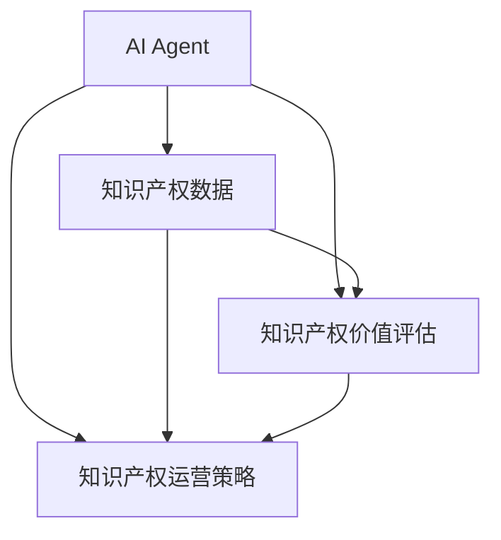
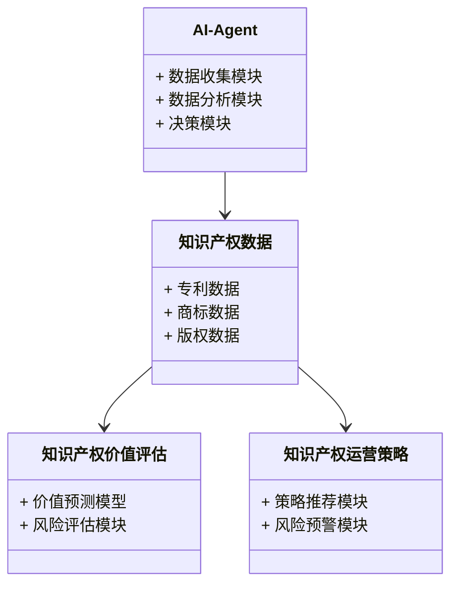

                 


# AI Agent在企业知识产权价值评估与运营策略制定中的应用

> 关键词：AI Agent, 企业知识产权, 价值评估, 运营策略, 算法原理, 系统架构, 项目实战

> 摘要：  
随着人工智能技术的快速发展，AI Agent（人工智能代理）在企业知识产权管理中的应用越来越广泛。本文从AI Agent的核心概念出发，详细探讨其在知识产权价值评估与运营策略制定中的应用。通过分析AI Agent的算法原理、系统架构设计以及实际项目案例，本文为读者提供一个全面的技术视角，展示如何利用AI Agent提升企业知识产权管理的效率和准确性。

---

# 第一部分: AI Agent与企业知识产权概述

## 第1章: 企业知识产权价值评估与运营策略概述

### 1.1 企业知识产权的基本概念

#### 1.1.1 知识产权的定义与分类
知识产权（Intellectual Property，IP）是指依法保护的智力成果，主要包括专利权、商标权、著作权、商业秘密等。这些权利为企业提供了法律保护，确保其创新成果不被他人非法使用。

#### 1.1.2 企业知识产权管理的重要性
在现代商业环境中，知识产权不仅是企业核心竞争力的体现，也是其在市场竞争中占据优势的重要手段。有效的知识产权管理可以帮助企业保护创新成果，避免侵权风险，并通过知识产权的合理运用实现商业价值。

#### 1.1.3 知识产权价值评估的挑战与意义
知识产权的价值评估是一个复杂的过程，涉及技术、法律、市场等多个方面。传统的评估方法往往依赖于人工判断，存在主观性强、效率低下的问题。通过引入AI Agent，可以实现对知识产权价值的自动化、智能化评估，提高评估的准确性和效率。

### 1.2 AI Agent的基本概念与技术特点

#### 1.2.1 AI Agent的定义与分类
AI Agent（人工智能代理）是指能够感知环境、自主决策并执行任务的智能系统。根据功能和应用场景的不同，AI Agent可以分为多种类型，包括基于规则的代理、基于模型的代理、强化学习代理等。

#### 1.2.2 AI Agent的核心技术特点
AI Agent的核心技术特点包括：  
1. **自主性**：能够在没有人工干预的情况下自主执行任务。  
2. **反应性**：能够实时感知环境变化并做出相应的反应。  
3. **学习能力**：通过数据和经验不断优化自身的决策能力。  
4. **协作性**：能够与其他AI Agent或系统进行协作，共同完成复杂任务。

#### 1.2.3 AI Agent与传统数据分析工具的区别
与传统数据分析工具相比，AI Agent具有更强的自主性和学习能力，能够主动发现问题、提出解决方案，并在动态环境中灵活调整策略。

### 1.3 企业知识产权价值评估与运营策略的背景

#### 1.3.1 知识产权在企业经营中的战略地位
知识产权是企业核心竞争力的重要组成部分，直接影响企业的市场地位和盈利能力。通过有效的知识产权管理，企业可以提升创新效率，降低侵权风险，并通过知识产权的质押融资等方式获取资金支持。

#### 1.3.2 传统知识产权管理的局限性
传统的知识产权管理主要依赖人工操作，存在以下问题：  
1. **效率低下**：人工评估知识产权价值耗时长，且容易受到主观因素的影响。  
2. **信息不全**：难以全面收集和分析海量的知识产权数据。  
3. **决策滞后**：由于信息处理速度慢，难以及时调整知识产权策略。

#### 1.3.3 AI Agent在知识产权管理中的应用前景
AI Agent技术的引入为知识产权管理带来了新的可能性。通过AI Agent，企业可以实现知识产权数据的自动化收集、分析和评估，从而提高管理效率和决策的准确性。

---

## 第2章: AI Agent与知识产权管理的核心概念

### 2.1 AI Agent在知识产权价值评估中的应用

#### 2.1.1 知识产权价值评估的关键指标
知识产权价值评估的关键指标包括：  
1. **技术先进性**：评估专利的技术创新程度和市场竞争力。  
2. **法律稳定性**：评估专利的法律保护力度和稳定性。  
3. **市场应用潜力**：评估专利在市场上的应用前景和经济价值。

#### 2.1.2 AI Agent如何辅助评估知识产权的价值
AI Agent可以通过以下方式辅助评估知识产权的价值：  
1. **数据收集与分析**：自动收集专利、商标等知识产权数据，并利用自然语言处理技术分析技术文档。  
2. **价值预测模型**：基于历史数据和机器学习算法，构建知识产权价值预测模型，提供客观的价值评估结果。  
3. **市场趋势分析**：结合市场数据，预测知识产权的未来价值变化趋势。

#### 2.1.3 知识产权评估中的数据来源与处理
知识产权评估的数据来源包括专利数据库、商标数据库、司法判决等。AI Agent可以通过爬虫技术自动获取数据，并利用数据清洗、特征提取等技术进行数据处理。

### 2.2 AI Agent在知识产权运营策略制定中的作用

#### 2.2.1 知识产权运营策略的定义与分类
知识产权运营策略是指企业通过知识产权的创造、保护、运用和管理，实现商业价值最大化的一系列策略。常见的知识产权运营策略包括专利布局、商标注册、版权保护等。

#### 2.2.2 AI Agent如何优化知识产权的运营策略
AI Agent可以通过以下方式优化知识产权的运营策略：  
1. **智能监控**：实时监控竞争对手的知识产权动态，发现潜在的侵权风险。  
2. **策略推荐**：基于数据分析结果，推荐最优的知识产权布局方案。  
3. **风险预警**：预测知识产权可能面临的法律风险，并提供应对策略。

#### 2.2.3 知识产权运营中的风险与机会
知识产权运营中常见的风险包括侵权风险、法律风险等。通过AI Agent的实时监控和风险预警功能，企业可以有效降低运营风险，抓住市场机会。

### 2.3 AI Agent与知识产权管理的实体关系图

#### 2.3.1 实体关系图的构建
以下是AI Agent与知识产权管理的实体关系图（使用Mermaid）：



#### 2.3.2 AI Agent与知识产权数据的关系
AI Agent通过收集和分析知识产权数据，为知识产权价值评估和运营策略制定提供支持。

#### 2.3.3 知识产权管理中的关键实体与关系
关键实体包括：  
1. **AI Agent**：负责数据收集、分析和决策。  
2. **知识产权数据**：包括专利、商标、版权等数据。  
3. **知识产权价值评估**：基于数据的分析结果。  
4. **知识产权运营策略**：根据评估结果制定的策略。

---

## 第3章: AI Agent的算法原理

### 3.1 AI Agent的核心算法

#### 3.1.1 基于强化学习的AI Agent算法
强化学习是一种通过试错机制优化决策的算法。AI Agent通过与环境的交互，不断调整策略，以获得最大化的奖励。

#### 3.1.2 基于监督学习的AI Agent算法
监督学习是一种通过标签数据训练模型的算法。AI Agent可以通过监督学习技术，从历史数据中学习知识产权评估的规律。

#### 3.1.3 基于无监督学习的AI Agent算法
无监督学习是一种通过发现数据中的潜在结构来优化决策的算法。AI Agent可以通过无监督学习技术，发现知识产权数据中的隐藏模式。

### 3.2 知识产权价值评估的数学模型

#### 3.2.1 知识产权价值评估的线性回归模型
线性回归模型是一种常用的预测模型。其数学表达式为：

$$ y = \beta_0 + \beta_1x_1 + \beta_2x_2 + \ldots + \beta_nx_n + \epsilon $$

其中，$y$ 表示知识产权的价值，$x_i$ 表示影响价值的各个因素，$\beta_i$ 表示回归系数，$\epsilon$ 表示误差项。

#### 3.2.2 基于神经网络的知识产权价值评估模型
神经网络模型是一种常用的深度学习模型。其数学表达式为：

$$ y = f(W_1x + b_1) $$

其中，$W_1$ 表示权重矩阵，$b_1$ 表示偏置项，$f$ 表示激活函数。

### 3.3 知识产权价值评估的算法实现

#### 3.3.1 算法实现的步骤
1. 数据收集与预处理  
2. 特征提取与选择  
3. 模型训练与优化  
4. 模型评估与部署  

#### 3.3.2 算法实现的代码示例
以下是一个基于Python的线性回归模型的实现代码：

```python
import numpy as np
from sklearn.linear_model import LinearRegression

# 示例数据
X = np.array([[1], [2], [3], [4], [5]])
y = np.array([2, 4, 5, 4, 6])

# 训练模型
model = LinearRegression()
model.fit(X, y)

# 预测结果
print(model.predict([[6]]))  # 输出: [[7.]]
```

---

## 第4章: 系统分析与架构设计方案

### 4.1 问题场景介绍
本章以企业知识产权价值评估与运营策略制定为问题场景，介绍AI Agent在其中的应用。

### 4.2 项目介绍
本项目旨在通过AI Agent技术，构建一个智能化的知识产权管理平台，实现知识产权价值评估与运营策略制定的自动化。

### 4.3 系统功能设计

#### 4.3.1 领域模型（Mermaid 类图）
以下是系统功能设计的领域模型：



### 4.4 系统架构设计

#### 4.4.1 系统架构图（Mermaid 架构图）
以下是系统架构设计的Mermaid图：


---

## 第5章: 项目实战

### 5.1 环境安装
需要安装Python、scikit-learn、TensorFlow等工具。

### 5.2 系统核心实现源代码

#### 5.2.1 数据收集与预处理
```python
import requests
from bs4 import BeautifulSoup

# 爬取专利数据
url = "https://example.com/patents"
response = requests.get(url)
soup = BeautifulSoup(response.text, 'html.parser')
data = soup.find_all('div', class_='patent-info')
```

#### 5.2.2 特征提取与选择
```python
from sklearn.feature_selection import SelectKBest
from sklearn.feature_selection import chi2

X = ...  # 特征矩阵
y = ...  # 标签向量

selector = SelectKBest(score_func=chi2, k=5)
X_new = selector.fit_transform(X, y)
```

#### 5.2.3 模型训练与优化
```python
from sklearn.model_selection import GridSearchCV
from sklearn.ensemble import RandomForestRegressor

param_grid = {
    'n_estimators': [100, 200],
    'max_depth': [None, 10, 20]
}

model = GridSearchCV(RandomForestRegressor(), param_grid, cv=5)
model.fit(X_new, y)
```

### 5.3 代码应用解读与分析
通过上述代码，可以实现知识产权数据的爬取、特征提取、模型训练和优化，最终实现知识产权价值评估的自动化。

### 5.4 实际案例分析和详细讲解剖析
通过一个具体的案例，详细讲解AI Agent在知识产权价值评估与运营策略制定中的应用过程。

### 5.5 项目小结
总结项目实现的关键步骤和成果，提出改进建议。

---

## 第6章: 最佳实践、小结、注意事项、拓展阅读

### 6.1 最佳实践
在使用AI Agent进行知识产权管理时，需要注意以下几点：  
1. **数据质量**：确保数据的准确性和完整性。  
2. **模型优化**：定期更新模型，保持其预测能力。  
3. **风险管理**：建立风险预警机制，及时应对潜在问题。

### 6.2 小结
本文详细探讨了AI Agent在企业知识产权价值评估与运营策略制定中的应用，通过算法原理、系统架构设计和项目实战的讲解，展示了AI Agent在知识产权管理中的巨大潜力。

### 6.3 注意事项
在实际应用中，需要注意知识产权的法律风险和技术风险，确保系统的合规性和安全性。

### 6.4 拓展阅读
建议读者进一步阅读相关领域的文献，深入了解AI Agent在知识产权管理中的其他应用，如知识产权风险预警、知识产权质押融资等。

---

通过以上内容，读者可以全面了解AI Agent在企业知识产权管理中的应用，并掌握相关技术的实现方法。

