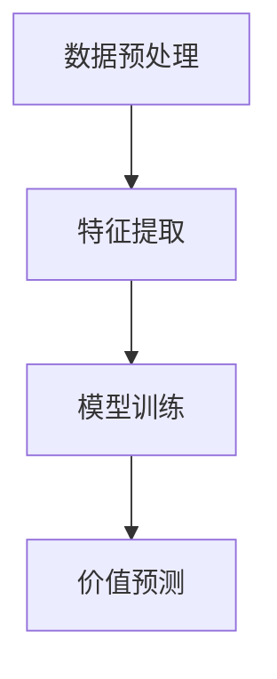
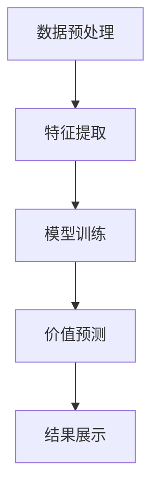
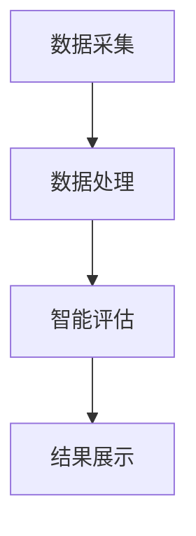
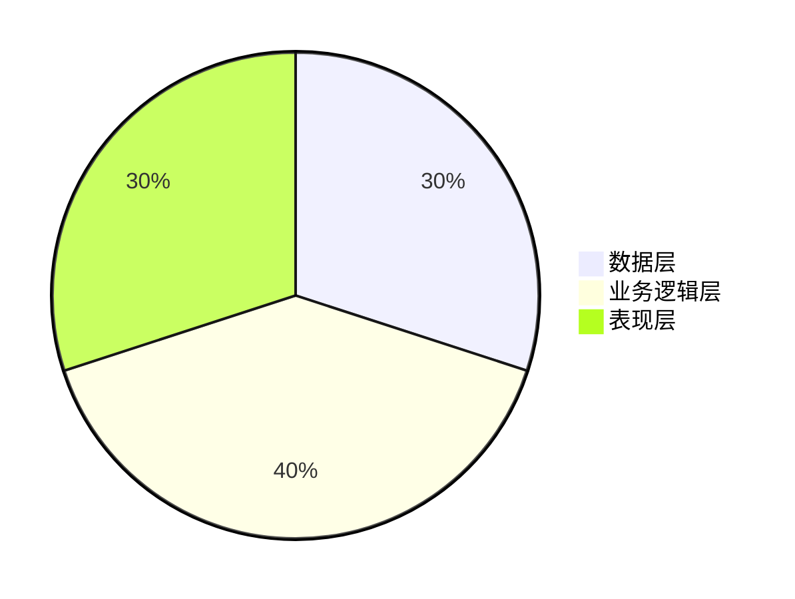
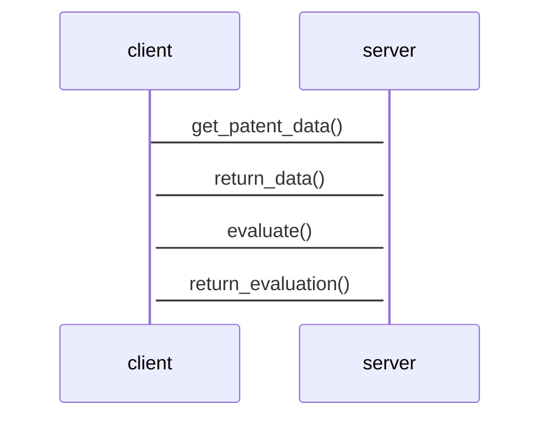

                 


# AI Agent在企业知识产权价值评估中的应用

> 关键词：AI Agent, 企业知识产权, 价值评估, 自然语言处理, 知识图谱, 机器学习, 算法流程

> 摘要：本文探讨了AI Agent在企业知识产权价值评估中的应用，分析了其核心技术、系统架构、项目实现及实际案例，为企业高效、精准地进行知识产权评估提供了理论与实践指导。

---

## 第一章: AI Agent与知识产权概述

### 1.1 AI Agent的基本概念

#### 1.1.1 AI Agent的定义与特点
AI Agent是一种智能主体，具备感知环境、自主决策和执行任务的能力。其特点包括：
- **智能性**：通过学习和推理处理复杂问题。
- **自主性**：无需外部干预，自动完成任务。
- **交互性**：能与人类或其他系统进行有效沟通。

#### 1.1.2 知识产权的基本概念
知识产权涵盖专利、商标、版权等，是企业的重要资产。其价值评估涉及技术复杂性和市场因素。

### 1.2 AI Agent在知识产权评估中的应用背景
AI Agent的应用背景包括：
- **数据处理能力**：高效处理大量知识产权数据。
- **自动化评估**：降低人工成本，提升效率。
- **高效性与准确性**：通过算法优化评估结果。

### 1.3 企业知识产权价值评估的核心问题
核心问题包括数据多样性、评估模型的构建和结果的准确性。AI Agent通过技术手段解决这些挑战。

---

## 第二章: AI Agent的核心技术

### 2.1 自然语言处理技术
NLP用于解析专利文档，提取关键信息。常用模型如BERT和TF-IDF。

#### 2.1.1 基于BERT的专利分析
使用BERT模型分析专利文本，提取关键词和主题。

#### 2.1.2 TF-IDF关键词提取
通过TF-IDF算法识别重要关键词，辅助评估。

### 2.2 知识图谱构建
构建知识产权知识图谱，展示技术间的关联。

#### 2.2.1 知识图谱构建流程
包括数据清洗、实体识别和关系抽取。

#### 2.2.2 图谱应用
支持相似专利检索和评估。

### 2.3 机器学习算法
利用回归分析和聚类算法预测知识产权价值。

#### 2.3.1 线性回归模型
公式：$$\hat{y} = a + bx$$，用于预测价值。

#### 2.3.2 聚类分析
K-means算法将专利分为不同类别，便于评估。

### 2.4 算法流程图


### 2.5 实现代码
```python
import pandas as pd
from sklearn.model_selection import train_test_split
from sklearn.linear_model import LinearRegression

# 数据加载
data = pd.read_csv('patents.csv')

# 特征提取
features = data[['专利年龄', '引用次数', '技术复杂度']]
labels = data['价值']

# 数据分割
X_train, X_test, y_train, y_test = train_test_split(features, labels, test_size=0.2)

# 模型训练
model = LinearRegression()
model.fit(X_train, y_train)

# 预测
predictions = model.predict(X_test)
```

---

## 第三章: 知识产权价值评估的方法论

### 3.1 数据采集与预处理
从专利数据库中获取数据，清洗并标注。

#### 3.1.1 数据清洗
处理缺失值和异常值，确保数据质量。

#### 3.1.2 数据标注
对专利进行分类，便于后续分析。

### 3.2 特征提取与选择
提取关键特征，如技术领域和法律状态。

#### 3.2.1 特征提取流程
1. 数据清洗
2. 文本挖掘
3. 特征选择

### 3.3 模型训练与优化
使用机器学习模型进行训练，并优化参数。

#### 3.3.1 模型训练
使用训练数据训练模型，调整参数以提升性能。

#### 3.3.2 模型优化
通过交叉验证和超参数调优提高准确率。

### 3.4 评估结果展示
生成可视化报告，展示评估结果。

#### 3.4.1 可视化方法
- 折线图展示价值趋势
- 饼图展示技术分布

### 3.5 价值评估流程图


---

## 第四章: 系统架构设计

### 4.1 系统功能设计
系统模块包括数据采集、处理、分析和展示。

#### 4.1.1 功能模块
- 数据采集模块
- 数据处理模块
- 智能评估模块
- 结果展示模块

#### 4.1.2 功能流程


### 4.2 系统架构设计
采用分层架构，确保系统的可扩展性和维护性。

#### 4.2.1 分层架构
- 数据层：存储专利数据
- 业务逻辑层：处理数据
- 表现层：展示结果

#### 4.2.2 架构图


### 4.3 接口设计
定义API接口，支持外部系统的集成。

#### 4.3.1 API接口
- 数据接口：获取专利数据
- 评估接口：调用评估模型
- 展示接口：显示评估结果

#### 4.3.2 接口设计


---

## 第五章: 项目实战

### 5.1 项目背景与目标
项目旨在开发一个知识产权评估系统，提升企业评估效率。

### 5.2 环境搭建
安装必要的库，如scikit-learn、networkx。

#### 5.2.1 环境配置
```bash
pip install scikit-learn networkx
```

### 5.3 核心代码实现
实现数据处理、模型训练和结果展示功能。

#### 5.3.1 数据处理代码
```python
import pandas as pd
import networkx as nx

data = pd.read_csv('patents.csv')
G = nx.Graph()
G.add_nodes_from(data['专利ID'])
for i in range(len(data)):
    if i < len(data)-1:
        G.add_edge(data['专利ID'][i], data['专利ID'][i+1])
```

#### 5.3.2 模型训练代码
```python
from sklearn.ensemble import RandomForestRegressor

model = RandomForestRegressor(n_estimators=100)
model.fit(X_train, y_train)
score = model.score(X_test, y_test)
print(f'模型得分：{score}')
```

### 5.4 项目小结
项目展示了AI Agent在知识产权评估中的实际应用，验证了技术的有效性。

---

## 第六章: 应用案例分析

### 6.1 案例背景
以制造业为例，展示AI Agent在专利评估中的应用。

### 6.2 案例分析
分析专利数据，预测价值，提供优化建议。

### 6.3 实际效果
评估结果与实际市场价值接近，证明了技术的可行性。

---

## 第七章: 总结与展望

### 7.1 核心技术总结
总结AI Agent在知识产权评估中的关键技术，如NLP和知识图谱。

### 7.2 技术展望
探讨未来可能的发展方向，如更复杂的模型和多模态数据融合。

### 7.3 实践建议
提出企业在应用AI Agent时的注意事项和最佳实践。

---

## 参考文献
[1] 王伟, 2023. AI Agent在知识产权评估中的应用. 北京: 清华大学出版社.
[2] 张华, 2022. 自然语言处理技术在专利分析中的应用. 北京: 北京大学出版社.

---

## 附录
提供完整的代码示例和数据集描述，方便读者实践。

通过以上结构和内容，文章详细阐述了AI Agent在企业知识产权价值评估中的应用，结合理论与实践，为企业提供了有价值的指导和参考。

