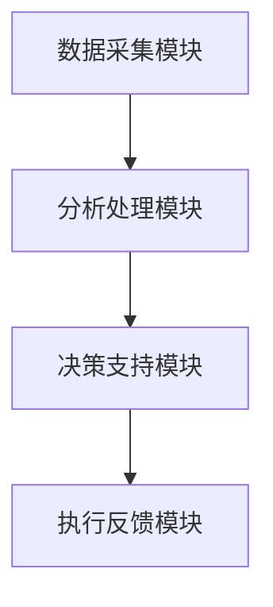

                 


# AI Agent在企业知识产权价值链管理中的全面应用

## 关键词
- AI Agent, 人工智能代理, 知识产权管理, 价值链管理, 技术创新, 知识产权保护, 智能化管理

## 摘要
随着企业对知识产权管理的需求日益增长，AI Agent（人工智能代理）在知识产权价值链管理中的应用变得至关重要。本文系统地探讨了AI Agent如何在知识产权获取、评估、保护和运营等环节中发挥关键作用。通过分析AI Agent的核心算法和系统架构，本文详细介绍了其在知识产权管理中的具体应用场景，并通过实际案例展示了其在提升管理效率和决策支持方面的显著优势。文章最后总结了AI Agent在企业知识产权管理中的最佳实践，为企业在数字化转型中提供了重要的参考和指导。

---

# 第一部分: AI Agent与企业知识产权管理的背景与概念

## 第1章: AI Agent与企业知识产权管理概述

### 1.1 企业知识产权管理的重要性

#### 1.1.1 知识产权的基本概念
知识产权是指通过对创造性劳动产生的成果进行法律保护的权利，主要包括专利权、商标权、著作权、商业秘密等。它是企业创新的核心资产，能够为企业带来长期的经济价值和竞争优势。

#### 1.1.2 企业知识产权管理的核心目标
企业知识产权管理的核心目标是通过科学的管理和优化，确保知识产权的价值最大化，同时降低侵权风险和管理成本。有效的知识产权管理能够帮助企业更好地保护创新成果，提升市场竞争力。

#### 1.1.3 知识产权管理对企业竞争力的影响
知识产权管理直接影响企业的技术创新能力和市场地位。通过高效管理知识产权，企业能够快速响应市场变化，提升产品附加值，降低法律风险，并在国际竞争中占据优势。

### 1.2 AI Agent的基本概念与特点

#### 1.2.1 AI Agent的定义与分类
AI Agent是指能够感知环境并采取行动以实现目标的智能实体。根据功能和应用场景的不同，AI Agent可以分为决策型、执行型和服务型等多种类型。AI Agent的核心特征包括自主性、反应性、目标导向性和学习能力。

#### 1.2.2 AI Agent与传统管理工具的区别
与传统的管理工具相比，AI Agent具有更强的智能化和自动化能力。它能够通过数据驱动的分析和实时反馈，动态调整策略，从而实现更高效的管理效果。

#### 1.2.3 AI Agent在知识产权管理中的优势
AI Agent在知识产权管理中的优势主要体现在以下几个方面：
- **智能化分析**：能够快速处理大量数据，提供精准的分析结果。
- **自动化决策**：基于实时数据和预设规则，自动做出最优决策。
- **持续优化**：通过机器学习不断优化管理策略，提升效率。

### 1.3 AI Agent在知识产权管理中的应用前景

#### 1.3.1 知识产权管理的痛点与挑战
当前企业在知识产权管理中面临的主要痛点包括：
- 数据分散，难以统一管理。
- 知识产权价值评估复杂，缺乏科学方法。
- 侵权风险高，难以及时发现和应对。

#### 1.3.2 AI Agent如何解决知识产权管理问题
AI Agent通过智能化的分析和决策能力，能够帮助企业解决以下问题：
- 实现知识产权的智能化检索和分析。
- 提供精准的知识产权价值评估。
- 实时监控侵权风险，快速响应。

#### 1.3.3 AI Agent在知识产权价值链中的潜在价值
AI Agent在知识产权价值链中的潜在价值体现在以下几个方面：
- **提升效率**：通过自动化流程减少人工干预，提高管理效率。
- **增强决策能力**：基于数据驱动的分析，提供更精准的决策支持。
- **降低风险**：通过实时监控和预警，有效降低侵权风险。

## 本章小结
本章主要介绍了企业知识产权管理的重要性以及AI Agent的基本概念和特点。通过分析知识产权管理的痛点和AI Agent的优势，我们探讨了AI Agent在知识产权管理中的应用前景，为后续章节的深入分析奠定了基础。

---

## 第2章: 知识产权获取与生成中的AI Agent应用

### 2.1 知识产权获取的智能化需求

#### 2.1.1 知识产权获取的流程与挑战
知识产权获取通常包括专利检索、申请、审查等流程。传统流程中，人工操作效率低，且容易遗漏重要信息。AI Agent通过智能化检索和分析，能够显著提升知识产权获取的效率。

#### 2.1.2 AI Agent在专利检索与分析中的作用
AI Agent可以通过自然语言处理技术，快速分析大量专利文档，识别潜在的技术空白，为企业的技术研发提供方向性建议。

#### 2.1.3 AI Agent如何辅助知识产权生成
基于大语言模型的AI Agent可以辅助生成专利申请文件，优化技术描述的准确性和完整性，从而提高专利申请的成功率。

### 2.2 基于AI Agent的知识产权生成模型

#### 2.2.1 基于大语言模型的知识产权生成原理
大语言模型通过海量数据的训练，能够理解和生成人类语言。AI Agent利用这一能力，帮助生成符合专利申请要求的技术文档。

#### 2.2.2 知识产权生成模型的训练与优化
知识产权生成模型的训练需要结合专业领域的知识，通过监督学习和强化学习不断优化生成质量。模型优化的关键在于数据的多样性和标签的准确性。

#### 2.2.3 生成模型在专利申请中的实际应用
实际应用中，AI Agent可以通过生成高质量的专利申请文件，缩短申请周期，降低人工成本，同时提高申请的成功率。

### 2.3 本章小结
本章详细探讨了AI Agent在知识产权获取和生成中的应用，特别是其在专利检索、分析和生成中的作用。通过智能化工具的引入，企业能够显著提升知识产权管理的效率和质量。

---

## 第3章: 知识产权评估与价值分析中的AI Agent应用

### 3.1 知识产权评估的核心要素

#### 3.1.1 知识产权评估的主要维度
知识产权评估的主要维度包括技术先进性、法律稳定性、经济价值和市场竞争力。这些维度共同决定了知识产权的综合价值。

#### 3.1.2 评估模型的构建与优化
构建知识产权评估模型需要结合定量和定性分析，通过机器学习算法优化模型的准确性和实用性。

#### 3.1.3 评估结果对企业决策的影响
评估结果能够为企业制定知识产权战略提供重要依据，影响技术投资、并购决策和市场布局。

### 3.2 AI Agent在知识产权价值分析中的应用

#### 3.2.1 基于机器学习的知识产权价值预测
AI Agent可以通过机器学习算法，基于历史数据和市场信息，预测知识产权的市场价值。

#### 3.2.2 知识产权组合优化的AI Agent解决方案
AI Agent可以帮助企业优化知识产权组合，降低管理风险，提升整体价值。

#### 3.2.3 价值分析在企业知识产权战略中的作用
价值分析能够帮助企业识别高价值知识产权，制定更有针对性的保护和运营策略。

### 3.3 本章小结
本章重点分析了AI Agent在知识产权评估和价值分析中的应用，特别是其在价值预测和组合优化方面的优势，为企业制定知识产权战略提供了新的思路。

---

## 第4章: 知识产权保护与风险管理中的AI Agent应用

### 4.1 知识产权保护的挑战与需求

#### 4.1.1 知识产权保护的主要挑战
知识产权保护的难点在于侵权行为的隐蔽性和难以追踪性。传统的保护手段效率低下，难以应对复杂的侵权风险。

#### 4.1.2 AI Agent在侵权监测中的作用
AI Agent可以通过实时监控网络信息，快速识别潜在的侵权行为，为企业提供及时的预警。

#### 4.1.3 AI Agent如何降低知识产权风险
通过建立实时监测和快速响应机制，AI Agent能够有效降低知识产权被侵权的风险。

### 4.2 AI Agent在知识产权风险管理中的应用

#### 4.2.1 知识产权风险管理的框架
知识产权风险管理需要构建全面的监测和应对体系，包括风险识别、评估和应对策略。

#### 4.2.2 AI Agent在风险应对中的具体应用
AI Agent可以通过分析历史侵权案例，优化企业的风险管理策略，提升应对效率。

#### 4.2.3 风险管理对企业知识产权保护的重要性
有效的风险管理能够显著降低企业的法律风险，保障知识产权的合法权益。

### 4.3 本章小结
本章主要探讨了AI Agent在知识产权保护和风险管理中的应用，特别是其在侵权监测和风险应对中的重要作用，为企业提供了新的风险管理思路。

---

## 第5章: 知识产权运营与商业化中的AI Agent应用

### 5.1 知识产权运营的核心环节

#### 5.1.1 知识产权运营的主要模式
知识产权运营主要包括许可、转让、质押融资等多种模式。AI Agent可以通过智能化分析，帮助企业选择最优的运营模式。

#### 5.1.2 知识产权运营中的关键问题
知识产权运营的关键问题包括价值评估、市场定位和风险控制。AI Agent可以通过数据驱动的分析，解决这些问题。

#### 5.1.3 知识产权运营对企业价值的影响
成功的知识产权运营能够显著提升企业的市场地位和经济收益。

### 5.2 AI Agent在知识产权商业化中的应用

#### 5.2.1 AI Agent在知识产权许可中的作用
AI Agent可以通过分析市场信息，帮助企业制定合理的许可策略，最大化收益。

#### 5.2.2 AI Agent在知识产权转让中的应用
AI Agent可以帮助企业快速匹配潜在买家，优化转让流程，提高交易效率。

#### 5.2.3 AI Agent在知识产权质押融资中的应用
通过分析企业的信用状况和知识产权价值，AI Agent可以辅助金融机构做出更科学的融资决策。

### 5.3 本章小结
本章详细探讨了AI Agent在知识产权运营和商业化中的应用，特别是在许可、转让和质押融资等环节中的具体作用，为企业提供了新的商业化的思路。

---

## 第6章: AI Agent在企业知识产权管理中的系统架构与实现

### 6.1 系统架构设计

#### 6.1.1 系统功能模块
AI Agent系统主要包括数据采集、分析处理、决策支持和执行反馈四大模块。每个模块都承担着特定的功能，共同实现知识产权管理的智能化。

#### 6.1.2 系统架构设计图



### 6.2 系统功能实现

#### 6.2.1 数据采集与处理
AI Agent需要实时采集知识产权相关的数据，包括专利、商标、版权等信息。数据采集可以通过API接口或爬虫技术实现。

#### 6.2.2 分析与建模
基于机器学习算法，AI Agent对采集到的数据进行分析和建模，生成有价值的洞察和建议。

#### 6.2.3 决策支持与反馈
AI Agent根据分析结果，生成决策支持报告，并通过执行反馈模块优化系统性能。

### 6.3 本章小结
本章详细探讨了AI Agent系统的架构设计与功能实现，为企业的知识产权管理提供了技术实现的参考。

---

## 第7章: 项目实战——基于AI Agent的知识产权管理系统开发

### 7.1 项目背景与需求分析

#### 7.1.1 项目背景
本项目旨在开发一套基于AI Agent的企业知识产权管理系统，帮助企业实现知识产权的智能化管理。

#### 7.1.2 项目需求
- 实现知识产权的智能化检索和分析。
- 提供精准的价值评估和风险预警。
- 支持知识产权的运营和商业化。

### 7.2 系统设计与实现

#### 7.2.1 系统功能模块设计
系统主要功能模块包括：
- 知识产权检索模块
- 价值评估模块
- 侵权监测模块
- 运营管理模块

#### 7.2.2 系统实现代码
以下是系统核心功能模块的代码示例：
```python
class AI-Agent:
    def __init__(self):
        self.data = []
    
    def collect_data(self):
        # 数据采集逻辑
        pass
    
    def analyze_data(self):
        # 数据分析逻辑
        pass
    
    def generate_report(self):
        # 生成报告逻辑
        pass
```

### 7.3 实际案例分析与代码解读

#### 7.3.1 案例分析
以某企业的专利检索项目为例，AI Agent通过自然语言处理技术，快速检索并分析相关专利信息，为企业技术研发提供方向性建议。

#### 7.3.2 代码解读
以下是案例中的关键代码：
```python
def search_patent(query):
    # 查询专利信息
    pass
```

### 7.4 项目总结
本项目通过基于AI Agent的知识产权管理系统，帮助企业实现了知识产权管理的智能化和高效化，显著提升了企业的核心竞争力。

---

## 第8章: AI Agent在企业知识产权管理中的最佳实践

### 8.1 最佳实践总结

#### 8.1.1 系统设计与优化
系统设计需要注重模块化和可扩展性，确保AI Agent能够适应不同企业的需求。

#### 8.1.2 数据安全与隐私保护
在数据采集和处理过程中，必须重视数据安全和隐私保护，确保系统的合规性。

#### 8.1.3 人才与团队建设
企业需要组建跨学科的团队，包括AI专家、知识产权律师和技术人员，共同推动AI Agent的应用。

### 8.2 注意事项与风险提示

#### 8.2.1 数据质量与模型精度
AI Agent的性能依赖于数据的质量和模型的精度，企业需要投入足够的资源进行数据清洗和模型优化。

#### 8.2.2 知识产权法律风险
在实际应用中，企业需要注意相关法律法规，确保AI Agent的应用符合法律要求。

#### 8.2.3 技术与业务的结合
AI Agent的应用需要与企业的实际业务相结合，避免技术与业务脱节。

### 8.3 拓展阅读与学习资源

#### 8.3.1 推荐书籍
- 《人工智能：一种现代的方法》
- 《知识产权管理与策略》

#### 8.3.2 在线课程与技术博客
- 知乎专栏：人工智能与知识产权
- Coursera课程：AI在商业中的应用

### 8.4 本章小结
本章总结了AI Agent在企业知识产权管理中的最佳实践，并提出了相关注意事项和拓展学习资源，为企业更好地应用AI Agent提供了指导。

---

## 总结
本文系统地探讨了AI Agent在企业知识产权管理中的应用，从理论到实践，全面分析了其在知识产权获取、评估、保护和运营中的具体作用。通过实际案例和系统设计，本文为企业的智能化管理提供了重要的参考和指导。未来，随着AI技术的不断发展，AI Agent在知识产权管理中的应用潜力将更加巨大，为企业创造更大的价值。

---

