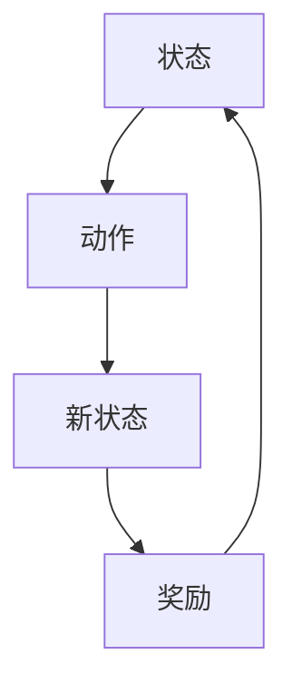
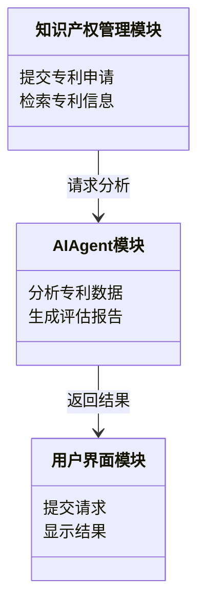
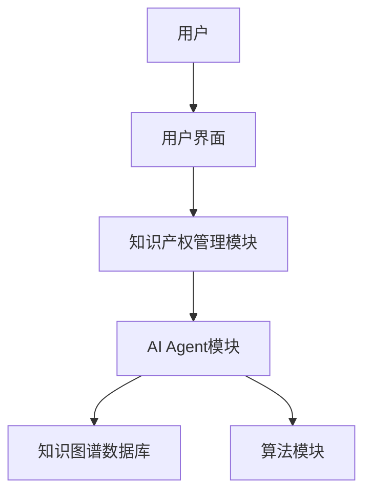
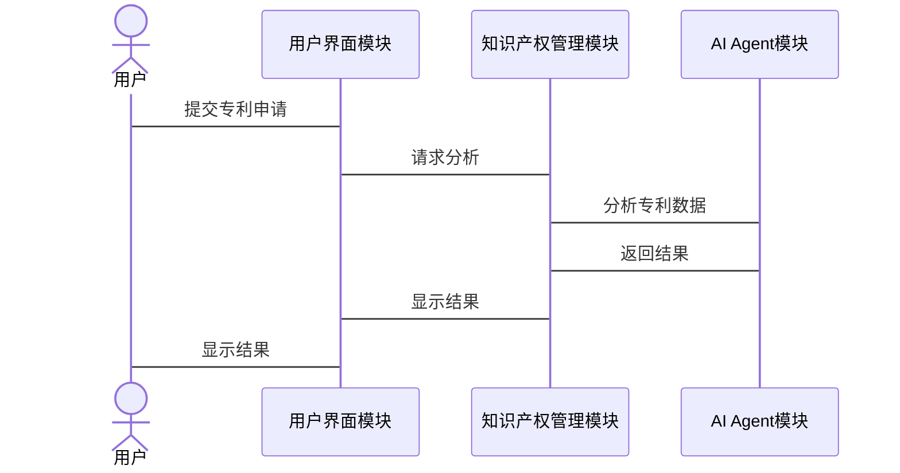

                 


# AI Agent在企业知识产权价值链管理中的应用

> 关键词：AI Agent，知识产权，价值链管理，企业应用，智能系统，技术实现

> 摘要：本文深入探讨了AI Agent在企业知识产权价值链管理中的应用，从基础概念到核心算法，从系统架构到项目实战，全面解析AI Agent如何助力企业提升知识产权管理效率与价值。文章结合实际案例，详细阐述了AI Agent在知识产权创造、保护和运用阶段的具体应用场景，并通过数学公式和代码实现，展示了其技术实现的细节。

---

# 第1章: AI Agent与企业知识产权管理概述

## 1.1 企业知识产权管理的基本概念

### 1.1.1 知识产权的基本定义
知识产权是指依法保护的智力成果，包括专利权、商标权、著作权、商业秘密等。企业知识产权管理的核心目标是通过有效管理和运用知识产权，创造最大价值。

### 1.1.2 企业知识产权管理的重要性
- **保护创新成果**：确保企业的技术成果和创意得到法律保护。
- **提升竞争力**：通过知识产权的高效管理，增强企业在市场中的竞争优势。
- **优化资源配置**：合理分配知识产权资源，避免重复劳动和资源浪费。

### 1.1.3 知识产权价值链的构成
知识产权价值链包括知识产权的创造、保护、运用和管理四个阶段，每个阶段都需要高效的管理工具支持。

---

## 1.2 AI Agent的基本概念与特点

### 1.2.1 AI Agent的定义
AI Agent（人工智能代理）是指能够感知环境、自主决策并执行任务的智能系统。它具备学习、推理、规划和自适应能力。

### 1.2.2 AI Agent的核心特点
| 特性 | 描述 |
|------|------|
| 智能性 | 能够理解复杂问题并提供解决方案 |
| 自主性 | 可以独立执行任务，无需人工干预 |
| 适应性 | 能够根据环境变化动态调整策略 |
| 可扩展性 | 支持多种应用场景和复杂任务 |

### 1.2.3 AI Agent与传统管理工具的区别
通过以下对比表格可以看出AI Agent的优势：

| 特性             | 传统管理工具         | AI Agent                |
|------------------|---------------------|-------------------------|
| 智能性           | 依赖人工操作         | 具备自主学习能力       |
| 决策能力         | 依赖预设规则         | 能够动态优化决策       |
| 处理效率         | 处理速度有限         | 高效处理复杂任务       |

---

## 1.3 AI Agent在企业知识产权管理中的应用前景

### 1.3.1 知识产权管理的痛点与挑战
- 数据量大：知识产权信息分散，难以高效检索。
- 动态变化：知识产权市场和法律环境不断变化，需要实时更新。
- 协作复杂：全球化背景下，知识产权管理需要多部门协作。

### 1.3.2 AI Agent的潜在应用领域
- 知识产权检索与分析
- 侵权风险预警
- 知识产权资产评估与优化

### 1.3.3 AI Agent应用的创新与优势
AI Agent通过智能化手段，显著提升了知识产权管理的效率和准确性，同时降低了管理成本。

---

## 1.4 本章小结

本章介绍了知识产权管理的基本概念和AI Agent的核心特点，分析了AI Agent在企业知识产权管理中的应用前景。通过对比传统管理工具，突出了AI Agent的优势和创新点。

---

# 第2章: 企业知识产权价值链管理的背景与需求

## 2.1 知识产权价值链的基本结构

### 2.1.1 知识产权的创造阶段
知识产权的创造阶段包括技术研发、作品创作等，需要高效的管理工具支持。

### 2.1.2 知识产权的保护阶段
保护阶段包括专利申请、商标注册等，需要快速响应和精准分析。

### 2.1.3 知识产权的运用阶段
运用阶段包括知识产权的交易、许可等，需要智能匹配和资产评估。

通过以下ER图可以清晰看出知识产权价值链的主要实体及其关系：

```mermaid
erDiagram
    actor 企业用户 {
        string 用户ID
        string 用户名
    }
    class 知识产权 {
        string 专利号
        string 商标号
        string 版权信息
    }
    class AI Agent {
        string 代理ID
        string 代理名称
    }
    actor 企业用户 --> class 知识产权 : 提交
    actor 企业用户 --> class AI Agent : 请求分析
    class 知识产权 --> class AI Agent : 分析结果
```

---

## 2.2 企业知识产权管理的核心需求

### 2.2.1 知识产权的高效检索与分析
企业需要快速检索和分析知识产权信息，以便做出决策。

### 2.2.2 知识产权的侵权风险预警
通过实时监测市场动态，预警潜在的侵权风险。

### 2.2.3 知识产权的资产评估与优化
通过智能评估工具，优化知识产权的运用策略。

---

## 2.3 知识产权价值链管理的挑战

### 2.3.1 数据的复杂性与多样性
知识产权数据来源广泛，格式多样，难以统一管理。

### 2.3.2 知识产权信息的动态变化
知识产权法律和市场环境不断变化，需要实时更新。

### 2.3.3 知识产权管理的全球化与协同性
全球化背景下，知识产权管理需要多部门和地区的协同合作。

---

## 2.4 本章小结

本章分析了企业知识产权价值链的基本结构，明确了知识产权管理的核心需求和面临的挑战。

---

# 第3章: AI Agent在知识产权价值链管理中的核心作用

## 3.1 AI Agent在知识产权创造阶段的应用

### 3.1.1 知识产权生成与评估
AI Agent可以通过自然语言处理技术，辅助生成技术文档，并评估其创新性。

### 3.1.2 AI Agent在专利申请中的辅助作用
AI Agent可以帮助撰写专利申请文件，并提供相似专利的检索和分析。

---

## 3.2 AI Agent在知识产权保护阶段的应用

### 3.2.1 知识产权侵权检测与预警
AI Agent可以通过图像识别和自然语言处理技术，实时监测市场动态，预警侵权风险。

### 3.2.2 AI Agent在知识产权诉讼中的支持作用
AI Agent可以提供法律条款检索、案例分析等支持，辅助企业应对知识产权诉讼。

---

## 3.3 AI Agent在知识产权运用阶段的应用

### 3.3.1 知识产权资产评估与优化
AI Agent可以通过大数据分析，评估知识产权的市场价值，并优化其运用策略。

### 3.3.2 AI Agent在知识产权交易中的智能匹配
AI Agent可以根据需求智能匹配潜在的交易对象，提高交易效率。

---

## 3.4 本章小结

本章详细探讨了AI Agent在知识产权创造、保护和运用阶段的具体应用，突出了其在提升管理效率和创造价值中的重要作用。

---

# 第4章: AI Agent的核心概念与原理

## 4.1 AI Agent的基本原理

### 4.1.1 AI Agent的感知与决策机制
AI Agent通过感知环境信息，利用学习算法进行决策。

### 4.1.2 AI Agent的学习与自适应能力
AI Agent可以通过强化学习和监督学习不断提升自身的智能水平。

---

## 4.2 AI Agent与知识图谱的关系

### 4.2.1 知识图谱的基本概念
知识图谱是一种结构化的知识表示方式，能够表示实体之间的关系。

### 4.2.2 AI Agent在知识图谱中的应用
AI Agent可以通过知识图谱进行推理和决策。

---

## 4.3 AI Agent的算法实现

### 4.3.1 强化学习算法
通过以下流程图可以清晰看出强化学习的基本流程：



### 4.3.2 监督学习算法
监督学习通过以下公式进行分类：

$$ y = \text{sign}(w \cdot x + b) $$

其中，$w$ 是权重，$x$ 是输入，$b$ 是偏置，$y$ 是输出。

---

## 4.4 本章小结

本章详细介绍了AI Agent的核心概念和基本原理，分析了其与知识图谱的关系，并通过数学公式和流程图展示了其算法实现。

---

# 第5章: 系统分析与架构设计方案

## 5.1 问题场景介绍

知识产权管理系统的应用场景包括专利申请、侵权检测、资产评估等。

---

## 5.2 系统功能设计

通过以下类图可以清晰看出系统的功能模块：



---

## 5.3 系统架构设计

通过以下架构图可以清晰看出系统的整体结构：



---

## 5.4 系统接口设计

主要接口包括：

1. 提交专利申请接口
2. 查询专利信息接口
3. 生成评估报告接口

---

## 5.5 系统交互设计

通过以下序列图可以清晰看出系统的交互流程：



---

## 5.6 本章小结

本章通过系统分析与架构设计，详细展示了知识产权管理系统的实现方案，包括功能模块、系统架构和交互流程。

---

# 第6章: 项目实战

## 6.1 环境安装

- 安装Python 3.8及以上版本
- 安装必要的库：numpy、pandas、scikit-learn、matplotlib

---

## 6.2 核心代码实现

### 6.2.1 知识产权检索与分析

```python
import numpy as np
import pandas as pd

def analyze_patent(data):
    # 数据分析逻辑
    pass

# 示例数据
data = {
    '专利号': ['12345', '67890'],
    '申请人': ['公司A', '公司B']
}
df = pd.DataFrame(data)
print(analyze_patent(df))
```

### 6.2.2 侵权风险预警

```python
from sklearn import svm

# 训练模型
model = svm.SVC()

# 预测侵权风险
def predict_risk(features):
    return model.predict(features)
```

---

## 6.3 案例分析

### 6.3.1 案例背景
某公司申请了一项专利，需要进行侵权风险预警。

### 6.3.2 数据准备
```python
features = [[1, 2], [3, 4]]
```

### 6.3.3 模型训练与预测
```python
model.fit(features, [0, 1])
print(predict_risk([[2, 3]]))
```

---

## 6.4 项目总结

通过本项目，我们可以看到AI Agent在知识产权管理中的强大能力，同时也需要注意到实际应用中的一些挑战。

---

# 第7章: 最佳实践与小结

## 7.1 最佳实践 tips

- 数据质量是关键：确保输入数据的准确性和完整性。
- 模型调优：根据实际需求调整算法参数，提升性能。
- 安全与隐私：注意知识产权数据的安全保护。

---

## 7.2 小结

本文详细探讨了AI Agent在企业知识产权价值链管理中的应用，从基础概念到技术实现，从系统设计到项目实战，全面展示了其巨大潜力和实际价值。

---

## 7.3 注意事项

- AI Agent的使用需要结合企业的具体需求。
- 数据隐私和安全是需要重点关注的问题。

---

## 7.4 拓展阅读

- 《人工智能在知识产权管理中的应用》
- 《基于知识图谱的智能系统设计》

---

# 结语

通过本文的深入探讨，我们可以看到AI Agent在企业知识产权管理中的巨大潜力，同时也需要我们在实际应用中不断探索和优化。

