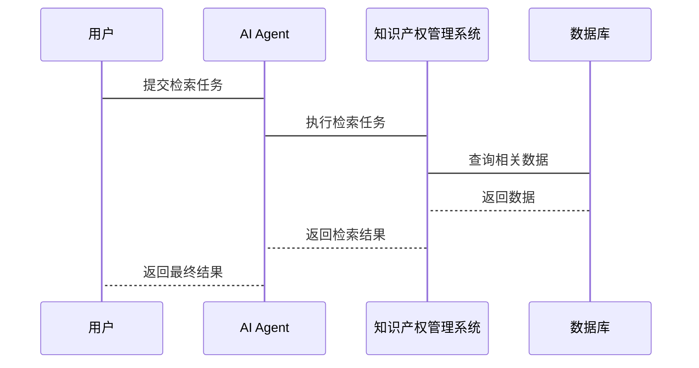

                 


# AI Agent在企业知识产权管理中的应用与价值

## 关键词：
AI Agent, 企业知识产权管理, 人工智能, 算法原理, 系统架构设计, 项目实战, 数学模型

## 摘要：
随着人工智能技术的快速发展，AI Agent（人工智能代理）在企业知识产权管理中的应用日益广泛。本文系统地探讨了AI Agent在知识产权管理中的核心概念、算法原理、系统架构设计以及实际项目中的应用。通过详细分析知识产权管理的核心问题，结合AI Agent的感知与决策机制，本文展示了如何利用AI Agent提高知识产权管理的效率和精准度。同时，本文还提供了丰富的数学模型和系统架构图，帮助读者更好地理解AI Agent在知识产权管理中的实际应用和价值。

---

## 第一部分: AI Agent在企业知识产权管理中的应用背景

### 第1章: AI Agent与知识产权管理概述

#### 1.1 什么是AI Agent
##### 1.1.1 AI Agent的基本概念
AI Agent（人工智能代理）是指能够感知环境、自主决策并执行任务的智能实体。它通过传感器获取信息，利用算法进行分析和推理，并通过执行器与环境交互。

##### 1.1.2 AI Agent的核心特点
- **自主性**：能够自主决策，无需人工干预。
- **反应性**：能够实时感知环境并做出反应。
- **目标导向**：以特定目标为导向，优化决策过程。
- **学习能力**：通过机器学习算法不断优化自身性能。

##### 1.1.3 AI Agent与传统软件的区别
传统的软件程序是基于固定的规则和逻辑运行，而AI Agent具备学习和适应能力，能够根据环境变化调整自身行为。

#### 1.2 企业知识产权管理的现状
##### 1.2.1 知识产权管理的基本概念
知识产权管理是指对企业拥有的专利、商标、版权等知识产权进行保护、监控和管理的过程。

##### 1.2.2 传统知识产权管理的挑战
- **信息分散**：知识产权信息分布在不同数据库和平台，难以统一管理和分析。
- **人工成本高**：传统管理依赖人工检索和分析，效率低且成本高。
- **数据复杂性**：知识产权数据量大且结构复杂，难以快速提取有价值的信息。

##### 1.2.3 数字化知识产权管理的趋势
随着大数据和人工智能技术的发展，知识产权管理逐渐向数字化、智能化方向转型，AI Agent在其中发挥重要作用。

#### 1.3 AI Agent在知识产权管理中的应用价值
##### 1.3.1 提高管理效率
AI Agent能够快速检索和分析大量知识产权数据，显著提高管理效率。

##### 1.3.2 降低管理成本
通过自动化处理和智能决策，AI Agent可以大幅降低人力和时间成本。

##### 1.3.3 提升决策精准度
AI Agent基于数据驱动的分析，提供更精准的知识产权保护和布局建议。

---

## 第二部分: AI Agent与知识产权管理的核心概念联系

### 第2章: AI Agent的核心概念与知识产权管理的联系

#### 2.1 AI Agent的核心概念原理
##### 2.1.1 AI Agent的感知与决策机制
AI Agent通过传感器（如API接口）获取环境信息，利用算法（如强化学习）进行分析和推理，最终做出决策并执行任务。

##### 2.1.2 知识产权管理的业务流程
知识产权管理包括知识产权的申请、检索、分析、保护和监控等多个环节。

##### 2.1.3 AI Agent如何赋能知识产权管理
AI Agent可以通过自动化处理和智能分析，优化知识产权的检索、分析和保护流程。

#### 2.2 AI Agent与知识产权管理的核心概念对比
##### 2.2.1 核心概念对比表
| 概念 | AI Agent | 知识产权管理 |
|------|----------|--------------|
| 核心目标 | 完成特定任务 | 保护和管理知识产权 |
| 输入 | 环境数据 | 知识产权数据 |
| 输出 | 行动或决策 | 管理策略或建议 |

##### 2.2.2 ER实体关系图
```mermaid
erd
    图表标题: 知识产权管理的ER实体关系图

    知识产权实体 --> 知识产权数据库
    知识产权数据库 --> 知识产权管理系统
    知识产权管理系统 --> AI Agent
    AI Agent --> 用户
```

##### 2.2.3 领域模型类图
```mermaid
classDiagram
    类 知识产权实体 {
        <属性>
        - 类型：专利、商标、版权
        - 申请人：申请人信息
        - 时间：申请日期
        - 状态：有效、无效
        <方法>
        + 检索(keywords): 查询相关知识产权
        + 分析(similar): 分析相似性
    }
    类 知识产权管理系统 {
        <属性>
        - 数据库连接：数据库IP
        - 用户权限：用户权限列表
        <方法>
        + 查询实体(keywords): 返回相关实体列表
        + 生成报告(): 生成分析报告
    }
    类 AI Agent {
        <属性>
        - 状态：空闲、运行中
        - 当前任务：检索、分析
        <方法>
        + 感知环境(): 获取环境数据
        + 决策(): 制定下一步行动
        + 执行(action): 执行具体任务
    }
    知识产权实体 --> 知识产权管理系统
    知识产权管理系统 --> AI Agent
    AI Agent --> 用户
```

---

## 第三部分: AI Agent的算法原理与数学模型

### 第3章: AI Agent的算法原理

#### 3.1 强化学习算法
##### 3.1.1 强化学习的基本原理
强化学习是一种通过试错机制，学习策略以最大化预期奖励的算法。

##### 3.1.2 Q-learning算法的数学模型
Q-learning算法的更新公式为：
$$ Q(s, a) = Q(s, a) + \alpha \left[ r + \gamma \max Q(s', a') - Q(s, a) \right] $$
其中：
- \( Q(s, a) \)：状态s下采取行动a的Q值
- \( \alpha \)：学习率
- \( r \)：奖励值
- \( \gamma \)：折扣因子
- \( s' \)：新状态
- \( a' \)：新行动

##### 3.1.3 算法实现步骤
1. 初始化Q表，所有状态-行动对的初始值为0。
2. 在每一步中，选择当前状态下的最优行动。
3. 执行该行动，获取奖励和新状态。
4. 更新Q表中的Q值。

##### 3.1.4 强化学习在知识产权管理中的应用
- **专利检索优化**：通过强化学习优化专利检索策略。
- **侵权风险评估**：通过强化学习评估侵权风险并制定应对策略。

#### 3.2 知识图谱构建算法
##### 3.2.1 知识图谱的基本概念
知识图谱是一种结构化的知识表示形式，能够将分散的数据组织成有意义的实体和关系。

##### 3.2.2 知识图谱构建的步骤
1. 数据抽取：从知识产权文档中提取实体和关系。
2. 数据清洗：去除噪声数据，确保数据质量。
3. 数据关联：建立实体之间的关联关系。
4. 数据存储：将构建的知识图谱存储在数据库中。

##### 3.2.3 知识图谱构建的数学模型
构建知识图谱的过程可以表示为：
$$ Entity\_关系 = f(输入数据) $$
其中，\( f \) 是一种数据处理函数。

##### 3.2.4 知识图谱在知识产权管理中的应用
- **专利布局优化**：基于知识图谱分析专利布局的合理性。
- **技术趋势预测**：通过知识图谱预测技术发展趋势。

---

## 第四部分: AI Agent的系统架构设计

### 第4章: 系统架构设计与实现

#### 4.1 系统应用场景
##### 4.1.1 专利检索与分析
用户可以通过AI Agent快速检索专利信息，并进行深度分析。

##### 4.1.2 商标监测与保护
AI Agent可以实时监测商标侵权行为，并提供保护建议。

##### 4.1.3 知识产权风险评估
AI Agent可以评估企业的知识产权风险，并制定应对策略。

#### 4.2 系统功能设计
##### 4.2.1 领域模型类图
```mermaid
classDiagram
    类 用户 {
        <属性>
        - 用户ID：string
        - 用户名：string
        <方法>
        + 提交任务(keywords): 提交检索任务
        + 获取结果(): 获取检索结果
    }
    类 知识产权管理系统 {
        <属性>
        - 数据库连接：string
        - 系统配置：dictionary
        <方法>
        + 查询(keywords): 返回相关知识产权列表
        + 生成报告(): 生成分析报告
    }
    类 AI Agent {
        <属性>
        - 状态：空闲、运行中
        - 当前任务：检索、分析
        <方法>
        + 感知环境(): 获取环境数据
        + 决策(): 制定下一步行动
        + 执行(action): 执行具体任务
    }
    用户 --> AI Agent
    AI Agent --> 知识产权管理系统
    知识产权管理系统 --> 数据库
```

##### 4.2.2 系统架构图
```mermaid
graph TD
    用户 --> AI Agent
    AI Agent --> 知识产权管理系统
    知识产权管理系统 --> 数据库
    数据库 --> AI Agent
```

#### 4.3 系统接口设计
##### 4.3.1 系统接口描述
- **输入接口**：接收用户的检索请求。
- **输出接口**：返回检索结果和分析报告。
- **数据接口**：与知识产权数据库进行数据交互。

##### 4.3.2 系统交互流程
1. 用户提交检索任务。
2. AI Agent感知环境并决策。
3. 知识产权管理系统执行检索任务。
4. 返回检索结果给用户。

#### 4.4 系统交互序列图


---

## 第五部分: 项目实战与案例分析

### 第5章: 项目实战

#### 5.1 环境安装与配置
##### 5.1.1 安装Python环境
- 安装Python 3.8或更高版本。
- 安装必要的Python库，如`numpy`, `pandas`, `scikit-learn`。

##### 5.1.2 安装AI Agent框架
- 使用`tensorflow`或`pytorch`框架。
- 安装强化学习库，如`keras-reinforce`。

##### 5.1.3 安装知识产权数据库接口
- 使用`patentdata`库连接专利数据库。
- 使用`tmdb`库连接商标数据库。

#### 5.2 系统核心实现
##### 5.2.1 AI Agent核心代码实现
```python
class AI-Agent:
    def __init__(self):
        self.state = 'idle'  # 状态：空闲、运行中
        self.current_task = None  # 当前任务：检索、分析
    
    def感知环境(self):
        # 获取环境数据，如数据库状态、用户输入
        pass
    
    def 决策(self):
        # 基于当前状态和环境数据，制定决策
        pass
    
    def 执行(self, action):
        # 执行具体任务，如检索、分析
        pass
```

##### 5.2.2 知识产权管理系统实现
```python
class IntellectualPropertySystem:
    def __init__(self):
        self.database_connection = None  # 数据库连接
        self.system_configuration = {}  # 系统配置
    
    def 查询(self, keywords):
        # 根据关键词查询知识产权数据
        pass
    
    def 生成报告(self):
        # 生成分析报告
        pass
```

##### 5.2.3 数据库实现
```python
class Database:
    def __init__(self):
        self.connection = None  # 数据库连接
    
    def 查询(self, query):
        # 执行查询并返回结果
        pass
    
    def 更新(self, data):
        # 更新数据库数据
        pass
```

#### 5.3 项目实战案例分析
##### 5.3.1 案例背景
某企业希望利用AI Agent优化专利检索和分析流程。

##### 5.3.2 数据准备
从专利数据库中获取相关专利数据，清洗和预处理数据。

##### 5.3.3 系统实现
1. 用户提交检索任务。
2. AI Agent感知环境并决策。
3. 知识产权管理系统执行检索任务。
4. 返回检索结果给用户。

##### 5.3.4 系统运行与结果分析
通过实际运行系统，验证AI Agent在专利检索和分析中的效果，并根据结果优化系统性能。

#### 5.4 项目小结
通过项目实战，验证了AI Agent在知识产权管理中的有效性，同时积累了实际应用的经验，为后续优化提供了参考。

---

## 第六部分: 最佳实践与小结

### 第6章: 最佳实践与小结

#### 6.1 AI Agent在知识产权管理中的最佳实践
##### 6.1.1 系统设计建议
- 确保系统的可扩展性和可维护性。
- 定期更新知识图谱，保持数据的准确性和及时性。

##### 6.1.2 算法优化建议
- 根据具体场景选择合适的算法，如强化学习和知识图谱构建。
- 定期对模型进行训练和优化，提升系统的性能和准确性。

##### 6.1.3 项目实施建议
- 明确项目目标和范围，制定详细的项目计划。
- 团队协作，确保各模块的协调配合。

#### 6.2 小结
通过本文的系统探讨和项目实战，可以得出AI Agent在企业知识产权管理中具有重要的应用价值。AI Agent能够显著提高知识产权管理的效率和精准度，降低管理成本，为企业创造更大的价值。

#### 6.3 未来展望
随着AI技术的不断发展，AI Agent在知识产权管理中的应用将更加广泛和深入。未来的研究方向包括优化算法性能、提升系统的智能化水平以及拓展更多的应用场景。

#### 6.4 注意事项
- 确保系统的安全性和稳定性。
- 保护知识产权数据的安全，防止数据泄露。

#### 6.5 拓展阅读
- 《强化学习入门》
- 《知识图谱构建与应用》
- 《企业知识产权管理》

---

通过以上目录大纲，您可以系统地学习AI Agent在企业知识产权管理中的应用与价值，从理论到实践，逐步深入理解其核心概念和实际应用。

