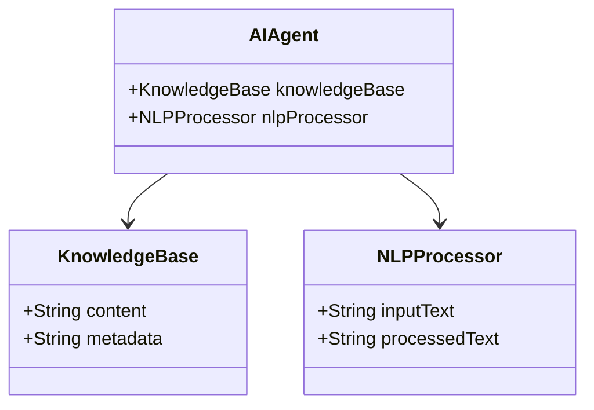
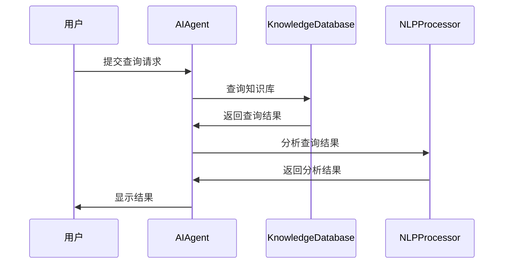

                 


# AI Agent在企业知识管理中的应用

## 关键词
AI Agent, 企业知识管理, 自然语言处理, 知识图谱, 智能化转型

## 摘要
随着企业对知识管理的需求日益增长，AI Agent在其中发挥着越来越重要的作用。本文从AI Agent的基本概念出发，详细探讨其在企业知识管理中的应用场景，包括知识图谱构建、自然语言处理和智能化决策支持。通过技术原理分析、系统架构设计和实际案例研究，本文深入阐述了AI Agent如何提升企业知识管理的效率和价值。

---

# 第一部分: AI Agent与企业知识管理的背景与概念

## 第1章: AI Agent与知识管理概述

### 1.1 AI Agent的基本概念
#### 1.1.1 AI Agent的定义与特点
AI Agent（人工智能代理）是指能够感知环境、自主决策并执行任务的智能实体。其特点包括自主性、反应性、目标导向和社会能力。

- 自主性：AI Agent无需外部干预，能够独立完成任务。
- 反应性：能够实时感知环境变化并做出响应。
- 目标导向：基于明确的目标进行决策和行动。
- 社会能力：能够与其他系统或人类进行有效交互。

#### 1.1.2 AI Agent的核心功能与模块
AI Agent的核心功能模块包括感知模块、决策模块和执行模块。

- 感知模块：通过传感器或数据接口获取环境信息。
- 决策模块：基于感知信息进行分析和推理，制定行动计划。
- 执行模块：将决策结果转化为具体行动。

#### 1.1.3 AI Agent与传统知识管理系统的区别
传统知识管理系统依赖于规则和预定义流程，而AI Agent能够通过学习和自适应优化知识管理流程。

---

### 1.2 企业知识管理的背景与挑战
#### 1.2.1 知识管理在企业中的重要性
知识管理（KM）是将企业中的显性知识（如文档、数据）和隐性知识（如经验、技能）系统化、共享化的过程。有效的知识管理能够提升企业的竞争力和创新能力。

#### 1.2.2 传统知识管理的局限性
传统知识管理系统面临以下问题：
- 知识孤岛：各部门之间的知识难以有效共享。
- 知识更新缓慢：难以快速响应变化。
- 知识利用效率低：难以精准匹配需求。

#### 1.2.3 企业知识管理的未来趋势
随着AI和大数据技术的发展，知识管理将更加智能化、自动化和个性化。

---

### 1.3 AI Agent在企业知识管理中的作用
#### 1.3.1 AI Agent如何提升知识管理效率
AI Agent能够自动识别、整理和分析企业中的知识资源，显著提升知识管理的效率。

#### 1.3.2 AI Agent在知识发现与共享中的应用
AI Agent能够通过自然语言处理技术，自动提取文档中的关键信息，并将其转化为结构化的知识图谱。

#### 1.3.3 AI Agent与企业智能化转型的关系
AI Agent是企业智能化转型的核心驱动力，能够推动企业从传统管理向智能决策转变。

---

## 第2章: AI Agent的技术原理

### 2.1 AI Agent的核心技术
#### 2.1.1 自然语言处理（NLP）在AI Agent中的应用
NLP技术用于理解和生成人类语言，是AI Agent实现智能交互的基础。

- 文本解析：将非结构化文本转化为结构化数据。
- 实体识别：识别文本中的关键实体。
- 情感分析：分析文本中的情感倾向。

#### 2.1.2 机器学习与深度学习在AI Agent中的作用
机器学习和深度学习技术用于训练AI Agent的学习能力，使其能够从数据中自动提取模式和规律。

- 有监督学习：基于标注数据进行训练。
- 无监督学习：从未标注数据中发现结构。
- 强化学习：通过试错优化决策策略。

#### 2.1.3 知识图谱构建与推理机制
知识图谱是一种结构化的知识表示方法，AI Agent通过构建和推理知识图谱实现知识的深度应用。

- 知识图谱构建：通过NLP技术将文本转化为结构化的知识。
- 知识推理：基于知识图谱进行逻辑推理。

---

### 2.2 AI Agent的感知与决策模块
#### 2.2.1 感知模块的实现原理
感知模块通过多种传感器或数据源获取环境信息，并进行初步处理。

- 数据采集：从企业知识管理系统中获取文本、数据等信息。
- 数据预处理：清洗和标准化数据。

#### 2.2.2 决策模块的算法选择
决策模块基于感知信息，选择最优行动方案。

- 基于规则的决策：根据预定义规则进行决策。
- 基于机器学习的决策：通过训练模型进行预测和决策。

#### 2.2.3 模块之间的交互流程
感知模块将数据传递给决策模块，决策模块根据数据制定行动计划，并将计划传递给执行模块。

---

### 2.3 AI Agent的执行与反馈机制
#### 2.3.1 执行模块的功能实现
执行模块根据决策模块的指令，执行具体的行动。

- 任务执行：如生成报告、发送通知等。
- 状态反馈：将执行结果反馈给决策模块。

#### 2.3.2 反馈机制的设计原理
反馈机制通过收集执行结果，优化AI Agent的行为。

- 正反馈：奖励正确的决策。
- 负反馈：惩罚错误的决策。

---

# 第三部分: 系统架构与项目实战

## 第3章: AI Agent与知识管理的系统架构

### 3.1 系统功能设计
#### 3.1.1 领域模型设计
领域模型是系统功能实现的基础，通常采用类图表示。



---

### 3.2 系统架构设计
系统架构设计采用分层架构，包括数据层、业务逻辑层和用户界面层。


---

### 3.3 系统接口设计
系统接口设计采用RESTful API，包括以下接口：

- GET /api/knowledge/{id}：获取知识内容。
- POST /api/analyze：分析文本并返回结果。

---

### 3.4 系统交互设计
系统交互设计采用序列图，描述用户与系统之间的交互流程。



---

## 第4章: 项目实战与应用案例

### 4.1 项目实战
#### 4.1.1 项目背景
本项目旨在开发一个基于AI Agent的知识管理系统，实现对企业知识的智能化管理。

#### 4.1.2 核心代码实现
以下是AI Agent的核心代码实现：

```python
class AIAgent:
    def __init__(self, knowledge_base):
        self.knowledge_base = knowledge_base

    def perceive(self, input_data):
        # 处理输入数据
        pass

    def decide(self, processed_data):
        # 制定决策
        pass

    def execute(self, decision):
        # 执行决策
        pass
```

#### 4.1.3 实现细节解读
AI Agent的实现依赖于知识库和NLP处理器，通过感知、决策和执行模块实现知识管理的自动化。

---

### 4.2 应用案例分析
#### 4.2.1 案例背景
某企业希望通过AI Agent实现知识库的智能化管理，提升知识共享和利用效率。

#### 4.2.2 案例分析
通过部署AI Agent，企业实现了知识的自动分类、关联和推理，显著提升了知识管理的效率。

---

## 第5章: 总结与展望

### 5.1 本章总结
本文详细探讨了AI Agent在企业知识管理中的应用，分析了其技术原理和系统架构，并通过实际案例展示了其应用价值。

### 5.2 未来展望
随着AI和大数据技术的不断发展，AI Agent在企业知识管理中的应用将更加广泛和深入，为企业智能化转型提供更强大的支持。

---

通过以上内容，我们可以看到，AI Agent在企业知识管理中的应用前景广阔，能够有效提升企业的知识管理水平，推动企业实现智能化转型。

