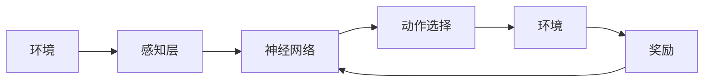
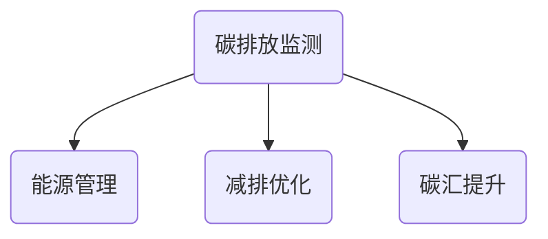
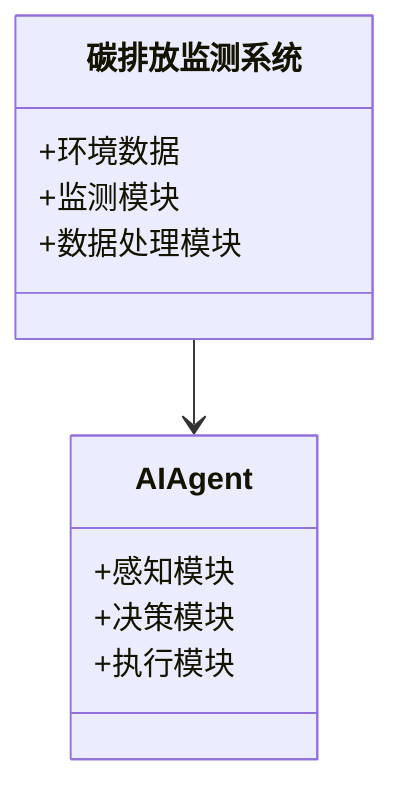
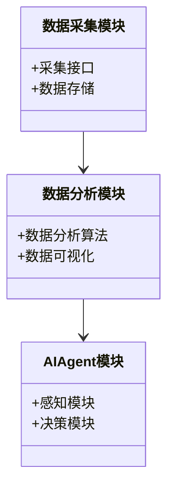
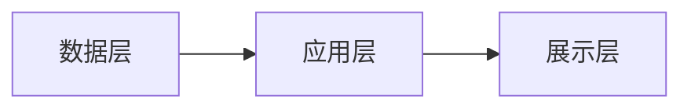
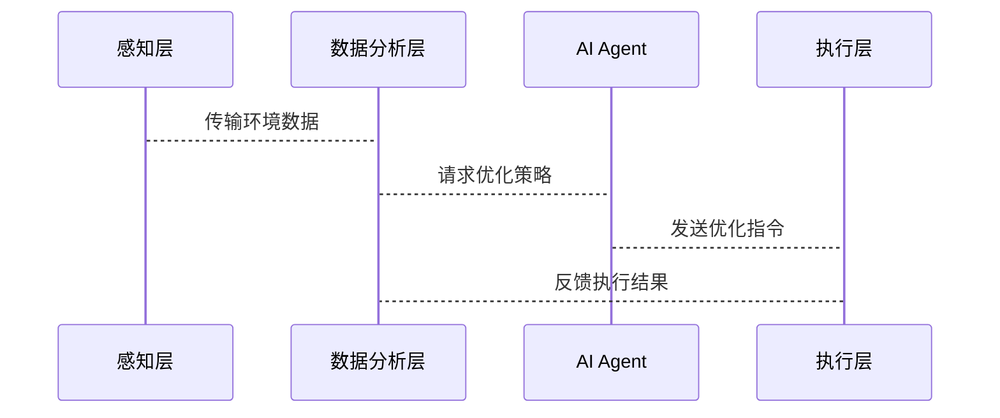

                 


# AI Agent在企业碳中和战略规划与实施中的应用

> 关键词：AI Agent, 企业碳中和, 战略规划, 实施, 人工智能, 碳排放, 可持续发展

> 摘要：本文探讨了AI Agent在企业碳中和战略中的应用，分析了其核心原理、算法模型及系统架构，通过实际案例展示了如何利用AI技术优化企业碳中和实施路径。

---

# 目录大纲

1. **企业碳中和背景与AI Agent概述**
   1.1 碳中和的背景与重要性
   1.2 AI Agent的基本概念与核心特征
   1.3 AI Agent在企业中的作用与应用趋势

2. **AI Agent的核心原理与技术基础**
   2.1 AI Agent的基本原理
   2.2 AI Agent的类型与应用场景对比
   2.3 AI Agent的核心算法与数学模型

3. **企业碳中和战略的构建与实施**
   3.1 企业碳排放分析与战略目标设定
   3.2 AI Agent在碳中和战略中的应用场景
   3.3 碳中和战略的系统分析与架构设计

4. **AI Agent在企业碳中和中的系统设计与实现**
   4.1 问题场景介绍
   4.2 系统功能设计（领域模型类图）
   4.3 系统架构设计（架构图）
   4.4 系统接口设计与交互流程（序列图）

5. **项目实战：AI Agent驱动的碳中和实施路径优化**
   5.1 环境安装与工具配置
   5.2 核心代码实现与解读
   5.3 实际案例分析与效果评估
   5.4 项目总结与经验分享

6. **最佳实践、总结与展望**
   6.1 AI Agent在碳中和中的应用总结
   6.2 实施过程中的注意事项与建议
   6.3 未来研究方向与技术发展趋势

7. **附录**
   7.1 相关工具与资源列表
   7.2 数据集与参考文献

---

## 第1章: 企业碳中和背景与AI Agent概述

### 1.1 碳中和的背景与重要性

碳中和是指企业在一定时间内通过减少温室气体排放、增加碳汇等方式，使自身产生的二氧化碳排放量与外界吸收量相抵消，达到“净零排放”的目标。随着全球气候变化问题的加剧，碳中和已成为全球企业和政府的共同目标。

- **问题背景**：企业活动产生大量碳排放，主要来源包括能源消耗、运输、生产过程等。减少碳排放已成为企业社会责任的重要组成部分。
- **问题解决**：通过技术创新、管理优化和政策支持，企业可以有效减少碳排放，实现可持续发展目标。
- **边界与外延**：碳中和不仅涉及企业内部的能源使用，还可能延伸到供应链、产品生命周期等更广泛领域。

### 1.2 AI Agent的基本概念与核心特征

AI Agent是一种能够感知环境、自主决策并执行任务的智能实体。在企业碳中和中，AI Agent主要用于优化资源配置、预测碳排放和制定减排策略。

- **核心概念**：AI Agent具备感知、决策和执行能力，能够根据环境反馈动态调整策略。
- **属性对比**：与传统AI相比，AI Agent更强调自主性和适应性，能够在复杂环境中独立完成任务。
- **ER实体关系图**：展示AI Agent与企业系统、环境数据等实体之间的关系。

### 1.3 AI Agent在企业中的作用与应用趋势

AI Agent能够提高企业碳中和策略的执行效率，帮助企业在能源管理、供应链优化等方面实现智能化决策。未来，随着技术进步，AI Agent在碳中和中的应用将更加广泛和深入。

---

## 第2章: AI Agent的核心原理与技术基础

### 2.1 AI Agent的基本原理

AI Agent通过感知环境、分析数据、制定决策并执行操作，实现预定目标。其核心包括感知模块、决策模块和执行模块。

- **算法模型**：强化学习是AI Agent的核心算法，通过不断试错优化策略。
- **数学模型**：Q-learning算法的数学模型如下：

$$ Q(s,a) = r + \gamma \max Q(s',a') $$

其中，$s$为状态，$a$为动作，$r$为奖励，$\gamma$为折扣因子。

### 2.2 AI Agent的类型与应用场景对比

AI Agent可大致分为基于规则、基于模型和基于强化学习的类型。以下是一个对比表格：

| 类型                | 特点                | 适用场景               |
|---------------------|---------------------|------------------------|
| 基于规则的AI Agent  | 依赖预定义规则      | 简单、确定性任务       |
| 基于模型的AI Agent  | 基于环境模型进行决策 | 复杂环境中的策略优化   |
| 基于强化学习的AI Agent | 通过试错优化策略    | 动态、不确定性环境       |

### 2.3 AI Agent的核心算法与数学模型

强化学习是AI Agent的核心算法，DQN算法是其典型实现。以下是DQN算法的流程图：



数学模型：

$$ Q(s,a) = r + \gamma \max Q(s',a') $$

---

## 第3章: 企业碳中和战略的构建与实施

### 3.1 企业碳排放分析与战略目标设定

企业需要全面分析自身的碳排放来源，制定减排目标，并设计实施路径。以下是一个碳排放来源的分类表：

| 排放源 | 部门 | 排放量（吨CO2/年） |
|-------|------|------------------|
| 能源使用 | 生产车间 | 1000             |
| 交通运输 | 物流部门 | 500              |
| 供应链 | 供应商A | 800              |

### 3.2 AI Agent在碳中和战略中的应用场景

AI Agent在碳中和中的应用场景包括能源管理、减排优化和碳汇提升等。以下是应用场景的对比图：



### 3.3 碳中和战略的系统分析与架构设计

系统架构设计需要考虑功能模块、数据流和交互流程。以下是一个类图：



---

## 第4章: AI Agent在企业碳中和中的系统设计与实现

### 4.1 问题场景介绍

企业在实施碳中和过程中，面临数据复杂、决策优化困难等问题。AI Agent通过实时数据分析和智能决策，帮助企业优化能源使用和减少排放。

### 4.2 系统功能设计

系统功能设计包括数据采集、分析、决策优化等模块。以下是领域模型类图：



### 4.3 系统架构设计

系统架构采用分层设计，包括数据层、应用层和展示层。以下是架构图：



### 4.4 系统接口设计与交互流程

系统交互流程包括数据采集、分析、决策优化和反馈等步骤。以下是交互流程图：



---

## 第5章: 项目实战：AI Agent驱动的碳中和实施路径优化

### 5.1 环境安装与工具配置

安装Python、TensorFlow和Keras等工具，配置开发环境。

### 5.2 核心代码实现与解读

以下是AI Agent的核心代码实现：

```python
import numpy as np
import gym

class AIAgent:
    def __init__(self, env):
        self.env = env
        self.state_size = env.observation_space.shape[0]
        self.action_size = env.action_space.n
        self.model = self.build_model()

    def build_model(self):
        # 网络模型构建
        pass

    def act(self, state):
        # 动作选择
        pass

    def remember(self, state, action, reward, next_state):
        # 记忆存储
        pass

    def replay(self, batch_size):
        # 回放学习
        pass

    def train(self, batch_size):
        # 网络训练
        pass

# 创建环境和AI Agent
env = gym.make('CartPole-v1')
agent = AIAgent(env)

# 训练过程
for episode in range(1000):
    state = env.reset()
    while True:
        action = agent.act(state)
        next_state, reward, done, _ = env.step(action)
        agent.remember(state, action, reward, next_state)
        agent.replay(32)
        state = next_state
        if done:
            break
```

### 5.3 实际案例分析与效果评估

通过实际案例分析，验证AI Agent在碳中和中的效果，如优化能源使用、减少碳排放等。

### 5.4 项目总结与经验分享

总结项目经验，分享实施过程中的关键点和优化建议。

---

## 第6章: 最佳实践、总结与展望

### 6.1 AI Agent在碳中和中的应用总结

总结AI Agent在企业碳中和中的应用效果和价值。

### 6.2 实施过程中的注意事项与建议

提出实施过程中需要注意的问题和建议。

### 6.3 未来研究方向与技术发展趋势

展望未来，AI Agent在碳中和中的应用将更加智能化和普及化。

---

## 第7章: 附录

### 7.1 相关工具与资源列表

列出开发过程中使用的工具和资源。

### 7.2 数据集与参考文献

提供相关的数据集和参考文献，供读者进一步研究。

---

通过以上目录和内容的规划，我们可以系统地探讨AI Agent在企业碳中和战略中的应用，从理论到实践，为企业提供科学的指导和可行的解决方案。

