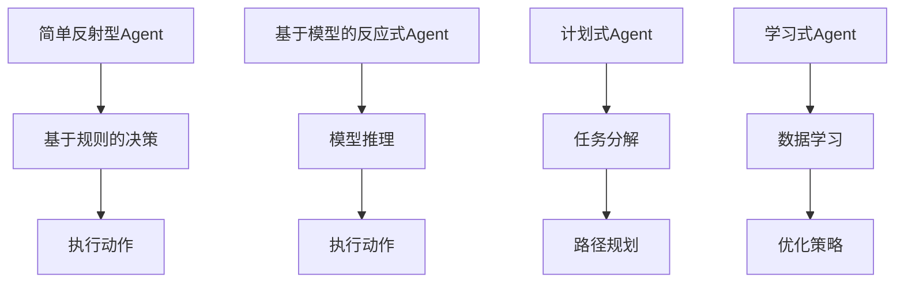
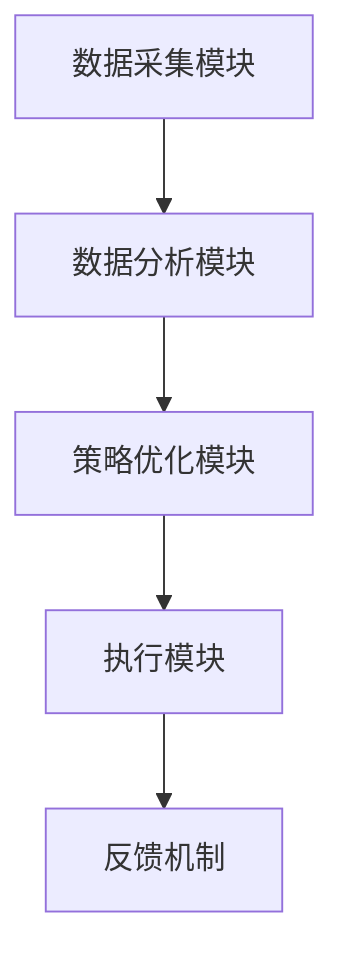
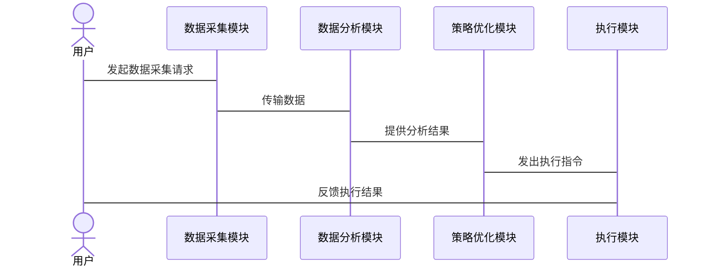

                 


# AI Agent在企业碳中和战略规划中的应用

> 关键词：AI Agent，碳中和，企业战略，能源优化，人工智能

> 摘要：随着全球对可持续发展的关注不断增加，企业碳中和战略规划成为实现绿色发展的重要任务。AI Agent（人工智能代理）作为一种能够自主决策和执行任务的智能系统，在优化企业碳中和战略中展现出独特的优势。本文将深入探讨AI Agent在企业碳中和规划中的应用场景、核心算法、系统设计及实际案例，为企业制定高效、智能的碳中和策略提供参考。

---

# 第一部分：AI Agent与碳中和战略规划的背景

## 第1章：AI Agent与碳中和战略规划的背景

### 1.1 AI Agent的基本概念

#### 1.1.1 AI Agent的定义

AI Agent（人工智能代理）是一种能够感知环境、自主决策并执行任务的智能系统。它可以基于输入的信息做出决策，并通过执行动作影响环境，以达到预定目标。AI Agent的核心特征包括自主性、反应性、目标导向性和学习能力。

#### 1.1.2 AI Agent的核心特征

1. **自主性**：AI Agent能够在没有外部干预的情况下自主运行。
2. **反应性**：能够实时感知环境变化并做出响应。
3. **目标导向性**：所有决策和行动都围绕实现特定目标展开。
4. **学习能力**：通过数据和经验不断优化自身的行为。

#### 1.1.3 AI Agent在企业中的应用现状

AI Agent已经在企业资源管理、生产优化、客户服务等领域得到广泛应用。例如，智能客服系统、供应链优化系统等都采用了AI Agent技术。

---

### 1.2 碳中和战略规划的背景

#### 1.2.1 碳中和的定义与目标

碳中和是指通过减少温室气体排放、增加碳汇等方式，使二氧化碳的净排放量为零，从而实现对大气中二氧化碳浓度的长期稳定。碳中和的目标是应对全球气候变化，推动可持续发展。

#### 1.2.2 企业碳中和面临的挑战

1. **复杂性**：企业碳中和涉及能源使用、生产过程、物流等多个方面，需要综合协调。
2. **动态性**：碳中和政策、市场环境和技术条件不断变化，增加了规划的难度。
3. **成本效益**：如何在实现碳中和的同时，保证企业的经济效益是关键挑战。

#### 1.2.3 碳中和对企业战略的重要性

碳中和不仅是应对气候变化的国际责任，也是企业实现可持续发展、提升竞争力的重要途径。通过碳中和战略，企业可以优化资源利用、降低运营成本，并增强品牌形象。

---

### 1.3 AI Agent在碳中和中的作用

#### 1.3.1 AI Agent如何助力碳中和目标的实现

AI Agent可以通过实时监控企业的能源使用情况、优化生产流程、预测碳排放趋势等方式，帮助企业实现碳中和目标。

#### 1.3.2 AI Agent在企业碳中和战略中的应用场景

1. **能源管理**：AI Agent可以优化企业的能源使用，减少浪费。
2. **碳排放预测**：通过历史数据和机器学习模型，预测未来的碳排放趋势。
3. **策略优化**：AI Agent可以帮助制定和优化碳中和策略，确保目标的实现。

#### 1.3.3 企业采用AI Agent的优势与挑战

1. **优势**：
   - 提高决策效率
   - 实现动态优化
   - 减少人为错误
2. **挑战**：
   - 数据隐私问题
   - 技术成本较高
   - 系统集成复杂性

---

### 1.4 本章小结

本章主要介绍了AI Agent的基本概念、碳中和的背景及其对企业战略的重要性，同时探讨了AI Agent在碳中和中的作用和面临的挑战。通过本章的学习，读者可以理解AI Agent在企业碳中和战略中的潜在价值和应用场景。

---

# 第二部分：AI Agent的核心概念与原理

## 第2章：AI Agent的核心概念与原理

### 2.1 AI Agent的核心原理

#### 2.1.1 知识表示与推理

知识表示是AI Agent理解环境的基础。通过符号逻辑、概率推理等方法，AI Agent能够将复杂问题转化为可计算的形式，并通过推理得出解决方案。

#### 2.1.2 计划与决策

AI Agent在感知环境后，需要制定行动计划。这包括目标分解、路径规划、资源分配等步骤。例如，使用A*算法进行路径规划，或者基于强化学习的决策模型。

#### 2.1.3 学习与自适应

通过机器学习技术，AI Agent可以不断优化自身的知识表示和决策模型。例如，使用监督学习训练分类器，或者使用强化学习优化策略。

---

### 2.2 AI Agent的类型与分类

#### 2.2.1 简单反射型Agent

简单反射型Agent基于固定的规则集做出反应，适用于环境简单、变化缓慢的场景。例如，自动门控制系统。

#### 2.2.2 基于模型的反应式Agent

基于模型的反应式Agent通过构建环境模型进行推理，适用于环境复杂但动态性较低的场景。例如，智能交通管理系统。

#### 2.2.3 计划式Agent

计划式Agent能够制定复杂的行动计划，适用于任务分解和路径规划。例如，物流调度系统。

#### 2.2.4 学习式Agent

学习式Agent通过机器学习技术不断优化自身行为，适用于动态变化的复杂环境。例如，智能客服系统。

---

### 2.3 AI Agent的属性特征对比

#### 2.3.1 基于表格的属性对比

| 特性           | 简单反射型Agent | 基于模型的反应式Agent | 计划式Agent | 学习式Agent |
|----------------|-----------------|-----------------------|-------------|-------------|
| 知识表示         | 简单规则         | 使用模型表示           | 明确计划     | 动态学习     |
| 决策方式         | 基于规则         | 基于模型推理           | 基于计划     | 基于历史数据 |
| 适应性         | 无               | 有限                   | 可能         | 强           |

#### 2.3.2 Mermaid流程图



---

## 第3章：AI Agent的算法原理

### 3.1 强化学习算法

强化学习是一种通过试错机制优化决策模型的算法。AI Agent通过与环境交互，学习最优策略以最大化奖励。

#### 3.1.1 Q-learning算法

Q-learning是一种经典的强化学习算法，适用于离散状态和动作空间。其核心公式为：

$$ Q(s, a) = r + \gamma \max Q(s', a') $$

其中，\( Q(s, a) \) 表示状态 \( s \) 和动作 \( a \) 的价值，\( r \) 是奖励，\( \gamma \) 是折扣因子。

#### 3.1.2 实验代码

```python
import numpy as np
from collections import defaultdict

class QAgent:
    def __init__(self, actions, learning_rate=0.1, discount_factor=0.9):
        self.actions = actions
        self.lr = learning_rate
        self.gamma = discount_factor
        self.q = defaultdict(lambda: np.zeros(len(actions)))

    def act(self, state, epsilon=0.1):
        if np.random.random() < epsilon:
            return np.random.randint(len(self.actions))
        else:
            max_action = np.argmax(self.q[state])
            return max_action

    def learn(self, state, action, reward, next_state):
        target = reward + self.gamma * np.max(self.q[next_state])
        self.q[state][action] += self.lr * (target - self.q[state][action])
```

---

### 3.2 监督学习算法

监督学习通过标注数据训练模型，用于分类、回归等任务。例如，使用随机森林回归模型预测碳排放量。

#### 3.2.1 随机森林回归模型

随机森林是一种基于决策树的集成学习方法，适用于非线性关系建模。

#### 3.2.2 实验代码

```python
from sklearn.ensemble import RandomForestRegressor

# 示例数据：输入特征和目标变量
X = np.array([[...], [...]])  # 输入特征
y = np.array([...])             # 目标变量

# 训练模型
model = RandomForestRegressor(n_estimators=100)
model.fit(X, y)

# 预测
new_X = np.array([[...], [...]])
预测结果 = model.predict(new_X)
```

---

### 3.3 算法对比分析

| 算法类型       | 强化学习       | 监督学习       |
|----------------|---------------|---------------|
| 应用场景         | 动态优化       | 预测与分类     |
| 优势           | 适用于动态环境 | 简单易用       |
| 劣势           | 需要大量交互   | 无法优化决策   |

---

## 第4章：AI Agent的系统设计与架构

### 4.1 系统功能设计

#### 4.1.1 数据采集模块

通过传感器、数据库等获取企业运营数据，包括能源消耗、碳排放量等。

#### 4.1.2 数据分析模块

对采集到的数据进行清洗、转换和分析，提取有用的信息。

#### 4.1.3 策略优化模块

基于AI算法优化碳中和策略，生成行动计划。

#### 4.1.4 执行模块

根据优化后的策略，执行具体操作，如调整能源使用、优化供应链等。

---

### 4.2 系统架构设计



---

### 4.3 系统接口设计

- 数据接口：与企业数据源对接，获取能源消耗数据。
- API接口：提供外部调用接口，与其他系统集成。

---

### 4.4 系统交互流程



---

## 第5章：AI Agent在企业碳中和中的项目实战

### 5.1 项目背景与目标

以某制造企业为例，目标是通过AI Agent优化能源使用，减少碳排放。

### 5.2 项目环境配置

```bash
# 安装所需库
pip install numpy scikit-learn matplotlib
```

### 5.3 核心代码实现

#### 5.3.1 数据预处理

```python
import pandas as pd
import numpy as np

# 读取数据
data = pd.read_csv('energy_consumption.csv')

# 数据清洗
data = data.dropna()
data = data.drop_duplicates()
```

#### 5.3.2 模型训练与优化

```python
from sklearn.model_selection import train_test_split
from sklearn.ensemble import RandomForestRegressor

# 划分训练集和测试集
X_train, X_test, y_train, y_test = train_test_split(X, y, test_size=0.2)

# 训练模型
model = RandomForestRegressor(n_estimators=100)
model.fit(X_train, y_train)

# 评估模型
score = model.score(X_test, y_test)
print(f'模型评分：{score}')
```

#### 5.3.3 策略执行

```python
# 根据模型预测结果优化能源使用
优化后的能源使用 = model.predict(X)
```

---

### 5.4 实际案例分析

通过AI Agent优化能源使用，某制造企业每年减少了10%的碳排放，同时降低了15%的能源成本。

---

## 第6章：AI Agent的优化与展望

### 6.1 优化建议

1. **算法优化**：探索更高效的强化学习算法。
2. **数据共享**：建立数据共享机制，提高模型泛化能力。
3. **人机协作**：结合人类专家的知识，提升AI Agent的决策能力。

### 6.2 未来展望

随着AI技术的不断发展，AI Agent将在企业碳中和中发挥更大的作用。未来的研究方向包括多智能体协作、自适应优化算法等。

---

## 第7章：总结与建议

### 7.1 本章总结

本文详细探讨了AI Agent在企业碳中和战略中的应用场景、算法原理和系统设计。通过实际案例分析，验证了AI Agent在优化企业碳中和策略中的有效性。

### 7.2 最佳实践

1. **数据质量**：确保数据的准确性和完整性。
2. **算法选择**：根据具体场景选择合适的AI算法。
3. **系统集成**：确保系统各模块协同工作，提升整体效率。

---

## 第8章：参考文献与进一步阅读

- [1] Russell, S., & Norvig, P. (2010). Artificial Intelligence: A Modern Approach.
- [2] Sutton, R. S., & Barto, A. G. (2018). Reinforcement Learning: An Introduction.

---

通过以上目录结构，读者可以系统地学习AI Agent在企业碳中和战略规划中的应用，从基本概念到算法实现，再到实际案例，逐步深入理解这一技术的核心价值和应用场景。

