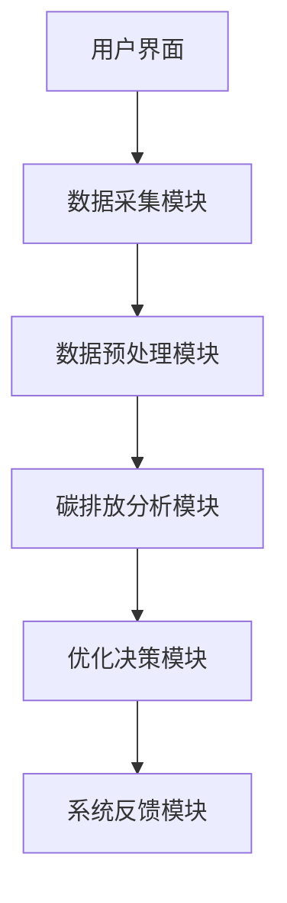

                 


# AI Agent在企业碳排放管理与可持续发展中的应用

## 关键词：AI Agent、企业碳排放管理、可持续发展、算法原理、系统架构、项目实战

## 摘要：随着全球气候变化问题的加剧，企业碳排放管理已成为实现可持续发展的重要任务。AI Agent作为一种智能代理技术，能够通过数据驱动和智能决策优化企业的碳排放管理。本文从AI Agent的核心概念、算法原理、系统架构设计、项目实战等多方面详细探讨其在企业碳排放管理与可持续发展中的应用，为企业实现绿色转型提供理论与实践指导。

---

# 第1章: 企业碳排放管理与可持续发展背景

## 1.1 碳排放管理的重要性

### 1.1.1 碳排放对企业的影响

碳排放是企业生产活动中不可避免的一部分，但过高的碳排放会导致气候变化、资源枯竭等问题。企业需要通过碳排放管理来降低对环境的影响，同时满足政府政策和行业标准的要求。

### 1.1.2 可持续发展的概念与目标

可持续发展是指在满足当前需求的同时，不损害后代满足其需求的能力。企业在追求经济利益的同时，必须关注环境保护和社会责任，实现绿色增长。

### 1.1.3 企业碳排放管理的现状与挑战

尽管许多企业已经开始关注碳排放管理，但仍然面临数据获取困难、管理复杂、技术手段落后等问题。传统的管理方式难以应对日益复杂的碳排放挑战，因此需要引入智能化的技术手段，如AI Agent。

---

## 1.2 AI Agent的基本概念

### 1.2.1 AI Agent的定义与特点

AI Agent是一种智能代理系统，能够感知环境、自主决策并执行任务。其特点包括智能性、自主性、反应性、社会性和学习性。

### 1.2.2 AI Agent的核心技术

AI Agent的核心技术包括自然语言处理、机器学习、强化学习、知识图谱等。

### 1.2.3 AI Agent在企业中的应用潜力

AI Agent可以在企业资源规划、生产优化、碳排放监测等领域发挥重要作用，帮助企业实现高效、智能的碳排放管理。

---

## 1.3 本章小结

本章从碳排放管理的重要性入手，介绍了AI Agent的基本概念和技术特点，为后续章节的展开奠定了基础。

---

# 第2章: AI Agent在企业碳排放管理中的核心作用

## 2.1 碳排放管理的关键环节

### 2.1.1 数据采集与分析

碳排放管理的第一步是数据采集，包括能源消耗数据、生产过程数据等。通过数据分析，可以识别碳排放的热点区域。

### 2.1.2 优化与决策支持

基于数据分析结果，AI Agent可以提供优化建议，如调整生产计划、优化能源使用等。

### 2.1.3 监测与反馈

实时监测碳排放数据，并根据反馈结果不断优化管理策略。

---

## 2.2 AI Agent在碳排放管理中的具体应用

### 2.2.1 能源消耗优化

AI Agent可以通过分析能源消耗数据，优化设备运行参数，降低能源浪费。

### 2.2.2 碳足迹追踪与分析

通过AI Agent，企业可以实现对整个供应链的碳足迹追踪，识别高排放环节。

### 2.2.3 可持续发展目标支持

AI Agent可以帮助企业制定长期的可持续发展目标，并提供实现路径。

---

## 2.3 本章小结

本章详细探讨了AI Agent在碳排放管理中的核心作用，包括数据采集与分析、优化与决策支持、监测与反馈等环节。

---

# 第3章: AI Agent的核心概念与原理

## 3.1 AI Agent的组成与功能

### 3.1.1 知识库与推理引擎

知识库存储企业的碳排放相关数据和知识，推理引擎基于知识库进行推理和决策。

### 3.1.2 行为决策模块

行为决策模块负责根据推理结果生成具体行动方案。

### 3.1.3 通信与协作机制

AI Agent需要与其他系统或人员进行通信和协作，确保信息的准确传递和任务的高效完成。

---

## 3.2 AI Agent的算法原理

### 3.2.1 强化学习算法

强化学习是一种通过试错机制优化决策的算法，适用于动态环境下的碳排放管理。

### 3.2.2 图神经网络

图神经网络可以处理复杂的网络关系，适用于供应链碳足迹分析。

### 3.2.3 联合学习机制

联合学习机制允许多个AI Agent协同工作，共同优化碳排放管理。

---

## 3.3 AI Agent的数学模型与公式

### 3.3.1 强化学习模型

强化学习模型可以通过以下公式表示：

$$ Q(s, a) = r + \gamma \max_{a'} Q(s', a') $$

其中，$s$是状态，$a$是动作，$r$是奖励，$\gamma$是折扣因子。

### 3.3.2 图神经网络模型

图神经网络模型可以表示为：

$$ f_{\text{GNN}}(G) = \text{aggregate}(\text{combine}(\text{apply}(\text{propagate}(G))) $$

其中，$G$是图结构数据，$\text{apply}$是节点更新函数，$\text{propagate}$是消息传播函数。

### 3.3.3 联合学习框架

联合学习框架可以通过以下公式表示：

$$ \theta_i^{new} = \theta_i^{old} + \sum_{j \neq i} \lambda_{ij} (\theta_j^{new} - \theta_i^{old}) $$

其中，$\theta_i$是参数，$\lambda_{ij}$是协作系数。

---

## 3.4 本章小结

本章详细介绍了AI Agent的核心概念与算法原理，为后续章节的系统设计和项目实战奠定了理论基础。

---

# 第4章: AI Agent在企业碳排放管理中的系统架构设计

## 4.1 系统功能设计

### 4.1.1 数据采集与预处理

系统需要采集企业的能源消耗数据、生产过程数据等，并进行清洗和预处理。

### 4.1.2 碳排放分析与预测

基于历史数据和算法模型，系统可以预测未来的碳排放趋势。

### 4.1.3 优化决策支持

系统根据分析结果提供优化建议，如调整生产计划、优化设备运行参数等。

### 4.1.4 系统监控与反馈

系统实时监控碳排放数据，并根据反馈结果不断优化管理策略。

---

## 4.2 系统架构图



---

## 4.3 系统接口与交互设计

### 4.3.1 数据接口规范

系统需要定义统一的数据接口规范，确保不同模块之间的数据交互顺利进行。

### 4.3.2 用户界面设计

用户界面需要直观易用，方便企业管理人员查看碳排放数据和管理决策。

### 4.3.3 API调用与响应

系统需要提供API接口，方便与其他系统进行集成和交互。

---

## 4.4 本章小结

本章详细设计了AI Agent在企业碳排放管理中的系统架构，包括功能设计、架构图和接口设计等内容。

---

# 第5章: AI Agent在企业碳排放管理中的项目实战

## 5.1 项目背景与需求分析

### 5.1.1 项目目标

本项目旨在通过AI Agent技术优化某制造企业的碳排放管理，降低能源消耗，实现可持续发展目标。

### 5.1.2 项目范围

项目范围包括能源消耗数据采集、碳排放分析与预测、优化决策支持等。

---

## 5.2 系统实现

### 5.2.1 环境安装

```bash
pip install numpy matplotlib tensorflow
```

### 5.2.2 核心实现代码

```python
import numpy as np
import tensorflow as tf

class AI-Agent:
    def __init__(self):
        self.model = self.build_model()

    def build_model(self):
        model = tf.keras.Sequential([
            tf.keras.layers.Dense(64, activation='relu'),
            tf.keras.layers.Dense(1, activation='sigmoid')
        ])
        model.compile(optimizer='adam', loss='binary_crossentropy')
        return model

    def train(self, X, y):
        self.model.fit(X, y, epochs=10, batch_size=32)

    def predict(self, X):
        return self.model.predict(X)
```

---

## 5.3 项目小结

本章通过一个具体的项目案例，详细讲解了AI Agent在企业碳排放管理中的实际应用，包括系统实现和项目总结。

---

# 第6章: 总结与展望

## 6.1 总结

本文详细探讨了AI Agent在企业碳排放管理与可持续发展中的应用，从理论到实践，全面介绍了AI Agent的核心概念、算法原理、系统架构设计和项目实战。

## 6.2 展望

未来，随着AI技术的不断发展，AI Agent在碳排放管理中的应用将更加广泛，为企业实现绿色转型提供更强大的技术支持。

---

# 附录: 参考文献

（此处列出相关参考文献）

---

通过以上目录结构，我们可以看到，本文从理论到实践，全面探讨了AI Agent在企业碳排放管理与可持续发展中的应用。每一章都详细介绍了相关的内容，确保读者能够系统地理解和掌握AI Agent在碳排放管理中的重要作用。

