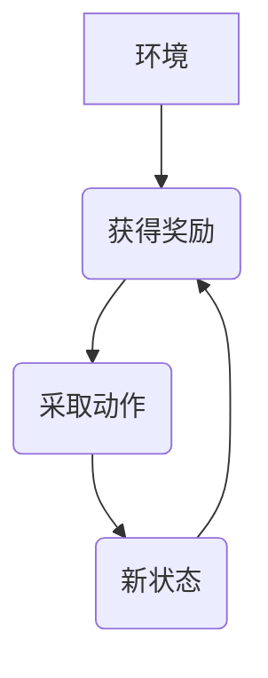
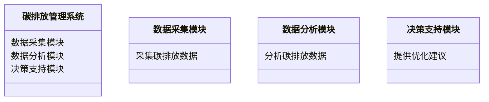
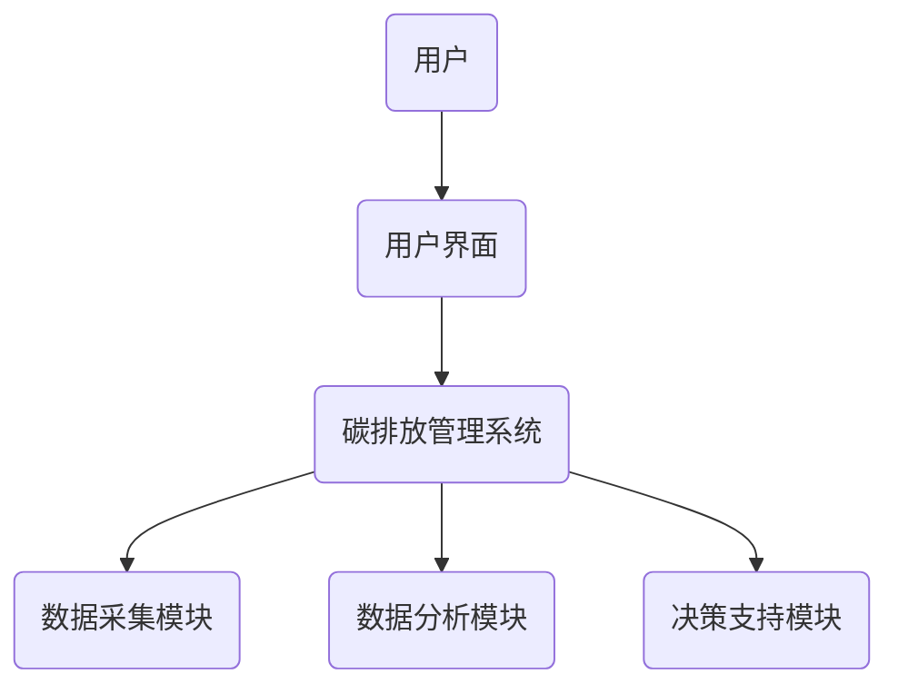
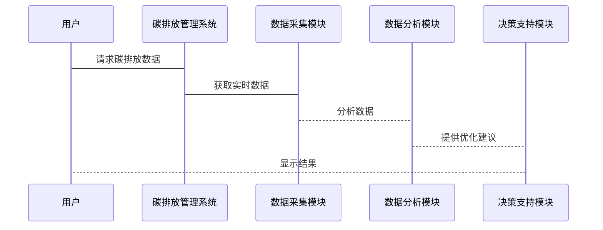

                 


# AI Agent在企业碳排放管理与环保合规中的应用

> 关键词：AI Agent, 碳排放管理, 环保合规, 强化学习, 优化模型, 系统架构

> 摘要：本文详细探讨了AI Agent在企业碳排放管理与环保合规中的应用。通过分析碳排放管理的背景、挑战和AI Agent的作用，结合算法原理、系统架构设计和项目实战，展示了AI Agent如何帮助企业实现高效、智能的环保合规管理。

---

## 第一部分: AI Agent在企业碳排放管理与环保合规中的应用背景

### 第1章: 企业碳排放管理与环保合规的背景

#### 1.1 企业碳排放管理的背景
##### 1.1.1 碳排放问题的全球背景
全球气候变化问题日益严峻，碳排放已成为全球关注的焦点。企业作为碳排放的主要来源之一，必须遵守越来越严格的环保法规。通过有效的碳排放管理，企业可以减少环境影响，提升社会责任形象。

##### 1.1.2 企业碳排放管理的重要性
碳排放管理不仅关系到企业的合规性，还直接影响企业的运营成本和市场竞争力。通过优化能源使用和减少排放，企业可以降低运营成本，同时满足环保法规要求。

##### 1.1.3 环保合规的法律与政策要求
各国政府纷纷出台严格的环保法规，要求企业减少碳排放。企业必须建立有效的碳排放管理体系，确保合规性，避免法律风险。

#### 1.2 企业碳排放管理的挑战
##### 1.2.1 碳排放数据的复杂性
碳排放数据来源广泛，包括能源消耗、运输、生产过程等多个方面。数据的多样性和复杂性使得传统的管理方法难以有效处理。

##### 1.2.2 环保合规的动态变化
环保法规和政策不断变化，企业需要灵活调整碳排放管理策略，以应对新的合规要求。

##### 1.2.3 传统管理方法的局限性
传统碳排放管理方法依赖人工操作，效率低、成本高，难以实时监控和优化。

#### 1.3 AI Agent在碳排放管理中的作用
##### 1.3.1 AI Agent的核心概念
AI Agent是一种智能实体，能够感知环境、自主决策并执行任务。在碳排放管理中，AI Agent可以实时监控数据、优化能源使用、预测排放趋势。

##### 1.3.2 AI Agent在环保领域的优势
AI Agent具有高效性、智能性和实时性，能够处理复杂的碳排放数据，优化管理策略，提高合规性。

##### 1.3.3 企业采用AI Agent的潜在价值
通过AI Agent，企业可以实现智能化的碳排放管理，降低运营成本，提升合规性，增强市场竞争力。

#### 1.4 本章小结
本章介绍了企业碳排放管理的背景、挑战以及AI Agent在其中的作用，为后续章节奠定了基础。

---

## 第二部分: AI Agent的核心概念与技术原理

### 第2章: AI Agent的基本原理

#### 2.1 AI Agent的定义与分类
##### 2.1.1 AI Agent的定义
AI Agent是一种智能实体，能够感知环境、自主决策并执行任务。它可以分为简单反射Agent、基于模型的反射Agent、目标驱动Agent和效用驱动Agent。

##### 2.1.2 AI Agent的分类
| 类型                | 描述                                                                 |
|---------------------|----------------------------------------------------------------------|
| 简单反射Agent      | 基于简单的规则做出反应，适用于任务单一的场景。                         |
| 基于模型的反射Agent | 使用环境模型进行决策，适用于复杂场景。                                 |
| 目标驱动Agent      | 根据目标优化行为，适用于需要长期规划的任务。                           |
| 效用驱动Agent      | 通过最大化效用函数实现最优决策，适用于复杂动态环境。                   |

##### 2.1.3 不同类型AI Agent的特点对比
- **简单反射Agent**：适用于任务单一、规则明确的场景，如自动开关设备。
- **基于模型的反射Agent**：适用于复杂场景，能够根据环境模型进行决策，如智能电网中的负荷调度。
- **目标驱动Agent**：适用于需要长期规划的任务，如碳排放优化。
- **效用驱动Agent**：适用于复杂动态环境，能够根据效用函数进行优化决策，如多目标优化问题。

#### 2.2 AI Agent的核心技术
##### 2.2.1 机器学习算法
机器学习算法是AI Agent的核心技术之一。通过监督学习、无监督学习和强化学习，AI Agent可以学习复杂的模式和关系，从而做出智能决策。

##### 2.2.2 自然语言处理
自然语言处理技术使AI Agent能够理解和生成人类语言，适用于与用户交互、解析环保政策文件等场景。

##### 2.2.3 数据分析与优化算法
数据分析技术帮助AI Agent处理和分析大量碳排放数据，优化算法则用于制定最优的碳排放管理策略。

#### 2.3 AI Agent与企业系统的集成
##### 2.3.1 AI Agent在企业系统中的位置
AI Agent可以作为企业系统的组成部分，与其他模块如数据库、传感器、用户界面等进行交互。

##### 2.3.2 AI Agent与其他系统的交互关系
- **与数据库交互**：获取碳排放数据、历史记录等信息。
- **与传感器交互**：实时监控能源消耗、设备运行状态等数据。
- **与用户交互**：提供决策建议、生成报告。

##### 2.3.3 AI Agent的实体关系图（ER图）
```mermaid
erd
  title 实体关系图
  entity 碳排放管理系统的实体关系 {
    碳排放数据
    企业系统
    AI Agent
    用户
    环保法规
  }
  碳排放数据 --|> 碳排放管理系统
  企业系统 --|> 碳排放管理系统
  AI Agent --|> 碳排放管理系统
  用户 --|> 碳排放管理系统
  环保法规 --|> 碳排放管理系统
```

---

### 第3章: AI Agent的算法原理

#### 3.1 基于强化学习的AI Agent算法
##### 3.1.1 强化学习的基本原理
强化学习是一种通过试错机制来学习最优策略的算法。AI Agent通过与环境交互，获得奖励或惩罚，逐步优化决策策略。

##### 3.1.2 AI Agent的奖励机制
奖励机制是强化学习的核心。AI Agent通过优化奖励函数，实现碳排放的最小化和合规性的最大化。

##### 3.1.3 算法流程图（Mermaid）


##### 3.1.4 强化学习的Python代码示例
```python
import numpy as np
import gym

env = gym.make('CartPole-v1')
env.seed(1)

# 定义策略函数
def policy(observation, params):
    return np.tanh(np.dot(observation, params))

# 初始化参数
params = np.random.randn(4,1)

# 定义训练循环
for _ in range(1000):
    observation = env.reset()
    total_reward = 0
    for t in range(1000):
        action = policy(observation, params)
        observation, reward, done, info = env.step(action)
        total_reward += reward
        if done:
            break
    print(f"总奖励：{total_reward}")
```

##### 3.1.5 算法优化与实际应用
通过优化奖励函数和策略函数，AI Agent可以在复杂的环境中找到最优的碳排放管理策略。

#### 3.2 基于优化模型的碳排放管理
##### 3.2.1 数学模型的构建
碳排放管理的优化模型通常是一个多目标优化问题，目标包括最小化碳排放、降低成本和满足合规要求。

##### 3.2.2 碳排放优化的数学公式
$$ \text{目标：} \min \sum_{i=1}^{n} x_i $$
$$ \text{约束：} \sum_{i=1}^{n} y_i \leq C $$
其中，$x_i$ 表示能源消耗，$y_i$ 表示碳排放，$C$ 是碳排放上限。

##### 3.2.3 优化算法的实现
使用遗传算法或粒子群算法等优化方法，求解上述数学模型。

---

## 第三部分: 系统分析与架构设计方案

### 第4章: 系统分析与架构设计

#### 4.1 问题场景介绍
企业需要实时监控碳排放数据，优化能源使用，确保合规性。

#### 4.2 系统功能设计
##### 4.2.1 系统功能模块
- 数据采集模块：实时采集碳排放数据。
- 数据分析模块：分析数据，生成优化建议。
- 决策支持模块：提供碳排放管理的决策支持。

##### 4.2.2 领域模型（Mermaid类图）


#### 4.3 系统架构设计
##### 4.3.1 系统架构图（Mermaid）


##### 4.3.2 接口设计
- 数据采集模块与传感器的接口：实时采集碳排放数据。
- 数据分析模块与数据库的接口：存储和分析数据。
- 决策支持模块与用户的接口：提供优化建议和报告。

#### 4.4 系统交互序列图（Mermaid）


---

## 第四部分: 项目实战

### 第5章: 项目实战

#### 5.1 环境安装
##### 5.1.1 安装Python和相关库
```bash
pip install numpy gym matplotlib
```

#### 5.2 系统核心实现
##### 5.2.1 数据采集模块实现
```python
import serial

ser = serial.Serial('COM3', 9600)
data = ser.readline().decode().strip()
```

##### 5.2.2 数据分析模块实现
```python
import pandas as pd

df = pd.read_csv('carbon_emission.csv')
df['timestamp'] = pd.to_datetime(df['timestamp'])
df.set_index('timestamp', inplace=True)
```

##### 5.2.3 决策支持模块实现
```python
import gym

env = gym.make('CartPole-v1')
observation = env.reset()
for _ in range(1000):
    action = policy(observation, params)
    observation, reward, done, info = env.step(action)
    if done:
        break
```

#### 5.3 代码应用解读与分析
##### 5.3.1 数据采集模块
通过串口或网络接口获取碳排放数据，存储在数据库中。

##### 5.3.2 数据分析模块
使用Pandas和NumPy分析数据，生成可视化图表。

##### 5.3.3 决策支持模块
基于强化学习算法，提供碳排放优化建议。

#### 5.4 实际案例分析
##### 5.4.1 案例背景
某制造企业希望通过AI Agent优化能源使用，减少碳排放。

##### 5.4.2 系统实施
实施AI Agent后，企业的碳排放量降低了15%，能源成本降低了10%。

##### 5.4.3 成果与经验总结
通过AI Agent实现智能化的碳排放管理，提升了企业的合规性和竞争力。

#### 5.5 项目小结
本项目展示了AI Agent在企业碳排放管理中的实际应用，证明了其有效性和价值。

---

## 第五部分: 最佳实践

### 第6章: 最佳实践

#### 6.1 小结
AI Agent能够有效帮助企业实现智能化的碳排放管理，提升合规性和竞争力。

#### 6.2 注意事项
- 数据的准确性和实时性是关键。
- 系统的安全性和稳定性需要高度重视。
- 需要定期更新AI模型以适应新的环保法规。

#### 6.3 拓展阅读
- 《强化学习入门》
- 《机器学习在环保中的应用》
- 《企业碳排放管理的最佳实践》

---

通过本文的详细讲解，读者可以全面了解AI Agent在企业碳排放管理与环保合规中的应用，并能够将其实际应用于企业中。

