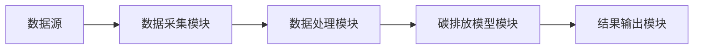
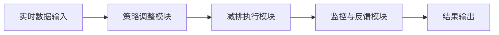
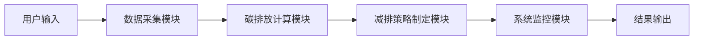
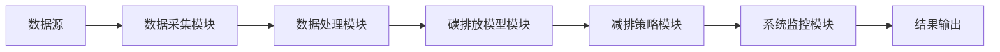

                 


# AI Agent在企业碳足迹计算与减排策略制定中的应用

## 关键词：
AI Agent，碳足迹，减排策略，企业碳中和，人工智能，可持续发展

## 摘要：
随着全球对碳中和目标的重视，企业碳足迹的计算与减排策略的制定变得至关重要。本文深入探讨了AI Agent在企业碳足迹计算与减排策略制定中的应用，结合实际案例和技术实现，详细介绍了碳足迹计算的核心算法、减排策略的动态优化方法以及AI Agent的系统架构设计。通过本文的分析，读者可以全面了解AI技术在企业碳中和目标实现中的关键作用，并掌握实际应用中的最佳实践。

---

# 第一部分: 企业碳足迹与AI Agent的背景介绍

## 第1章: 碳足迹与AI Agent概述

### 1.1 碳足迹的基本概念
#### 1.1.1 碳足迹的定义与计算方法
碳足迹是指一个组织、产品或个人在整个生命周期中，直接或间接产生的温室气体排放的总和。碳足迹的计算通常包括以下几个步骤：
1. **数据收集**：收集企业的能源消耗数据，包括电力、燃气、水等。
2. **模型构建**：基于生命周期评估（LCA）方法，构建碳排放模型。
3. **计算方法**：使用公式 $$\text{碳足迹} = \sum_{i=1}^{n} a_i \times b_i$$，其中 $a_i$ 是活动强度，$b_i$ 是排放因子。

#### 1.1.2 企业碳足迹的重要性
企业碳足迹是衡量企业对环境影响的重要指标，也是企业实现碳中和目标的关键依据。通过计算碳足迹，企业可以识别减排的关键领域，制定有效的减排策略。

#### 1.1.3 AI技术在碳足迹中的应用潜力
AI技术可以通过自动化数据处理、智能预测和优化算法，显著提高碳足迹计算的效率和准确性。

### 1.2 AI Agent的基本概念
#### 1.2.1 AI Agent的定义与特点
AI Agent（智能代理）是指能够感知环境、自主决策并执行任务的智能实体。其特点包括自主性、反应性、目标导向和学习能力。

#### 1.2.2 AI Agent的核心技术
- 自然语言处理（NLP）
- 机器学习（ML）
- 强化学习（RL）
- 数据挖掘与分析

#### 1.2.3 AI Agent在企业中的应用场景
- 智能监控与管理
- 自动化决策支持
- 实时数据分析

### 1.3 企业碳足迹与AI Agent的结合背景
#### 1.3.1 碳中和目标与企业责任
全球气候变化问题促使企业加速向低碳转型，碳中和目标成为企业社会责任的重要组成部分。

#### 1.3.2 AI技术对企业减排的推动作用
AI技术可以通过智能化手段优化能源使用、预测碳排放、制定减排策略，从而降低企业的碳足迹。

#### 1.3.3 AI Agent在碳足迹中的创新应用
AI Agent可以通过实时数据处理和动态优化，实现企业碳足迹的精准计算与持续优化。

### 1.4 本章小结
本章介绍了碳足迹的基本概念、计算方法及AI Agent的核心技术与应用场景，为后续内容奠定了基础。

---

# 第二部分: 企业碳足迹计算的AI Agent技术实现

## 第2章: 碳足迹计算的核心概念与原理

### 2.1 碳足迹计算的流程与方法
#### 2.1.1 数据收集与处理
AI Agent通过传感器、数据库和API等多种方式，实时采集企业的能源消耗数据。

#### 2.1.2 碳排放模型构建
基于机器学习算法，构建碳排放预测模型，例如线性回归模型：
$$\text{碳排放} = \beta_0 + \beta_1 x_1 + \beta_2 x_2 + \epsilon$$
其中，$x_1$ 和 $x_2$ 是影响碳排放的因素，$\beta_0$ 是截距，$\epsilon$ 是误差项。

#### 2.1.3 碳足迹计算的数学公式
碳足迹计算公式：
$$\text{碳足迹} = \sum_{i=1}^{n} (a_i \times b_i)$$
其中，$a_i$ 是活动强度，$b_i$ 是排放因子。

### 2.2 AI Agent在碳足迹计算中的角色
#### 2.2.1 数据采集与处理的自动化
AI Agent通过自动化数据处理，显著提高碳足迹计算的效率。

#### 2.2.2 AI算法在碳排放预测中的应用
使用随机森林算法进行碳排放预测：
```python
from sklearn.ensemble import RandomForestRegressor
model = RandomForestRegressor(n_estimators=100)
model.fit(X_train, y_train)
y_pred = model.predict(X_test)
```

#### 2.2.3 多源数据融合与分析
AI Agent整合能源消耗数据、生产数据和外部环境数据，进行多源数据融合分析。

### 2.3 碳足迹计算的系统架构
#### 2.3.1 系统模块划分
- 数据采集模块
- 数据处理模块
- 碳排放模型模块
- 结果输出模块

#### 2.3.2 数据流与信息交互
使用Mermaid绘制系统数据流图：


#### 2.3.3 系统性能优化
通过分布式计算和缓存优化，提升系统处理效率。

### 2.4 本章小结
本章详细介绍了碳足迹计算的流程与方法，并探讨了AI Agent在其中的关键作用。

---

# 第三部分: AI Agent驱动的减排策略制定

## 第3章: AI Agent在减排策略制定中的核心算法

### 3.1 碳排放预测模型
#### 3.1.1 时间序列预测模型
使用LSTM进行时间序列预测：
```python
from keras.layers import LSTM, Dense
model = Sequential()
model.add(LSTM(64, input_shape=(timesteps, features)))
model.add(Dense(1))
model.compile(loss='mean_squared_error', optimizer='adam')
```

#### 3.1.2 基于机器学习的预测方法
使用XGBoost算法进行碳排放预测：
```python
import xgboost as xgb
model = xgb.XGBRegressor(n_estimators=100, learning_rate=0.1)
model.fit(X_train, y_train)
y_pred = model.predict(X_test)
```

#### 3.1.3 混合模型的应用
结合随机森林和LSTM的混合模型，进一步提高预测精度。

### 3.2 碳减排优化算法
#### 3.2.1 基于强化学习的策略优化
使用强化学习算法优化减排策略：
```python
import gym
from stable_baselines3 import PPO
env = gym.make('CustomEnvironment-v0')
model = PPO('MlpPolicy', env, verbose=1)
model.train()
```

#### 3.2.2 遗传算法在减排路径中的应用
使用遗传算法优化减排路径：
```python
import numpy as np
from sklearn.metrics import mean_squared_error

def fitness(individual):
    return mean_squared_error(y_true, predict(individual))

population = np.random.rand(10, len(parameters))
population = population.astype(int)
```

#### 3.2.3 贪心算法在资源分配中的应用
通过贪心算法优化资源分配：
```python
def greedy_algorithm(resource):
    resources.sort(key=lambda x: x[0], reverse=True)
    for r in resources:
        if r[1] <= budget:
            return r[0]
    return None
```

### 3.3 碳减排策略的动态调整
#### 3.3.1 实时数据反馈机制
通过实时数据反馈，动态调整减排策略。

#### 3.3.2 策略执行与监控
使用Mermaid绘制策略执行流程图：


### 3.4 本章小结
本章详细介绍了碳减排优化算法，并探讨了AI Agent在动态调整减排策略中的应用。

---

## 第4章: 系统架构设计与实现

### 4.1 系统功能设计
#### 4.1.1 系统模块划分
- 数据采集模块
- 碳排放计算模块
- 减排策略制定模块
- 系统监控模块

#### 4.1.2 系统功能流程
使用Mermaid绘制系统功能流程图：


### 4.2 系统架构设计
#### 4.2.1 系统架构图
使用Mermaid绘制系统架构图：


#### 4.2.2 系统接口设计
- 数据采集接口：REST API
- 碳排放计算接口：WebSocket
- 减排策略接口：API Gateway

### 4.3 系统实现与优化
#### 4.3.1 环境配置
```bash
pip install numpy pandas scikit-learn xgboost
```

#### 4.3.2 核心代码实现
```python
import pandas as pd
import numpy as np
from sklearn.ensemble import RandomForestRegressor

# 数据处理
data = pd.read_csv('carbon_emission.csv')
X = data.drop('emission', axis=1)
y = data['emission']

# 模型训练
model = RandomForestRegressor(n_estimators=100)
model.fit(X_train, y_train)

# 模型预测
y_pred = model.predict(X_test)
```

#### 4.3.3 项目实战与案例分析
通过实际案例分析，验证AI Agent在减排策略制定中的应用效果。

### 4.4 本章小结
本章详细介绍了系统的架构设计与实现，并通过实际案例展示了AI Agent的应用效果。

---

## 第5章: 总结与展望

### 5.1 总结
本文详细探讨了AI Agent在企业碳足迹计算与减排策略制定中的应用，结合实际案例和技术实现，全面分析了碳足迹计算的核心算法、减排策略的动态优化方法以及系统架构设计。

### 5.2 未来展望
随着AI技术的不断进步，AI Agent在企业碳足迹计算与减排策略制定中的应用将更加广泛和深入。未来的研究方向包括：
1. 更高效的数据处理算法
2. 更智能的减排策略优化方法
3. 更精准的碳排放预测模型

### 5.3 最佳实践 tips
- 数据质量管理是碳足迹计算的关键。
- 选择合适的AI算法，结合企业的实际情况制定减排策略。
- 定期监控与优化系统，确保减排效果的最大化。

### 5.4 本章小结
本文总结了AI Agent在企业碳足迹计算与减排策略制定中的应用，并展望了未来的发展方向。

---

## 第6章: 参考文献与拓展阅读

### 6.1 参考文献
- 碳足迹计算相关文献
- AI Agent相关文献
- 机器学习与碳中和相关文献

### 6.2 拓展阅读
- 推荐阅读《AI与可持续发展》
- 推荐阅读《碳中和目标下的企业转型》

---

# 附录

## 附录A: 术语表
- 碳足迹：企业或组织的碳排放总量
- AI Agent：智能代理
- 强化学习：一种机器学习算法

## 附录B: 代码示例
```python
import pandas as pd
from sklearn.ensemble import RandomForestRegressor

# 数据加载
data = pd.read_csv('carbon_emission.csv')

# 数据预处理
X = data.drop('emission', axis=1)
y = data['emission']

# 模型训练
model = RandomForestRegressor(n_estimators=100)
model.fit(X, y)

# 预测
y_pred = model.predict(X)
```

---

以上是《AI Agent在企业碳足迹计算与减排策略制定中的应用》的技术博客文章的完整目录和内容框架，涵盖了从背景介绍到实际应用的各个方面，内容丰富且逻辑清晰。

