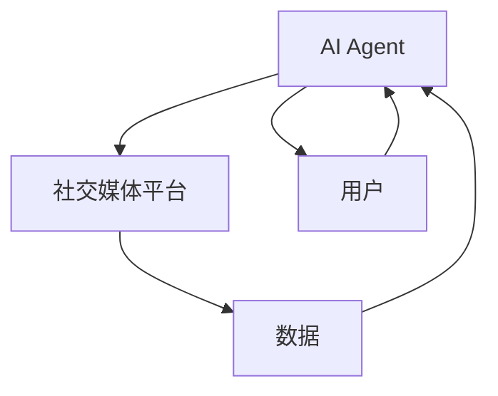
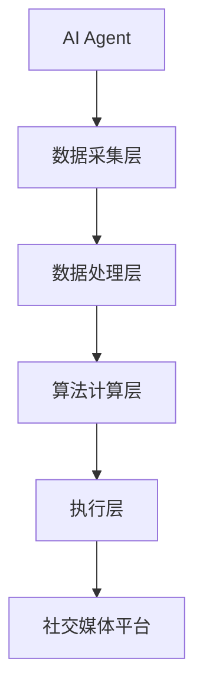
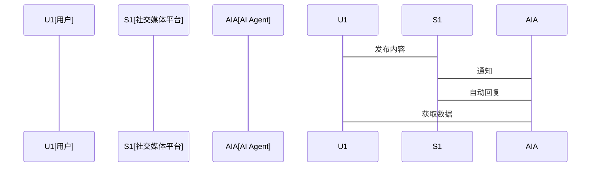

                 


# AI Agent在企业社交媒体管理中的应用

> 关键词：AI Agent, 企业社交媒体管理, 算法原理, 系统架构, 项目实战

> 摘要：本文探讨AI Agent在企业社交媒体管理中的应用，从背景介绍、核心概念、算法原理到系统架构、项目实战，全面解析如何利用AI Agent优化企业社交媒体管理流程，提升效率与决策能力。

---

## 第一章: AI Agent的基本概念与背景

### 1.1 AI Agent的定义与特点

AI Agent（人工智能代理）是一种能够感知环境、自主决策并执行任务的智能体。它通过传感器获取信息，利用算法进行分析和推理，最终做出决策并执行操作。与传统软件不同，AI Agent具有以下特点：

- **自主性**：能够在没有人工干预的情况下独立运行。
- **反应性**：能够实时感知环境变化并做出反应。
- **学习能力**：通过数据和经验不断优化自身性能。
- **社交能力**：能够理解、生成和处理自然语言，与人类或其他系统进行交互。

### 1.2 企业社交媒体管理的现状与挑战

随着社交媒体的普及，企业社交媒体管理变得越来越复杂。传统的人工管理方式效率低下，难以应对海量信息和多样化的用户需求。主要挑战包括：

- **信息过载**：每天产生的海量信息需要快速筛选和处理。
- **用户多样性**：用户行为和需求多样化，难以统一管理。
- **实时性要求**：社交媒体上的信息需要实时响应，否则可能会错失最佳时机。
- **数据孤岛**：不同社交媒体平台之间的数据难以整合和利用。

### 1.3 AI Agent在社交媒体管理中的优势

AI Agent能够有效解决传统社交媒体管理的诸多问题。其优势包括：

- **自动化处理**：能够自动监测、分析和响应社交媒体上的信息，大幅提高效率。
- **精准决策**：通过大数据分析和机器学习算法，能够做出更精准的决策。
- **7x24小时运行**：AI Agent可以全天候运行，确保社交媒体的实时监控和管理。
- **智能交互**：能够理解用户需求，生成个性化的回复和内容，提升用户体验。

---

## 第二章: AI Agent的核心概念与联系

### 2.1 AI Agent的核心概念

AI Agent在企业社交媒体管理中的核心概念包括以下几个方面：

#### 2.1.1 感知层：数据采集与处理

AI Agent通过多种传感器（如API接口、网络爬虫等）采集社交媒体上的数据，包括文本、图片、视频等。这些数据需要经过预处理、清洗和特征提取，以便后续分析和决策。

#### 2.1.2 决策层：策略制定与优化

在感知到信息后，AI Agent需要根据预设的策略或动态学习的模型进行决策。决策层的核心是算法，包括分类、回归、聚类等机器学习算法，以及强化学习等高级算法。

#### 2.1.3 执行层：操作与反馈

根据决策结果，AI Agent会执行相应的操作，如发布微博、回复评论、调整广告投放等。同时，AI Agent还会收集执行结果的反馈信息，用于优化自身的算法和策略。

### 2.2 AI Agent的核心属性对比表

以下是AI Agent与传统软件在社交媒体管理中的核心属性对比：

| 属性         | AI Agent                      | 传统软件                     |
|--------------|-------------------------------|------------------------------|
| 自主性         | 高                            | 低                            |
| 反应能力       | 强                            | 弱                            |
| 学习能力       | 有                            | 无                            |
| 交互能力       | 强                            | 弱                            |

### 2.3 AI Agent的实体关系图

以下是AI Agent在企业社交媒体管理中的实体关系图（使用Mermaid）：



---

## 第三章: AI Agent的算法原理与数学模型

### 3.1 感知算法概述

AI Agent的感知算法主要用于数据的采集、清洗和特征提取。常见的感知算法包括：

- **文本分类**：用于识别文本的情感倾向。
- **自然语言处理**：用于理解和生成人类语言。
- **图像识别**：用于识别社交媒体上的图片内容。

#### 3.1.1 感知模型的数学表达式

文本分类的常用算法是朴素贝叶斯分类器，其数学表达式如下：

$$
P(y|x) = \frac{P(x|y)P(y)}{P(x)}
$$

其中：
- $P(y|x)$ 是在给定特征$x$的情况下，类别$y$的后验概率。
- $P(x|y)$ 是在类别$y$的情况下，特征$x$的条件概率。
- $P(y)$ 是类别$y$的先验概率。
- $P(x)$ 是特征$x$的全概率。

### 3.2 决策算法概述

AI Agent的决策算法主要用于根据感知到的信息做出最优决策。常见的决策算法包括：

- **强化学习**：通过试错的方式优化决策策略。
- **决策树**：通过树状结构进行分类和回归。
- **随机森林**：通过集成学习提高决策的准确性。

#### 3.2.1 决策模型的数学表达式

强化学习的Q-learning算法的数学表达式如下：

$$
Q(s, a) = Q(s, a) + \alpha [r + \gamma \max Q(s', a') - Q(s, a)]
$$

其中：
- $Q(s, a)$ 是当前状态$s$和动作$a$的Q值。
- $\alpha$ 是学习率。
- $r$ 是奖励。
- $\gamma$ 是折扣因子。
- $Q(s', a')$ 是下一个状态$s'$和动作$a'$的Q值。

---

## 第四章: AI Agent的系统架构与设计

### 4.1 系统架构设计

AI Agent的系统架构设计需要考虑以下几个方面：

- **数据采集层**：负责从社交媒体平台采集数据。
- **数据处理层**：对数据进行清洗、转换和特征提取。
- **算法计算层**：负责数据的分析和决策。
- **执行层**：根据决策结果执行相应的操作。

以下是系统架构设计的Mermaid图：



### 4.2 接口设计与交互

AI Agent需要与社交媒体平台、用户和其他系统进行交互。以下是接口设计的Mermaid序列图：



---

## 第五章: AI Agent的项目实战

### 5.1 环境安装与配置

要实现一个简单的AI Agent，首先需要安装以下工具：

- **Python**：用于开发和运行代码。
- **TensorFlow** 或 **Keras**：用于机器学习模型的训练。
- **Twitter API**：用于与社交媒体平台交互。

### 5.2 核心代码实现

以下是一个简单的AI Agent代码示例，用于自动回复社交媒体上的评论：

```python
import tweepy
from textblob import TextBlob

# 初始化API
auth = tweepy.OAuthHandler(consumer_key, consumer_secret)
api = tweepy.API(auth)

# 自动回复评论
def auto_reply():
    # 获取最新评论
    comments = tweepy.Cursor(api.search(q="example", rpp=100)).items(10)
    for comment in comments:
        # 分析情感
        blob = TextBlob(comment.text)
        sentiment = blob.sentiment.polarity
        if sentiment > 0:
            reply = "感谢您的正面评价！😊"
        elif sentiment < 0:
            reply = "我们注意到您的反馈，会尽快改进。🙏"
        else:
            reply = "谢谢您的关注！😊"
        # 发送回复
        api.update_status(reply, comment.id)

auto_reply()
```

### 5.3 实际案例分析

假设某企业希望自动回复社交媒体上的用户评论，可以通过上述代码实现。首先，企业需要获取社交媒体平台的API密钥，然后部署代码到服务器上。AI Agent会自动监测评论，并根据情感分析结果发送相应的回复。

---

## 第六章: 总结与展望

### 6.1 本章小结

本文详细介绍了AI Agent在企业社交媒体管理中的应用，从核心概念到算法原理，再到系统架构和项目实战，全面解析了AI Agent的优势和实现过程。通过AI Agent，企业可以显著提高社交媒体管理的效率和精准度。

### 6.2 注意事项

在实际应用中，需要注意以下几点：

- 数据隐私保护：确保用户数据的安全性和隐私性。
- 算法的可解释性：确保AI Agent的决策过程透明可追溯。
- 系统的稳定性：确保AI Agent能够稳定运行，避免因系统故障导致社交媒体管理中断。

### 6.3 拓展阅读

对于感兴趣的朋友，可以进一步阅读以下书籍和论文：

- 《机器学习实战》
- 《深度学习》
- 《强化学习：理论与应用》

---

以上就是《AI Agent在企业社交媒体管理中的应用》的完整内容。通过本文的分析，您可以看到AI Agent在企业社交媒体管理中的巨大潜力和广泛应用前景。希望本文对您有所帮助！

