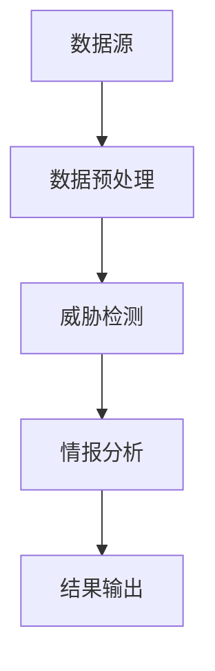
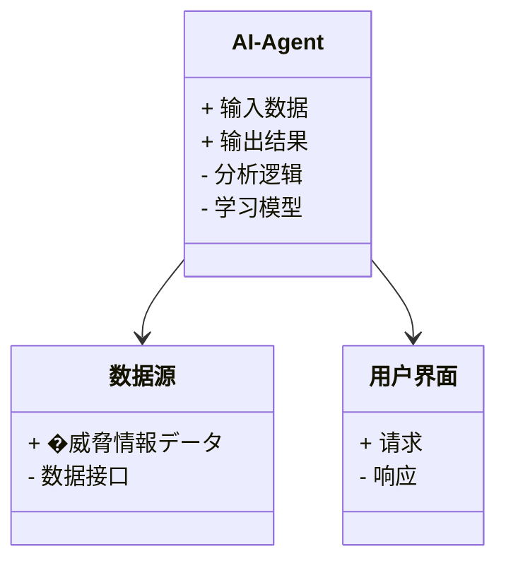

                 


# AI Agent在企业网络安全威胁情报分析中的应用

## 关键词：
- AI Agent
- 企业网络安全
- 威胁情报分析
- 自然语言处理
- 机器学习
- 图神经网络
- 知识图谱

## 摘要：
本文深入探讨了AI Agent在企业网络安全威胁情报分析中的应用。首先介绍了AI Agent的基本概念及其在企业安全中的作用，然后详细分析了威胁情报分析的基础原理，包括数据收集、处理和分析的方法。接着，重点讲解了AI Agent的核心技术，如自然语言处理、机器学习和图神经网络，并通过实际案例展示了这些技术在威胁情报分析中的应用。最后，本文还探讨了基于AI Agent的威胁情报分析系统的架构设计、项目实战和最佳实践，为读者提供了全面的理论和技术指导。

---

# 第1章: AI Agent与企业网络安全威胁情报分析概述

## 1.1 AI Agent的基本概念

### 1.1.1 什么是AI Agent
AI Agent（人工智能代理）是一种能够感知环境并采取行动以实现目标的智能实体。在企业网络安全领域，AI Agent通常用于自动化威胁检测、响应和情报分析。

### 1.1.2 AI Agent的核心特征
- **自主性**：能够在没有人工干预的情况下执行任务。
- **反应性**：能够实时感知环境变化并做出响应。
- **学习能力**：通过机器学习算法不断优化自身的分析能力。
- **协作性**：能够与其他系统或AI Agent协同工作。

### 1.1.3 AI Agent在企业安全中的作用
- 提高威胁检测的准确性。
- 实现威胁情报的自动化处理。
- 降低人工分析的成本。

## 1.2 企业网络安全威胁情报分析的背景

### 1.2.1 网络安全威胁的现状
- 随着企业数字化转型的推进，网络安全威胁日益复杂。
- 威胁来源多样化，包括恶意软件、钓鱼攻击、数据泄露等。

### 1.2.2 威胁情报分析的重要性
- 帮助企业及时发现潜在威胁。
- 通过分析历史威胁数据，预测未来可能的攻击行为。

### 1.2.3 传统威胁情报分析的局限性
- 依赖人工分析，效率低下。
- 需要大量专业人员，成本高昂。
- 面对新型威胁时，难以快速响应。

## 1.3 AI Agent在威胁情报分析中的优势

### 1.3.1 提高威胁检测的准确性
- 利用机器学习算法，AI Agent能够从海量数据中发现异常模式。

### 1.3.2 实现威胁情报的自动化处理
- AI Agent可以自动收集、分析和报告威胁情报，减少人工干预。

### 1.3.3 降低人工分析的成本
- 通过自动化处理，AI Agent显著降低了威胁情报分析的人力成本。

## 1.4 本章小结
本章介绍了AI Agent的基本概念及其在企业安全中的作用，分析了威胁情报分析的背景和传统方法的局限性，最后总结了AI Agent在威胁情报分析中的优势。

---

# 第2章: 威胁情报分析的基本原理

## 2.1 �威脅情報の定義と分類

### 2.1.1 什么是威脅情報
威脅情報是指与网络安全威胁相关的信息，包括攻击手法、漏洞信息、恶意代码特征等。

### 2.1.2 威脅情報の分類
- **基于来源**：内部威胁、外部威胁。
- **基于类型**：恶意软件、网络攻击、数据泄露。
- **基于严重性**：高危、中危、低危。

### 2.1.3 威脅情報の生命周期
- 数据收集：从各种来源获取威胁数据。
- 数据处理：清洗、转换、 enrichment。
- 数据分析：使用机器学习、NLP等技术进行分析。
- 结果输出：生成威胁报告和预警。

## 2.2 威脅情報分析の方法

### 2.2.1 基于特征の分析方法
- 基于特征的分析方法依赖于已知的威胁特征，例如恶意代码的特征码。

### 2.2.2 基于行動の分析方法
- 基于行为的分析方法通过监控系统行为，发现异常活动。

### 2.2.3 基于知識図spectumの分析方法
- 基于知识图谱的分析方法利用图结构数据，发现复杂的威胁关系。

## 2.3 威脅情報分析のツールと技術

### 2.3.1 数据收集ツール
- SIEM（安全信息和事件管理）系统：Splunk、QRadar。
- API数据源：API接口获取第三方威胁数据。

### 2.3.2 数据分析ツール
- 机器学习框架：TensorFlow、PyTorch。
- 自然语言处理工具：spaCy、NLTK。

### 2.3.3 可視化ツール
- 可视化平台：Tableau、Power BI。
- 图谱分析工具：Neo4j、Gephi。

## 2.4 本章小结
本章详细介绍了威胁情报的定义、分类和生命周期，分析了基于特征、行为和知识图谱的三种威胁情报分析方法，并列举了常用的工具和技术。

---

# 第3章: AI Agent的核心技术与实现原理

## 3.1 自然语言处理技术

### 3.1.1 NLPの基本概念
- 自然语言处理（NLP）是研究如何让计算机理解和生成人类语言的学科。

### 3.1.2 基于深度学习のNLPモデル
- 常见的深度学习模型包括RNN、LSTM、Transformer等。

### 3.1.3 NLP在威胁情报分析中的应用
- 文本分类：识别恶意邮件。
- 实体识别：提取威胁相关实体。

### 3.1.4 Python代码示例：文本分类
```python
import tensorflow as tf
from tensorflow.keras import layers

model = tf.keras.Sequential([
    layers.Embedding(10000, 16),
    layers.Dropout(0.5),
    layers.Conv1D(32, 5, activation='relu'),
    layers.MaxPooling1D(4),
    layers.Flatten(),
    layers.Dense(1, activation='sigmoid')
])
```

## 3.2 机器学习算法

### 3.2.1 机器学习の基本原理
- 机器学习算法通过训练数据学习模式，用于预测或分类。

### 3.2.2 常见の机器学习アルゴリズム
- 监督学习：随机森林、支持向量机（SVM）。
- 无监督学习：聚类、主成分分析（PCA）。

### 3.2.3 机器学习在威胁检测中的应用
- 异常检测：使用聚类算法识别异常行为。

### 3.2.4 Python代码示例：异常检测
```python
from sklearn.ensemble import IsolationForest

clf = IsolationForest(random_state=42)
clf.fit(X_train)
```

## 3.3 图神经网络

### 3.3.1 图神經ネットワークの基本概念
- 图神经网络是一种处理图结构数据的深度学习模型。

### 3.3.2 图神經ネットワークの実現原理
- 节点表示：通过聚合邻居节点的信息生成节点表示。
- 图传播：通过消息传递机制在图中传播信息。

### 3.3.3 图神經ネットワーク在威胁情报分析中的应用
- 建模威胁关系：通过图结构发现威胁之间的关联。

### 3.3.4 Python代码示例：图神经网络
```python
import tensorflow as tf
from tensorflow.keras import layers

class GraphConvolution(layers.Layer):
    def __init__(self, input_dim, output_dim):
        super(GraphConvolution, self).__init__()
        self.W = tf.keras.layers.Dense(output_dim, use_bias=False)
        self.b = tf.keras.layers.Dense(output_dim)
    
    def call(self, inputs, training=None):
        x = inputs[0]
        A = inputs[1]
        x = tf.matmul(A, x)
        x = self.W(x) + self.b(x)
        return x
```

## 3.4 本章小结
本章详细介绍了AI Agent的核心技术，包括自然语言处理、机器学习和图神经网络，并通过代码示例展示了这些技术在威胁情报分析中的应用。

---

# 第4章: 基于AI Agent的威胁情报分析系统架构设计

## 4.1 系统功能设计

### 4.1.1 系统架构MERMAID图


### 4.1.2 系统功能模块
- 数据预处理：清洗和转换数据。
- 威胁检测：使用AI Agent检测潜在威胁。
- 情报分析：生成威胁报告和预警。

## 4.2 系统架构设计

### 4.2.1 系统架构MERMAID图


### 4.2.2 接口设计
- 数据接口：与SIEM系统对接。
- 用户接口：提供API供其他系统调用。

## 4.3 本章小结
本章设计了基于AI Agent的威胁情报分析系统的架构，包括功能模块、系统架构和接口设计。

---

# 第5章: 项目实战——基于AI Agent的威胁情报分析系统实现

## 5.1 项目环境搭建

### 5.1.1 安装必要的库
```bash
pip install tensorflow numpy scikit-learn networkx
```

## 5.2 系统核心实现

### 5.2.1 数据预处理
```python
import pandas as pd

data = pd.read_csv('threat_data.csv')
data = data.dropna()
```

### 5.2.2 威胁检测模型训练
```python
from sklearn.model

