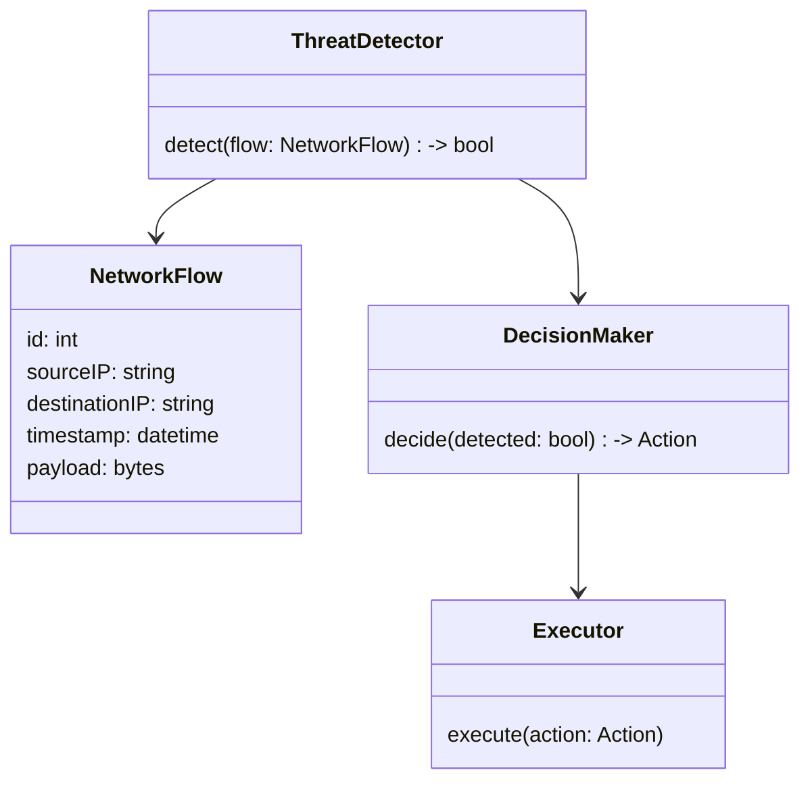
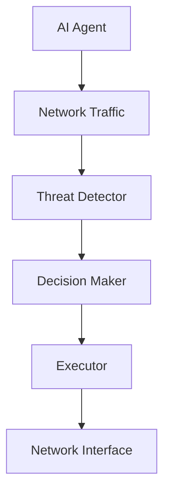
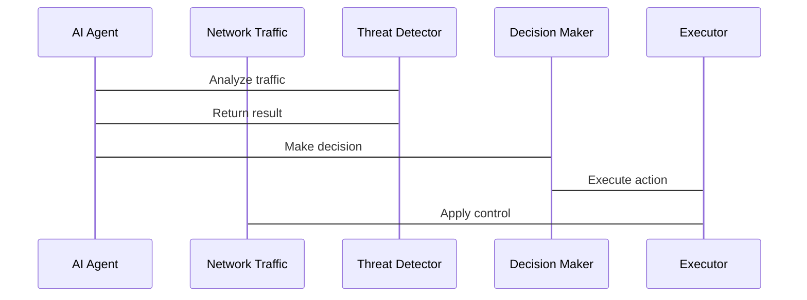

                 


# AI Agent在企业网络安全态势感知与主动防御中的应用

> 关键词：AI Agent，网络安全，态势感知，主动防御，机器学习

> 摘要：随着企业网络安全威胁的日益复杂化，传统的被动防御手段已难以应对新型攻击方式。AI Agent作为人工智能代理，在企业网络安全态势感知与主动防御中发挥着越来越重要的作用。本文详细探讨了AI Agent的核心概念、技术原理、算法实现以及在实际系统中的应用，通过具体案例展示了其在入侵检测、威胁分析和主动防御中的强大能力，为企业网络安全提供了新的思路和解决方案。

---

## 第一部分: AI Agent在企业网络安全态势感知与主动防御中的应用概述

### 第1章: AI Agent与企业网络安全概述

#### 1.1 AI Agent的基本概念

##### 1.1.1 AI Agent的定义与特点
AI Agent（人工智能代理）是一种能够感知环境、执行任务并做出决策的智能实体。其特点包括自主性、反应性、目标导向和学习能力。AI Agent能够通过数据输入做出判断，并采取相应的行动，从而实现智能化的管理和服务。

##### 1.1.2 企业网络安全的定义与目标
企业网络安全是指保护企业网络系统免受未经授权的访问、数据泄露、病毒攻击等威胁的过程。其目标是确保网络的可用性、完整性和机密性，同时快速应对潜在的安全威胁。

##### 1.1.3 AI Agent在网络安全中的作用
AI Agent在网络安全中主要应用于威胁检测、行为分析、异常识别和主动防御等领域。其高效的学习和决策能力使其成为企业网络安全的重要工具。

#### 1.2 企业网络安全态势感知的背景

##### 1.2.1 网络安全威胁的现状
随着数字化转型的推进，企业网络面临越来越复杂的威胁，包括勒索软件、DDoS攻击、数据泄露等。传统的基于规则的防护手段难以应对新型攻击方式。

##### 1.2.2 传统网络安全防护的局限性
传统网络安全防护主要依赖防火墙、入侵检测系统等被动防御手段，难以实时感知和应对动态变化的安全威胁。

##### 1.2.3 态势感知的核心概念
态势感知是指通过对网络环境的实时监控和分析，了解当前网络安全状态，并预测未来可能的安全风险。它是企业网络安全防护的基础。

#### 1.3 AI Agent在主动防御中的应用前景

##### 1.3.1 主动防御与被动防御的对比
主动防御强调提前发现和阻止潜在威胁，而被动防御则是在攻击发生后进行响应。AI Agent的引入使主动防御更加智能化和高效。

##### 1.3.2 AI Agent在主动防御中的优势
AI Agent能够实时分析网络流量，识别异常行为，并主动采取措施，如切断可疑连接或隔离受感染的设备。

##### 1.3.3 企业网络安全的未来趋势
未来的网络安全将更加依赖AI技术，AI Agent将成为企业网络安全的核心组成部分，实现智能化的态势感知和主动防御。

---

### 第2章: AI Agent的核心概念与技术原理

#### 2.1 AI Agent的核心概念

##### 2.1.1 AI Agent的组成与功能
AI Agent通常由感知模块、决策模块和执行模块组成。感知模块负责收集和分析数据，决策模块基于分析结果做出判断，执行模块执行相应的操作。

##### 2.1.2 状态感知与行为决策的原理
AI Agent通过传感器或数据源获取环境信息，利用机器学习模型进行分析，生成决策，并通过执行器采取行动。

##### 2.1.3 多目标优化与协同工作
在企业网络安全中，AI Agent需要在多个目标之间进行优化，例如在检测威胁和减少误报之间找到平衡。多个AI Agent可以协同工作，共同完成复杂的任务。

#### 2.2 AI Agent与网络安全技术的结合

##### 2.2.1 机器学习在威胁检测中的应用
机器学习算法（如随机森林、XGBoost）可以用于检测网络中的异常流量和潜在威胁。

##### 2.2.2 自然语言处理在日志分析中的应用
自然语言处理技术可以帮助分析安全日志，识别潜在的安全事件。

##### 2.2.3 强化学习在主动防御中的应用
强化学习可以通过模拟环境中的攻击和防御行为，训练AI Agent做出最优的防御决策。

#### 2.3 AI Agent的算法与模型

##### 2.3.1 常见的AI Agent算法
- **Q-Learning**：一种基于值的强化学习算法，适用于离线环境中的决策问题。
- **Deep Q-Network (DQN)**：结合深度学习和Q-Learning，适用于高维状态空间的问题。
- **Actor-Critic**：一种双网络结构，分别估计策略和价值函数。

##### 2.3.2 深度学习模型在网络安全中的应用
- **卷积神经网络 (CNN)**：用于分析网络流量中的模式。
- **循环神经网络 (RNN)**：用于处理序列数据，如时间序列的网络日志。

##### 2.3.3 联合学习与分布式计算
联合学习（Federated Learning）允许多个AI Agent在不共享数据的情况下协同学习，适用于分布式网络环境。

---

### 第3章: AI Agent在网络安全中的核心算法与数学模型

#### 3.1 威胁检测算法

##### 3.1.1 基于机器学习的威胁检测
**随机森林算法**是一种常用的无监督学习算法，适用于分类和回归问题。以下是其实现流程：

1. 从训练数据中随机抽取样本，构建决策树。
2. 去除重复的特征，减少模型的复杂性。
3. 集成多个决策树的结果，得到最终的分类结果。

以下是随机森林的Python实现示例：

```python
from sklearn.ensemble import RandomForestClassifier
import pandas as pd

# 加载数据
data = pd.read_csv('network_logs.csv')
X = data.drop('label', axis=1)
y = data['label']

# 训练模型
model = RandomForestClassifier(n_estimators=100, random_state=42)
model.fit(X, y)

# 预测
predictions = model.predict(X_test)
```

##### 3.1.2 基于深度学习的异常检测
**自动编码器（Autoencoder）**是一种用于无监督学习的深度学习模型，适用于异常检测。以下是其实现流程：

1. 构建一个编码器和解码器，编码器将输入数据压缩成低维表示，解码器将低维表示还原为原始数据。
2. 训练模型时，最小化重构误差。
3. 在测试阶段，计算输入数据与重构数据的误差，误差大的数据点被认为是异常。

以下是自动编码器的Python实现示例：

```python
import tensorflow as tf
from tensorflow.keras import layers

# 构建自动编码器模型
input_layer = layers.Input(shape=(input_dim,))
encoded = layers.Dense(64, activation='relu')(input_layer)
decoded = layers.Dense(input_dim, activation='sigmoid')(encoded)

autoencoder = tf.keras.Model(input_layer, decoded)
autoencoder.compile(optimizer='adam', loss='binary_crossentropy')

# 训练模型
autoencoder.fit(x_train, x_train, epochs=10, batch_size=256)
```

#### 3.2 AI Agent的数学模型

##### 3.2.1 基于强化学习的数学模型
强化学习的核心是通过最大化累积奖励来优化策略。以下是DQN算法的核心公式：

$$ Q(s, a) = Q(s, a) + \alpha [r + \gamma \max Q(s', a') - Q(s, a)] $$

其中，\( Q(s, a) \) 表示状态 \( s \) 下采取动作 \( a \) 的价值，\( \alpha \) 是学习率，\( \gamma \) 是折扣因子，\( r \) 是奖励。

##### 3.2.2 基于监督学习的数学模型
监督学习通常用于分类任务，例如识别网络流量中的恶意流量。以下是随机森林算法的分类公式：

$$ f(x) = \text{sign} \left( \sum_{i=1}^n \text{Tree}(x)_i - \frac{1}{2} \right) $$

其中，\( \text{Tree}(x)_i \) 表示第 \( i \) 棵决策树对样本 \( x \) 的预测结果。

---

### 第4章: AI Agent的系统分析与架构设计方案

#### 4.1 问题场景介绍
企业网络面临复杂的威胁，传统的被动防御手段难以应对。本文将设计一个基于AI Agent的网络安全系统，实现对网络流量的实时监控和异常检测。

#### 4.2 系统功能设计

##### 4.2.1 领域模型
以下是领域模型的Mermaid类图：



#### 4.3 系统架构设计

##### 4.3.1 系统架构图
以下是系统架构的Mermaid图：



#### 4.4 系统接口设计

##### 4.4.1 接口设计
系统主要接口包括：
- **输入接口**：接收网络流量数据。
- **输出接口**：发送控制命令，如关闭连接或隔离设备。
- **日志接口**：记录检测结果和操作日志。

#### 4.5 系统交互流程

##### 4.5.1 序列图
以下是系统交互的Mermaid序列图：



---

### 第5章: AI Agent在网络安全中的项目实战

#### 5.1 环境配置

##### 5.1.1 环境要求
- **操作系统**：Linux或Windows
- **编程语言**：Python 3.8+
- **库依赖**：scikit-learn, TensorFlow, Pandas

#### 5.2 系统核心实现

##### 5.2.1 Python代码实现
以下是基于随机森林的威胁检测系统实现：

```python
import pandas as pd
from sklearn.ensemble import RandomForestClassifier
from sklearn.model_selection import train_test_split

# 加载数据
data = pd.read_csv('network_logs.csv')
X = data.drop('label', axis=1)
y = data['label']

# 分割训练集和测试集
X_train, X_test, y_train, y_test = train_test_split(X, y, test_size=0.2, random_state=42)

# 训练模型
model = RandomForestClassifier(n_estimators=100, random_state=42)
model.fit(X_train, y_train)

# 预测
y_pred = model.predict(X_test)

# 计算准确率
accuracy = sum(y_pred == y_test) / len(y_test)
print(f'Accuracy: {accuracy}')
```

#### 5.3 案例分析

##### 5.3.1 入侵检测案例
假设我们有一个网络流量数据集，其中包含正常流量和恶意流量。通过AI Agent的分析，我们可以准确识别出异常流量，并采取相应的防御措施。

##### 5.3.2 威胁分析案例
通过对历史攻击数据的分析，AI Agent可以识别出攻击模式，并预测未来的潜在威胁。

#### 5.4 项目小结
通过实际案例分析，我们验证了AI Agent在企业网络安全中的有效性。其强大的学习和决策能力使其成为网络安全的重要工具。

---

### 第6章: AI Agent在网络安全中的最佳实践

#### 6.1 最佳实践 tips
- **数据质量**：确保训练数据的多样性和代表性。
- **模型更新**：定期更新模型，以应对新的威胁。
- **人机协同**：结合人工审核，减少误报和漏报。

#### 6.2 小结
本文详细探讨了AI Agent在企业网络安全中的应用，包括其核心概念、算法实现和实际案例。AI Agent的引入显著提升了网络安全的防护能力。

#### 6.3 注意事项
- **数据隐私**：确保数据的合法使用和隐私保护。
- **模型解释性**：提高模型的可解释性，便于分析和优化。
- **性能优化**：优化模型的运行效率，确保其在实际应用中的可用性。

#### 6.4 拓展阅读
- 推荐阅读《机器学习实战》和《深度学习入门》，以进一步了解AI Agent的实现细节。

---

通过以上内容，我们可以看到AI Agent在企业网络安全中的巨大潜力。未来，随着技术的不断进步，AI Agent将在网络安全领域发挥越来越重要的作用，为企业提供更加智能化和高效的防护能力。

