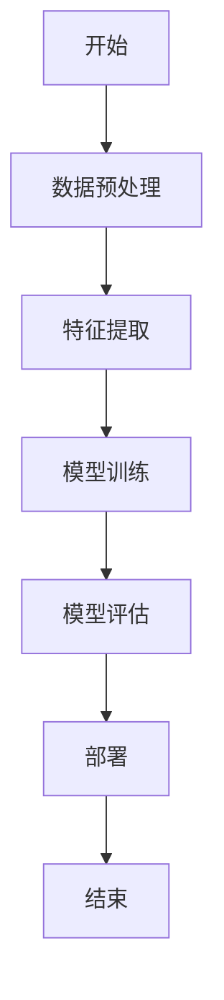
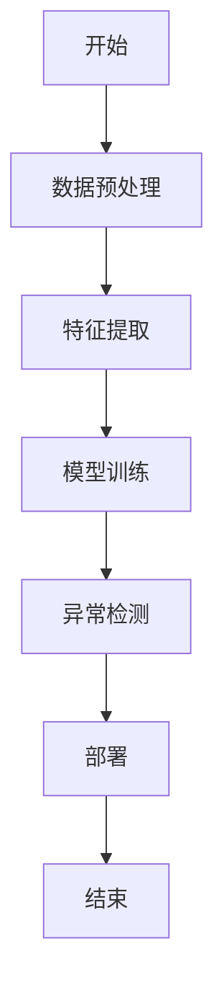
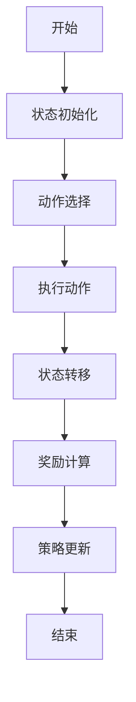
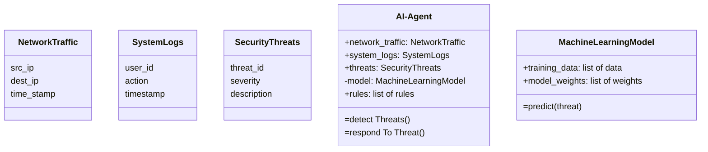
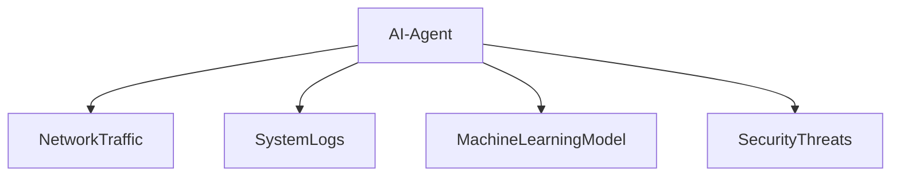
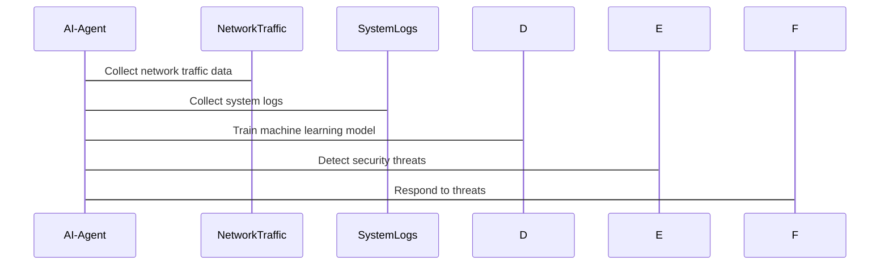

                 


# AI Agent在企业网络安全态势感知与威胁响应中的应用

> 关键词：AI Agent，网络安全，态势感知，威胁响应，机器学习，实时监控，自动化

> 摘要：  
随着企业网络环境的复杂化和网络攻击的智能化，传统的网络安全防护手段已难以应对日益复杂的威胁。本文深入探讨AI Agent（人工智能代理）在企业网络安全中的应用，重点分析其在态势感知与威胁响应中的作用。通过结合机器学习、大数据分析和自动化技术，AI Agent能够实现对网络威胁的实时感知、智能分析与自动响应，显著提升企业的网络安全防护能力。本文从背景、原理、算法、系统架构、实战案例等多个维度展开，全面解析AI Agent在企业网络安全中的潜力与价值。

---

## 第1章 背景介绍

### 1.1 问题背景

#### 1.1.1 企业网络安全面临的挑战
现代企业网络环境日益复杂，包含多种设备、系统和用户，这使得网络安全防护的难度大大增加。网络威胁呈现出多样化、智能化和隐蔽化的特点，传统的基于规则的防火墙和入侵检测系统难以应对高级持续性威胁（APT）和零日攻击。

#### 1.1.2 网络安全态势感知的重要性
网络安全态势感知是指对网络系统的安全状态进行全面感知、分析和预测。通过整合网络流量、日志、漏洞信息等多源数据，态势感知能够帮助企业及时发现潜在威胁，评估威胁的影响程度，并制定应对策略。

#### 1.1.3 AI Agent在网络安全中的作用
AI Agent（人工智能代理）是一种能够自主感知环境、分析问题并采取行动的智能系统。在网络安全领域，AI Agent可以通过机器学习、自然语言处理和强化学习等技术，实现对网络威胁的实时监测、智能分析与自动化响应。

### 1.2 问题描述

#### 1.2.1 网络威胁的多样性和复杂性
网络攻击者不断进化其攻击手段，从简单的病毒传播到复杂的社交工程攻击、无文件恶意软件和AI驱动的攻击。这些威胁对企业的数据安全、业务连续性和用户隐私构成了巨大挑战。

#### 1.2.2 现有网络安全解决方案的局限性
传统的网络安全工具依赖于预定义的规则和特征匹配，难以应对未知威胁和高级持续性威胁。此外，安全运维人员数量有限，难以应对海量的网络数据和复杂的安全事件。

#### 1.2.3 AI Agent在威胁响应中的应用前景
AI Agent能够通过机器学习模型实时分析网络流量、用户行为和系统日志，快速识别异常模式，并采取相应的防护措施。其自动化和智能化的特点，使其成为解决网络安全问题的重要工具。

### 1.3 问题解决

#### 1.3.1 AI Agent的核心功能与优势
AI Agent具备以下核心功能：  
1. **实时监测**：持续监控网络流量、日志和系统状态。  
2. **智能分析**：利用机器学习算法识别异常行为和潜在威胁。  
3. **自动化响应**：根据威胁严重性自动执行防护措施，如隔离设备、阻止恶意流量等。  
4. **自我学习**：通过反馈机制不断优化威胁检测和响应能力。

#### 1.3.2 网络安全态势感知与威胁响应的结合
态势感知提供全局视角，帮助企业在复杂环境下快速识别威胁；威胁响应则通过AI Agent实现自动化应对，缩短响应时间，降低损失。

#### 1.3.3 AI Agent在企业网络安全中的具体应用场景
1. **入侵检测与防御**：实时检测网络中的异常流量和潜在攻击。  
2. **用户行为分析**：识别异常用户行为，防范内部威胁。  
3. **漏洞管理**：自动发现和修复系统漏洞。  
4. **应急响应**：在发生安全事件时，快速启动应急响应机制。

### 1.4 边界与外延

#### 1.4.1 AI Agent的边界
AI Agent在网络安全中的应用范围包括网络流量分析、日志处理、威胁检测和响应，但其边界不包括物理安全、硬件防护和完全替代人类的安全运维工作。

#### 1.4.2 相关概念的区分与联系
- **AI Agent与传统安全工具**：AI Agent具备自主决策能力，而传统工具依赖于预定义规则。  
- **态势感知与威胁情报**：态势感知侧重于实时监测和分析，而威胁情报侧重于外部威胁信息的收集与共享。  
- **AI Agent与自动化工具**：AI Agent结合了自动化和智能分析能力，而传统自动化工具缺乏自主学习能力。

#### 1.4.3 企业网络安全中的其他技术与AI Agent的结合
- **零信任架构**：通过AI Agent实现基于上下文的访问控制。  
- **区块链技术**：结合AI Agent实现安全事件的不可篡改记录。  
- **物联网安全**：利用AI Agent保护物联网设备的安全。

### 1.5 核心概念与组成

#### 1.5.1 AI Agent的定义与核心要素
AI Agent是一种智能系统，具备以下核心要素：  
1. **感知能力**：通过传感器或API获取网络数据。  
2. **分析能力**：利用机器学习模型进行威胁检测。  
3. **决策能力**：基于分析结果采取相应的安全措施。  
4. **执行能力**：通过API或脚本实现自动化操作。

#### 1.5.2 网络安全态势感知的定义与实现
网络安全态势感知是通过整合多源数据，利用大数据分析和机器学习技术，对网络系统的安全状态进行全面感知和评估。

#### 1.5.3 威胁响应的定义与实现
威胁响应是指在检测到安全威胁后，通过自动化或人工干预的方式采取应对措施，以降低威胁的影响。

---

## 第2章 核心概念与联系

### 2.1 AI Agent的原理

#### 2.1.1 AI Agent的基本原理
AI Agent通过以下步骤实现网络安全功能：  
1. **数据采集**：收集网络流量、日志、系统状态等数据。  
2. **数据预处理**：清洗、标准化和特征提取。  
3. **模型训练**：利用机器学习算法训练威胁检测模型。  
4. **实时分析**：对实时数据进行分析，识别潜在威胁。  
5. **决策与响应**：根据分析结果采取相应的安全措施。

#### 2.1.2 知识表示与推理
知识表示通过符号逻辑或概率模型描述网络安全领域的知识，推理过程基于这些知识进行威胁判断。

#### 2.1.3 行为决策机制
AI Agent通过强化学习或基于规则的策略制定决策，选择最优的响应措施。

### 2.2 核心概念对比

#### 2.2.1 AI Agent与传统安全工具的对比
| **特性**       | **AI Agent**         | **传统安全工具**       |
|----------------|----------------------|-------------------------|
| 自主性         | 高                   | 低                     |
| 学习能力       | 强                   | 无                     |
| 响应速度       | 快                   | 慢                     |
| 适应性         | 强                   | 弱                     |

#### 2.2.2 不同AI Agent模型的对比
| **模型类型**     | **监督学习**         | **无监督学习**           | **强化学习**             |
|------------------|----------------------|--------------------------|--------------------------|
| 数据需求         | 标签数据             | 无标签数据               | 环境反馈                 |
| 适用场景         | 分类已知威胁         | 发现未知模式             | 动态调整策略             |
| 优势             | 准确性高             | 灵活性强                 | 自适应性好               |

#### 2.2.3 网络安全态势感知与传统监控的对比
| **特性**       | **态势感知**         | **传统监控**             |
|----------------|----------------------|--------------------------|
| 数据来源       | 多源数据             | 单一数据源               |
| 分析方法       | 大数据分析           | 简单规则匹配             |
| 响应能力       | 自动化响应           | 手动响应                 |
| 智能性           | 高                   | 低                     |

### 2.3 ER实体关系图

#### 2.3.1 实体关系图的绘制
```mermaid
er
actor: 用户
device: 设备
network: 网络
threat: �威 �胁
ai_agent: AI Agent
logs: 日志
rules: 规则
actions: 行动

actor --> device: 操作
device --> network: 连接
network --> threat: 暴露
ai_agent --> logs: 采集
ai_agent --> rules: 执行
ai_agent --> threat: 检测
threat --> actions: 触发
```

#### 2.3.2 关键实体的属性与关系
- **用户（actor）**：操作设备，触发网络流量。
- **设备（device）**：连接网络，产生日志。
- **网络（network）**：承载流量，暴露威胁。
- **威胁（threat）**：触发行动，被AI Agent检测。
- **AI Agent（ai_agent）**：采集日志，执行规则，检测威胁并触发行动。

---

## 第3章 算法原理讲解

### 3.1 AI Agent算法原理

#### 3.1.1 监督学习在AI Agent中的应用
监督学习用于分类已知威胁，例如通过训练好的分类器识别恶意流量。

#### 3.1.2 无监督学习在AI Agent中的应用
无监督学习用于发现未知威胁，例如通过聚类分析识别异常行为。

#### 3.1.3 强化学习在AI Agent中的应用
强化学习用于动态调整威胁响应策略，例如通过Q-learning算法优化响应决策。

### 3.2 算法流程图

#### 3.2.1 监督学习算法流程图


#### 3.2.2 无监督学习算法流程图


#### 3.2.3 强化学习算法流程图


### 3.3 算法实现

#### 3.3.1 监督学习实现
```python
import pandas as pd
from sklearn.model_selection import train_test_split
from sklearn.tree import DecisionTreeClassifier
from sklearn.metrics import accuracy_score

# 加载数据
data = pd.read_csv('network_logs.csv')
X = data.drop('label', axis=1)
y = data['label']

# 数据分割
X_train, X_test, y_train, y_test = train_test_split(X, y, test_size=0.2)

# 模型训练
model = DecisionTreeClassifier()
model.fit(X_train, y_train)

# 模型预测
y_pred = model.predict(X_test)

# 准确率计算
print("Accuracy:", accuracy_score(y_test, y_pred))
```

#### 3.3.2 无监督学习实现
```python
from sklearn.cluster import KMeans
from sklearn.preprocessing import StandardScaler

# 加载数据
data = pd.read_csv('network_logs.csv')

# 数据预处理
scaler = StandardScaler()
X = scaler.fit_transform(data.drop('label', axis=1))

# 模型训练
model = KMeans(n_clusters=2, random_state=0)
model.fit(X)

# 预测聚类
y_pred = model.predict(X)
```

#### 3.3.3 强化学习实现
```python
import numpy as np
from collections import defaultdict

# 状态空间
states = ['low', 'medium', 'high']

# 行动空间
actions = ['allow', 'block', ' Quarantine']

# Q-learning表格
Q = defaultdict(dict)
for state in states:
    Q[state] = {'allow': 0, 'block': 0, 'Quarantine': 0}

# 状态转移函数
def transition(state, action):
    if action == 'block':
        return 'low'
    elif action == 'Quarantine':
        return 'medium'
    else:
        return 'high'

# Q-learning算法
alpha = 0.1
gamma = 0.9

for episode in range(100):
    current_state = 'high'
    while current_state != 'low':
        action = max(Q[current_state], key=lambda k: Q[current_state][k])
        next_state = transition(current_state, action)
        reward = 1 if next_state == 'low' else -1
        Q[current_state][action] = Q[current_state][action] + alpha * (reward + gamma * max(Q[next_state].values()) - Q[current_state][action])
        current_state = next_state
```

---

## 第4章 系统分析与架构设计

### 4.1 问题场景介绍
企业需要实时监测网络流量，快速识别并响应安全威胁，降低数据泄露和业务中断的风险。

### 4.2 系统功能设计

#### 4.2.1 领域模型类图


### 4.3 系统架构设计

#### 4.3.1 系统架构图


#### 4.3.2 接口设计
- **API接口**：提供RESTful API用于数据采集和事件响应。
- **日志接口**：与企业日志系统对接，获取系统日志。
- **威胁数据库接口**：连接威胁情报数据库， enrich威胁信息。

#### 4.3.3 交互序列图


---

## 第5章 项目实战

### 5.1 环境安装

#### 5.1.1 安装Python和相关库
```bash
python --version
pip install scikit-learn
pip install pandas
pip install mermaid
```

#### 5.1.2 安装网络数据采集工具
```bash
sudo apt-get install tshark
pip install python-pcap
```

### 5.2 系统核心实现

#### 5.2.1 数据采集模块
```python
import pcap
from sklearn.model_selection import train_test_split
from sklearn.tree import DecisionTreeClassifier
from sklearn.metrics import accuracy_score

# 数据采集
pcap_reader = pcap.pcap()
for ts, buf in pcap_reader.capture('eth0'):
    packet = buf.decode('utf-8')
    process_packet(packet)
```

#### 5.2.2 威胁检测模块
```python
def detect_threats(data):
    model = DecisionTreeClassifier()
    model.fit(X_train, y_train)
    y_pred = model.predict(data)
    return y_pred
```

#### 5.2.3 威胁响应模块
```python
def respond_to_threat(threat_level):
    if threat_level == 'high':
        block_traffic()
    elif threat_level == 'medium':
        quarantine_device()
    else:
        log_alert()
```

### 5.3 案例分析

#### 5.3.1 数据采集与分析
通过对网络流量进行实时采集和分析，识别异常流量模式，发现潜在的DDoS攻击。

#### 5.3.2 威胁检测与响应
AI Agent检测到高危威胁后，自动执行阻断策略，隔离受感染设备，并触发应急响应流程。

---

## 第6章 总结与展望

### 6.1 最佳实践
- **数据质量**：确保训练数据的多样性和代表性。  
- **模型优化**：定期更新模型，适应新的威胁。  
- **人机协同**：AI Agent辅助人类安全专家，而非完全替代。

### 6.2 小结
AI Agent通过实时监测、智能分析和自动化响应，显著提升了企业网络安全的防护能力。其在态势感知与威胁响应中的应用为企业提供了更快、更智能的网络安全解决方案。

### 6.3 注意事项
- **数据隐私**：确保数据采集和处理符合相关法律法规。  
- **模型鲁棒性**：加强模型的抗干扰能力，避免误报和漏报。  
- **系统稳定性**：确保AI Agent系统的高可用性和容错能力。

### 6.4 拓展阅读
- 《机器学习在网络安全中的应用》  
- 《AI驱动的网络安全防护技术》  
- 《零信任架构与企业安全》

---

通过本文的详细分析，可以清晰地看到AI Agent在企业网络安全中的巨大潜力。未来，随着AI技术的不断进步，AI Agent将在网络安全领域发挥越来越重要的作用，为企业构建更加智能、高效的网络安全防护体系。

