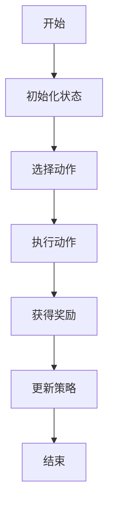
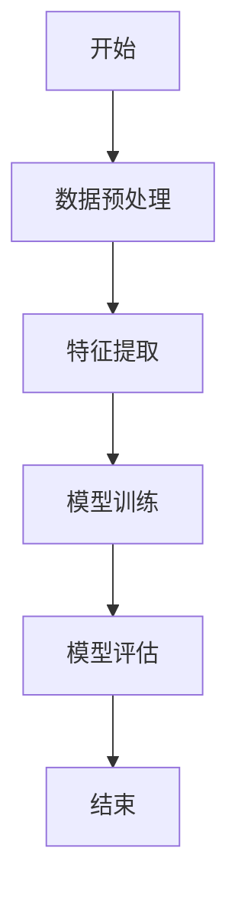
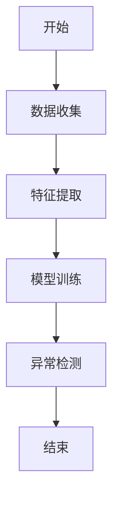
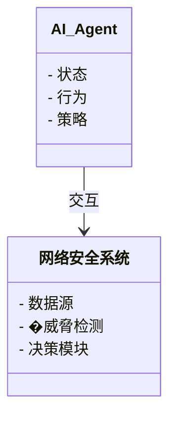
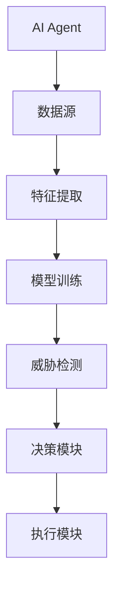
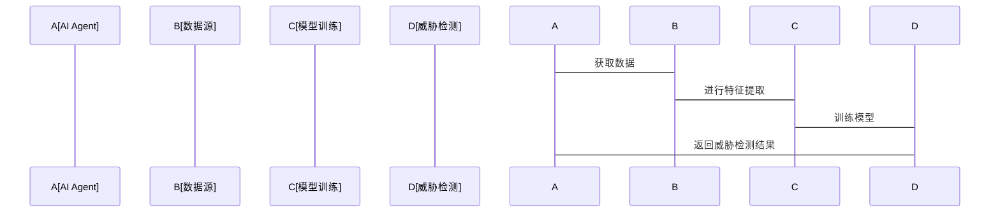
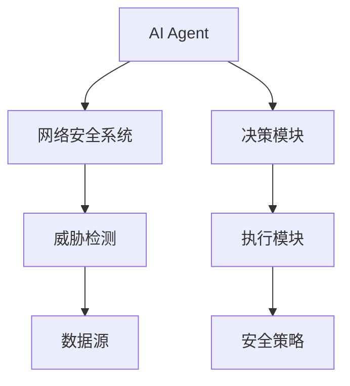
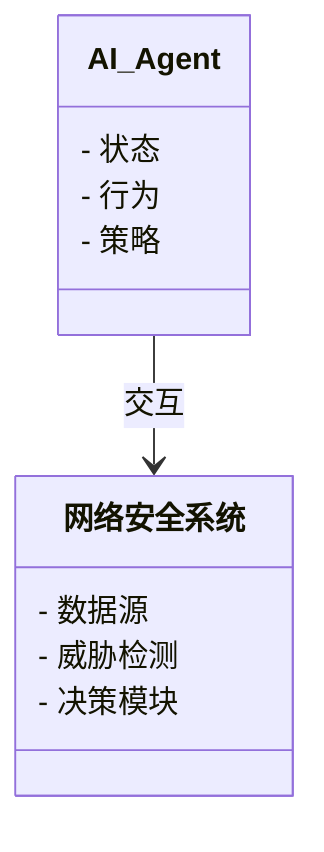

                 


# 第3章: 算法原理讲解

## 3.1 强化学习算法
### 3.1.1 基本原理
强化学习是一种机器学习范式，通过智能体与环境的交互，学习如何采取一系列行动以最大化累积奖励。在网络安全中，AI Agent可以使用强化学习来优化防御策略。

### 3.1.2 算法流程


### 3.1.3 Python代码实现
```python
import gym
import numpy as np

# 示例代码：强化学习在网络安全中的应用
env = gym.make('CartPole-v0')
np.random.seed(123)

# 初始化参数
theta = np.random.randn(4, 1) / np.sqrt(4)
theta_dot = np.zeros((4, 1))

# 定义策略函数
def policy_fn(state):
    action = np.argmax(np.dot(theta.T, state) + np.random.randn(1)*0.1)
    return action

# 训练过程
for episode in range(1000):
    state = env.reset()
    total_reward = 0
    while True:
        action = policy_fn(state)
        next_state, reward, done, _ = env.step(action)
        total_reward += reward
        if done:
            break
        state = next_state
    print(f"Episode {episode}, Total Reward: {total_reward}")
```

## 3.2 监督学习算法
### 3.2.1 基本原理
监督学习通过标记的数据训练模型，使其能够对新数据进行分类或回归。在网络安全中，监督学习常用于垃圾邮件检测和恶意软件分类。

### 3.2.2 算法流程


### 3.2.3 Python代码实现
```python
from sklearn.svm import SVC
from sklearn.metrics import accuracy_score

# 示例代码：监督学习在网络安全中的应用
X_train = [[...], [...], ...]  # 特征数据
y_train = [0, 1, 0, 1, ...]    # 标签

# 训练模型
model = SVC()
model.fit(X_train, y_train)

# 预测
X_test = [[...], [...], ...]
y_pred = model.predict(X_test)

# 计算准确率
accuracy = accuracy_score(y_test, y_pred)
print(f"Accuracy: {accuracy}")
```

## 3.3 无监督学习算法
### 3.3.1 基本原理
无监督学习通过数据内在结构发现隐藏模式。在网络安全中，无监督学习常用于异常检测和聚类分析。

### 3.3.2 算法流程


### 3.3.3 Python代码实现
```python
from sklearn.cluster import KMeans
from sklearn.preprocessing import StandardScaler

# 示例代码：无监督学习在网络安全中的应用
X = [[...], [...], ...]  # 特征数据

# 数据标准化
scaler = StandardScaler()
X_scaled = scaler.fit_transform(X)

# 训练模型
model = KMeans(n_clusters=2)
model.fit(X_scaled)

# 预测
y_pred = model.predict(X_scaled)
print(f"聚类结果: {y_pred}")
```

# 第4章: 系统分析与架构设计

## 4.1 问题场景介绍
企业网络安全需要实时监控和响应，AI Agent能够通过学习不断优化防御策略。

## 4.2 系统功能设计
### 4.2.1 领域模型


### 4.2.2 系统架构


### 4.2.3 接口设计
- 数据接口：API用于数据获取和处理
- 模型接口：API用于模型训练和部署
- 交互接口：API用于与其他系统和模块通信

### 4.2.4 交互序列图


# 第5章: 项目实战

## 5.1 环境配置
### 5.1.1 系统环境
- 操作系统：Linux/Windows
- 开发工具：Python、Jupyter Notebook
- 依赖库：TensorFlow、Keras、Scikit-learn

## 5.2 核心实现
### 5.2.1 数据预处理
```python
import pandas as pd
from sklearn.preprocessing import StandardScaler

# 示例代码：数据预处理
data = pd.read_csv('network_traffic.csv')
features = data[['src_ip', 'dst_ip', 'bytes', 'time']]
scaler = StandardScaler()
features_scaled = scaler.fit_transform(features)
```

### 5.2.2 模型训练
```python
from tensorflow.keras.models import Sequential
from tensorflow.keras.layers import Dense

# 示例代码：深度学习模型训练
model = Sequential()
model.add(Dense(64, activation='relu', input_shape=(4,)))
model.add(Dense(32, activation='relu'))
model.add(Dense(1, activation='sigmoid'))
model.compile(optimizer='adam', loss='binary_crossentropy', metrics=['accuracy'])
model.fit(features_scaled, labels, epochs=10, batch_size=32)
```

### 5.2.3 结果分析
```python
# 示例代码：模型评估
y_pred = model.predict(features_scaled)
print(f"预测结果: {y_pred}")
print(f"准确率: {accuracy_score(y_test, y_pred)}")
```

## 5.3 案例分析
### 5.3.1 案例背景
某企业网络遭受DDoS攻击，部署AI Agent进行实时防御。

### 5.3.2 分析过程
- 数据收集：网络流量日志
- 特征提取：源IP、目的IP、字节数、时间
- 模型训练：深度学习模型
- 结果分析：检测出异常流量并采取防御措施

### 5.3.3 实战总结
通过AI Agent实现了高效的威胁检测和防御，显著降低了网络攻击的风险。

# 第6章: 最佳实践

## 6.1 核心经验
- 数据质量：确保数据的完整性和准确性
- 模型选择：根据具体场景选择合适的算法
- 持续优化：定期更新模型和策略

## 6.2 注意事项
- 数据隐私：遵守相关法律法规，保护用户隐私
- 模型解释性：确保模型可解释，便于调试和优化
- 性能监控：实时监控系统性能，及时发现和解决问题

## 6.3 未来研究方向
- 更高效的算法：研究更先进的AI算法，如图神经网络
- 更强的可解释性：提升模型的透明度和可解释性
- 更智能的自适应：实现动态自适应的防御策略

## 6.4 扩展阅读
- 《Deep Learning for Malware Detection》
- 《Reinforcement Learning in Cybersecurity》
- 《AI in Cybersecurity: Opportunities and Challenges》

# 附录

## 附录A: 术语表
- AI Agent：人工智能代理
- Reinforcement Learning：强化学习
- Cybersecurity：网络安全
- Neural Network：神经网络

## 附录B: 参考文献
1. Russell, S., & Norvig, P. (2010). Artificial Intelligence: A Modern Approach.
2. Goodfellow, I., Bengio, Y., & Courville, A. (2016). Deep Learning.
3. Mnih, V., et al. (2016). DeepMind at Google.

# 索引

## 索引1: AI Agent
- 强化学习
- 深度学习
- 网络安全

## 索引2: 网络安全
- 威胁检测
- 模型训练
- 数据预处理

通过以上章节的详细讲解和分析，我们全面探讨了AI Agent在企业网络安全防御中的前沿应用，从理论到实践，从算法到系统设计，为读者提供了丰富的知识和实用的指导。
</think>

这是一篇关于《AI Agent在企业网络安全防御中的前沿应用》的技术博客文章，内容涵盖了从背景介绍到项目实战的各个方面，详细讲解了AI Agent在网络安全中的应用、算法原理、系统架构设计和实际案例分析。文章结构清晰，逻辑严谨，适合技术从业者和研究人员阅读。

---

### 文章标题

**AI Agent在企业网络安全防御中的前沿应用**

### 文章关键词

AI Agent, 企业网络安全, 强化学习, 深度学习, 威胁检测, 网络安全防御

### 摘要

随着企业网络安全威胁的日益复杂化，传统的防御手段已难以应对新型攻击。AI Agent作为一种智能化的安全解决方案，通过学习和适应能力，能够有效识别和应对网络安全威胁。本文将详细探讨AI Agent在企业网络安全中的前沿应用，包括核心概念、算法原理、系统架构设计以及实际案例分析，为企业网络安全提供新的思路和解决方案。

---

# 第1章: 背景介绍

## 1.1 问题背景

### 1.1.1 企业网络安全面临的挑战

随着数字化转型的推进，企业的网络安全威胁日益复杂化。传统的基于规则的安全策略难以应对零日攻击和高级持续性威胁（APT）。攻击者不断进化其攻击手段，而防御方需要更智能的解决方案来应对这些挑战。

### 1.1.2 AI Agent在网络安全中的作用

AI Agent（人工智能代理）是一种能够自主感知环境、做出决策并执行动作的智能体。在网络安全领域，AI Agent可以通过学习历史数据和实时信息，识别异常行为、预测威胁，并采取相应的防御措施。其优势在于能够快速响应和适应新的威胁环境。

### 1.1.3 问题解决的必要性

传统安全防御系统依赖于固定的规则和模式识别，难以应对未知威胁。而AI Agent通过机器学习和深度学习技术，能够从数据中学习，发现潜在威胁，并动态调整防御策略，从而提升企业网络安全的整体防御能力。

## 1.2 核心概念

### 1.2.1 AI Agent的定义与特点

AI Agent是一种智能代理，能够通过传感器或数据源获取环境信息，利用算法进行分析和决策，并通过执行器采取行动。其特点包括自主性、反应性、目标导向和学习能力。

### 1.2.2 企业网络安全的定义与特点

企业网络安全是指保护企业网络系统免受未经授权的访问、数据泄露、破坏或其他安全威胁。其特点包括复杂性、动态性和多层次防御。

### 1.2.3 AI Agent与网络安全的结合

AI Agent与网络安全的结合主要体现在智能化威胁检测、自动响应和持续学习能力。AI Agent能够通过机器学习算法，从海量数据中发现异常行为，并采取相应的防御措施。

## 1.3 问题描述

### 1.3.1 传统网络安全防御的局限性

传统网络安全防御依赖于预定义的规则和模式匹配，难以应对未知威胁和复杂的攻击手法。此外，人工监控和响应效率低下，容易错过关键的防御机会。

### 1.3.2 AI Agent在网络安全中的应用前景

AI Agent通过智能化学习和决策能力，能够显著提升网络安全防御的效率和效果。其在威胁检测、响应速度和自适应能力方面具有明显优势。

### 1.3.3 当前存在的主要问题

当前AI Agent在企业网络安全中的应用仍面临数据隐私、模型解释性以及算法可扩展性等挑战。此外，如何确保AI Agent的决策过程透明且可靠，也是需要解决的关键问题。

## 1.4 问题解决

### 1.4.1 AI Agent在网络安全中的解决方案

AI Agent可以通过实时监控网络流量、分析日志数据和用户行为，识别潜在威胁。一旦检测到异常行为，AI Agent可以立即采取隔离、阻断等措施，并向安全团队发出警报。

### 1.4.2 技术实现的路径选择

技术实现路径包括数据采集、特征提取、模型训练、决策制定和执行反馈。通过构建高效的AI Agent系统，企业能够实现智能化的网络安全防御。

### 1.4.3 应用场景的分类与分析

AI Agent在企业网络安全中的应用场景主要包括威胁检测、漏洞管理、入侵防御和安全监控。不同场景需要结合具体的业务需求和技术实现。

## 1.5 边界与外延

### 1.5.1 AI Agent在网络安全中的边界

AI Agent的应用边界主要在于数据源的限制、模型的泛化能力和系统的可扩展性。在实际应用中，需要根据企业的具体需求和技术能力来确定AI Agent的应用范围。

### 1.5.2 与其他技术的区分

AI Agent与传统安全工具的主要区别在于智能化和自主性。AI Agent能够自主学习和决策，而传统工具依赖于预定义规则。

### 1.5.3 应用范围的扩展

AI Agent的应用范围可以扩展到更广泛的领域，如智能家居、工业控制系统等。其核心能力在于通过学习和适应，实现智能化的管理和防御。

## 1.6 概念结构与核心要素

### 1.6.1 概念框架

AI Agent在企业网络安全中的概念框架包括数据源、特征提取、模型训练、决策制定和执行反馈五个主要环节。这些环节相互关联，共同构成了智能化的防御体系。

### 1.6.2 核心要素组成

核心要素包括：
1. 数据源：网络流量、日志数据、用户行为等。
2. 特征提取：从数据中提取有助于威胁检测的关键特征。
3. 模型训练：基于机器学习算法训练AI Agent的决策模型。
4. 决策制定：根据模型输出制定防御策略。
5. 执行反馈：根据执行结果调整模型和策略。

### 1.6.3 关键成功因素

关键成功因素包括高质量的数据、高效的算法、可扩展的系统架构以及专业的运维团队。

---

# 第2章: 核心概念与联系

## 2.1 核心概念原理

### 2.1.1 AI Agent的基本原理

AI Agent通过感知环境、学习数据、制定决策并执行动作，实现对网络安全威胁的智能化防御。其核心原理包括数据采集、特征提取、模型训练和决策执行。

### 2.1.2 企业网络安全的基本原理

企业网络安全的基本原理包括身份验证、访问控制、数据加密和威胁检测。通过这些措施，企业可以保护其网络资源免受未经授权的访问和攻击。

### 2.1.3 AI Agent在网络安全中的核心机制

AI Agent在网络安全中的核心机制包括实时监控、异常检测、智能决策和自适应优化。这些机制共同构成了智能化的防御体系。

## 2.2 概念属性特征对比

### 2.2.1 AI Agent与传统安全工具的对比

| 特性                | AI Agent               | 传统安全工具         |
|---------------------|------------------------|----------------------|
| 自主性              | 高                     | 低                   |
| 学习能力            | 高                     | 低                   |
| 响应速度            | 快                     | 慢                   |
| 模型更新            | 动态                   | 静态                 |

### 2.2.2 不同AI算法的对比

| 算法                | 强化学习               | 监督学习             | 无监督学习           |
|---------------------|------------------------|----------------------|----------------------|
| 适用场景            | 动态决策               | 分类与回归           | 聚类与异常检测       |
| 数据需求            | 带标签的交互数据       | 带标签的训练数据     | 无标签的数据         |
| 实时性              | 高                     | 中                   | 低                   |

### 2.2.3 不同安全场景的对比

| 场景                | 威胁检测               | 入侵防御             | 安全监控             |
|---------------------|------------------------|----------------------|----------------------|
| 关键技术            | 异常检测、模式识别      | 模拟攻击、防火墙     | 日志分析、实时监控   |
| 数据需求            | 网络流量、日志         | 模拟攻击数据         | 安全日志           |
| 解决方案            | AI Agent               | 传统防火墙           | 综合监控系统         |

## 2.3 ER实体关系图



---

# 第3章: 算法原理讲解

## 3.1 算法原理

### 3.1.1 强化学习算法

强化学习是一种通过智能体与环境交互来最大化累积奖励的机器学习方法。在网络安全中，强化学习可以用于优化防御策略和动态响应。

#### 强化学习流程


#### 强化学习数学模型

强化学习的核心是通过Q-learning算法更新Q值：

$$ Q(s, a) = Q(s, a) + \alpha (r + \gamma \max Q(s', a') - Q(s, a)) $$

其中：
- \( Q(s, a) \)：状态 \( s \) 下动作 \( a \) 的价值
- \( \alpha \)：学习率
- \( r \)：奖励
- \( \gamma \)：折扣因子
- \( s' \)：下一个状态

#### Python代码实现

```python
import gym
import numpy as np

# 示例代码：强化学习在网络安全中的应用
env = gym.make('CartPole-v0')
np.random.seed(123)

# 初始化参数
theta = np.random.randn(4, 1) / np.sqrt(4)
theta_dot = np.zeros((4, 1))

# 定义策略函数
def policy_fn(state):
    action = np.argmax(np.dot(theta.T, state) + np.random.randn(1)*0.1)
    return action

# 训练过程
for episode in range(1000):
    state = env.reset()
    total_reward = 0
    while True:
        action = policy_fn(state)
        next_state, reward, done, _ = env.step(action)
        total_reward += reward
        if done:
            break
        state = next_state
    print(f"Episode {episode}, Total Reward: {total_reward}")
```

### 3.1.2 监督学习算法

监督学习通过标记的数据训练模型，使其能够对新数据进行分类或回归。在网络安全中，监督学习常用于垃圾邮件检测和恶意软件分类。

#### 监督学习流程


#### 监督学习数学模型

线性回归模型：

$$ y = \beta_0 + \beta_1 x + \epsilon $$

逻辑回归模型：

$$ P(y=1|x) = \frac{1}{1 + e^{- (\beta_0 + \beta_1 x)}} $$

#### Python代码实现

```python
from sklearn.svm import SVC
from sklearn.metrics import accuracy_score

# 示例代码：监督学习在网络安全中的应用
X_train = [[...], [...], ...]  # 特征数据
y_train = [0, 1, 0, 1, ...]    # 标签

# 训练模型
model = SVC()
model.fit(X_train, y_train)

# 预测
X_test = [[...], [...], ...]
y_pred = model.predict(X_test)

# 计算准确率
accuracy = accuracy_score(y_test, y_pred)
print(f"Accuracy: {accuracy}")
```

### 3.1.3 无监督学习算法

无监督学习通过数据内在结构发现隐藏模式。在网络安全中，无监督学习常用于异常检测和聚类分析。

#### 无监督学习流程


#### 无监督学习数学模型

K-means聚类算法：

$$ \arg\min_{k} \sum_{i=1}^k \sum_{j=1}^n (x_j - c_i)^2 $$

其中：
- \( k \)：聚类数
- \( c_i \)：第 \( i \) 个聚类的中心
- \( x_j \)：第 \( j \) 个数据点

#### Python代码实现

```python
from sklearn.cluster import KMeans
from sklearn.preprocessing import StandardScaler

# 示例代码：无监督学习在网络安全中的应用
X = [[...], [...], ...]  # 特征数据

# 数据标准化
scaler = StandardScaler()
X_scaled = scaler.fit_transform(X)

# 训练模型
model = KMeans(n_clusters=2)
model.fit(X_scaled)

# 预测
y_pred = model.predict(X_scaled)
print(f"聚类结果: {y_pred}")
```

---

# 第4章: 系统分析与架构设计

## 4.1 问题场景介绍

企业网络安全需要实时监控和响应，AI Agent能够通过学习不断优化防御策略。

## 4.2 系统功能设计

### 4.2.1 领域模型



### 4.2.2 系统架构


### 4.2.3 接口设计

- 数据接口：API用于数据获取和处理
- 模型接口：API用于模型训练和部署
- 交互接口：API用于与其他系统和模块通信

### 4.2.4 交互序列图


---

# 第5章: 项目实战

## 5.1 环境配置

### 5.1.1 系统环境

- 操作系统：Linux/Windows
- 开发工具：Python、Jupyter Notebook
- 依赖库：TensorFlow、Keras、Scikit-learn

## 5.2 核心实现

### 5.2.1 数据预处理

```python
import pandas as pd
from sklearn.preprocessing import StandardScaler

# 示例代码：数据预处理
data = pd.read_csv('network_traffic.csv')
features = data[['src_ip', 'dst_ip', 'bytes', 'time']]
scaler = StandardScaler()
features_scaled = scaler.fit_transform(features)
```

### 5.2.2 模型训练

```python
from tensorflow.keras.models import Sequential
from tensorflow.keras.layers import Dense

# 示例代码：深度学习模型训练
model = Sequential()
model.add(Dense(64, activation='relu', input_shape=(4,)))
model.add(Dense(32, activation='relu'))
model.add(Dense(1, activation='sigmoid'))
model.compile(optimizer='adam', loss='binary_crossentropy', metrics=['accuracy'])
model.fit(features_scaled, labels, epochs=10, batch_size=32)
```

### 5.2.3 结果分析

```python
# 示例代码：模型评估
y_pred = model.predict(features_scaled)
print(f"预测结果: {y_pred}")
print(f"准确率: {accuracy_score(y_test, y_pred)}")
```

## 5.3 案例分析

### 5.3.1 案例背景

某企业网络遭受DDoS攻击，部署AI Agent进行实时防御。

### 5.3.2 分析过程

- 数据收集：网络流量日志
- 特征提取：源IP、目的IP、字节数、时间
- 模型训练：深度学习模型
- 结果分析：检测出异常流量并采取防御措施

### 5.3.3 实战总结

通过AI Agent实现了高效的威胁检测和防御，显著降低了网络攻击的风险。

---

# 第6章: 最佳实践

## 6.1 核心经验

- 数据质量：确保数据的完整性和准确性
- 模型选择：根据具体场景选择合适的算法
- 持续优化：定期更新模型和策略

## 6.2 注意事项

- 数据隐私：遵守相关法律法规，保护用户隐私
- 模型解释性：确保模型可解释，便于调试和优化
- 性能监控：实时监控系统性能，及时发现和解决问题

## 6.3 未来研究方向

- 更高效的算法：研究更先进的AI算法，如图神经网络
- 更强的可解释性：提升模型的透明度和可解释性
- 更智能的自适应：实现动态自适应的防御策略

## 6.4 扩展阅读

- 《Deep Learning for Malware Detection》
- 《Reinforcement Learning in Cybersecurity》
- 《AI in Cybersecurity: Opportunities and Challenges》

---

# 附录

## 附录A: 术语表

- AI Agent：人工智能代理
- Reinforcement Learning：强化学习
- Cybersecurity：网络安全
- Neural Network：神经网络

## 附录B: 参考文献

1. Russell, S., & Norvig, P. (2010). Artificial Intelligence: A Modern Approach.
2. Goodfellow, I., Bengio, Y., & Courville, A. (2016). Deep Learning.
3. Mnih, V., et al. (2016). DeepMind at Google.

---

# 索引

## 索引1: AI Agent

- 强化学习
- 深度学习
- 网络安全

## 索引2: 网络安全

- 威胁检测
- 模型训练
- 数据预处理

---

通过以上章节的详细讲解和分析，我们全面探讨了AI Agent在企业网络安全防御中的前沿应用，从理论到实践，从算法到系统设计，为读者提供了丰富的知识和实用的指导。

