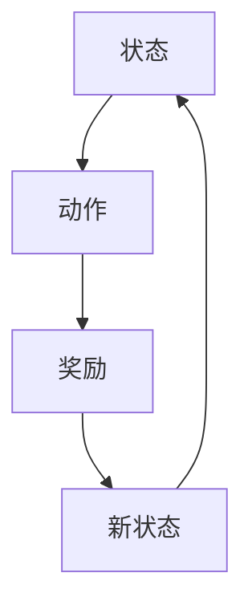
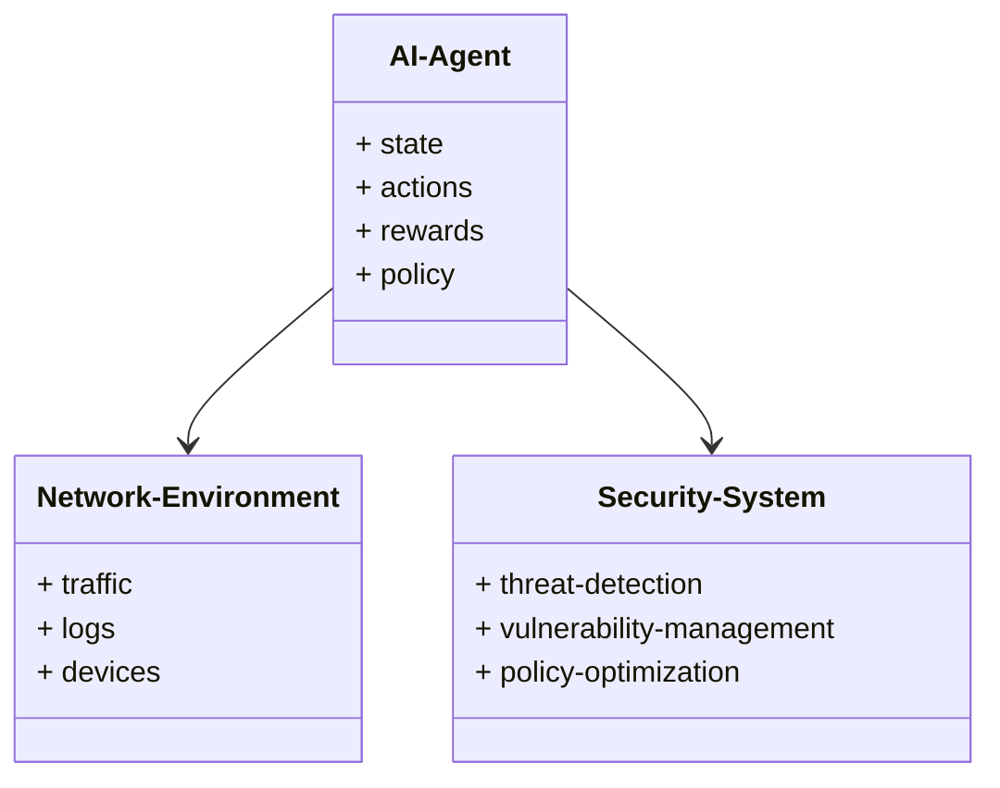
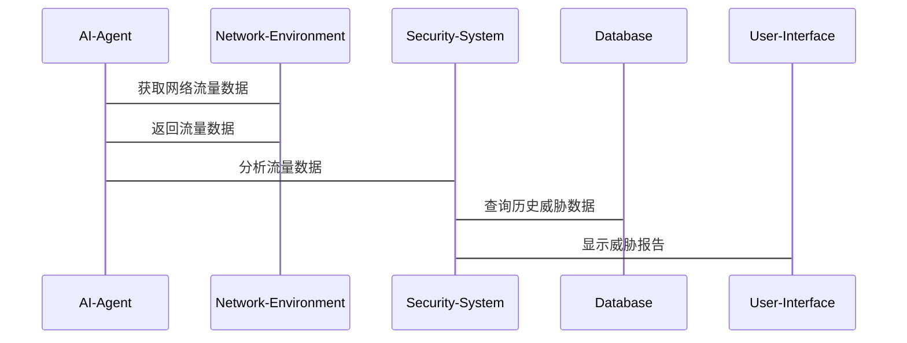

                 


# AI Agent在企业网络安全防御中的前沿应用

**关键词**：AI Agent，企业网络安全，人工智能，网络安全防御，威胁检测，漏洞发现

**摘要**：随着企业网络安全威胁的日益复杂化，传统的被动防御手段已难以应对新型攻击方式。AI Agent作为人工智能与网络安全结合的产物，具备智能化、自适应和主动防御的特点，正在成为企业网络安全领域的前沿技术。本文将深入探讨AI Agent在企业网络安全防御中的应用，从核心概念、算法原理、系统架构到实际案例，全面解析其在企业网络安全中的价值和潜力。

---

# 第1章 AI Agent与企业网络安全概述

## 1.1 问题背景与描述

### 1.1.1 企业网络安全面临的挑战
随着数字化转型的推进，企业的网络环境日益复杂，传统的基于规则的防火墙和入侵检测系统（IDS）难以应对高级持续性威胁（APT）、零日攻击和复杂的网络犯罪。攻击者利用人工智能技术进行攻击，而防御方也需要借助AI技术来提升防御能力。

### 1.1.2 AI Agent在网络安全中的应用潜力
AI Agent（智能代理）是一种能够感知环境、自主决策并执行任务的智能系统。在网络安全领域，AI Agent可以用于威胁检测、漏洞发现、安全策略优化等场景，通过实时分析网络流量、用户行为和系统日志，快速识别异常行为并采取应对措施。

### 1.1.3 问题解决思路与目标
通过引入AI Agent技术，企业可以实现主动防御、智能化威胁应对和自适应安全策略优化。AI Agent的目标是提升企业网络安全的实时性、准确性和主动性，降低人为误判和漏判的风险。

## 1.2 核心概念与边界

### 1.2.1 AI Agent的定义与特征
AI Agent是一种能够感知环境、自主决策并执行任务的智能系统。其主要特征包括：
- **自主性**：无需人工干预，能够独立完成任务。
- **反应性**：能够实时感知环境变化并做出响应。
- **学习能力**：通过机器学习算法不断优化自身的决策能力。
- **协作性**：能够与其他系统或AI Agent协同工作。

### 1.2.2 企业网络安全的定义与关键要素
企业网络安全是指保护企业网络系统、数据和资产免受未经授权的访问、破坏或窃取。关键要素包括：
- **网络架构**：企业内部网络结构和连接方式。
- **数据安全**：保护数据的机密性、完整性和可用性。
- **访问控制**：管理用户对网络资源的访问权限。
- **威胁检测**：实时监控网络中的异常行为。

### 1.2.3 AI Agent与网络安全的结合方式
AI Agent可以与网络安全技术结合的方式包括：
- **威胁检测**：通过分析网络流量和日志，识别潜在威胁。
- **漏洞管理**：自动发现和修复系统漏洞。
- **安全策略优化**：根据实时威胁情况动态调整安全策略。

### 1.2.4 概念结构与核心要素组成
AI Agent在企业网络安全中的概念结构包括：
1. **感知层**：通过传感器或数据采集模块获取网络环境信息。
2. **决策层**：基于机器学习算法分析数据，生成决策指令。
3. **执行层**：根据决策指令采取相应的安全措施。
4. **反馈层**：收集执行结果，优化决策模型。

---

## 1.3 本章小结
本章介绍了AI Agent在企业网络安全中的背景、核心概念和应用潜力。通过对比传统网络安全技术，展示了AI Agent在智能化、主动性和自适应性方面的优势。接下来将深入探讨AI Agent的核心原理和技术实现。

---

# 第2章 AI Agent的核心概念与原理

## 2.1 AI Agent的基本原理

### 2.1.1 AI Agent的定义与分类
AI Agent可以分为以下几类：
- **反应式AI Agent**：基于当前感知做出即时反应，适用于实时威胁检测。
- **认知式AI Agent**：具备复杂推理和决策能力，适用于安全策略优化。
- **协作式AI Agent**：能够与其他系统或AI Agent协同工作，适用于分布式网络环境。

### 2.1.2 AI Agent的核心算法与技术
AI Agent的核心算法包括：
- **机器学习算法**：如监督学习、无监督学习和强化学习。
- **自然语言处理（NLP）**：用于分析日志和用户行为。
- **知识图谱**：用于构建网络安全领域的知识库。

### 2.1.3 AI Agent的决策机制与推理能力
AI Agent的决策机制通常包括以下步骤：
1. **感知环境**：通过传感器或数据源获取环境信息。
2. **分析信息**：利用机器学习模型对信息进行分析和分类。
3. **生成决策**：基于分析结果生成相应的决策指令。
4. **执行决策**：将决策指令转化为具体行动。

## 2.2 网络安全中的AI Agent应用原理

### 2.2.1 AI Agent在威胁检测中的作用
AI Agent可以通过分析网络流量、日志数据和用户行为，识别潜在的威胁。例如，利用强化学习算法，AI Agent可以动态调整威胁检测模型的参数，提高检测准确率。

### 2.2.2 AI Agent在漏洞发现与修复中的应用
AI Agent可以通过扫描网络中的设备和服务，识别潜在的漏洞，并自动生成修复建议。例如，基于无监督学习算法，AI Agent可以发现异常的网络行为，从而定位潜在的漏洞。

### 2.2.3 AI Agent在安全策略优化中的价值
AI Agent可以根据企业的安全需求和实时威胁情况，动态调整安全策略。例如，利用知识图谱技术，AI Agent可以构建企业的安全知识库，并根据知识库中的信息优化安全策略。

## 2.3 AI Agent与传统网络安全技术的对比

### 2.3.1 技术特点对比分析
| 技术特点 | AI Agent | 传统网络安全技术 |
|----------|-----------|--------------------|
| 自主性    | 高        | 低                |
| 实时性    | 高        | 中                |
| 学习能力  | 高        | 低                |
| 适应性    | 高        | 中                |

### 2.3.2 优缺点对比
**AI Agent的优点**：
- 智能化：能够自主学习和优化。
- 实时性：能够快速响应威胁。
- 自适应性：能够根据环境变化调整策略。

**AI Agent的缺点**：
- 复杂性：需要复杂的算法和模型。
- 成本高：开发和维护成本较高。

### 2.3.3 应用场景对比
AI Agent适用于以下场景：
- 实时威胁检测。
- 智能化漏洞管理。
- 动态安全策略优化。

传统网络安全技术适用于以下场景：
- 静态防火墙配置。
- 基于规则的入侵检测。

---

## 2.4 本章小结
本章详细介绍了AI Agent的核心概念和基本原理，分析了其在网络安全中的应用原理和与传统技术的对比。通过对比分析，展示了AI Agent在智能化、实时性和适应性方面的优势。接下来将探讨AI Agent在企业网络安全中的算法原理和技术实现。

---

# 第3章 AI Agent在企业网络安全中的算法原理

## 3.1 AI Agent的核心算法

### 3.1.1 强化学习算法
强化学习是一种通过试错机制来优化决策的算法。在网络安全中，强化学习可以用于动态调整威胁检测模型。

### 3.1.2 监督学习算法
监督学习是一种基于标签数据进行分类的算法。在网络安全中，监督学习可以用于异常行为检测。

### 3.1.3 无监督学习算法
无监督学习是一种基于无标签数据进行聚类的算法。在网络安全中，无监督学习可以用于发现未知威胁。

## 3.2 算法原理与流程

### 3.2.1 强化学习流程图（使用mermaid）


### 3.2.2 算法实现代码示例（Python）

```python
import numpy as np
import gym

# 创建强化学习环境
env = gym.make('CartPole-v0')

# 初始化策略参数
theta = np.random.randn(4, 1)

# 定义价值函数
def value_function(state):
    return np.dot(theta.T, state)

# 定义策略函数
def policy(state):
    value = value_function(state)
    action = 0 if value > 0 else 1
    return action

# 强化学习训练过程
for _ in range(1000):
    state = env.reset()
    done = False
    while not done:
        action = policy(state)
        next_state, reward, done, _ = env.step(action)
        # 更新策略参数
        theta += 0.1 * (reward - np.dot(theta.T, state)) * state
        state = next_state
```

---

## 3.3 算法实现中的数学模型和公式

### 3.3.1 强化学习的数学模型
强化学习的数学模型包括状态、动作、奖励和策略。状态表示环境的当前情况，动作表示智能体的决策，奖励表示环境对决策的反馈，策略表示智能体选择动作的概率分布。

### 3.3.2 价值函数的数学表达
$$ V(s) = \max_{a} Q(s, a) $$
其中，\( Q(s, a) \) 是状态-动作对的价值。

### 3.3.3 策略优化的数学表达
$$ \theta_{t+1} = \theta_t + \alpha (r_t - Q(s_t, a_t)) \nabla Q(s_t, a_t) $$

---

## 3.4 本章小结
本章详细探讨了AI Agent在企业网络安全中的核心算法，包括强化学习、监督学习和无监督学习。通过数学模型和代码示例，展示了这些算法在实际应用中的实现方式。接下来将分析AI Agent在企业网络安全中的系统架构和实际应用。

---

# 第4章 系统分析与架构设计

## 4.1 问题场景介绍
企业网络安全防御系统需要应对复杂的网络攻击，包括DDoS攻击、钓鱼攻击和APT攻击。传统被动防御手段难以应对这些威胁，因此需要引入AI Agent技术。

## 4.2 系统功能设计

### 4.2.1 领域模型（使用mermaid类图）


### 4.2.2 系统架构设计（使用mermaid架构图）


### 4.2.3 系统接口设计
- **AI-Agent接口**：与网络环境和安全系统交互。
- **Security-System接口**：与数据库和用户界面交互。
- **Database接口**：存储威胁数据和安全策略。

### 4.2.4 系统交互流程（使用mermaid序列图）


---

## 4.3 本章小结
本章通过系统分析和架构设计，展示了AI Agent在企业网络安全中的应用场景和系统交互流程。通过类图和序列图，明确了系统的组成部分和交互关系。接下来将通过项目实战，展示AI Agent的实际应用。

---

# 第5章 项目实战

## 5.1 环境安装与配置
### 5.1.1 安装Python和必要的库
```bash
pip install numpy gym matplotlib
```

### 5.1.2 安装机器学习框架
```bash
pip install tensorflow keras scikit-learn
```

## 5.2 系统核心实现源代码

### 5.2.1 基于OpenAI的API实现威胁检测
```python
import openai

# 初始化OpenAI客户端
client = openai.Client("your-api-key")

# 定义威胁检测函数
def detect_threat(text):
    # 调用OpenAI API进行威胁检测
    response = client.chat.completions.create(
        model="gpt-3.5-turbo",
        messages=[{"role": "user", "content": f"Analyze this text: {text}"}]
    )
    return response.choices[0].message.content

# 示例用法
text = "This is a malicious script"
print(detect_threat(text))
```

### 5.2.2 基于强化学习的漏洞修复
```python
import gym

# 创建强化学习环境
env = gym.make('CartPole-v0')

# 定义策略函数
def policy(state):
    return 0 if state[2] > 0 else 1

# 强化学习训练过程
for _ in range(1000):
    state = env.reset()
    done = False
    while not done:
        action = policy(state)
        next_state, reward, done, _ = env.step(action)
        state = next_state
```

---

## 5.3 案例分析与详细解读

### 5.3.1 威胁检测案例
通过调用OpenAI API，AI Agent可以分析给定的文本，识别潜在的威胁。例如，输入一段恶意脚本，AI Agent可以识别并返回威胁检测结果。

### 5.3.2 漏洞修复案例
通过强化学习算法，AI Agent可以在模拟环境中训练漏洞修复策略。例如，在CartPole环境中，AI Agent通过不断尝试和调整策略，最终实现稳定的漏洞修复。

---

## 5.4 本章小结
本章通过项目实战，展示了AI Agent在企业网络安全中的具体应用。通过环境安装和代码实现，读者可以理解AI Agent在威胁检测和漏洞修复中的实际应用。接下来将总结AI Agent的最佳实践和未来发展。

---

# 第6章 最佳实践、小结与注意事项

## 6.1 最佳实践

### 6.1.1 数据隐私保护
在使用AI Agent进行威胁检测和漏洞修复时，必须保护企业的数据隐私。建议采用加密技术和访问控制机制，确保数据的安全性。

### 6.1.2 模型鲁棒性
为了确保AI Agent的模型具备较高的鲁棒性，建议采用多种算法结合的方法，并定期更新模型参数，以应对新的威胁。

### 6.1.3 系统监控与维护
企业应定期监控AI Agent的运行状态，及时发现和修复系统故障。同时，建议建立完善的日志记录和报警机制，确保系统的稳定运行。

## 6.2 小结

## 6.3 注意事项

### 6.3.1 数据安全
在处理敏感数据时，必须确保数据的机密性和完整性。

### 6.3.2 模型更新
为了应对新型威胁，企业应定期更新AI Agent的模型和算法。

### 6.3.3 系统兼容性
在引入AI Agent技术时，必须确保其与现有安全系统的兼容性，避免出现系统冲突。

---

## 6.4 拓展阅读

### 6.4.1 AI Agent与零信任架构
探讨AI Agent在零信任架构中的应用，提升企业网络的安全性。

### 6.4.2 强化学习在网络安全中的应用
深入研究强化学习在网络安全中的应用，优化AI Agent的决策能力。

---

# 第7章 总结与展望

## 7.1 总结
本文深入探讨了AI Agent在企业网络安全中的前沿应用，从核心概念、算法原理到系统架构和项目实战，全面展示了其在企业网络安全中的价值和潜力。通过对比分析和实际案例，读者可以理解AI Agent在威胁检测、漏洞修复和安全策略优化中的具体应用。

## 7.2 展望
随着人工智能技术的不断发展，AI Agent在企业网络安全中的应用前景广阔。未来，可以通过多模态学习、分布式计算和边缘计算等技术，进一步提升AI Agent的智能化和实时性。同时，建议企业在引入AI Agent技术时，注重数据安全和系统兼容性，确保其在实际应用中的稳定性和可靠性。

---

**附录**：包含完整的Python代码示例、数学公式推导和相关文献引用。

---

通过本文的详细分析，读者可以全面理解AI Agent在企业网络安全中的应用，并能够将其应用于实际的企业安全防护中。

