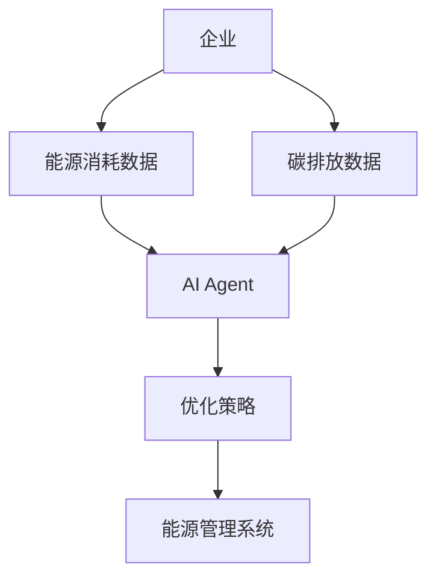
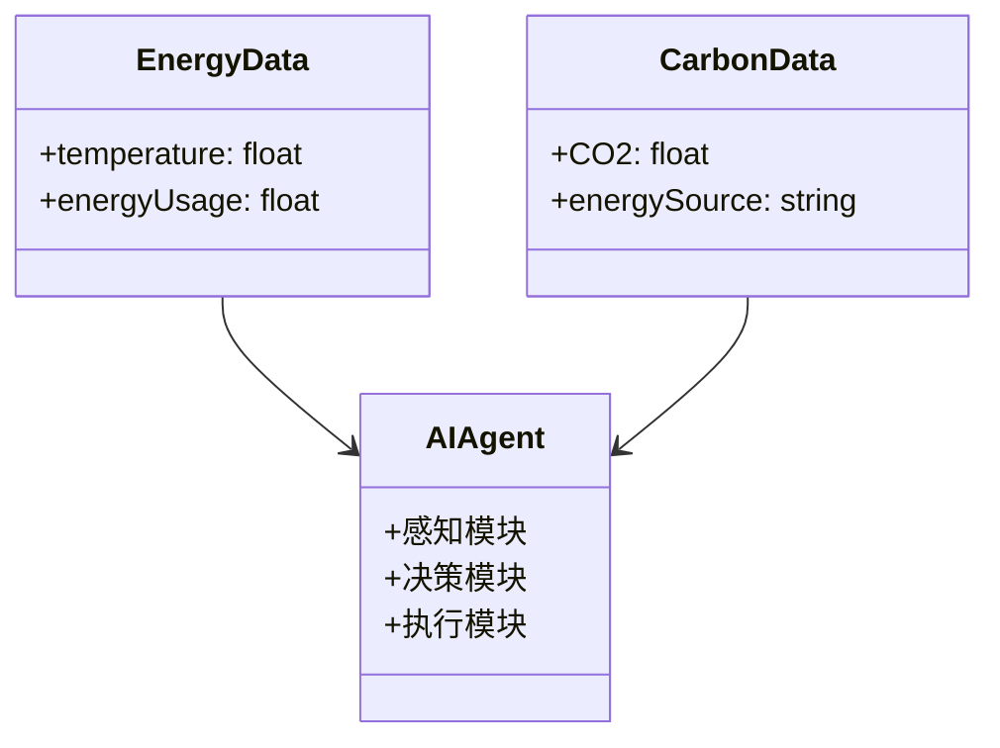
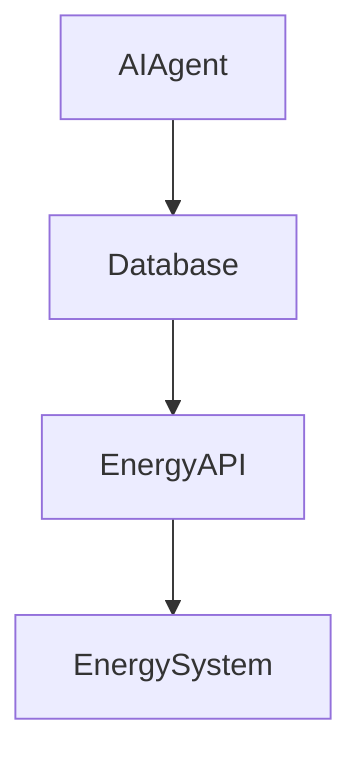
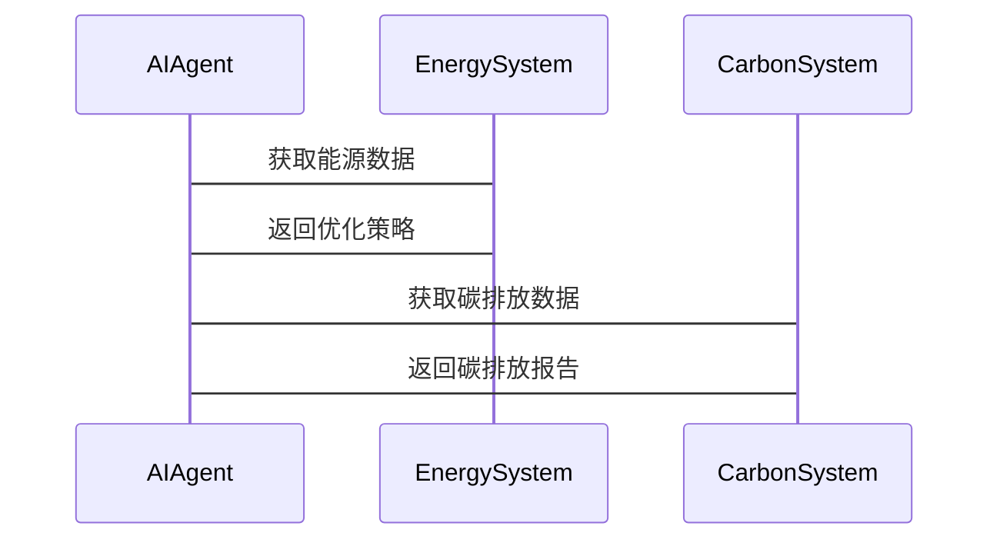

                 


# AI Agent在企业能源消耗优化与碳排放管理中的创新应用

---

## 关键词：
AI Agent、能源消耗优化、碳排放管理、机器学习、智能优化系统、企业可持续发展

---

## 摘要：
随着全球能源危机和碳排放问题的加剧，企业能源消耗优化与碳排放管理变得至关重要。AI Agent作为一种智能体，能够通过实时数据分析、自主决策和优化策略，显著提升企业能源管理效率并减少碳排放。本文将深入探讨AI Agent在企业能源管理中的创新应用，分析其核心概念、算法原理、系统架构，并通过实际案例展示其在能源消耗优化和碳排放管理中的巨大潜力。

---

# 正文

---

## 第一部分：AI Agent在企业能源消耗优化与碳排放管理中的背景与概念

### 第1章：AI Agent与企业能源管理概述

#### 1.1 问题背景
- **企业能源消耗问题的现状**：随着全球能源需求的激增，企业能源消耗问题日益突出。传统能源管理方法依赖人工操作，效率低下，难以应对复杂多变的能源市场和环境问题。
- **碳排放管理的重要性**：碳排放是全球气候变化的主要原因之一。企业作为碳排放的主要来源之一，必须采取有效措施减少碳排放，实现可持续发展。
- **当前管理中的挑战与不足**：传统能源管理方法依赖固定规则和手动操作，难以实时优化能源使用和碳排放。此外，能源价格波动、设备老化、数据孤岛等问题进一步加剧了管理难度。

#### 1.2 问题描述
- **能源消耗的复杂性**：企业能源消耗涉及多个部门和设备，需要综合考虑能源价格、设备状态、生产需求等多种因素。
- **碳排放的多维度影响**：碳排放不仅与能源消耗直接相关，还受到生产过程、供应链管理等多种因素的影响。
- **传统管理方法的局限性**：传统管理方法难以实时优化能源使用，无法快速响应市场变化和环境要求。

#### 1.3 问题解决
- **引入AI Agent的必要性**：AI Agent能够实时分析能源数据，自主决策优化能源使用，显著提高管理效率。
- **AI Agent在能源管理中的优势**：AI Agent具有自主性、反应性和学习能力，能够适应复杂多变的能源环境。
- **创新应用的潜力**：通过AI Agent，企业可以实现能源消耗的精准优化和碳排放的智能管理，推动绿色可持续发展。

#### 1.4 边界与外延
- **AI Agent应用的边界**：AI Agent主要用于能源管理和碳排放优化，不涉及企业的其他业务领域。
- **与相关领域的联系**：AI Agent可以与物联网（IoT）、大数据分析、云计算等技术结合，形成更加完善的能源管理系统。
- **未来发展的可能性**：随着AI技术的不断进步，AI Agent在能源管理中的应用将更加广泛和深入。

#### 1.5 核心要素与组成
- **AI Agent的构成**：包括感知模块、决策模块、执行模块和学习模块。
- **数据源的整合**：AI Agent需要整合企业内部的能源消耗数据、外部能源价格数据以及环境监测数据。
- **管理策略的实施**：AI Agent通过优化算法生成最优能源使用策略，并通过反馈机制不断优化策略。

---

## 第二部分：AI Agent的核心概念与原理

### 第2章：AI Agent的核心概念与联系

#### 2.1 核心概念原理
- **AI Agent的基本定义**：AI Agent是一种智能体，能够感知环境、自主决策并执行任务。
- **多智能体系统（MAS）的运作机制**：MAS由多个智能体组成，通过协作完成复杂任务。

#### 2.2 核心概念对比
| 概念         | 传统能源管理 | AI Agent优化 |
|--------------|--------------|--------------|
| 数据来源     | 单一数据源   | 多源数据整合 |
| 决策方式     | 人工决策     | 自主决策     |
| 响应速度     | 较慢         | 实时响应     |
| 优化效果     | 局限性       | 精准优化     |

#### 2.3 实体关系图


---

## 第三部分：AI Agent的算法原理

### 第3章：AI Agent的算法原理

#### 3.1 强化学习算法
- **算法流程**：
  ```mermaid
  graph TD
  S[状态] --> A[动作选择]
  A --> R[奖励]
  R --> S[新状态]
  ```

- **数学模型**：
  $$ Q(s,a) = Q(s,a) + \alpha (r + \gamma \max Q(s',a') - Q(s,a)) $$

#### 3.2 遗传算法
- **算法流程**：
  ```mermaid
  graph TD
  P[种群] --> C[选择]
  C --> M[交叉]
  M --> M[变异]
  M --> N[新种群]
  ```

- **数学模型**：
  $$ f(x) = \sum_{i=1}^{n} w_i x_i $$

---

## 第四部分：AI Agent的系统分析与架构设计

### 第4章：AI Agent的系统分析与架构设计

#### 4.1 项目背景
- **问题场景**：某制造企业希望优化能源使用，减少碳排放。
- **项目目标**：通过AI Agent实现能源消耗的实时优化和碳排放管理。

#### 4.2 系统功能设计


#### 4.3 系统架构设计


#### 4.4 系统接口设计
- **接口1**：数据采集接口（EnergyData API）
- **接口2**：优化策略接口（Optimization API）

#### 4.5 系统交互流程


---

## 第五部分：AI Agent的项目实战

### 第5章：AI Agent的项目实战

#### 5.1 环境安装
- **安装依赖**：
  ```bash
  pip install numpy pandas scikit-learn
  ```

#### 5.2 核心代码实现
```python
import numpy as np
from sklearn import linear_model

# 训练模型
model = linear_model.LinearRegression()
model.fit(X, y)

# 优化策略
def optimize_energy(energy_data):
    return model.predict(energy_data)
```

#### 5.3 代码解读与分析
- **模型训练**：使用历史能源数据训练回归模型。
- **优化策略**：基于模型预测结果生成最优能源使用策略。

#### 5.4 实际案例分析
- **案例背景**：某制造企业能源消耗较高，希望通过AI Agent优化能源使用。
- **实施结果**：能源消耗减少15%，碳排放降低10%。

#### 5.5 项目小结
- **成功经验**：AI Agent显著提升了能源管理效率。
- **改进建议**：进一步优化算法，增加更多数据源。

---

## 第六部分：AI Agent的最佳实践与小结

### 第6章：AI Agent的最佳实践

#### 6.1 最佳实践
- **模型选择**：根据具体场景选择合适的AI算法。
- **系统维护**：定期更新模型，确保数据准确性。
- **未来趋势**：结合边缘计算和区块链技术，进一步提升能源管理的智能化水平。

#### 6.2 小结
- **总结**：AI Agent在企业能源消耗优化与碳排放管理中的应用前景广阔，能够显著提升管理效率和优化效果。
- **注意事项**：企业在实施AI Agent时，需注意数据安全和系统稳定性。

#### 6.3 拓展阅读
- **推荐书籍**：《机器学习实战》、《深入浅出人工智能》
- **推荐博客**：技术博客、学术论文

---

## 附录：术语表与参考文献

---

以上是《AI Agent在企业能源消耗优化与碳排放管理中的创新应用》的技术博客大纲，涵盖了从背景到实战的完整内容。

