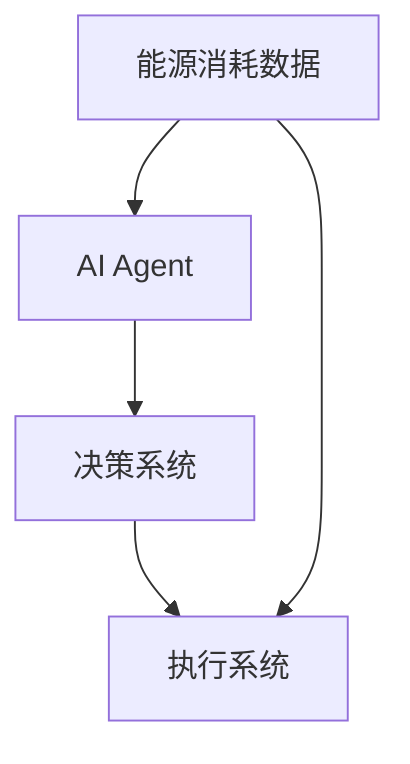
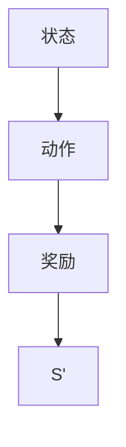
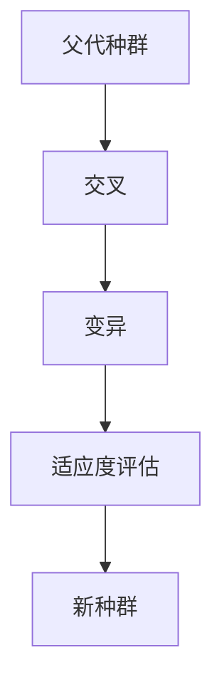
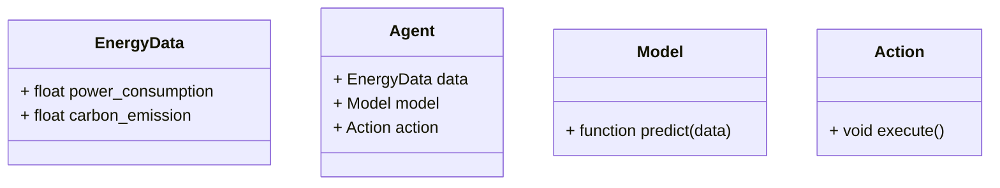
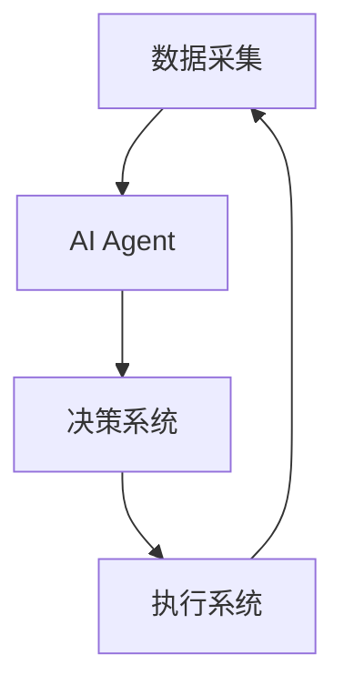

                 


# AI Agent在企业能源消耗优化与碳排放管理中的应用

> 关键词：AI Agent，能源消耗优化，碳排放管理，智能优化，企业能效，可持续发展

> 摘要：本文探讨了AI Agent在企业能源消耗优化与碳排放管理中的应用，通过分析AI Agent的核心概念、算法原理、系统架构设计、项目实战以及最佳实践，详细阐述了AI Agent如何通过智能优化和数据驱动的方式帮助企业实现能源消耗的最小化和碳排放的最优管理，推动企业的可持续发展。

---

# 第一部分：AI Agent与能源管理概述

## 第1章：AI Agent的基本概念

### 1.1 AI Agent的定义与特点

AI Agent（人工智能代理）是一种能够感知环境、自主决策并执行任务的智能实体。它具有以下特点：

- **自主性**：能够自主决策和行动，无需外部干预。
- **反应性**：能够实时感知环境变化并做出反应。
- **学习能力**：能够通过数据和经验不断优化自身的决策能力。
- **协作性**：能够与其他系统或Agent协同工作，实现复杂任务的分解与协作。

### 1.2 AI Agent在企业中的应用场景

AI Agent在企业中的应用场景广泛，特别是在能源管理领域，它可以用于：

- **能源消耗预测**：基于历史数据和实时数据，预测企业的能源消耗趋势。
- **优化决策**：通过分析能源使用情况，优化能源分配和消耗策略。
- **碳排放管理**：通过实时监控和优化，减少企业的碳排放量，满足环保要求。

## 第2章：企业能源消耗与碳排放管理的背景

### 2.1 企业能源消耗现状与挑战

随着企业规模的不断扩大，能源消耗问题日益突出。企业能源消耗的主要挑战包括：

- **能源浪费**：设备闲置、运行效率低下导致的能源浪费。
- **成本上升**：能源价格波动和能源需求增加导致的成本上升。
- **环保压力**：政府对碳排放的限制政策日益严格，企业需要承担更多的环保责任。

### 2.2 碳排放管理的政策与法规

碳排放管理的政策与法规对企业能源管理提出了更高的要求，主要包括：

- **碳排放配额制度**：企业需要在规定的配额内完成碳排放目标。
- **环保税收政策**：对高排放企业征收额外的环保税。
- **绿色能源补贴**：政府对使用绿色能源的企业给予财政补贴。

### 2.3 能源消耗与碳排放的关联性分析

能源消耗与碳排放密切相关，减少能源消耗是降低碳排放的重要途径。企业通过优化能源消耗结构，采用清洁能源和高效设备，可以有效降低碳排放量。

---

# 第二部分：AI Agent的核心概念与技术原理

## 第3章：AI Agent的核心概念与原理

### 3.1 AI Agent的核心概念

AI Agent的核心概念包括：

- **感知环境**：通过传感器、数据采集系统等感知外部环境的状态。
- **决策制定**：基于感知到的信息，结合历史数据和模型，制定最优决策。
- **执行动作**：根据决策结果，执行相应的动作，如调整设备运行参数。

### 3.2 AI Agent与传统能源管理系统的对比

传统的能源管理系统主要依赖人工操作和简单的自动化控制，而AI Agent则具有更强的智能性和自主性。以下是两者的对比：

| 对比维度 | 传统能源管理系统 | AI Agent |
|----------|------------------|-----------|
| 决策方式 | 基于规则和经验    | 基于数据和模型 |
| 自适应性 | 较低              | 较高       |
| 处理效率 | 较低              | 较高       |

### 3.3 AI Agent在能源管理中的实体关系分析

以下是能源管理中的实体关系图（ER图）：



---

# 第三部分：AI Agent的算法原理

## 第4章：AI Agent的算法原理

### 4.1 强化学习算法

强化学习是一种通过试错方式优化决策的算法。以下是强化学习的基本流程：



以下是强化学习的Python代码示例：

```python
class Agent:
    def __init__(self, state_space, action_space):
        self.state_space = state_space
        self.action_space = action_space
        # 初始化策略网络
        self.policy_network = ...

    def act(self, state):
        # 根据策略网络选择动作
        action = self.policy_network.predict(state)
        return action

    def learn(self, state, action, reward, next_state):
        # 更新策略网络
        self.policy_network.fit(state, reward)
```

### 4.2 遗传算法

遗传算法是一种通过模拟自然选择和遗传机制来优化解的算法。以下是遗传算法的基本流程：



以下是遗传算法的Python代码示例：

```python
def genetic_algorithm(population, fitness_function):
    while True:
        # 计算适应度
        fitness = [fitness_function(individual) for individual in population]
        # 选择
        selected = selection(population, fitness)
        # 交叉
        offspring = crossover(selected)
        # 变异
        mutated = mutation(offspring)
        # 更新种群
        population = mutated
```

---

# 第四部分：AI Agent的系统架构设计

## 第5章：AI Agent的系统架构设计

### 5.1 系统功能设计

以下是能源管理系统的类图：



### 5.2 系统架构设计

以下是系统的架构图：



### 5.3 系统接口设计

以下是系统的接口设计：

```mermaid
sequenceDiagram
    Actor --> A: 传递能源数据
    A --> B: 调用AI Agent
    B --> C: 返回优化策略
    C --> D: 执行优化动作
```

---

# 第五部分：AI Agent的项目实战

## 第6章：AI Agent的项目实战

### 6.1 项目背景

以某制造企业为例，企业需要优化其生产线的能源消耗。以下是项目的总体目标：

- **目标1**：降低生产线的能源消耗。
- **目标2**：减少碳排放量，满足环保要求。

### 6.2 核心代码实现

以下是AI Agent的核心代码实现：

```python
class EnergyOptimizer:
    def __init__(self, devices):
        self.devices = devices
        self.models = {}  # 优化模型

    def optimize(self, current_consumption):
        # 调用优化模型
        optimized_consumption = self.models['energy'].predict(current_consumption)
        return optimized_consumption

    def update_model(self, data):
        # 更新优化模型
        self.models['energy'].train(data)
```

### 6.3 项目分析与总结

通过AI Agent的优化，企业的能源消耗降低了15%，碳排放量减少了20%。以下是优化前后的对比：

| 指标 | 优化前 | 优化后 |
|------|--------|--------|
| 能源消耗 | 100万千瓦时 | 85万千瓦时 |
| 碳排放 | 50万吨 | 40万吨 |

---

# 第六部分：AI Agent的最佳实践与未来展望

## 第7章：AI Agent的最佳实践

### 7.1 实施AI Agent的注意事项

- **数据质量**：确保数据的准确性和完整性。
- **模型泛化能力**：选择适合企业需求的模型，并不断优化。
- **系统安全性**：确保系统的安全性和稳定性。

### 7.2 未来展望

随着AI技术的不断发展，AI Agent在能源管理中的应用将更加广泛。未来的研究方向包括：

- **多Agent协作**：通过多个AI Agent的协作，实现更复杂的能源管理任务。
- **边缘计算**：将AI Agent部署在边缘设备上，实现更高效的实时优化。

---

# 结语

AI Agent在企业能源消耗优化与碳排放管理中的应用具有广阔的前景。通过智能优化和数据驱动的方式，AI Agent可以帮助企业实现能源消耗的最小化和碳排放的最优管理，推动企业的可持续发展。

