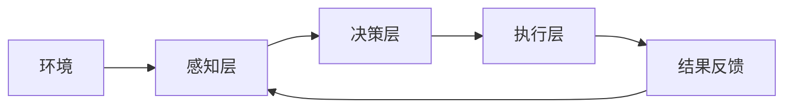
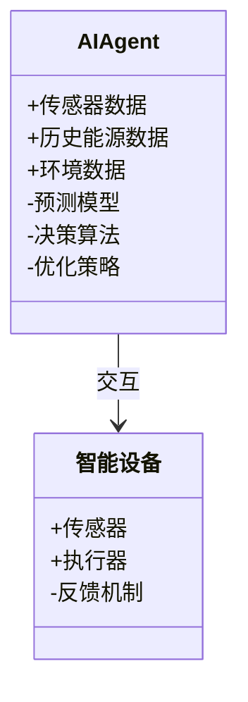
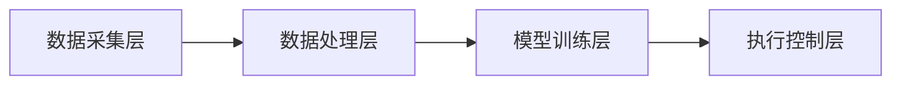

                 

# AI Agent在企业能源管理与可持续发展中的应用

> 关键词：AI Agent, 企业能源管理, 可持续发展, 智能代理, 能源优化, 机器学习

> 摘要：随着企业对可持续发展的关注日益增加，能源管理的智能化和高效化成为关键。本文探讨AI Agent在企业能源管理中的应用，分析其核心原理、系统架构，并结合实际案例，展示如何通过AI Agent优化能源使用，推动可持续发展。

---

## 第一章: 问题背景与概念介绍

### 1.1 问题背景
企业能源管理是确保企业高效、经济地使用能源的过程，旨在减少浪费并降低环境影响。然而，传统能源管理依赖于人工监控和简单自动化系统，存在效率低、响应慢等问题。

### 1.2 问题描述
随着能源成本的上升和环保压力的增加，企业需要更智能化的能源管理解决方案。AI Agent作为一种智能代理，能够实时感知环境、做出决策并采取行动，为能源管理提供了新的可能性。

### 1.3 问题解决
AI Agent可以通过机器学习算法，分析历史数据，预测能源需求，优化能源分配，实现节能减排。此外，AI Agent还可以与智能设备交互，实现自动化控制，提高能源使用效率。

### 1.4 边界与外延
AI Agent的应用边界包括能源消耗监控、需求预测和设备控制。外延则涉及与物联网、大数据分析等技术的结合，进一步提升能源管理的智能化水平。

---

## 第二章: AI Agent的基本原理

### 2.1 AI Agent的定义与特点
AI Agent是一种能够感知环境、自主决策并执行任务的智能系统。其特点包括自主性、反应性、目标导向和学习能力。

### 2.2 AI Agent的体系结构
AI Agent的体系结构通常包括感知层、决策层和执行层。感知层负责收集环境数据，决策层基于数据进行分析和决策，执行层则根据决策执行具体操作。

### 2.3 AI Agent与传统能源管理的对比
传统能源管理依赖于人工监控和简单自动化系统，而AI Agent通过机器学习和智能决策，显著提高了能源管理的效率和精准度。

---

## 第三章: AI Agent的算法原理

### 3.1 强化学习
强化学习是一种通过试错来优化决策的算法。AI Agent通过与环境交互，学习最优策略，以实现目标。例如，使用Q-learning算法优化能源分配策略。

### 3.2 监督学习
监督学习通过训练数据预测能源消耗，帮助AI Agent做出更准确的需求预测。例如，使用线性回归模型预测电力需求。

### 3.3 无监督学习
无监督学习用于发现数据中的隐藏模式，如聚类分析，帮助识别能源浪费的模式。

---

## 第四章: 系统分析与架构设计

### 4.1 系统功能设计
系统功能包括能源消耗监控、需求预测、设备控制和优化建议。

### 4.2 系统架构设计
系统架构包括数据采集层、数据处理层、模型训练层和执行控制层。

### 4.3 接口设计
接口设计包括数据接口、设备接口和用户接口，确保系统各部分的高效协同。

---

## 第五章: 项目实战

### 5.1 环境安装
需要安装Python、TensorFlow、Kafka等工具。

### 5.2 核心代码实现
使用强化学习算法优化能源分配策略，实现能源消耗预测和设备控制。

### 5.3 系统功能展示
展示能源消耗监控界面、预测结果和优化建议。

### 5.4 案例分析
通过实际案例分析，展示AI Agent在能源管理中的应用效果。

---

## 第六章: 最佳实践与总结

### 6.1 最佳实践
- 数据质量是关键，需确保数据的准确性和完整性。
- 结合企业实际情况，选择合适的AI算法和模型。
- 定期更新模型，适应环境变化。

### 6.2 小结
AI Agent在企业能源管理中的应用前景广阔，能够显著提高能源使用效率，减少成本，推动可持续发展。

### 6.3 注意事项
- 数据隐私和安全问题需高度重视。
- 系统的实时性和稳定性是关键。
- 模型的可解释性需满足企业需求。

### 6.4 未来展望
随着技术的发展，AI Agent将更加智能化和自主化，进一步推动企业能源管理的智能化转型。

---

## 附录

### 术语表
- AI Agent：人工智能代理
- 强化学习：Reinforcement Learning
- 可持续发展：Sustainable Development

### 参考文献
[1] Russell, S., & Norvig, P. (2010). Artificial Intelligence: A Modern Approach.

