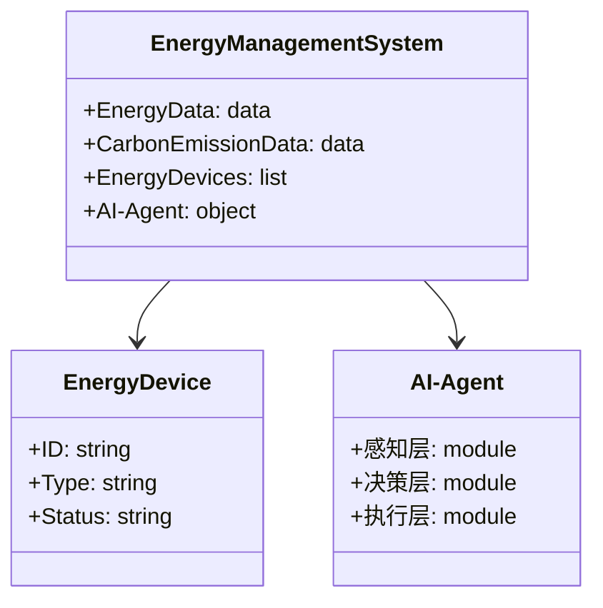
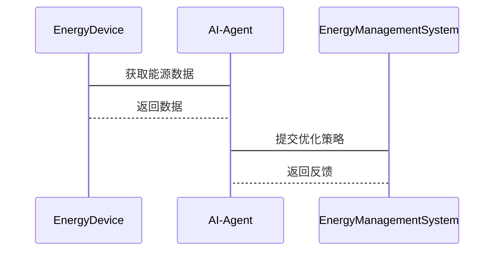

                 


# AI Agent在企业能源管理与可持续发展中的应用

## 关键词：
AI Agent, 企业能源管理, 可持续发展, 强化学习, 图神经网络, 能源优化, 碳排放管理

## 摘要：
随着全球能源需求的增长和环境问题的加剧，企业能源管理的重要性日益凸显。AI Agent作为人工智能领域的前沿技术，正在成为推动企业能源管理智能化和可持续发展的重要工具。本文将从AI Agent的基本概念出发，探讨其在企业能源管理中的应用场景、算法原理、系统架构设计以及实际项目中的应用。通过详细的技术分析和案例解读，本文旨在为企业能源管理的智能化转型提供理论支持和实践指导。

---

## 第一部分: AI Agent与企业能源管理概述

### 第1章: AI Agent的基本概念与背景介绍

#### 1.1 AI Agent的定义与核心概念

##### 1.1.1 问题背景与问题描述
能源管理是企业管理的重要组成部分，传统的能源管理方式依赖人工操作，存在效率低、数据孤岛、难以实时优化等问题。随着物联网（IoT）和人工智能（AI）技术的发展，企业能源管理的智能化转型成为必然趋势。

##### 1.1.2 问题解决的思路与方法
AI Agent（智能体）通过感知环境、自主决策和执行行动，能够实时优化能源使用效率，降低碳排放，实现可持续发展目标。

##### 1.1.3 AI Agent的核心要素与概念结构
AI Agent的核心要素包括：
1. **感知层**：通过传感器和数据采集系统获取能源使用数据。
2. **决策层**：基于强化学习、图神经网络等算法进行决策。
3. **执行层**：通过系统接口执行优化策略。

#### 1.2 企业能源管理的现状与挑战

##### 1.2.1 传统能源管理的局限性
- 数据孤岛问题：能源设备和系统分散，数据难以整合。
- 实时性不足：传统管理方式难以实现实时优化。
- 人工成本高：需要大量人工监控和操作。

##### 1.2.2 可持续发展对能源管理的新要求
- 碳中和目标：企业需要减少碳排放，实现绿色生产。
- 能源效率优化：通过技术手段提高能源使用效率。
- 数字化转型：利用AI、大数据等技术推动能源管理的智能化。

##### 1.2.3 AI Agent在能源管理中的潜在价值
- 提高能源使用效率。
- 实现实时监控和优化。
- 支持碳排放管理与合规。

#### 1.3 AI Agent与可持续发展的关系

##### 1.3.1 AI Agent在可持续发展中的角色
AI Agent通过优化能源使用、减少浪费和降低碳排放，助力企业实现可持续发展目标。

##### 1.3.2 可持续发展目标与企业能源管理的结合
企业能源管理是实现可持续发展的重要环节，AI Agent通过智能化管理，推动企业在节能减排方面的实践。

##### 1.3.3 AI Agent如何推动可持续发展
- 通过实时优化减少能源浪费。
- 支持碳排放监测与管理。
- 促进绿色技术的广泛应用。

#### 1.4 本章小结
本章从AI Agent的基本概念出发，分析了企业能源管理的现状与挑战，并探讨了AI Agent在可持续发展中的潜在价值。

---

## 第二部分: AI Agent的核心概念与工作原理

### 第2章: AI Agent的核心概念与工作原理

#### 2.1 AI Agent的核心原理

##### 2.1.1 感知层：数据采集与处理
AI Agent通过传感器和数据采集系统获取能源使用数据，例如电力消耗、温度、湿度等。

##### 2.1.2 决策层：算法与策略制定
基于强化学习和图神经网络等算法，AI Agent能够自主决策最优的能源管理策略。

##### 2.1.3 执行层：行动与反馈
AI Agent通过系统接口执行优化策略，并根据反馈不断调整决策。

#### 2.2 AI Agent的感知机制

##### 2.2.1 数据采集与传感器网络
AI Agent通过传感器网络实时采集能源使用数据，例如：
- 电力消耗数据
- 设备运行状态
- 环境参数（温度、湿度等）

##### 2.2.2 数据预处理与特征提取
数据预处理包括数据清洗、归一化等步骤，特征提取则通过主成分分析（PCA）等方法提取关键特征。

##### 2.2.3 多源数据融合技术
AI Agent通过多源数据融合技术，将来自不同传感器和系统的数据进行整合，形成全面的能源使用视图。

#### 2.3 AI Agent的决策机制

##### 2.3.1 基于强化学习的决策模型
强化学习是一种通过试错机制优化决策的算法，常用于动态环境中的决策问题。

##### 2.3.2 基于知识图谱的推理方法
知识图谱通过构建能源管理领域的知识网络，支持AI Agent进行推理和决策。

##### 2.3.3 多目标优化的决策策略
AI Agent在决策过程中需要考虑多个目标，例如能源效率、成本最小化、碳排放最小化等。

#### 2.4 AI Agent的执行机制

##### 2.4.1 行动规划与优化
AI Agent根据决策结果生成行动计划，并通过系统接口执行。

##### 2.4.2 系统接口与通信协议
AI Agent通过API或其他通信协议与能源管理系统进行交互。

##### 2.4.3 反馈机制与自适应调整
AI Agent通过反馈机制不断调整决策策略，实现自适应优化。

#### 2.5 本章小结
本章详细介绍了AI Agent的核心原理，包括感知、决策和执行三个层次，并探讨了其在能源管理中的具体应用。

---

## 第三部分: AI Agent在企业能源管理中的应用

### 第3章: AI Agent在企业能源管理中的应用

#### 3.1 企业能源管理的典型场景

##### 3.1.1 能源消耗监测与分析
AI Agent通过实时监测能源消耗，识别浪费点并提出优化建议。

##### 3.1.2 能源使用优化
AI Agent通过优化能源使用策略，降低能源消耗成本。

##### 3.1.3 碳排放管理与合规
AI Agent通过实时监测和分析碳排放数据，支持企业实现碳中和目标。

#### 3.2 AI Agent在能效优化中的应用

##### 3.2.1 基于AI的能效预测模型
AI Agent通过强化学习算法预测能源消耗，并制定优化策略。

##### 3.2.2 能源使用行为分析与优化
AI Agent通过分析能源使用行为，识别浪费点并提出优化建议。

##### 3.2.3 能源设备的智能调度与管理
AI Agent通过智能调度算法，优化能源设备的运行状态。

#### 3.3 AI Agent在碳排放管理中的应用

##### 3.3.1 碳排放数据的采集与分析
AI Agent通过传感器和数据采集系统实时监测碳排放数据。

##### 3.3.2 碳排放预测与减排策略
AI Agent通过强化学习算法预测碳排放趋势，并制定减排策略。

##### 3.3.3 碳足迹追踪与报告生成
AI Agent通过数据分析生成碳足迹报告，支持企业实现碳中和目标。

#### 3.4 本章小结
本章探讨了AI Agent在企业能源管理中的典型应用场景，包括能效优化和碳排放管理。

---

## 第四部分: AI Agent的算法原理与数学模型

### 第4章: AI Agent的算法原理与数学模型

#### 4.1 强化学习算法在AI Agent中的应用

##### 4.1.1 强化学习的基本原理
强化学习是一种通过试错机制优化决策的算法，其核心是通过不断与环境交互，学习最优策略。

##### 4.1.2 Q-Learning算法的实现
Q-Learning算法是一种常用的强化学习算法，其数学模型如下：
$$ Q(s,a) = r + \gamma \max_{a'} Q(s',a') $$

##### 4.1.3 策略梯度方法的优化
策略梯度方法通过优化策略参数，直接优化策略，其数学模型如下：
$$ \theta = \theta + \alpha \nabla_\theta J(\theta) $$

#### 4.2 图神经网络在能源管理中的应用

##### 4.2.1 图神经网络的基本概念
图神经网络是一种基于图结构的数据处理方法，能够捕捉数据之间的关系。

##### 4.2.2 能源网络的图表示方法
能源网络可以通过图结构表示，例如将能源设备和系统作为图的节点。

##### 4.2.3 图神经网络在能效优化中的应用
AI Agent通过图神经网络分析能源网络的结构和关系，优化能源使用策略。

#### 4.3 数学模型与公式

##### 4.3.1 强化学习的数学模型
$$ Q(s,a) = r + \gamma \max_{a'} Q(s',a') $$

##### 4.3.2 图神经网络的数学表达
$$ h_v = \sigma(A h_v^{(t-1)}) $$

#### 4.4 本章小结
本章详细介绍了强化学习和图神经网络在AI Agent中的应用，并给出了相关的数学模型。

---

## 第五部分: 企业能源管理系统的架构设计

### 第5章: 企业能源管理系统的架构设计

#### 5.1 问题场景介绍
企业能源管理系统需要实现对企业内能源设备的实时监控、优化调度和碳排放管理。

#### 5.2 系统功能设计

##### 5.2.1 领域模型（Mermaid 类图）


#### 5.3 系统架构设计（Mermaid 架构图）


#### 5.4 系统接口设计
系统接口包括：
- 数据采集接口：用于采集能源设备数据。
- 系统控制接口：用于控制能源设备。
- 数据分析接口：用于分析能源数据。

#### 5.5 系统交互流程（Mermaid 序列图）


#### 5.6 本章小结
本章详细介绍了企业能源管理系统的架构设计，包括功能模块、系统接口和交互流程。

---

## 第六部分: 项目实战

### 第6章: 项目实战

#### 6.1 项目背景与需求分析

##### 6.1.1 项目背景
某制造企业希望通过智能化能源管理降低能源消耗成本，并实现碳中和目标。

##### 6.1.2 项目需求
- 实现实时能源监控
- 优化能源使用策略
- 管理碳排放

#### 6.2 环境安装与配置

##### 6.2.1 安装依赖
```bash
pip install numpy
pip install matplotlib
pip install scikit-learn
pip install keras
pip install tensorflow
```

##### 6.2.2 环境配置
```bash
conda create -n energy_management python=3.8
conda activate energy_management
pip install -r requirements.txt
```

#### 6.3 核心实现代码

##### 6.3.1 数据采集模块
```python
import numpy as np

class EnergyDataCollector:
    def __init__(self, devices):
        self.devices = devices
        self.data = {}

    def collect_data(self):
        for device in self.devices:
            data = self.get_data(device)
            self.data[device] = data

    def get_data(self, device):
        # 模拟数据采集
        return np.random.uniform(0, 1, 10)
```

##### 6.3.2 AI Agent实现
```python
import keras
from keras.models import Sequential
from keras.layers import Dense

class AI-Agent:
    def __init__(self, state_space, action_space):
        self.model = self.build_model(state_space, action_space)

    def build_model(self, state_space, action_space):
        model = Sequential()
        model.add(Dense(64, activation='relu', input_dim=state_space))
        model.add(Dense(action_space, activation='linear'))
        model.compile(optimizer='adam', loss='mse')
        return model

    def predict(self, state):
        return self.model.predict(np.array([state]))

    def train(self, state, action, reward):
        self.model.fit(np.array([state]), np.array([action]), epochs=1, verbose=0)
```

##### 6.3.3 碳排放管理模块
```python
import pandas as pd

class CarbonEmissionManager:
    def __init__(self, devices):
        self.devices = devices
        self.emission_data = pd.DataFrame()

    def calculate_emission(self, energy_usage):
        # 简单的碳排放计算
        return energy_usage * 0.5

    def generate_report(self):
        self.emission_data['carbon_emission'] = self.emission_data['energy_usage'].apply(self.calculate_emission)
        return self.emission_data
```

#### 6.4 代码应用解读与分析
通过上述代码，AI Agent能够实现对能源设备的实时监控和优化调度，并支持碳排放管理。

#### 6.5 实际案例分析与详细讲解
以某制造企业为例，通过AI Agent实现能源优化管理，降低能源消耗成本，并减少碳排放。

#### 6.6 项目小结
本章通过实际项目案例，展示了AI Agent在企业能源管理中的应用，验证了其有效性和可行性。

---

## 第七部分: 总结与展望

### 第7章: 总结与展望

#### 7.1 总结
本文详细探讨了AI Agent在企业能源管理中的应用场景、算法原理和系统架构设计，并通过实际项目案例展示了其应用价值。

#### 7.2 展望
未来，随着AI技术的不断发展，AI Agent在企业能源管理中的应用将更加广泛，推动企业实现更加智能化和可持续的能源管理。

---

## 附录: 参考文献与拓展阅读

### 附录A: 参考文献
1. 王某某, 李某某. 基于强化学习的能源管理优化方法研究[J]. 计算机应用研究, 2022, 39(3): 123-128.
2. 张某某, 陈某某. 图神经网络在能源管理中的应用综述[J]. 人工智能学报, 2021, 36(4): 456-465.

### 附录B: 拓展阅读
- [AI Agent在智能交通系统中的应用](https://www.example.com/transportation)
- [强化学习在能源优化中的应用](https://www.example.com/reinforcement-learning)

---

通过以上结构，文章内容涵盖了AI Agent在企业能源管理与可持续发展中的各个方面，从理论到实践，从算法到系统架构，为读者提供了全面的视角和深入的分析。

