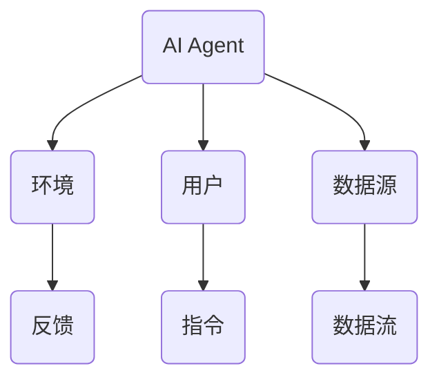
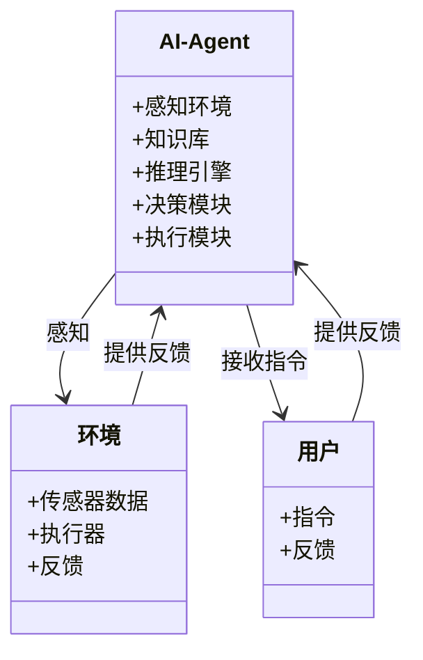
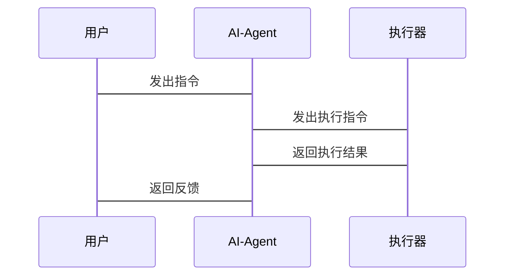

                 


```
# AI Agent在企业能源管理与碳排放控制中的应用

> 关键词：AI Agent, 企业能源管理, 碳排放控制, 多智能体系统, 强化学习, 碳中和

> 摘要：随着全球对可持续发展的关注增加，企业能源管理和碳排放控制的重要性日益凸显。AI Agent作为一种智能代理技术，正在成为解决这些复杂问题的有效工具。本文将深入探讨AI Agent的核心概念、算法原理、系统架构及其在企业能源管理与碳排放控制中的实际应用。通过详细的技术分析和实例说明，本文旨在为企业提供一种高效、智能化的能源管理与碳排放控制解决方案。

---

# 第一部分: AI Agent在企业能源管理与碳排放控制中的应用背景

# 第1章: AI Agent与企业能源管理概述

## 1.1 AI Agent的基本概念
### 1.1.1 AI Agent的定义
- AI Agent（智能体）是指能够感知环境并采取行动以实现目标的实体。
- 区分自主智能体与非自主智能体的关键特征。
- AI Agent的核心属性包括自主性、反应性、主动性、社会性等。

### 1.1.2 AI Agent的技术背景
- AI Agent的发展历程：从专家系统到现代智能体。
- AI Agent的主要技术：知识表示、推理、规划、学习等。
- AI Agent与传统自动化系统的区别：智能化、自主性和适应性。

### 1.1.3 AI Agent在能源管理中的应用现状
- 当前AI Agent在能源管理中的典型应用案例。
- AI Agent的优势：高效性、实时性和灵活性。

## 1.2 企业能源管理的背景与挑战
### 1.2.1 企业能源管理的定义
- 企业能源管理的概念：对企业能源的获取、使用和分配进行规划和优化。
- 企业能源管理的目标：降低成本、提高效率、减少环境影响。

### 1.2.2 当前企业能源管理的主要挑战
- 能源价格波动、政策变化对企业管理的影响。
- 数据获取的复杂性与不完整性。
- 多目标优化的难度：成本、效率、环保之间的平衡。

### 1.2.3 能源管理的数字化转型趋势
- 数字化技术对企业能源管理的推动作用。
- AI技术在能源管理中的应用趋势。

## 1.3 碳排放控制的重要性
### 1.3.1 碳排放的定义与计算方法
- 碳排放的定义：温室气体排放的量。
- 碳排放的计算方法：基于能源消耗、生产过程等的排放因子。

### 1.3.2 碳中和目标对企业的影响
- 碳中和目标的提出与全球政策背景。
- 碳中和对企业能源管理的要求：减少化石能源使用、增加可再生能源、优化能源结构。

### 1.3.3 碳排放控制的政策与市场驱动
- 政策驱动：碳排放交易、补贴政策等。
- 市场驱动：消费者环保意识的提升、绿色产品的需求增加。

## 1.4 AI Agent在能源管理中的应用前景
### 1.4.1 AI Agent在能源管理中的潜在应用场景
- 智能电网：负荷预测、配电优化、可再生能源整合。
- 工厂能源管理：设备优化、生产过程优化、能效监控。
- 建筑能效管理：智能 HVAC 系统、能耗监测、用户行为分析。

### 1.4.2 AI Agent的优势与局限性
- 优势：高效性、实时性、适应性。
- 局限性：数据依赖性、模型泛化能力、系统集成难度。

### 1.4.3 未来发展趋势与挑战
- 技术发展：强化学习、多智能体协同、边缘计算的结合。
- 市场应用：行业标准化、数据共享、政策支持。

## 1.5 本章小结
- 总结本章内容：AI Agent的基本概念、能源管理的挑战与趋势、碳排放控制的重要性，以及AI Agent的应用前景。

---

# 第二部分: AI Agent的核心概念与原理

# 第2章: AI Agent的核心概念与联系

## 2.1 AI Agent的原理与机制
### 2.1.1 AI Agent的基本工作原理
- 感知环境：通过传感器或数据源获取信息。
- 决策与规划：基于知识库和推理机制制定行动方案。
- 执行行动：通过执行器或系统接口实现目标。

### 2.1.2 知识表示与推理
- 知识表示方法：规则、框架、语义网络。
- 推理机制：逻辑推理、案例推理、模糊推理。

### 2.1.3 计划与决策过程
- 目标设定：明确问题目标和约束条件。
- 计划生成：基于知识库和推理机制生成多种计划。
- 决策优化：通过评估和优化选择最优方案。

## 2.2 AI Agent的核心概念对比
### 2.2.1 实体关系图（ER图）
- 实体：AI Agent、环境、用户、数据源。
- 关系：感知、决策、执行、反馈。

### 2.2.2 用例分析与场景描述
- 用例：负荷预测、设备优化、能效监控。
- 场景描述：不同场景下AI Agent的行为模式。

### 2.2.3 核心概念对比分析表
| 比较维度 | AI Agent | 传统自动化系统 |
|----------|-----------|----------------|
| 自主性   | 高         | 低             |
| 反应性   | 高         | 中             |
| 学习能力 | 高         | 无             |

## 2.3 AI Agent的实体关系图（Mermaid）



## 2.4 本章小结
- 详细阐述了AI Agent的核心概念与原理，通过对比分析和图示明确了AI Agent与其他系统的区别与联系。

---

# 第三部分: AI Agent的算法原理与数学模型

# 第3章: AI Agent的算法原理

## 3.1 多智能体协同算法
### 3.1.1 多智能体系统概述
- 多智能体系统的基本概念。
- 多智能体系统的优势：分布式计算、协同优化。

### 3.1.2 协作与竞争机制
- 协作机制：任务分配、信息共享。
- 竞争机制：资源分配、冲突解决。

### 3.1.3 联合推理与决策流程
- 联合推理：多个智能体协同推理。
- 分层决策：层次化决策结构。

## 3.2 强化学习在AI Agent中的应用
### 3.2.1 强化学习的基本原理
- 强化学习的定义：通过试错学习，最大化累积奖励。
- 状态、动作、奖励的关系。

### 3.2.2 Q-Learning算法
- Q-Learning的算法流程。
- Q值更新公式：Q(s, a) = Q(s, a) + α(max Q(s', a'))。

### 3.2.3 强化学习在能源管理中的应用
- 负荷预测：通过强化学习优化预测模型。
- 设备调度：基于强化学习进行设备启停决策。

## 3.3 本章小结
- 详细介绍了AI Agent中的多智能体协同算法和强化学习算法，分析了其在能源管理中的具体应用。

---

# 第四部分: AI Agent在企业能源管理中的应用实践

# 第4章: AI Agent在企业能源管理中的应用实践

## 4.1 问题场景介绍
### 4.1.1 智能电网中的负荷预测
- 负荷预测的定义与重要性。
- 当前负荷预测的主要挑战。

### 4.1.2 工厂能源管理中的设备优化
- 设备优化的定义与目标。
- 当前设备优化的主要问题。

## 4.2 系统功能设计
### 4.2.1 领域模型设计（Mermaid类图）


### 4.2.2 系统架构设计（Mermaid架构图）


### 4.2.3 系统接口设计
- API接口：RESTful API设计。
- 数据格式：JSON格式。

### 4.2.4 系统交互设计（Mermaid序列图）


## 4.3 项目实战
### 4.3.1 环境安装
- 操作系统：Linux/Windows/MacOS。
- 开发工具：Python、Jupyter Notebook、TensorFlow、Keras。

### 4.3.2 核心代码实现
#### 4.3.2.1 AI Agent类
```python
class AI-Agent:
    def __init__(self):
        self.perception = []
        self.knowledge_base = {}
        self.planner = Planner()
        self.executor = Executor()

    def perceive(self, environment):
        self.perception = environment.get_data()

    def decide(self, goal):
        plan = self.planner.plan(self.perception, goal)
        return plan

    def execute(self, plan):
        self.executor.execute(plan)
```

#### 4.3.2.2 知识库类
```python
class KnowledgeBase:
    def __init__(self):
        self.rules = {}
        self.frames = {}

    def update(self, data):
        pass
```

#### 4.3.2.3 执行器类
```python
class Executor:
    def execute(self, plan):
        pass
```

### 4.3.3 案例分析与解读
- 案例1：智能电网中的负荷预测。
- 案例2：工厂设备的能效优化。

## 4.4 项目小结
- 总结项目实现的关键步骤和成果。
- 强调AI Agent在能源管理中的实际应用价值。

---

# 第五部分: 最佳实践与未来展望

# 第5章: 最佳实践与未来展望

## 5.1 最佳实践
### 5.1.1 数据质量管理
- 数据清洗：去除噪声数据。
- 数据融合：多源数据的整合。

### 5.1.2 系统集成与协作
- 系统集成：与现有企业系统的无缝对接。
- 多智能体协作：优化系统整体性能。

## 5.2 小结
- 总结全文内容，强调AI Agent在企业能源管理与碳排放控制中的重要性。

## 5.3 未来展望
- 技术发展：AI Agent与边缘计算、物联网的结合。
- 应用拓展：更多行业的应用探索。

## 5.4 注意事项
- 数据隐私与安全。
- 系统可扩展性与维护性。

---

# 结语

随着全球对可持续发展的关注不断增加，AI Agent在企业能源管理与碳排放控制中的应用前景广阔。通过本文的详细分析与实践案例，读者可以深入理解AI Agent的核心概念、算法原理和系统架构，并掌握其在能源管理中的实际应用方法。未来，随着技术的不断发展，AI Agent将在更多领域发挥重要作用，为企业和社会创造更大的价值。

---

# 参考文献

（此处列出相关参考文献）

---

# 附录

（此处列出附录内容，如代码片段、数据表格等）
```

