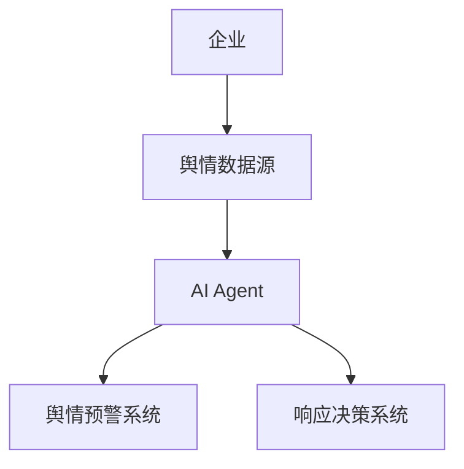
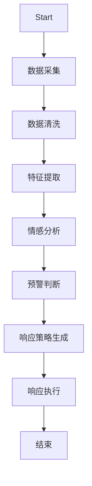
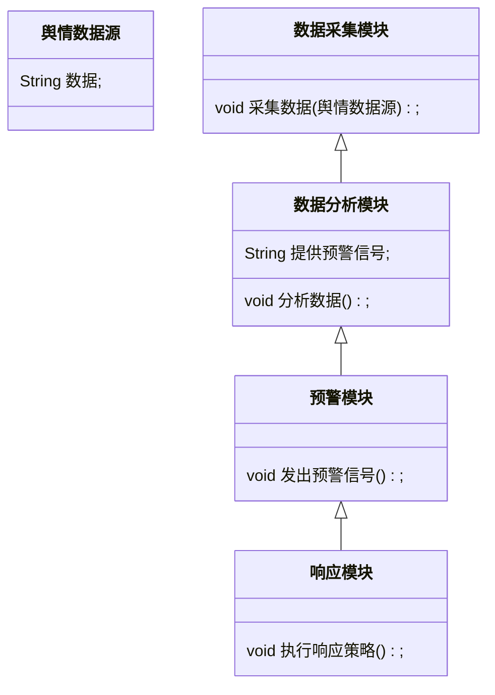
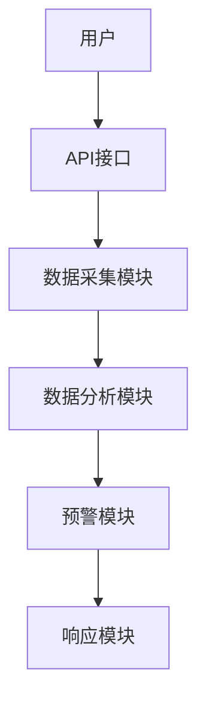
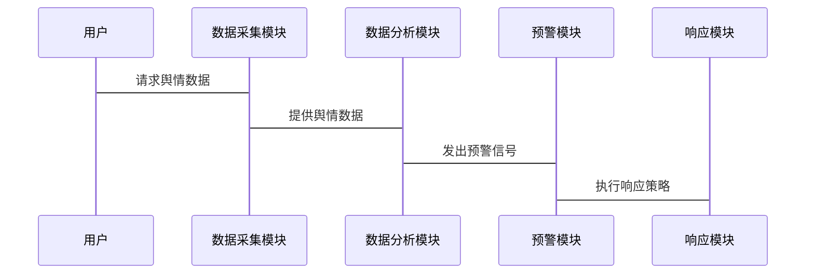

                 


# AI Agent在企业舆情危机预警与响应中的实时应用

> 关键词：AI Agent，舆情危机，实时预警，自然语言处理，机器学习

> 摘要：随着企业面临的舆情危机日益复杂化和多样化，传统的舆情监控方法已难以满足实时性和精准性的需求。本文将介绍AI Agent在企业舆情危机预警与响应中的实时应用，探讨其核心算法原理、系统架构设计及实际应用场景。通过自然语言处理和机器学习技术，AI Agent能够实现舆情数据的实时采集、智能分析和自主响应，为企业提供高效、可靠的舆情管理解决方案。

---

# 第一部分: 背景介绍

## 第1章: 舆情危机与AI Agent的基本概念

### 1.1 舆情危机的定义与特征
舆情危机是指企业在经营过程中，由于外部环境（如媒体、社交媒体、客户反馈等）或内部管理问题，导致公众对其形象、声誉或业务造成负面影响的突发事件。舆情危机具有突发性、传播速度快、影响范围广等特点，对企业声誉和经营稳定性构成严重威胁。

### 1.2 AI Agent的核心概念
AI Agent（人工智能代理）是一种能够感知环境、自主决策并执行任务的智能系统。它具备以下核心特征：
- **自主性**：能够在无需人工干预的情况下完成任务。
- **反应性**：能够实时感知环境变化并做出响应。
- **学习能力**：能够通过数据学习和优化自身行为。
- **协作性**：能够与其他系统或人类进行协同工作。

### 1.3 企业舆情危机预警与响应的背景
企业在经营过程中，面临着来自媒体、社交媒体、客户反馈等多种渠道的海量舆情信息。传统的舆情监控方法依赖于人工分析，存在以下问题：
- **效率低下**：无法实时处理海量数据。
- **精准性不足**：人工分析容易受到主观因素影响。
- **响应延迟**：在危机发生时，人工干预难以快速应对。

AI Agent的引入为企业舆情管理提供了新的解决方案。通过实时数据采集、智能分析和自主响应，AI Agent能够显著提升舆情管理的效率和精准性。

---

## 第2章: AI Agent在企业舆情管理中的应用背景

### 2.1 当前企业舆情管理的挑战
企业舆情管理面临以下主要挑战：
- **数据量大与实时性要求**：社交媒体等渠道每天产生的海量舆情数据，要求舆情监控系统具备高效的处理能力。
- **舆情信息的复杂性**：舆情信息往往包含多种情绪、意图和语境，需要复杂的自然语言处理技术进行分析。
- **人工监控的局限性**：人工监控容易受到主观因素和疲劳效应的影响，难以实现高效率和高精准度。

### 2.2 AI Agent在舆情管理中的优势
AI Agent通过智能化技术，能够显著提升舆情管理的效率和效果：
- **高效性与实时性**：AI Agent能够实时采集、分析和响应舆情信息，做到快速预警和处理。
- **智能分析与决策能力**：通过自然语言处理和机器学习技术，AI Agent能够准确识别舆情中的情绪、意图和趋势。
- **自适应与学习能力**：AI Agent能够通过不断学习优化自身的分析和响应能力。

---

## 第3章: AI Agent与企业舆情管理的核心概念

### 3.1 舆情数据的特征与分类
舆情数据具有以下特征：
- **文本性**：舆情数据主要以文本形式存在，包括社交媒体帖子、新闻文章、评论等。
- **情感性**：舆情数据中包含丰富的情感信息，如正面、负面、中性等。
- **时效性**：舆情数据的影响力具有时间敏感性，需要及时处理。

舆情数据可以按照以下方式进行分类：
- **按来源**：社交媒体、新闻媒体、论坛等。
- **按内容**：产品评价、服务反馈、品牌形象等。
- **按情感**：正面、负面、中性。

### 3.2 AI Agent的实体关系与功能模块
AI Agent在企业舆情管理中的实体关系如下：



AI Agent的主要功能模块包括：
- **数据采集模块**：实时采集舆情数据。
- **数据分析模块**：对舆情数据进行清洗、特征提取和情感分析。
- **预警模块**：根据分析结果生成预警信号。
- **响应模块**：根据预警信号生成响应策略并执行。

### 3.3 AI Agent在舆情管理中的工作流程
AI Agent的工作流程如下：



---

## 第4章: AI Agent的算法原理与数学模型

### 4.1 自然语言处理基础
自然语言处理（NLP）是AI Agent实现舆情分析的核心技术。常用的情感分析算法包括：

- **基于机器学习的情感分类**：
  ```python
  # 代码示例：基于逻辑回归的情感分类
  from sklearn.linear_model import LogisticRegression
  from sklearn.feature_extraction.text import TfidfVectorizer

  # 数据预处理
  vectorizer = TfidfVectorizer()
  X = vectorizer.fit_transform(texts)
  y = labels

  # 模型训练
  model = LogisticRegression()
  model.fit(X, y)

  # 预测
  print(model.predict(vectorizer.transform(["这是一个正面的评论"])))
  ```

- **基于深度学习的情感分类**：
  ```python
  # 代码示例：基于LSTM的情感分类
  import tensorflow as tf
  from tensorflow.keras import layers

  model = tf.keras.Sequential()
  model.add(layers.Embedding(input_dim= vocabulary_size, output_dim= embedding_dim))
  model.add(layers.LSTM(units= lstm_units))
  model.add(layers.Dense(units=1, activation='sigmoid'))

  model.compile(loss='binary_crossentropy', optimizer='adam', metrics=['accuracy'])
  model.fit(X_train, y_train, epochs=10, batch_size=32)
  ```

### 4.2 情感分析算法
情感分析的数学模型可以表示为：

$$ P(y=1 | x) = \frac{e^{w \cdot x + b}}{1 + e^{w \cdot x + b}} $$

其中：
- $x$ 是输入的文本特征向量。
- $w$ 和 $b$ 是模型的参数。
- $P(y=1 | x)$ 是文本为正面的概率。

### 4.3 舆情预测模型
舆情预测模型可以基于时间序列分析或深度学习模型（如LSTM）实现。以下是基于LSTM的舆情预测模型的代码示例：

```python
import numpy as np
from tensorflow.keras import layers

# 示例数据生成
time_steps = 30
features = np.random.randn(time_steps, 10)
labels = np.random.randint(2, size=time_steps)

model = tf.keras.Sequential()
model.add(layers.LSTM(50, input_shape=(None, 10)))
model.add(layers.Dense(1, activation='sigmoid'))
model.compile(loss='binary_crossentropy', optimizer='adam', metrics=['accuracy'])
model.fit(features, labels, epochs=5, batch_size=32)
```

---

## 第5章: 系统架构与设计

### 5.1 系统功能模块设计
系统功能模块设计如下：



### 5.2 系统架构设计
系统架构设计如下：



### 5.3 系统接口设计
系统接口设计如下：



---

## 第6章: 项目实战

### 6.1 环境安装
以下是项目实战所需的环境安装命令：

```bash
pip install numpy
pip install pandas
pip install scikit-learn
pip install tensorflow
pip install mermaid
```

### 6.2 系统核心实现源代码
以下是AI Agent的核心实现代码：

```python
# 数据采集模块
import requests
from bs4 import BeautifulSoup

def fetch_data(url):
    response = requests.get(url)
    soup = BeautifulSoup(response.text, 'html.parser')
    return [p.text for p in soup.find_all('p')]

# 数据分析模块
from sklearn.feature_extraction.text import TfidfVectorizer
from sklearn.linear_model import LogisticRegression

def analyze_data(texts, labels):
    vectorizer = TfidfVectorizer()
    X = vectorizer.fit_transform(texts)
    model = LogisticRegression()
    model.fit(X, labels)
    return model, vectorizer

# 预警模块
def generate预警信号(model, vectorizer, new_text):
    X_new = vectorizer.transform([new_text])
    return model.predict(X_new)[0]

# 响应模块
def execute_response(危机等级):
    if 危机等级 == '严重':
        print("启动危机公关策略")
    elif 危机等级 == '中等':
        print("加强监控并准备应对方案")
    else:
        print("继续观察")
```

### 6.3 实际案例分析
以下是一个实际案例分析：

假设某企业收到以下社交媒体评论：
- "这个产品的质量太差，根本不值得购买！"
- "虽然价格有点高，但整体体验还是不错的。"
- "客服态度非常差，以后不会再支持这个品牌。"

AI Agent会通过情感分析模型，将这些评论分类为负面、中性和负面。系统会发出预警信号，并启动相应的响应策略，如联系客户处理投诉、优化产品质量等。

---

## 第7章: 最佳实践

### 7.1 小结
本文详细介绍了AI Agent在企业舆情危机预警与响应中的实时应用，涵盖了背景、核心概念、算法原理、系统架构设计和项目实战等内容。

### 7.2 注意事项
- 在实际应用中，需要根据具体业务需求调整算法和系统架构。
- 数据隐私和安全问题需要特别关注。
- 模型的可解释性和透明度是实际应用中的重要考量因素。

### 7.3 拓展阅读
- 《深度学习实战》
- 《自然语言处理入门》
- 《机器学习算法与应用》

---

通过本文的介绍，读者可以全面了解AI Agent在企业舆情管理中的应用，掌握其实现原理和实际操作方法。希望本文能够为企业的舆情管理提供有价值的参考和指导。

