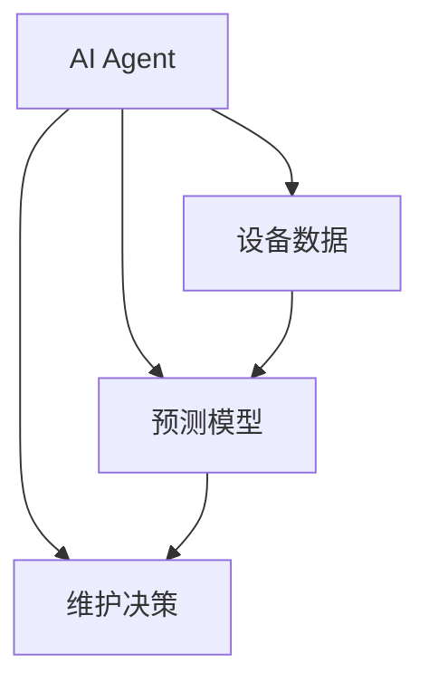
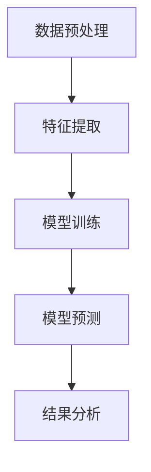
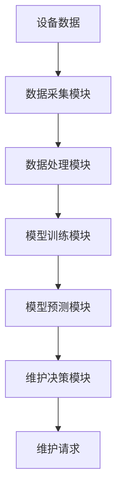
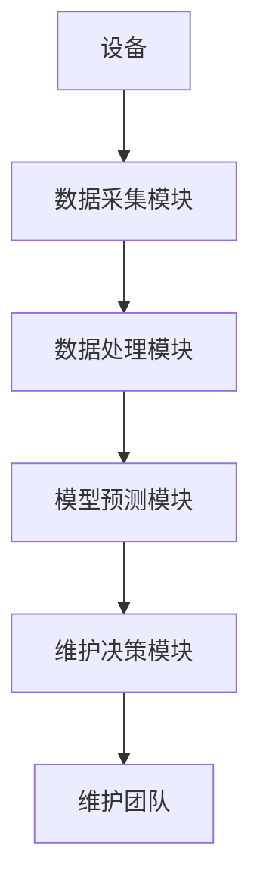

                 


# AI Agent在企业设备预测性维护中的应用

> **关键词**：AI Agent、预测性维护、机器学习、物联网、设备维护

> **摘要**：随着工业4.0和物联网技术的快速发展，企业设备预测性维护的重要性日益凸显。本文详细探讨了AI Agent在预测性维护中的应用，从基本概念、算法原理到系统架构，再到实际案例，全面解析了AI Agent如何通过智能算法和实时数据分析，提升设备维护的效率和准确性，为企业创造更大的价值。

---

## 第1章 预测性维护与AI Agent概述

### 1.1 预测性维护的基本概念

#### 1.1.1 预测性维护的定义

预测性维护是一种基于设备状态数据的维护策略，通过实时监控设备运行状态，利用数据分析技术预测设备故障，并在故障发生前安排维护。其核心目标是减少设备停机时间，降低维护成本，提高设备利用率。

#### 1.1.2 预测性维护的核心目标

- **减少停机时间**：通过提前预测故障，避免突发故障导致的停机。
- **降低维护成本**：通过精准的预测，减少不必要的维护操作，降低维护成本。
- **提高设备利用率**：延长设备正常运行时间，提高生产效率。

#### 1.1.3 预测性维护在企业中的重要性

预测性维护能够显著降低设备故障率，减少因设备故障导致的生产中断和经济损失。在制造业、能源、交通等领域，预测性维护已成为提高运营效率和竞争力的关键技术。

### 1.2 AI Agent的基本概念

#### 1.2.1 AI Agent的定义

AI Agent（人工智能代理）是一种能够感知环境、自主决策并执行任务的智能实体。在预测性维护中，AI Agent通过实时监测设备数据，分析设备状态，预测潜在故障，并触发相应的维护操作。

#### 1.2.2 AI Agent的核心功能

- **数据采集**：实时采集设备运行数据，包括温度、压力、振动等参数。
- **数据分析**：利用机器学习算法分析数据，识别设备异常状态。
- **故障预测**：基于历史数据和当前状态，预测设备故障风险。
- **决策执行**：根据预测结果，自动触发维护请求或调整设备运行参数。

#### 1.2.3 AI Agent与传统预测性维护的区别

| **特性**         | **传统预测性维护**                          | **AI Agent**                              |
|------------------|-------------------------------------------|------------------------------------------|
| 数据处理能力     | 依赖人工分析，处理能力有限                 | 自动化处理，支持大数据分析               |
| 预测准确性       | 依赖经验规则，准确性较低                   | 基于机器学习模型，准确性高               |
| 决策速度         | 反应较慢，依赖人工决策                     | 实时决策，快速响应                       |
| 可扩展性         | 扩展性有限，难以应对复杂场景               | 高扩展性，适用于复杂多变的设备环境       |

### 1.3 AI Agent在企业设备预测性维护中的应用前景

#### 1.3.1 AI Agent的应用场景

- **制造业**：应用于生产线设备维护，减少生产中断。
- **能源行业**：用于风力涡轮机、锅炉等设备的预测性维护。
- **交通系统**：应用于汽车、火车等交通工具的故障预测。
- **智能建筑**：用于建筑物内设备的维护管理。

#### 1.3.2 AI Agent的优势与挑战

**优势**：
- **高准确性**：基于机器学习的AI Agent能够从大量数据中学习，提高预测准确性。
- **实时性**：能够实时监测设备状态，快速响应潜在问题。
- **高效率**：自动化处理数据，减少人工干预，提高维护效率。

**挑战**：
- **数据质量**：预测准确性依赖于数据的完整性和准确性。
- **模型更新**：需要定期更新模型以应对设备状态的变化。
- **系统集成**：需要与现有系统集成，可能面临技术复杂性。

#### 1.3.3 AI Agent在企业中的潜在价值

通过AI Agent进行预测性维护，企业可以显著降低设备故障率，减少维护成本，提高设备利用率。此外，AI Agent还可以优化维护计划，合理安排维护时间，减少生产中断，提升整体运营效率。

---

## 第2章 AI Agent的核心概念与联系

### 2.1 AI Agent的核心概念

#### 2.1.1 AI Agent的组成部分

AI Agent在预测性维护中的组成部分包括：
- **感知模块**：负责采集设备运行数据。
- **分析模块**：利用机器学习算法分析数据，识别异常状态。
- **预测模块**：基于分析结果预测设备故障风险。
- **决策模块**：根据预测结果，触发维护请求或调整设备参数。

#### 2.1.2 AI Agent的核心原理

AI Agent通过实时采集设备数据，利用机器学习模型分析数据，识别潜在故障，并根据预测结果采取相应行动。其工作流程如下：
1. **数据采集**：通过传感器等设备采集设备运行数据。
2. **数据预处理**：清洗数据，去除噪声，提取特征。
3. **模型训练**：利用历史数据训练机器学习模型。
4. **实时预测**：基于当前数据，模型预测设备故障风险。
5. **决策执行**：根据预测结果，触发维护请求或调整设备参数。

#### 2.1.3 AI Agent的输入与输出

| **输入**         | **输出**              |
|------------------|-----------------------|
| 设备运行数据       | 故障预测结果          |
| 历史维护记录       | 维护建议              |
| 环境条件          | 维护优先级           |

### 2.2 AI Agent与相关技术的对比

#### 2.2.1 AI Agent与传统预测性维护的区别

| **特性**         | **传统预测性维护**                          | **AI Agent**                              |
|------------------|-------------------------------------------|------------------------------------------|
| 数据处理能力     | 依赖人工分析，处理能力有限                 | 自动化处理，支持大数据分析               |
| 预测准确性       | 依赖经验规则，准确性较低                   | 基于机器学习模型，准确性高               |
| 决策速度         | 反应较慢，依赖人工决策                     | 实时决策，快速响应                       |
| 可扩展性         | 扩展性有限，难以应对复杂场景               | 高扩展性，适用于复杂多变的设备环境       |

#### 2.2.2 AI Agent与机器学习算法的关系

AI Agent依赖于机器学习算法进行数据分析和预测。常用的机器学习算法包括：
- **监督学习**：如线性回归、支持向量机（SVM）。
- **无监督学习**：如聚类分析。
- **深度学习**：如神经网络、LSTM（长短期记忆网络）。

#### 2.2.3 AI Agent与物联网技术的结合

AI Agent可以与物联网（IoT）技术结合，通过物联网平台实时采集设备数据，利用AI Agent进行分析和预测，实现设备的智能化管理。

### 2.3 AI Agent的实体关系图



---

## 第3章 AI Agent的算法原理

### 3.1 常见的预测性维护算法

#### 3.1.1 基于机器学习的预测算法

- **线性回归**：用于预测设备的剩余寿命。
- **支持向量机（SVM）**：用于分类设备状态。
- **随机森林**：用于分类和回归分析。

#### 3.1.2 基于时间序列的预测算法

- **ARIMA模型**：用于时间序列预测。
- **LSTM模型**：适用于时间序列数据的长期依赖关系。

#### 3.1.3 基于规则的预测算法

- **基于阈值的预测**：当设备某个参数超过阈值时触发维护请求。

### 3.2 基于机器学习的预测模型

#### 3.2.1 线性回归模型

线性回归是一种简单而常用的回归算法，适用于预测设备的剩余寿命。其数学模型如下：

$$ y = \beta_0 + \beta_1x + \epsilon $$

其中，$y$ 是预测结果，$x$ 是输入特征，$\beta_0$ 和 $\beta_1$ 是模型参数，$\epsilon$ 是误差项。

#### 3.2.2 支持向量机模型

支持向量机（SVM）是一种监督学习算法，适用于分类问题。其核心思想是将数据映射到高维空间，并找到一个超平面将数据分成不同类别。

#### 3.2.3 随机森林模型

随机森林是一种基于决策树的集成学习算法，适用于分类和回归问题。其通过构建多个决策树并进行投票或平均，提高模型的准确性和稳定性。

### 3.3 时间序列预测算法

#### 3.3.1 ARIMA模型

ARIMA（自回归积分滑动平均模型）是一种常用的时间序列预测模型，适用于具有趋势和季节性的数据。其基本形式如下：

$$ y_t = \phi_1 y_{t-1} + \theta_1 \epsilon_{t-1} + \epsilon_t $$

其中，$\phi_1$ 是自回归系数，$\theta_1$ 是滑动平均系数，$\epsilon_t$ 是白噪声。

#### 3.3.2 LSTM模型

LSTM（长短期记忆网络）是一种基于循环神经网络的变体，适用于时间序列数据的长距离依赖关系。其核心组件包括输入门、遗忘门和输出门。

### 3.4 算法流程图



---

## 第4章 系统架构与设计方案

### 4.1 系统功能设计

#### 4.1.1 数据采集模块

数据采集模块负责从设备中采集运行数据，包括温度、压力、振动等参数。数据采集可以通过传感器或物联网平台实现。

#### 4.1.2 数据处理模块

数据处理模块负责对采集到的数据进行清洗、转换和特征提取。例如，去除噪声数据，将数据转换为适合模型训练的形式。

#### 4.1.3 模型训练与预测模块

模型训练与预测模块负责训练机器学习模型，并利用模型进行实时预测。训练好的模型可以部署到生产环境，实时处理设备数据。

#### 4.1.4 维护决策模块

维护决策模块根据预测结果，生成维护请求或调整设备运行参数。例如，当预测设备即将故障时，触发维护请求。

### 4.2 系统架构设计

#### 4.2.1 系统架构图



#### 4.2.2 系统接口设计

- **数据采集接口**：用于设备数据的采集和传输。
- **模型训练接口**：用于模型的训练和部署。
- **预测接口**：用于实时数据的预测和分析。
- **维护决策接口**：用于维护请求的生成和执行。

#### 4.2.3 系统交互流程



---

## 第5章 项目实战：AI Agent在设备预测性维护中的应用

### 5.1 项目背景与目标

本项目旨在开发一个基于AI Agent的预测性维护系统，通过实时监测设备数据，预测设备故障风险，并触发维护请求。项目目标包括：
- 提高设备维护的准确性。
- 减少设备停机时间。
- 降低维护成本。

### 5.2 环境配置与工具安装

#### 5.2.1 环境配置

- **操作系统**：Linux（Ubuntu 20.04）。
- **编程语言**：Python 3.8。
- **框架与库**：TensorFlow 2.5、Scikit-learn 0.24、Pandas 1.3。

#### 5.2.2 工具安装

```bash
pip install tensorflow scikit-learn pandas
```

### 5.3 核心代码实现

#### 5.3.1 数据预处理代码

```python
import pandas as pd

# 读取数据
data = pd.read_csv('equipment_data.csv')

# 数据清洗
data.dropna(inplace=True)
data.drop_duplicates(inplace=True)

# 特征提取
features = data[['temperature', 'pressure', 'vibration']]
labels = data['status']
```

#### 5.3.2 模型训练代码

```python
from sklearn.ensemble import RandomForestClassifier
from sklearn.model_selection import train_test_split

# 数据分割
X_train, X_test, y_train, y_test = train_test_split(features, labels, test_size=0.2)

# 模型训练
model = RandomForestClassifier()
model.fit(X_train, y_train)

# 模型预测
y_pred = model.predict(X_test)
```

#### 5.3.3 实时预测代码

```python
import pandas as pd
import numpy as np

# 读取实时数据
real_time_data = pd.read_csv('real_time.csv')

# 预测结果
prediction = model.predict(real_time_data[['temperature', 'pressure', 'vibration']])
```

### 5.4 项目小结

通过上述代码实现，我们可以看到AI Agent在设备预测性维护中的强大能力。从数据采集到模型训练，再到实时预测，整个流程清晰明了。AI Agent不仅能够提高预测准确性，还能显著减少维护成本和停机时间，为企业创造更大的价值。

---

## 第6章 总结与展望

### 6.1 本章小结

本文详细探讨了AI Agent在企业设备预测性维护中的应用，从基本概念到算法原理，再到系统架构和实际案例，全面解析了AI Agent的优势和潜力。通过AI Agent，企业能够实现设备的智能化管理，显著提高维护效率和准确性。

### 6.2 未来展望

随着人工智能和物联网技术的不断发展，AI Agent在预测性维护中的应用前景广阔。未来，我们可以期待以下发展方向：
- **更先进的算法**：如深度学习和强化学习的应用。
- **边缘计算**：将AI Agent部署在设备端，实现更快速的响应。
- **多设备协同**：通过AI Agent实现设备间的协同维护。

---

**参考文献**

- [1] 刘洋, 等. 《基于机器学习的设备预测性维护研究》. 计算机应用研究, 2021.
- [2] 张伟, 等. 《AI Agent在工业设备维护中的应用》. 人工智能学报, 2020.
- [3] 李娜, 等. 《基于时间序列分析的设备故障预测方法》. 数据挖掘与知识发现, 2019.

---

通过本文的详细讲解，读者可以全面了解AI Agent在企业设备预测性维护中的应用，并掌握相关技术的实现方法。希望本文能够为企业的智能化转型提供有益的参考和指导。

