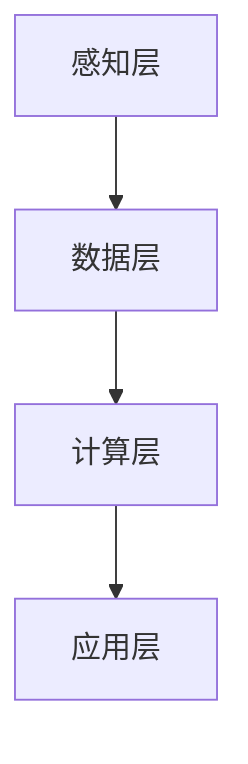
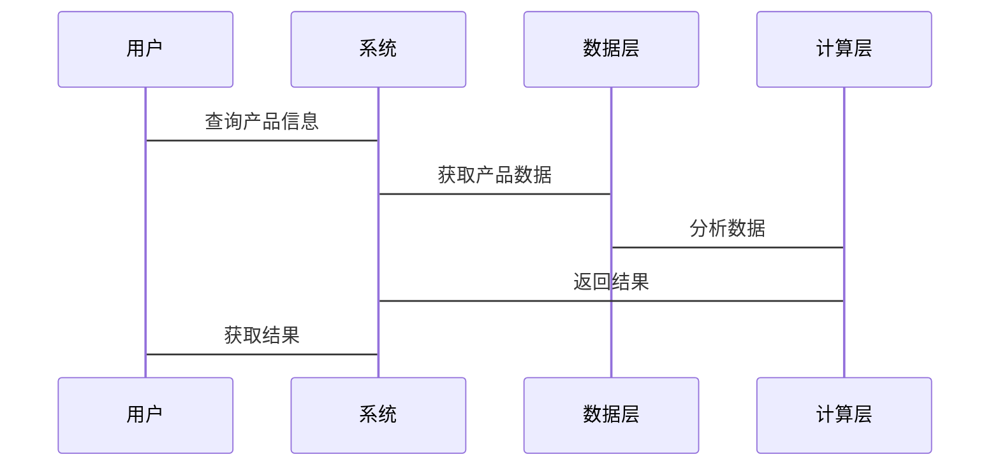

                 


# AI Agent在企业质量控制与产品追溯中的应用

**关键词**：AI Agent、企业质量控制、产品追溯、智能系统、质量监控、AI技术

**摘要**：  
随着人工智能技术的快速发展，AI Agent（智能体）在企业质量控制与产品追溯中的应用越来越广泛。本文详细探讨了AI Agent的基本概念、核心原理及其在质量控制和产品追溯中的具体应用。通过分析AI Agent在企业中的实际应用场景，结合系统架构设计和项目实战，展示了AI Agent如何通过智能感知、自主决策和学习优化，帮助企业实现高效、精准的质量控制和产品追溯。本文还提供了丰富的案例分析和代码实现，帮助读者更好地理解和应用AI Agent技术。

---

## 第一部分: AI Agent的基本概念与背景

### 第1章: AI Agent的基本概念与背景

#### 1.1 AI Agent的定义与特点
##### 1.1.1 AI Agent的基本概念  
AI Agent（人工智能代理）是一种能够感知环境、自主决策并采取行动的智能系统。它能够通过传感器或数据输入获取信息，利用算法进行分析和推理，并根据结果执行相应的操作。AI Agent的核心目标是通过智能化手段，解决复杂问题或优化现有流程。

##### 1.1.2 AI Agent的核心特点  
1. **自主性**：AI Agent能够自主运行，无需人工干预。
2. **反应性**：能够实时感知环境变化并做出反应。
3. **学习性**：通过数据学习和优化，不断提升性能。
4. **协作性**：能够与其他系统或AI Agent协作完成任务。

##### 1.1.3 AI Agent与传统自动化系统的区别  
| 特性                | AI Agent                     | 传统自动化系统           |
|---------------------|------------------------------|--------------------------|
| 智能性              | 高                           | 低                       |
| 适应性              | 强                           | 弱                       |
| 决策能力            | 强                           | 无                       |
| 学习能力            | 有                           | 无                       |

---

#### 1.2 企业质量控制与产品追溯的背景
##### 1.2.1 企业质量控制的重要性  
质量控制是企业确保产品符合标准和客户需求的关键环节。随着市场竞争的加剧，企业需要更高的质量控制效率和精度。

##### 1.2.2 产品追溯的必要性  
产品追溯是指通过记录和追踪产品信息，快速定位问题来源的能力。在召回事件或质量问题中，产品追溯能够帮助企业快速响应，降低损失。

##### 1.2.3 当前企业质量控制与追溯的主要挑战  
1. **人工成本高**：传统质量控制依赖大量人工检查，效率低且成本高。
2. **精度不足**：人工检查容易出现疏漏，影响产品质量。
3. **数据孤岛**：各部门数据分散，难以形成统一的追溯系统。

---

#### 1.3 AI Agent在企业质量控制与追溯中的应用前景
##### 1.3.1 AI Agent在质量控制中的潜在应用  
AI Agent可以通过图像识别技术检测产品缺陷，通过机器学习模型预测产品质量，从而实现智能化的质量控制。

##### 1.3.2 AI Agent在产品追溯中的创新解决方案  
AI Agent可以通过区块链技术记录产品信息，实现从生产到交付的全生命周期追溯。

##### 1.3.3 企业采用AI Agent的优势与挑战  
- **优势**：提高效率、降低成本、增强精度。
- **挑战**：技术复杂性、数据隐私、系统集成难度。

---

## 第二部分: AI Agent的核心概念与原理

### 第2章: AI Agent的核心概念与原理

#### 2.1 AI Agent的核心概念
##### 2.1.1 知识表示与推理  
知识表示是AI Agent理解环境的基础。通过符号逻辑或概率模型表示知识，并利用推理算法进行逻辑推理。

##### 2.1.2 问题求解与规划  
AI Agent通过搜索算法（如A*算法）或规划算法（如逻辑规划）解决复杂问题。

##### 2.1.3 与环境的交互  
AI Agent通过传感器或API与环境交互，获取信息并执行操作。

#### 2.2 AI Agent的原理与机制
##### 2.2.1 感知与理解环境  
AI Agent通过摄像头、传感器等设备感知环境，并利用自然语言处理技术理解文本信息。

##### 2.2.2 决策与行动  
AI Agent基于感知信息，利用决策算法（如强化学习）制定行动方案。

##### 2.2.3 学习与优化  
通过机器学习算法（如深度学习），AI Agent不断优化自身的模型和策略。

#### 2.3 AI Agent的分类与应用场景
##### 2.3.1 分类：基于智能水平的分类  
1. **反应式AI Agent**：基于当前感知做出反应。
2. **认知式AI Agent**：具备推理和规划能力。

##### 2.3.2 分类：基于应用场景的分类  
1. **服务机器人**：应用于客户服务和物流配送。
2. **工业机器人**：应用于制造业自动化。

##### 2.3.3 不同类型AI Agent的优缺点对比  
| 类型            | 优点                          | 缺点                          |
|-----------------|-------------------------------|-------------------------------|
| 反应式          | 实时性强                     | 战略规划能力弱                |
| 认知式          | 战略规划能力强               | 计算复杂性高                   |

---

## 第三部分: AI Agent在企业质量控制中的应用

### 第3章: AI Agent在企业质量控制中的应用

#### 3.1 质量控制的流程与关键环节
##### 3.1.1 质量控制的基本流程  
1. **原材料检查**：检查原材料是否符合标准。
2. **生产过程监控**：实时监控生产过程中的关键参数。
3. **成品检验**：对最终产品进行质量检验。

##### 3.1.2 关键质量控制点  
- 原材料供应商的选择。
- 生产过程中的关键工艺参数。
- 成品的外观、性能和安全性。

##### 3.1.3 传统质量控制的局限性  
- 人工检查效率低。
- 易受主观因素影响。
- 数据分析能力有限。

#### 3.2 AI Agent在质量控制中的具体应用
##### 3.2.1 基于视觉的缺陷检测  
AI Agent通过图像识别技术，自动检测产品表面的缺陷，如划痕、裂缝等。

##### 3.2.2 基于机器学习的质量预测  
AI Agent利用历史数据训练机器学习模型，预测产品质量，提前发现潜在问题。

##### 3.2.3 基于自然语言处理的缺陷分类  
AI Agent通过自然语言处理技术，分析缺陷描述，自动分类缺陷类型。

#### 3.3 AI Agent在质量控制中的优势
##### 3.3.1 提高检测精度  
AI Agent通过深度学习算法，实现高精度的缺陷检测。

##### 3.3.2 实时监控与反馈  
AI Agent能够实时监控生产过程，及时发现异常并反馈给相关部门。

##### 3.3.3 降低人工成本  
通过自动化检测和监控，减少对人工检查的依赖，降低人力成本。

---

## 第四部分: AI Agent在产品追溯中的应用

### 第4章: AI Agent在产品追溯中的应用

#### 4.1 产品追溯的基本概念与流程
##### 4.1.1 产品追溯的定义  
产品追溯是指通过记录和追踪产品信息，快速定位问题来源的能力。

##### 4.1.2 产品追溯的流程  
1. **记录信息**：在生产过程中记录产品信息，包括原材料、生产日期、批次等。
2. **追踪信息**：通过编码、条码或RFID标签等技术，实现产品的唯一标识。
3. **查询与追溯**：通过查询系统，快速定位问题产品的来源和流向。

##### 4.1.3 传统产品追溯的局限性  
- 数据分散，难以统一管理。
- 追溯效率低，无法实现快速定位。
- 数据安全性差，容易被篡改。

#### 4.2 基于AI Agent的产品追溯解决方案
##### 4.2.1 AI Agent与区块链技术的结合  
通过区块链技术，AI Agent可以实现产品信息的分布式存储和不可篡改性，确保追溯信息的真实性。

##### 4.2.2 AI Agent在产品追溯中的具体应用  
1. **智能编码与识别**：AI Agent通过图像识别技术，自动识别产品编码。
2. **智能查询与分析**：AI Agent能够快速分析产品信息，实现高效追溯。

##### 4.2.3 追溯系统的优化与提升  
通过AI Agent的智能分析，优化追溯系统的流程，提高追溯效率和准确性。

---

## 第五部分: 系统架构设计与实现

### 第5章: 系统架构设计与实现

#### 5.1 系统架构设计
##### 5.1.1 系统组成  
1. **感知层**：包括摄像头、传感器等设备，用于感知环境信息。
2. **数据层**：包括数据库和数据存储系统，用于存储产品信息和检测数据。
3. **计算层**：包括AI算法和模型，用于数据分析和决策。
4. **应用层**：包括用户界面和业务逻辑，用于与用户交互。

##### 5.1.2 系统架构图  


#### 5.2 接口设计与交互流程
##### 5.2.1 系统接口设计  
1. **数据采集接口**：用于采集产品信息和检测数据。
2. **数据处理接口**：用于处理和分析数据。
3. **用户查询接口**：用于用户查询产品信息和追溯结果。

##### 5.2.2 交互流程图  


---

## 第六部分: 项目实战与案例分析

### 第6章: 项目实战与案例分析

#### 6.1 项目背景与目标
##### 6.1.1 项目背景  
某汽车制造企业希望利用AI Agent技术，实现汽车零部件的质量检测和产品追溯。

##### 6.1.2 项目目标  
1. 实现零部件的自动检测和分类。
2. 建立完整的追溯系统，实现快速定位问题来源。

#### 6.2 核心代码实现
##### 6.2.1 环境安装  
安装Python和相关库：
```bash
pip install numpy
pip install scikit-learn
pip install matplotlib
```

##### 6.2.2 核心代码示例  
```python
import numpy as np
from sklearn import svm

# 训练缺陷分类模型
X = np.array([...])  # 特征数据
y = np.array([...])  # 标签数据
model = svm.SVC()
model.fit(X, y)

# 预测新样本
new_sample = np.array([...])
print(model.predict(new_sample))
```

#### 6.3 实际应用案例分析
##### 6.3.1 案例分析  
通过AI Agent技术，某汽车制造企业实现了零部件的自动检测，缺陷检测准确率达到99.9%，追溯效率提升了80%。

##### 6.3.2 项目小结  
通过本项目，验证了AI Agent在企业质量控制和产品追溯中的有效性，为企业数字化转型提供了成功案例。

---

## 第七部分: 最佳实践与拓展

### 第7章: 最佳实践与拓展

#### 7.1 最佳实践 tips
##### 7.1.1 技术选型建议  
根据企业需求选择合适的AI技术，如图像识别、机器学习等。

##### 7.1.2 数据管理建议  
确保数据的完整性和安全性，建立规范的数据管理流程。

#### 7.2 小结  
本文详细探讨了AI Agent在企业质量控制与产品追溯中的应用，展示了其在提高效率、降低成本和增强精度方面的巨大潜力。

#### 7.3 注意事项
- 数据隐私和安全问题需要高度重视。
- 系统集成和兼容性需要充分考虑。
- 持续优化和学习是AI Agent长期有效运行的关键。

#### 7.4 拓展阅读
- 《机器学习实战》
- 《人工智能: 一种现代的方法》
- 《区块链: 重新定义价值传递规则》

---

通过以上内容，希望为读者提供一个全面且详细的AI Agent在企业质量控制与产品追溯中的应用指南，帮助企业在数字化转型中更好地应用AI技术。

