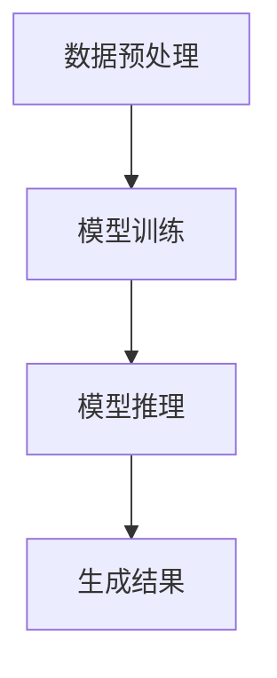
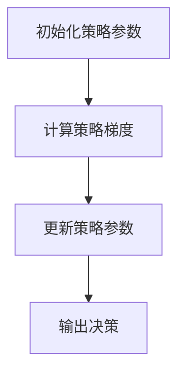
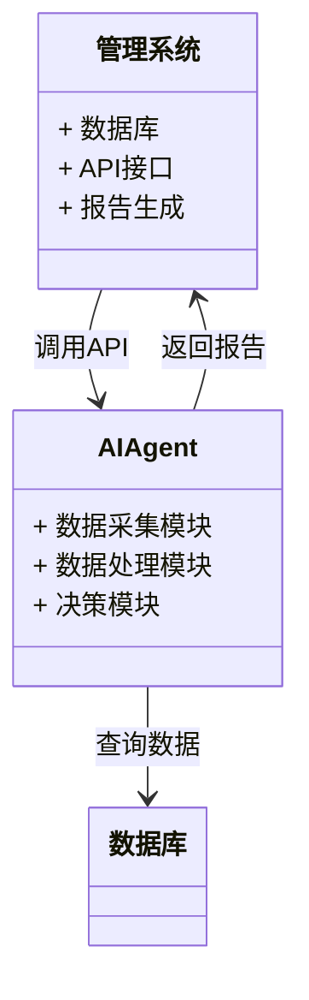
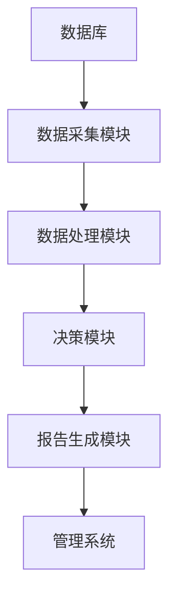

                 


# AI Agent在企业质量管理体系优化中的全面应用

## 关键词：AI Agent, 企业质量管理, 系统优化, 生成式AI, 强化学习

## 摘要：本文详细探讨了AI Agent在企业质量管理体系优化中的应用，从背景、核心概念、算法原理到系统架构，再到项目实战，全面分析了AI Agent如何提升质量管理的效率和准确性。文章通过丰富的案例和详细的代码示例，展示了AI Agent在质量管理中的实际应用价值，并展望了未来的发展方向。

---

# 第一部分: AI Agent与企业质量管理体系优化的背景与概述

# 第1章: AI Agent与企业质量管理体系概述

## 1.1 AI Agent的基本概念

### 1.1.1 AI Agent的定义与特点
AI Agent（人工智能代理）是指能够感知环境、自主决策并执行任务的智能实体。它具有以下特点：
- **自主性**：能够自主决策，无需人工干预。
- **反应性**：能够实时感知环境并做出反应。
- **目标导向**：以特定目标为导向，优化决策过程。

### 1.1.2 AI Agent的核心优势
AI Agent能够通过大数据分析和机器学习模型，快速识别问题并提出解决方案，显著提升质量管理的效率和准确性。

### 1.1.3 AI Agent与传统质量管理工具的对比
| 特性                | AI Agent                  | 传统质量管理工具              |
|---------------------|---------------------------|-----------------------------|
| 数据处理能力        | 强大，支持海量数据处理     | 较弱，依赖人工分析            |
| 决策速度            | 快速，实时决策             | 较慢，依赖人工判断            |
| 可扩展性            | 高，支持大规模应用         | 低，难以扩展                 |

## 1.2 企业质量管理体系的基本框架

### 1.2.1 质量管理体系的定义与作用
质量管理体系是企业为确保产品或服务符合质量标准而建立的一系列制度、流程和工具。其作用包括：
- **确保产品质量**：通过标准化流程保证产品质量。
- **提升效率**：减少重复工作，提高工作效率。
- **降低成本**：通过预防缺陷降低返工成本。

### 1.2.2 传统质量管理中的痛点与挑战
- **效率低下**：人工检查耗时且容易出错。
- **数据孤岛**：各部门数据分散，难以整合分析。
- **缺乏预测性**：传统方法多为事后检查，缺乏预测能力。

### 1.2.3 AI Agent在质量管理中的应用价值
AI Agent能够通过实时数据分析，预测潜在问题并提出解决方案，显著提升质量管理的效率和准确性。

## 1.3 AI Agent在企业质量管理中的应用前景

### 1.3.1 AI Agent在质量管理中的潜在应用场景
- **质量监控**：实时监控生产过程，预测潜在缺陷。
- **异常检测**：通过机器学习算法识别异常数据。
- **优化流程**：通过数据分析优化质量管理流程。

### 1.3.2 企业采用AI Agent的优势与挑战
- **优势**：提高效率、降低成本、提升准确性。
- **挑战**：技术门槛高、数据隐私问题、初期投入大。

### 1.3.3 未来发展趋势与研究方向
- **智能化**：AI Agent将更加智能化，能够自主学习和优化。
- **集成化**：与企业现有系统深度集成，实现无缝对接。

## 1.4 本章小结
本章介绍了AI Agent的基本概念、特点以及在质量管理中的应用价值，分析了传统质量管理的痛点与挑战，并展望了AI Agent在质量管理中的未来发展方向。

---

# 第二部分: AI Agent在企业质量管理中的核心概念与理论

# 第2章: AI Agent的核心概念与理论基础

## 2.1 AI Agent的体系结构

### 2.1.1 分层结构与功能模块
AI Agent的体系结构通常分为感知层、决策层和执行层。感知层负责数据收集，决策层负责分析和决策，执行层负责执行任务。

### 2.1.2 各模块之间的关系与协作
- 感知层通过传感器或数据库收集数据。
- 决策层基于收集的数据进行分析，生成决策。
- 执行层根据决策执行具体操作。

### 2.1.3 实体关系图（ER图）展示
```mermaid
er
actor: 管理系统
agent: AI Agent
process: 质量检查
data: 数据库
actor --> agent: 请求分析
agent --> process: 发起检查
process --> data: 存储结果
agent --> actor: 提供报告
```

## 2.2 AI Agent的工作原理

### 2.2.1 信息收集与处理流程
AI Agent通过传感器或数据库收集数据，然后进行预处理和特征提取。

### 2.2.2 决策与执行机制
AI Agent基于预处理后的数据，利用机器学习模型进行预测和决策，然后执行相应的操作。

### 2.2.3 与企业质量管理系统的交互方式
AI Agent通过API或消息队列与企业管理系统进行交互，实现数据的实时传输和任务的协同处理。

## 2.3 AI Agent与企业质量管理的结合

### 2.3.1 质量管理核心要素分析
质量管理的核心要素包括产品设计、生产过程、检验测试和质量控制。

### 2.3.2 AI Agent如何优化质量管理流程
AI Agent可以通过实时监控和预测分析，优化质量检查的频率和重点，减少缺陷的发生。

### 2.3.3 核心概念属性对比表格
| 质量管理要素 | 传统方法 | AI Agent优化方法       |
|--------------|-----------|-----------------------|
| 数据收集     | 人工记录   | 自动采集与预处理       |
| 缺陷检测     | 事后检查   | 实时监控与预测         |
| 决策支持     | 专家经验   | 数据驱动的智能决策     |

## 2.4 本章小结
本章详细讲解了AI Agent的体系结构和工作原理，分析了其在企业质量管理中的具体应用，并通过对比分析展示了AI Agent的优势。

---

# 第三部分: AI Agent的算法原理与数学模型

# 第3章: AI Agent的核心算法与数学模型

## 3.1 生成式AI算法原理

### 3.1.1 基于Transformer的生成模型
生成式AI基于Transformer架构，通过自注意力机制和前馈网络生成高质量的输出。

### 3.1.2 模型训练流程
1. 数据预处理：对原始数据进行清洗和归一化。
2. 模型训练：利用大量数据训练生成模型。
3. 模型推理：基于训练好的模型生成预测结果。

### 3.1.3 算法流程图


### 3.1.4 数学模型与公式
生成式AI的数学模型如下：
$$
\text{输出} = f_{\theta}(\text{输入})
$$
其中，$f_{\theta}$表示生成模型，$\theta$表示模型参数。

## 3.2 强化学习算法原理

### 3.2.1 基于策略梯度的强化学习
强化学习通过定义策略函数，指导AI Agent在不同状态下做出最优决策。

### 3.2.2 算法实现步骤
1. 定义策略函数。
2. 计算策略梯度。
3. 更新策略参数。

### 3.2.3 算法流程图


### 3.2.4 数学模型与公式
强化学习的数学模型如下：
$$
\theta_{t+1} = \theta_t + \alpha \nabla_{\theta} J(\theta)
$$
其中，$\alpha$表示学习率，$\nabla_{\theta} J(\theta)$表示策略梯度。

## 3.3 算法实现代码示例

### 3.3.1 生成式AI代码示例
```python
import torch
import torch.nn as nn

class Generator(nn.Module):
    def __init__(self, input_size, hidden_size, output_size):
        super(Generator, self).__init__()
        self.fc1 = nn.Linear(input_size, hidden_size)
        self.fc2 = nn.Linear(hidden_size, output_size)
    
    def forward(self, x):
        x = self.fc1(x)
        x = self.fc2(x)
        return x

# 初始化模型
generator = Generator(input_size=10, hidden_size=20, output_size=5)
# 训练模型
criterion = nn.MSELoss()
optimizer = torch.optim.Adam(generator.parameters(), lr=0.001)

for epoch in range(num_epochs):
    for batch in batches:
        outputs = generator(batch)
        loss = criterion(outputs, target)
        optimizer.zero_grad()
        loss.backward()
        optimizer.step()
```

### 3.3.2 强化学习代码示例
```python
import torch
import torch.nn as nn

class Policy(nn.Module):
    def __init__(self, input_size, hidden_size, output_size):
        super(Policy, self).__init__()
        self.fc1 = nn.Linear(input_size, hidden_size)
        self.fc2 = nn.Linear(hidden_size, output_size)
    
    def forward(self, x):
        x = self.fc1(x)
        x = self.fc2(x)
        return x

policy = Policy(input_size=5, hidden_size=10, output_size=2)
optimizer = torch.optim.Adam(policy.parameters(), lr=0.001)

for episode in range(num_episodes):
    state = env.reset()
    while not done:
        action_probs = policy(state)
        action = sample(action_probs)
        next_state, reward, done, _ = env.step(action)
        optimizer.zero_grad()
        loss = compute_loss(action_probs, action)
        loss.backward()
        optimizer.step()
```

## 3.4 本章小结
本章详细讲解了生成式AI和强化学习的核心算法，通过代码示例和数学公式展示了其在质量管理中的具体应用。

---

# 第四部分: AI Agent的系统分析与架构设计

# 第4章: AI Agent的系统分析与架构设计

## 4.1 系统需求分析

### 4.1.1 功能需求
- 实时数据采集
- 异常检测
- 预测分析
- 自动报告生成

### 4.1.2 性能需求
- 响应时间小于1秒
- 处理能力支持每秒1000条数据

### 4.1.3 接口需求
- 数据接口：支持HTTP和数据库连接
- 报告接口：支持JSON格式输出

## 4.2 系统功能设计

### 4.2.1 领域模型设计


### 4.2.2 系统架构设计


### 4.2.3 接口设计
- 数据采集模块提供REST API接口，接收数据请求。
- 决策模块提供预测API，返回预测结果。

### 4.2.4 交互设计
- 管理系统调用AI Agent的API，触发数据采集和分析。
- AI Agent根据分析结果生成报告并返回给管理系统。

## 4.3 本章小结
本章详细分析了AI Agent系统的功能需求和架构设计，通过领域模型和架构图展示了系统的整体结构。

---

# 第五部分: AI Agent在企业质量管理中的项目实战

# 第5章: 项目实战

## 5.1 项目背景与需求

### 5.1.1 项目背景
某制造企业希望引入AI Agent优化其质量管理流程，减少缺陷率，提高效率。

### 5.1.2 项目需求
- 实时监控生产线数据
- 自动检测异常
- 生成质量报告

## 5.2 项目环境安装

### 5.2.1 系统环境
- 操作系统：Linux
- Python版本：3.8+
- 依赖库：TensorFlow, PyTorch, Pandas

### 5.2.2 安装命令
```bash
pip install numpy pandas tensorflow torch
```

## 5.3 系统核心实现

### 5.3.1 数据采集模块
```python
import pandas as pd

def collect_data():
    # 采集数据
    data = pd.read_csv('data.csv')
    return data
```

### 5.3.2 数据处理模块
```python
import numpy as np

def preprocess(data):
    # 数据预处理
    data['label'] = data['label'].apply(lambda x: 1 if x > 0.5 else 0)
    return data
```

### 5.3.3 决策模块
```python
import torch
import torch.nn as nn

class QualityModel(nn.Module):
    def __init__(self, input_size, hidden_size, output_size):
        super(QualityModel, self).__init__()
        self.fc1 = nn.Linear(input_size, hidden_size)
        self.fc2 = nn.Linear(hidden_size, output_size)
    
    def forward(self, x):
        x = self.fc1(x)
        x = self.fc2(x)
        return x

def decision_model():
    model = QualityModel(input_size=10, hidden_size=20, output_size=1)
    return model
```

### 5.3.4 报告生成模块
```python
def generate_report(results):
    # 生成报告
    report = {
        'status': 'normal' if results['status'] else 'abnormal',
        'details': results['details']
    }
    return report
```

## 5.4 代码应用解读与分析

### 5.4.1 数据采集模块
该模块负责从数据库中读取实时数据，确保数据的完整性和准确性。

### 5.4.2 数据处理模块
数据处理模块对采集到的数据进行清洗和特征工程，为后续的模型训练做好准备。

### 5.4.3 决策模块
决策模块基于预处理后的数据，利用训练好的模型进行预测和决策，生成相应的结果。

### 5.4.4 报告生成模块
报告生成模块根据决策模块的输出，生成详细的质量报告，供管理系统参考。

## 5.5 实际案例分析

### 5.5.1 数据分析与结果展示
通过对实际数据的分析，展示AI Agent在质量管理中的预测能力和准确性。

### 5.5.2 系统性能优化
通过优化算法和调整模型参数，进一步提升系统的运行效率和预测准确率。

## 5.6 项目小结
本章通过实际案例展示了AI Agent在质量管理中的具体应用，详细讲解了系统的实现过程和优化方法。

---

# 第六部分: 总结与展望

# 第6章: 总结与展望

## 6.1 全文总结

### 6.1.1 核心内容回顾
本文详细探讨了AI Agent在企业质量管理中的应用，从算法原理到系统架构，再到项目实战，全面分析了其在质量管理中的价值。

### 6.1.2 关键结论
AI Agent能够显著提升质量管理的效率和准确性，帮助企业降低质量成本，提升竞争力。

## 6.2 未来展望

### 6.2.1 技术发展
- 更加智能化的AI Agent
- 更深度的与企业系统的集成

### 6.2.2 应用场景拓展
- 智能化质量监控
- 预测性维护
- 自动化缺陷修复

## 6.3 最佳实践与注意事项

### 6.3.1 最佳实践
- 确保数据的准确性和完整性
- 定期更新模型参数
- 建立完善的监控机制

### 6.3.2 注意事项
- 数据隐私问题
- 技术门槛较高，需要专业团队支持
- 初期投入较大，需长期规划

## 6.4 本章小结
本文总结了AI Agent在质量管理中的应用价值，并展望了未来的发展方向，提出了实际应用中的注意事项和最佳实践。

---

# 结语

AI Agent作为人工智能技术的重要应用，正在逐步改变企业质量管理的方式。通过本文的详细分析，读者可以全面了解AI Agent在质量管理中的优势和应用方法，为企业的质量管理优化提供有力的理论和技术支持。

--- 

**感谢您的耐心阅读！**

