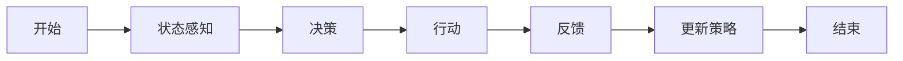
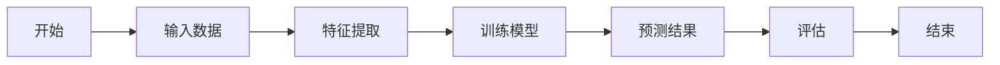
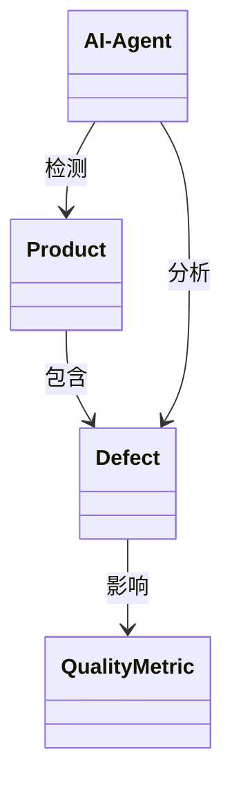
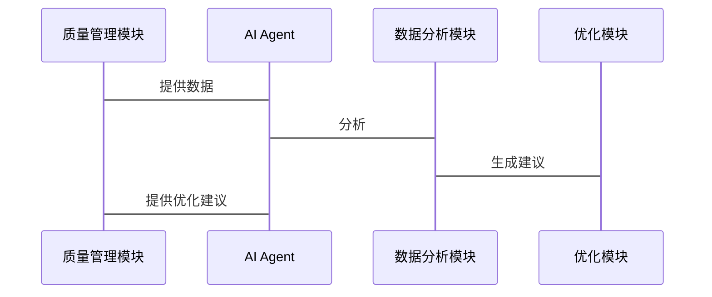

                 


# AI Agent在企业质量管理体系优化中的应用

## 关键词：AI Agent, 企业质量管理, 质量优化, 强化学习, 数学模型

## 摘要：本文探讨了AI Agent在企业质量管理体系中的应用，分析了其核心概念、算法原理，并通过系统设计和项目案例展示了AI Agent如何优化质量管理流程。文章最后总结了最佳实践和未来方向。

---

## 第1章：背景介绍

### 1.1 问题背景

#### 1.1.1 企业质量管理的现状与挑战
企业质量管理传统依赖人工检查，存在效率低下、数据复杂、反馈延迟等问题，导致成本增加、效率降低，难以满足现代企业的需求。

#### 1.1.2 AI Agent在质量管理中的应用背景
AI Agent通过自动化检测和实时数据分析，能够显著提高质量管理效率，减少人工错误，降低成本。

#### 1.1.3 问题的提出与解决方向
传统质量管理依赖人工，效率低、数据复杂。AI Agent通过自动化和智能决策，解决这些问题。

### 1.2 问题描述

#### 1.2.1 质量管理体系的复杂性
现代企业质量管理涉及多个部门和流程，复杂性高，难以优化。

#### 1.2.2 传统质量管理的痛点
- 数据处理复杂
- 人工检查效率低
- 反馈不及时

#### 1.2.3 AI Agent如何解决这些问题
通过自动化检测、实时数据分析和智能优化建议，提升效率和准确性。

### 1.3 问题解决

#### 1.3.1 AI Agent的核心作用
- 自动化检测
- 实时数据分析
- 智能优化建议

#### 1.3.2 技术手段与解决方案
- 强化学习优化流程
- 机器学习预测缺陷

#### 1.3.3 应用场景与实际案例
制造业中的质量检测优化。

### 1.4 边界与外延

#### 1.4.1 AI Agent的应用范围
质量检测、流程优化。

#### 1.4.2 与其他技术的界限
与传统软件和机器学习的区别。

#### 1.4.3 质量管理优化的边界
不涉及生产过程的优化。

### 1.5 概念结构与核心要素

#### 1.5.1 核心概念的组成
- AI Agent
- 质量管理体系
- 数据分析

#### 1.5.2 各要素之间的关系
AI Agent通过数据分析优化质量管理。

#### 1.5.3 优化目标与关键指标
- 提高效率
- 减少缺陷

---

## 第2章：AI Agent的核心原理

### 2.1 AI Agent的定义与特点

#### 2.1.1 定义与分类
AI Agent能够感知环境并采取行动，分为简单和复杂两类。

#### 2.1.2 核心特点对比
| 特性 | 传统软件 | AI Agent |
|------|----------|----------|
| 学习 | 无       | 有       |
| 决策 | 程序化   | 自主化   |

### 2.2 AI Agent与相关概念的对比

#### 2.2.1 与传统软件的对比
传统软件依赖预定义规则，AI Agent具备学习能力。

#### 2.2.2 与AI模型的差异
AI Agent具备自主决策能力，AI模型仅提供预测。

### 2.3 实体关系架构

#### 2.3.1 ER图展示
```mermaid
erd
    左边: 企业
    中间: 质量管理体系
    右边: AI Agent
    左边 --> 中间: 实施
    中间 --> 右边: 优化
```

---

## 第3章：AI Agent的算法原理

### 3.1 强化学习算法

#### 3.1.1 算法流程图


#### 3.1.2 Python代码实现
```python
class QLearning:
    def __init__(self, actions):
        self.actions = actions
        self.q_table = {}

    def choose_action(self, state):
        if state not in self.q_table:
            return self.actions[np.random.randint(len(self.actions))]
        max_action = max(self.q_table[state], key=lambda k: self.q_table[state][k])
        return max_action

    def learn(self, state, action, reward):
        if state not in self.q_table:
            self.q_table[state] = {a: 0 for a in self.actions}
        current_q = self.q_table[state][action]
        self.q_table[state][action] = current_q + reward
```

#### 3.1.3 数学模型
优化目标函数：
$$ \text{max} \sum_{t=1}^{T} r_t $$
状态转移方程：
$$ s_{t+1} = f(s_t, a_t) $$
Q-learning更新规则：
$$ Q(s,a) = Q(s,a) + \alpha [r + \gamma Q(s',a') - Q(s,a)] $$

### 3.2 监督学习算法

#### 3.2.1 算法流程图


#### 3.2.2 Python代码实现
```python
from sklearn import tree

def train_model(X_train, y_train):
    clf = tree.DecisionTreeClassifier()
    clf.fit(X_train, y_train)
    return clf
```

---

## 第4章：数学模型和公式

### 4.1 强化学习模型
Q-learning公式：
$$ Q(s,a) = Q(s,a) + \alpha (r + \gamma Q(s',a') - Q(s,a)) $$

### 4.2 监督学习模型
线性回归公式：
$$ y = \beta x + \epsilon $$

---

## 第5章：系统分析与架构设计

### 5.1 项目背景

#### 5.1.1 项目背景介绍
制造企业质量管理的现状和痛点。

#### 5.1.2 项目介绍
通过AI Agent优化质量管理流程。

### 5.2 系统功能设计

#### 5.2.1 功能模块
- 数据采集
- 数据分析
- 优化建议

#### 5.2.2 领域模型类图


### 5.3 系统架构设计

#### 5.3.1 架构图


### 5.4 系统接口设计

#### 5.4.1 接口描述
- 输入：产品数据
- 输出：优化建议

#### 5.4.2 接口交互


---

## 第6章：项目实战

### 6.1 环境安装与配置

#### 6.1.1 环境要求
Python 3.8以上，安装库如scikit-learn、mermaid。

#### 6.1.2 安装配置
```bash
pip install scikit-learn mermaid
```

### 6.2 核心代码实现

#### 6.2.1 数据采集
```python
import pandas as pd

def load_data(file_path):
    data = pd.read_csv(file_path)
    return data
```

#### 6.2.2 数据分析
```python
from sklearn.tree import DecisionTreeClassifier

def train_model(X_train, y_train):
    clf = DecisionTreeClassifier()
    clf.fit(X_train, y_train)
    return clf
```

### 6.3 代码应用解读

#### 6.3.1 核心代码功能
数据加载、模型训练、预测。

#### 6.3.2 实际案例分析
AI Agent在制造企业中的应用案例，展示优化效果。

### 6.4 项目小结
总结项目成果和经验。

---

## 第7章：总结与展望

### 7.1 最佳实践 tips

#### 7.1.1 数据质量
确保数据准确、完整。

#### 7.1.2 模型可解释性
选择可解释的模型。

#### 7.1.3 系统可扩展性
设计灵活的架构。

### 7.2 小结
AI Agent在质量管理中的应用显著提升了效率和准确性。

### 7.3 注意事项
避免过度依赖AI，注意数据隐私。

### 7.4 拓展阅读
推荐相关书籍和论文。

---

## 参考文献

- 强化学习相关书籍
- 机器学习相关论文
- 质量管理标准文献

---

通过以上结构，文章详细讲解了AI Agent在企业质量管理中的应用，从背景到实践，层层深入，帮助读者全面理解其价值和实现方法。

