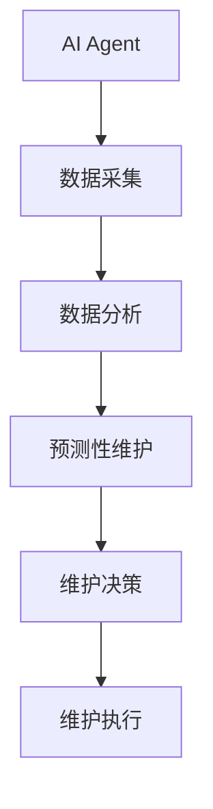
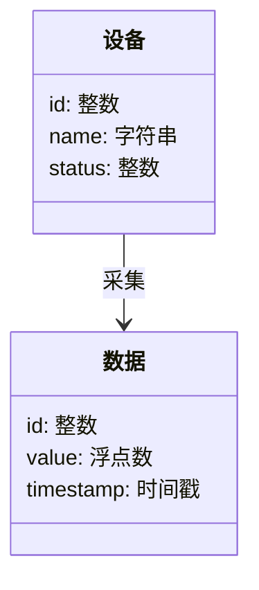

                 


# AI Agent在企业资产管理与预测性维护中的应用

> 关键词：AI Agent, 企业资产管理, 预测性维护, 机器学习, 深度学习, 时间序列分析

> 摘要：随着企业数字化转型的深入推进，AI Agent（人工智能代理）在企业资产管理与预测性维护中的应用越来越广泛。本文从AI Agent的核心概念出发，详细探讨了其在企业资产管理中的应用场景、算法原理、系统架构设计以及实际项目实现。通过分析AI Agent如何利用机器学习、深度学习和时间序列分析等技术，实现设备的预测性维护，为企业资产管理提供智能化解决方案。本文还提供了实际案例分析和代码实现，帮助读者全面理解AI Agent在企业资产管理中的应用。

---

# 第一部分: AI Agent与企业资产管理概述

## 第1章: AI Agent与企业资产管理概述

### 1.1 什么是AI Agent
AI Agent（人工智能代理）是一种能够感知环境、自主决策并执行任务的智能系统。它通过收集数据、分析信息、做出决策并采取行动，帮助企业在资产管理中实现智能化管理。

#### 1.1.1 AI Agent的定义与特点
- **定义**：AI Agent是一种能够感知环境、自主决策并执行任务的智能系统，通常具备学习、推理和自适应能力。
- **特点**：
  - 智能性：能够理解数据并做出决策。
  - 自主性：无需人工干预，自主完成任务。
  - 可扩展性：能够处理多种类型的任务。
  - 实时性：能够快速响应环境变化。

#### 1.1.2 AI Agent在企业中的作用
AI Agent在企业中扮演着关键角色，尤其是在资产管理领域：
- **数据采集与分析**：通过传感器和数据平台实时采集设备数据，并进行分析。
- **预测性维护**：基于历史数据和实时数据，预测设备的故障风险，提前采取维护措施。
- **优化决策**：通过分析数据，优化设备的运行策略，降低运营成本。

#### 1.1.3 AI Agent与传统IT系统的区别
- **传统IT系统**：主要用于数据存储、处理和展示，不具备自主决策能力。
- **AI Agent**：具备自主决策能力，能够根据环境变化动态调整行为。

---

### 1.2 企业资产管理的挑战与需求
企业资产管理（Enterprise Asset Management, EAM）是企业管理的重要组成部分，涉及设备的全生命周期管理。然而，传统资产管理方式存在诸多痛点。

#### 1.2.1 传统资产管理的痛点
- **数据孤岛**：设备数据分散在不同的系统中，难以统一管理。
- **维护成本高**：设备故障后被动维修，导致维修成本增加。
- **维护周期长**：设备故障修复时间长，影响生产效率。

#### 1.2.2 数字化转型对企业资产管理的要求
- **智能化**：利用AI技术实现设备的智能化管理。
- **实时性**：实时监控设备运行状态，及时发现异常。
- **预测性维护**：通过预测设备故障，提前安排维护计划，降低维护成本。

#### 1.2.3 预测性维护的必要性
预测性维护（Predictive Maintenance）是一种基于设备状态的维护策略，能够显著降低设备故障率和维护成本。AI Agent通过分析设备的历史数据和实时数据，预测设备的故障风险，从而实现预测性维护。

---

### 1.3 AI Agent在资产管理中的应用前景
AI Agent在企业资产管理中的应用前景广阔，尤其是在预测性维护领域。

#### 1.3.1 AI Agent在资产管理中的潜在应用场景
- **设备状态监测**：实时监测设备运行状态，发现潜在故障。
- **预测性维护**：基于数据分析，预测设备故障风险。
- **优化维护计划**：根据设备状态动态调整维护计划。

#### 1.3.2 企业采用AI Agent的优势
- **降低维护成本**：通过预测性维护，减少设备故障率，降低维护成本。
- **提高生产效率**：通过实时监控和快速响应，减少设备停机时间。
- **延长设备寿命**：通过优化维护策略，延长设备使用寿命。

#### 1.3.3 AI Agent应用的挑战与机遇
- **挑战**：数据质量、模型精度、系统集成等问题。
- **机遇**：AI技术的快速发展为企业资产管理提供了新的可能性。

---

## 1.4 本章小结
本章从AI Agent的核心概念出发，分析了AI Agent在企业资产管理中的作用，并探讨了预测性维护的必要性。通过对比传统IT系统和AI Agent的特点，明确了AI Agent在企业资产管理中的优势和应用前景。

---

## 第2章: AI Agent在预测性维护中的应用

### 2.1 预测性维护的基本概念
预测性维护是一种基于设备状态的维护策略，通过预测设备的故障风险，提前安排维护计划。

#### 2.1.1 预测性维护的流程
1. 数据采集：通过传感器采集设备的运行数据。
2. 数据分析：利用AI算法分析数据，预测设备的故障风险。
3. 维护决策：根据预测结果，安排维护计划。

#### 2.1.2 预测性维护的优势
- **降低维护成本**：通过预测性维护，减少设备故障率，降低维护成本。
- **提高生产效率**：通过实时监控和快速响应，减少设备停机时间。
- **延长设备寿命**：通过优化维护策略，延长设备使用寿命。

---

### 2.2 AI Agent在预测性维护中的角色
AI Agent在预测性维护中扮演着关键角色，主要负责数据采集、分析和决策。

#### 2.2.1 AI Agent在预测性维护中的流程
1. 数据采集：AI Agent通过传感器实时采集设备的运行数据。
2. 数据分析：AI Agent利用机器学习算法分析数据，预测设备的故障风险。
3. 决策与执行：AI Agent根据预测结果，安排维护计划并执行维护任务。

---

### 2.3 AI Agent与预测性维护的关系
AI Agent是预测性维护的核心技术，通过AI Agent的智能决策，实现设备的预测性维护。

#### 2.3.1 AI Agent与预测性维护的关系图



---

## 2.4 本章小结
本章详细探讨了AI Agent在预测性维护中的应用，分析了预测性维护的基本概念、流程和优势。通过AI Agent的智能决策，企业能够实现设备的预测性维护，显著降低维护成本，提高生产效率。

---

## 第3章: AI Agent的核心概念与原理

### 3.1 AI Agent的核心概念
AI Agent的核心概念包括感知、决策和执行。

#### 3.1.1 AI Agent的感知能力
AI Agent通过传感器和数据平台实时感知设备的运行状态。

#### 3.1.2 AI Agent的决策能力
AI Agent利用机器学习算法分析数据，做出最优决策。

#### 3.1.3 AI Agent的执行能力
AI Agent根据决策结果，执行维护任务。

---

### 3.2 AI Agent的算法原理
AI Agent的核心算法包括机器学习和深度学习。

#### 3.2.1 机器学习算法
- **监督学习**：通过标签数据训练模型，预测设备的故障风险。
- **无监督学习**：通过聚类分析，发现设备的异常状态。

#### 3.2.2 深度学习算法
- **神经网络**：通过多层神经网络，提取设备数据的深层特征。
- **时间序列分析**：通过LSTM（长短期记忆网络），预测设备的运行状态。

---

### 3.3 AI Agent的数学模型
AI Agent的数学模型包括监督学习模型和时间序列分析模型。

#### 3.3.1 监督学习模型
- **线性回归**：用于预测设备的故障概率。
  $$ y = \beta_0 + \beta_1x + \epsilon $$
- **支持向量机**：用于分类设备的运行状态。
  $$ y = \text{sign}(w \cdot x + b) $$

#### 3.3.2 时间序列分析模型
- **ARIMA模型**：用于预测设备的运行状态。
  $$ ARIMA(p, d, q) $$
- **LSTM模型**：用于处理时间序列数据的长依赖关系。
  $$ \text{LSTM}(t, h, c) $$

---

## 3.4 本章小结
本章详细介绍了AI Agent的核心概念和算法原理，分析了机器学习和深度学习算法在AI Agent中的应用，以及时间序列分析模型的数学公式和实现方法。

---

## 第4章: 系统分析与架构设计

### 4.1 问题场景介绍
企业资产管理的典型问题包括设备故障率高、维护成本高等。

#### 4.1.1 问题背景
企业设备的故障率高，导致维护成本增加，影响生产效率。

#### 4.1.2 问题描述
设备故障率高，维护成本高，设备停机时间长。

#### 4.1.3 问题解决
通过AI Agent实现设备的预测性维护，降低设备故障率和维护成本。

---

### 4.2 系统功能设计
AI Agent驱动的预测性维护系统包括数据采集、数据分析和维护决策三大功能模块。

#### 4.2.1 功能模块
- **数据采集模块**：通过传感器实时采集设备的运行数据。
- **数据分析模块**：利用机器学习算法分析数据，预测设备的故障风险。
- **维护决策模块**：根据预测结果，安排维护计划并执行维护任务。

#### 4.2.2 领域模型


---

### 4.3 系统架构设计
AI Agent驱动的预测性维护系统采用微服务架构，包括前端、后端和数据层。

#### 4.3.1 微服务架构
```mermaid
serviceDiagram
    service 数据采集服务 {
        提供数据采集接口
    }
    service 数据分析服务 {
        提供数据分析接口
    }
    service 维护决策服务 {
        提供维护决策接口
    }
    service 前端服务 {
        提供用户界面
    }
```

---

## 4.4 本章小结
本章详细介绍了AI Agent驱动的预测性维护系统的系统分析与架构设计，包括问题场景、功能模块和系统架构。通过微服务架构的设计，确保系统的可扩展性和灵活性。

---

## 第5章: 项目实战——基于AI Agent的设备预测性维护系统

### 5.1 环境安装
#### 5.1.1 系统环境
- 操作系统：Linux
- Python版本：3.8+

#### 5.1.2 依赖安装
- Python库：numpy、pandas、scikit-learn、tensorflow、pytorch

---

### 5.2 系统核心实现
#### 5.2.1 数据采集模块
- 代码实现：
  ```python
  import numpy as np
  import pandas as pd

  def collect_data():
      # 模拟数据采集
      data = np.random.randn(100, 5)
      df = pd.DataFrame(data, columns=['timestamp', 'temperature', 'vibration', 'pressure', 'rpm'])
      return df
  ```

#### 5.2.2 数据分析模块
- 代码实现：
  ```python
  from sklearn.model_selection import train_test_split
  from sklearn.linear_model import LinearRegression

  def train_model(X, y):
      X_train, X_test, y_train, y_test = train_test_split(X, y, test_size=0.2)
      model = LinearRegression()
      model.fit(X_train, y_train)
      return model
  ```

#### 5.2.3 维护决策模块
- 代码实现：
  ```python
  def predict_failure(model, X):
      y_pred = model.predict(X)
      return y_pred
  ```

---

### 5.3 项目小结
本章通过实际案例分析，详细介绍了基于AI Agent的设备预测性维护系统的实现过程，包括环境安装、数据采集、数据分析和维护决策模块的代码实现。

---

## 第6章: 总结与展望

### 6.1 总结
本文从AI Agent的核心概念出发，详细探讨了其在企业资产管理与预测性维护中的应用。通过分析AI Agent的算法原理、系统架构设计和实际项目实现，展示了AI Agent在企业资产管理中的巨大潜力。

### 6.2 展望
未来，随着AI技术的不断发展，AI Agent在企业资产管理中的应用将更加广泛。通过结合边缘计算和物联网技术，AI Agent将进一步提升设备的预测性维护能力，为企业资产管理提供更加智能化的解决方案。

---

## 6.3 最佳实践 Tips
- **数据质量**：确保数据的准确性和完整性。
- **模型优化**：通过不断优化模型，提高预测精度。
- **系统集成**：实现系统各模块的高效集成。

---

## 6.4 小结
本文通过详细分析AI Agent在企业资产管理与预测性维护中的应用，为企业提供了智能化的解决方案。未来，随着技术的不断发展，AI Agent将在企业资产管理中发挥更大的作用。

---

## 结语
感谢您的阅读！希望本文能够为您提供有价值的信息和启发。如果您有任何问题或建议，请随时与我联系。

