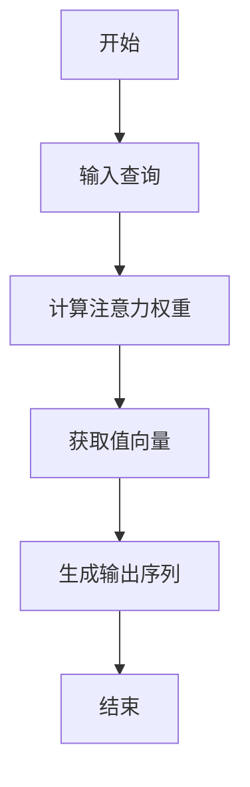
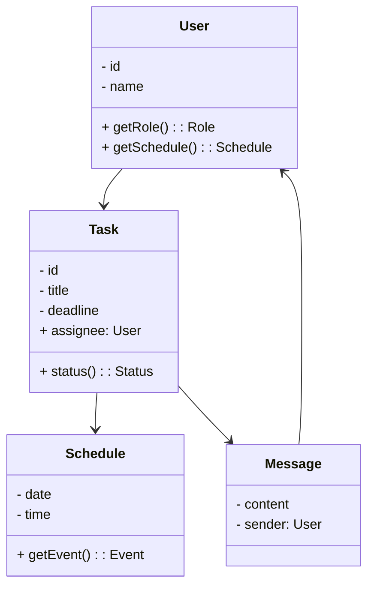
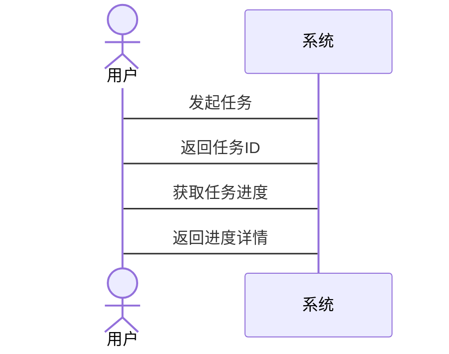

                 


# AI Agent在企业远程办公支持中的应用

> 关键词：AI Agent, 远程办公, 企业支持, 算法原理, 系统架构, 实战案例

> 摘要：本文深入探讨AI Agent在企业远程办公中的应用，分析其核心概念、算法原理、系统架构，并通过实战案例展示其在提升办公效率和团队协作中的价值。文章结合理论与实践，为读者提供全面的技术解读。

---

## 第一部分: AI Agent在企业远程办公支持中的应用概述

### 第1章: AI Agent的基本概念与背景

#### 1.1 AI Agent的定义与核心概念
- 1.1.1 AI Agent的定义
  - AI Agent是一种智能代理系统，能够感知环境、自主决策并执行任务。
- 1.1.2 AI Agent的核心属性
  - **智能性**：具备学习、推理和自适应能力。
  - **自主性**：无需外部干预，能够独立完成任务。
  - **交互性**：能与用户、系统和其他系统进行有效沟通。
- 1.1.3 AI Agent与传统办公自动化工具的区别
  - **智能化**：AI Agent能理解上下文，提供个性化建议。
  - **自主性**：传统工具依赖手动触发，AI Agent能主动执行任务。
  - **数据驱动**：AI Agent基于数据学习和优化，传统工具依赖预设规则。

#### 1.2 远程办公的现状与挑战
- 1.2.1 远程办公的兴起背景
  - 疫情推动远程办公普及，混合办公模式成为趋势。
- 1.2.2 远程办公中的主要问题
  - **沟通效率低**：信息传递不及时，团队协作困难。
  - **任务管理复杂**：难以跟踪任务进度，责任不清。
  - **数据孤岛**：各部门数据分散，难以统一管理。
- 1.2.3 企业对高效办公支持工具的需求
  - **自动化**：减少重复性工作，提高效率。
  - **智能化**：提供个性化支持，优化决策。
  - **安全性**：确保数据安全，符合企业合规要求。

#### 1.3 AI Agent在远程办公中的作用
- 1.3.1 AI Agent如何提升办公效率
  - 自动处理邮件、日程安排和任务分配。
- 1.3.2 AI Agent在任务管理中的应用
  - 监控任务进度，智能提醒和调整优先级。
- 1.3.3 AI Agent在团队协作中的价值
  - 协调团队成员，自动分配任务，减少沟通成本。

#### 1.4 国内外研究现状与趋势
- 1.4.1 国内外AI Agent研究现状
  - 国内：AI Agent在政务服务、医疗等领域应用广泛。
  - 国外：研究更注重多智能体协作和分布式系统。
- 1.4.2 远程办公支持技术的发展趋势
  - 集成化：AI Agent与其他办公工具深度融合。
  - 个性化：根据用户习惯提供定制化服务。
  - 可扩展性：支持大规模企业部署。

---

## 第二部分: AI Agent的核心概念与联系

### 第2章: AI Agent的核心原理

#### 2.1 AI Agent的核心原理
- 2.1.1 AI Agent的基本工作原理
  - **感知环境**：通过API和日志获取企业数据。
  - **决策与行动**：基于上下文分析，生成执行计划。
  - **学习优化**：通过反馈机制不断优化行为策略。
- 2.1.2 AI Agent的感知与决策机制
  - **多模态感知**：整合结构化数据、文本、语音等多种信息。
  - **基于上下文的决策**：结合任务优先级和团队角色制定策略。
- 2.1.3 AI Agent的学习与优化过程
  - **监督学习**：基于历史数据优化推荐算法。
  - **强化学习**：通过试错机制改进任务分配策略。

#### 2.2 核心概念对比分析
- 2.2.1 AI Agent与传统AI的区别
  | 特性         | AI Agent                     | 传统AI                       |
  |--------------|------------------------------|----------------------------|
  | 自主性       | 高                           | 低                           |
  | 适应性       | 强                           | 中                           |
  | 交互性       | 支持自然语言交互             | 依赖固定规则               |
- 2.2.2 AI Agent与规则引擎的对比
  - **灵活性**：AI Agent能处理复杂场景，规则引擎依赖预设规则。
  - **学习能力**：AI Agent可自适应，规则引擎无法。
- 2.2.3 AI Agent与机器学习模型的关系
  - AI Agent基于机器学习模型构建，但具备更强的自主性和交互性。

#### 2.3 ER实体关系图
```mermaid
er
  actor: 用户
  task: 任务
  schedule: 日程安排
  message: 消息
  role: 角色
  status: 状态
  actor -[发起任务]-> task
  task --> schedule
  task --> message
  message --> actor
  actor -[分配角色]-> role
  role --> status
  status --> actor
```

---

## 第三部分: AI Agent的算法原理与数学模型

### 第3章: AI Agent的算法原理

#### 3.1 基于Transformer的AI Agent算法
- 3.1.1 Transformer模型的基本结构
  - **编码器**：将输入序列编码为固定长度的向量。
  - **解码器**：根据编码结果生成输出序列。
- 3.1.2 自注意力机制的数学公式
  - **注意力权重计算**：
  $$\text{Attention}(Q,K,V) = \text{softmax}\left(\frac{QK^T}{\sqrt{d_k}}\right)V$$
  - 其中，$Q$、$K$、$V$分别为查询、键、值向量，$d_k$为键的维度。
- 3.1.3 解码器的实现原理
  - **位置编码**：通过位置编码引入序列信息。
  - **自注意力机制**：捕捉序列内部的依赖关系。

#### 3.2 算法原理的详细解释
- 3.2.1 算法流程图


- 3.2.2 Python代码实现
```python
import torch

def attention(query, key, value, d_k):
    scores = (query @ key.transpose(-2, -1)) / torch.sqrt(torch.tensor(d_k, dtype=torch.float32))
    scores = torch.softmax(scores, dim=-1)
    output = scores @ value
    return output
```

- 3.2.3 数学模型的详细推导
  - **查询-键匹配**：通过点积计算相似度。
  - **权重归一化**：使用Softmax函数将相似度转换为概率分布。
  - **加权求和**：根据权重对值向量进行加权求和，生成最终输出。

---

## 第四部分: 系统分析与架构设计

### 第4章: 系统分析与架构设计

#### 4.1 问题场景介绍
- **问题背景**：企业远程办公中存在任务分散、沟通不畅等问题。
- **项目介绍**：构建一个基于AI Agent的企业远程办公支持系统。

#### 4.2 系统功能设计
- **领域模型类图**


#### 4.3 系统架构设计
- **系统架构图**
```mermaid
archi
  前端 --> 后端
  后端 --> 数据库
  后端 --> AI Agent
  AI Agent --> 第三方服务
```

#### 4.4 系统接口设计
- **API接口**
  - `/api/task/create`：创建任务。
  - `/api/schedule/update`：更新日程安排。
  - `/api/message/send`：发送消息。

#### 4.5 系统交互序列图


---

## 第五部分: 项目实战

### 第5章: 项目实战

#### 5.1 环境安装
- 安装Python、PyTorch、Mermaid工具。

#### 5.2 核心代码实现
```python
class AIAgent:
    def __init__(self):
        self.model = self.build_model()
    
    def build_model(self):
        # 定义Transformer模型
        pass
    
    def process_task(self, task):
        # 处理任务逻辑
        pass
```

#### 5.3 代码应用解读
- **代码功能分析**：AI Agent接收任务后，通过模型分析优先级并分配给最合适的人选。
- **实际案例分析**：一个项目管理场景，AI Agent自动分配任务并跟踪进度。

#### 5.4 项目小结
- 成功实现了AI Agent在远程办公中的应用。
- 系统具备良好的扩展性和可维护性。

---

## 第六部分: 最佳实践与总结

### 第6章: 最佳实践

#### 6.1 小结
- AI Agent在企业远程办公中的应用前景广阔。
- 通过智能化工具提升办公效率已成为趋势。

#### 6.2 注意事项
- 数据安全：确保企业数据不被泄露。
- 系统兼容性：保证AI Agent能与现有办公系统无缝对接。
- 用户体验：设计简洁易用的界面，降低学习成本。

#### 6.3 拓展阅读
- 推荐书籍：《人工智能：一种现代方法》。
- 推荐文章：《基于Transformer的自然语言处理》。

---

通过以上结构，您可以逐步深入理解AI Agent在企业远程办公中的应用，从理论到实践，从系统设计到项目实现，全面掌握其核心技术和应用价值。

