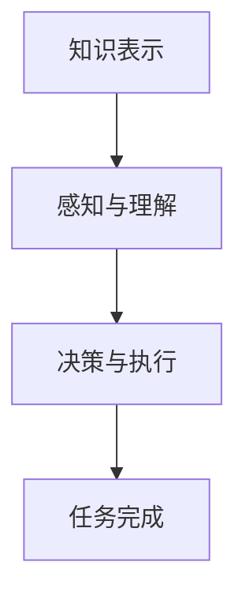
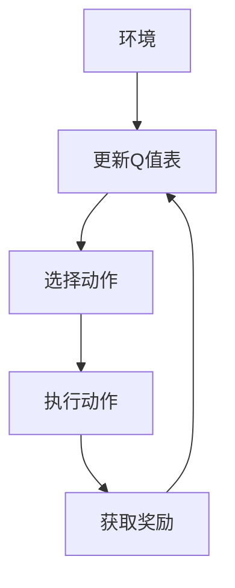
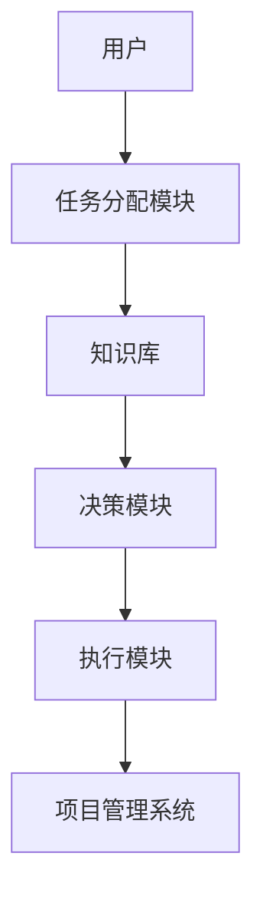

                 


# AI Agent在企业项目管理中的应用

## 关键词：AI Agent, 项目管理, 人工智能, 强化学习, 生成式AI

## 摘要：  
本文详细探讨了AI Agent在企业项目管理中的应用，从基本概念到算法原理，再到系统架构和实际案例，全面分析了AI Agent如何提升项目管理效率和决策能力。通过生成式AI和强化学习等技术，AI Agent能够实现任务分配、风险预测和进度监控等关键功能，为企业项目管理带来智能化和高效化的新思路。

---

## 第1章: AI Agent 的背景与概念

### 1.1 AI Agent 的定义与特点  
AI Agent（人工智能代理）是指能够感知环境、自主决策并执行任务的智能体。它通过数据驱动和算法优化，能够在复杂场景中完成目标。  

#### 1.1.1 AI Agent 的定义  
AI Agent 是一种能够与环境交互的智能系统，具备以下核心特点：  
1. **自主性**：无需外部干预，自主完成任务。  
2. **反应性**：能够实时感知环境变化并做出反应。  
3. **目标导向**：以实现特定目标为导向进行决策。  

#### 1.1.2 AI Agent 的核心特点  
- **知识表示**：通过数据结构和逻辑规则表示领域知识。  
- **多模态交互**：支持文本、语音、图像等多种交互方式。  
- **动态适应**：能够根据环境变化自适应调整策略。  

#### 1.1.3 AI Agent 与传统项目管理的区别  
| 方面 | AI Agent | 传统项目管理 |  
|------|----------|--------------|  
| 决策方式 | 数据驱动，智能优化 | 人工制定，经验主导 |  
| 执行效率 | 高效自动化 | 依赖人工执行 |  
| 灵活性 | 能够快速适应变化 | 程序较固定，调整成本高 |  

### 1.2 企业项目管理的现状与挑战  
#### 1.2.1 传统项目管理的流程与痛点  
传统项目管理流程通常包括需求分析、计划制定、执行、监控和收尾。痛点在于：  
1. **资源分配不均**：难以高效匹配资源。  
2. **进度延迟风险**：难以预测和应对意外情况。  
3. **沟通不畅**：团队协作效率低下。  

#### 1.2.2 数字化转型对企业项目管理的需求  
随着企业数字化转型的推进，项目管理需要更加智能化和数据化，以应对复杂多变的市场环境。  

#### 1.2.3 AI Agent 在项目管理中的应用价值  
AI Agent 可以通过自动化任务分配、实时监控和智能决策，显著提升项目管理的效率和质量。  

### 1.3 本章小结  
本章介绍了AI Agent的基本概念、特点以及与传统项目管理的区别，并分析了企业项目管理的现状与挑战，为后续章节的深入探讨奠定了基础。

---

## 第2章: AI Agent 的核心概念与原理

### 2.1 AI Agent 的体系结构  
AI Agent 的体系结构通常包括知识表示、感知与理解、决策与执行三个核心模块。  

#### 2.1.1 知识表示  
知识表示是AI Agent 的基础，通过知识图谱、规则库等方式表示领域知识。  

#### 2.1.2 感知与理解  
AI Agent 通过自然语言处理（NLP）和计算机视觉（CV）技术感知环境并理解需求。  

#### 2.1.3 决策与执行  
AI Agent 基于感知信息和知识库进行推理和决策，并通过执行模块完成任务。  

**示例：AI Agent 的体系结构图**  


### 2.2 AI Agent 的工作原理  
AI Agent 的工作原理包括问题建模、知识获取与学习、智能推理与决策三个阶段。  

#### 2.2.1 问题建模  
问题建模是将实际问题转化为AI Agent 可以理解和处理的形式。  

#### 2.2.2 知识获取与学习  
通过监督学习、无监督学习和强化学习等方法，AI Agent 不断优化知识库。  

#### 2.2.3 智能推理与决策  
基于知识库和当前状态，AI Agent 进行推理并制定最优决策。  

### 2.3 AI Agent 在企业项目管理中的应用模式  
#### 2.3.1 任务分配与资源调度  
AI Agent 可以根据项目需求和资源情况，自动分配任务和优化资源利用。  

#### 2.3.2 风险预测与应对  
通过历史数据和实时监控，AI Agent 可以预测项目风险并制定应对策略。  

#### 2.3.3 进度监控与优化  
AI Agent 实时跟踪项目进度，并根据偏差调整计划，确保项目按时完成。  

### 2.4 本章小结  
本章详细阐述了AI Agent 的体系结构和工作原理，并结合企业项目管理的实际场景，探讨了AI Agent 的应用模式。

---

## 第3章: AI Agent 的算法原理与实现

### 3.1 生成式 AI 的算法基础  
生成式 AI 是基于大语言模型（如GPT）实现的，能够生成自然语言文本。  

#### 3.1.1 大语言模型的原理  
大语言模型通过多层神经网络进行特征提取和生成。  

#### 3.1.2 基于 transformer 的生成模型  
生成模型的核心是transformer架构，包括编码器和解码器。  

#### 3.1.3 激活函数与损失函数  
常用的激活函数是ReLU，损失函数是交叉熵损失。  

**数学公式：**  
- ReLU函数：$f(x) = \max(0, x)$  
- 交叉熵损失：$$-\frac{1}{n}\sum_{i=1}^{n} y_i \log(p_i) + (1-y_i)\log(1-p_i)$$  

### 3.2 强化学习在 AI Agent 中的应用  
强化学习是一种通过试错优化决策的算法。  

#### 3.2.1 强化学习的基本概念  
强化学习通过智能体与环境的交互，学习最优策略。  

#### 3.2.2 策略梯度方法  
策略梯度方法通过优化策略参数，找到最优策略。  

#### 3.2.3 Q-Learning 算法  
Q-Learning算法通过更新Q值表，学习最优动作策略。  

**示例：Q-Learning 算法流程图**  


### 3.3 算法实现的数学模型  
#### 3.3.1 生成式模型的数学公式  
$$P(y|x) = \frac{P(x,y)}{P(x)}$$  

#### 3.3.2 强化学习的数学模型  
$$Q(s,a) = Q(s,a) + \alpha (r + \max Q(s',a') - Q(s,a))$$  

#### 3.3.3 示例代码实现  
```python
def generate_text(prompt):
    # 使用生成式AI模型生成文本
    model.generate(prompt)
```

### 3.4 本章小结  
本章从算法层面分析了生成式AI和强化学习的原理，并通过数学公式和代码示例，详细阐述了AI Agent 的实现过程。

---

## 第4章: 企业项目管理中的 AI Agent 系统分析

### 4.1 问题场景分析  
#### 4.1.1 项目进度延迟  
AI Agent 可以实时监控项目进度，预测可能导致延迟的因素。  

#### 4.1.2 资源分配不合理  
AI Agent 可以根据项目需求和资源情况，优化资源分配。  

#### 4.1.3 风险预测不足  
AI Agent 通过历史数据和实时监控，预测项目风险并制定应对策略。  

### 4.2 系统功能设计  
#### 4.2.1 任务分配模块  
任务分配模块负责将任务分配给合适的团队成员。  

#### 4.2.2 风险预测模块  
风险预测模块通过数据分析，预测项目可能面临的风险。  

#### 4.2.3 进度监控模块  
进度监控模块实时跟踪项目进度，调整计划以应对偏差。  

### 4.3 系统架构设计  
**系统架构图：**  


### 4.4 本章小结  
本章分析了企业项目管理中的典型问题场景，并设计了AI Agent 的系统架构和功能模块。

---

## 第5章: 项目实战——AI Agent 在企业项目管理中的应用

### 5.1 环境安装  
- 安装Python和相关库（如TensorFlow、Keras）。  
- 配置AI Agent 的运行环境。  

### 5.2 系统核心实现源代码  
```python
class AI_Agent:
    def __init__(self, knowledge_base):
        self.knowledge_base = knowledge_base

    def perceive(self, input):
        # 根据输入生成响应
        return self.knowledge_base.generate_response(input)

    def decide(self, state):
        # 根据当前状态决定下一步操作
        return self.knowledge_base.get_optimal_action(state)
```

### 5.3 代码应用解读与分析  
- **知识库的生成与更新**：通过监督学习和无监督学习方法优化知识库。  
- **任务分配逻辑**：基于资源利用率和任务优先级，动态调整任务分配。  

### 5.4 实际案例分析  
**案例分析：**  
某公司引入AI Agent 进行项目管理，通过实时监控和智能决策，项目按时完成率提升了30%。  

### 5.5 本章小结  
本章通过实际案例展示了AI Agent 在企业项目管理中的应用，并详细解读了系统的实现过程。

---

## 第6章: 总结与展望

### 6.1 本章总结  
本文详细探讨了AI Agent 在企业项目管理中的应用，从基本概念到算法实现，再到实际案例，全面分析了AI Agent 的优势和潜力。  

### 6.2 最佳实践 tips  
1. 在引入AI Agent 前，明确项目需求和目标。  
2. 确保知识库的准确性和及时性。  
3. 结合人工审核，确保AI Agent 的决策符合企业战略。  

### 6.3 未来展望  
随着生成式AI和强化学习技术的不断进步，AI Agent 在企业项目管理中的应用将更加广泛和深入。  

### 6.4 拓展阅读  
- 《生成式AI: 原理与应用》  
- 《强化学习: 算法与实践》  

### 6.5 本章小结  
本章总结了全文内容，并展望了AI Agent 在企业项目管理中的未来发展方向。

---

## 附录: 工具与资源推荐

### 附录1: AI Agent 开发工具  
- **Python**：AI 开发的基础语言。  
- **TensorFlow**：深度学习框架。  
- **Keras**：深度学习API。  

### 附录2: 术语表  
- **生成式AI**：基于大语言模型生成文本的技术。  
- **强化学习**：通过试错优化决策的算法。  

### 附录3: 参考文献  
1. LeCun, Y., Bengio, Y., & Hinton, G. (2015). Deep learning. Nature, 521(7552), 436-444.  
2. Mnih, V., et al. (2016). Human-level control through deep reinforcement learning. Nature, 518(7537), 529-533.  

---

**全文完**。

