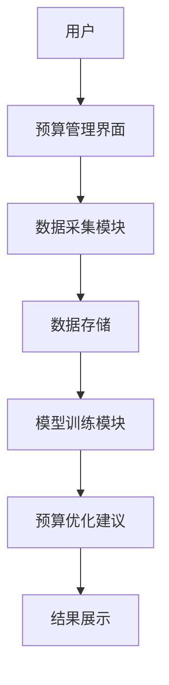

                 


# AI Agent在企业预算管理与成本控制中的应用

## 关键词：AI Agent，企业预算管理，成本控制，人工智能技术，预算优化算法，成本预测模型

## 摘要：  
随着人工智能技术的迅速发展，AI Agent（人工智能代理）在企业预算管理与成本控制中的应用逐渐成为热点。通过智能化的预算优化算法和成本预测模型，AI Agent能够显著提升企业的财务决策效率和准确性，帮助企业更好地实现成本控制目标。本文将深入探讨AI Agent在企业预算管理与成本控制中的核心概念、算法原理、系统架构设计以及实际应用案例，为企业提供切实可行的解决方案和实践指导。

---

## 第一章：引言

### 1.1 AI Agent的基本概念  
AI Agent是一种能够感知环境、自主决策并执行任务的智能实体。它能够通过学习和优化算法，实现对复杂问题的高效解决。AI Agent的核心在于其智能性和自主性，能够在动态环境中做出最优决策。

### 1.2 企业预算管理的重要性  
企业预算管理是企业管理的核心环节之一，它涉及对企业未来一段时间内的收入和支出的规划与控制。有效的预算管理能够帮助企业合理分配资源，优化成本结构，提升整体运营效率。

### 1.3 AI Agent在成本控制中的应用前景  
AI Agent通过智能化的算法和大数据分析，能够为企业提供实时的预算优化建议和成本预测。它不仅能够提高预算管理的精准度，还能显著降低企业的运营成本。

---

## 第二章：AI Agent的核心概念与原理

### 2.1 AI Agent的核心概念  
AI Agent的核心概念包括以下几个方面：  
1. **智能性**：AI Agent能够通过感知环境和学习，不断优化其决策过程。  
2. **自主性**：AI Agent能够在没有人工干预的情况下，独立完成任务。  
3. **交互性**：AI Agent能够与人类或其他系统进行交互，获取信息并执行任务。  

### 2.2 AI Agent的算法原理  
AI Agent的算法原理主要基于强化学习、监督学习和无监督学习。  

#### 2.2.1 强化学习算法  
强化学习是一种通过试错机制来优化决策的算法。AI Agent通过与环境的交互，不断调整其策略，以获得最大的累积奖励。  

#### 2.2.2 监督学习算法  
监督学习是一种基于已有数据进行模式识别的算法。AI Agent通过学习历史数据，预测未来的预算和成本趋势。  

#### 2.2.3 无监督学习算法  
无监督学习是一种通过发现数据中的潜在结构来实现聚类的算法。AI Agent可以利用无监督学习算法，识别成本控制中的关键因素。

---

## 第三章：企业预算管理的理论基础

### 3.1 预算管理的基本方法  
企业预算管理的基本方法包括以下步骤：  
1. **预算编制**：根据企业战略目标和资源状况，制定预算计划。  
2. **预算执行**：按照预算计划，监控预算执行情况。  
3. **预算调整**：根据实际情况，对预算进行适时调整。  

### 3.2 成本控制的理论与实践  
成本控制是企业预算管理的重要组成部分。通过成本预测、成本分析和成本控制，企业可以有效降低运营成本，提升利润水平。

---

## 第四章：AI Agent在成本控制中的应用

### 4.1 成本预测模型的构建  
AI Agent可以通过强化学习算法，构建成本预测模型。模型能够根据历史数据和市场变化，预测未来的成本趋势。  

#### 4.1.1 成本预测模型的数学表达  
成本预测模型可以通过以下公式表示：  
$$ C_{t} = \beta_{0} + \beta_{1}C_{t-1} + \epsilon_{t} $$  
其中，$C_{t}$ 表示第 $t$ 期的成本，$\beta_{0}$ 和 $\beta_{1}$ 是模型参数，$\epsilon_{t}$ 是误差项。  

### 4.2 成本控制的优化算法  
AI Agent通过强化学习算法，优化成本控制策略。模型能够根据实时数据，动态调整预算分配，以实现成本最小化和利润最大化。

#### 4.2.1 强化学习的优化流程  
1. **状态空间定义**：定义预算分配的状态空间。  
2. **动作空间定义**：定义可能的预算分配方案。  
3. **奖励函数设计**：设计奖励函数，衡量预算分配的优劣。  

---

## 第五章：系统架构设计

### 5.1 系统功能设计  
AI Agent系统的主要功能包括：  
1. **数据采集**：收集企业的财务数据和市场信息。  
2. **模型训练**：基于历史数据，训练预算优化模型。  
3. **决策支持**：根据实时数据，提供预算优化建议。  

### 5.2 系统架构图  
以下是AI Agent系统的架构图：  


### 5.3 系统接口设计  
系统接口设计包括数据接口和用户接口。数据接口负责与企业财务系统对接，用户接口提供友好的操作界面。

---

## 第六章：项目实战

### 6.1 环境安装  
需要安装Python、TensorFlow和Keras等工具。  

### 6.2 代码实现  
以下是AI Agent系统的部分代码示例：  
```python
import numpy as np
import tensorflow as tf

# 定义强化学习模型
class AI_Agent:
    def __init__(self, state_space, action_space):
        self.state_space = state_space
        self.action_space = action_space
        self.model = self.build_model()

    def build_model(self):
        model = tf.keras.Sequential([
            tf.keras.layers.Dense(32, activation='relu', input_dim=self.state_space),
            tf.keras.layers.Dense(self.action_space, activation='linear')
        ])
        model.compile(optimizer='adam', loss='mse')
        return model

    def act(self, state):
        state = np.array([state])
        prediction = self.model.predict(state)
        action = np.argmax(prediction[0])
        return action

    def train(self, state, action, reward, next_state):
        state = np.array([state])
        target = np.array([reward])
        self.model.fit(state, target, epochs=1, verbose=0)
```

### 6.3 案例分析  
通过具体案例分析，验证AI Agent在预算管理中的实际效果。  

---

## 第七章：最佳实践与总结

### 7.1 最佳实践  
1. 数据质量是AI Agent系统的核心，确保数据的准确性和完整性。  
2. 定期更新模型，适应市场变化和企业需求。  

### 7.2 未来展望  
随着AI技术的不断进步，AI Agent在企业预算管理与成本控制中的应用前景将更加广阔。未来，可以通过引入更多智能化技术，进一步提升预算管理的效率和准确性。

---

## 总结  
本文详细探讨了AI Agent在企业预算管理与成本控制中的应用，从理论到实践，全面分析了AI Agent的核心概念、算法原理、系统设计和实际应用。通过本文的指导，企业可以更好地利用AI技术，优化预算管理，实现成本控制目标。

