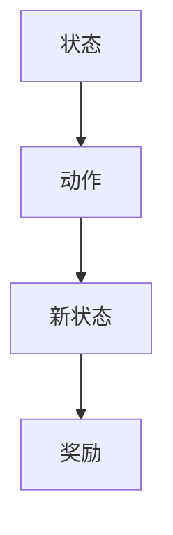
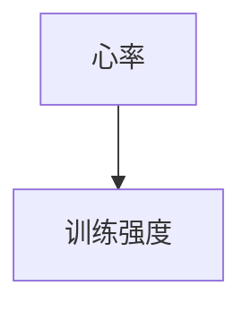
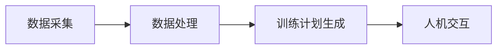
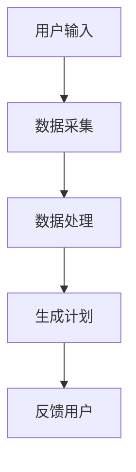

                 


# AI Agent在体育训练中的应用：个性化训练计划制定

## 关键词：AI Agent, 个性化训练计划, 体育训练, 数据分析, 算法优化

## 摘要：本文探讨AI Agent在体育训练中的应用，重点分析其如何通过数据驱动和智能算法来制定个性化训练计划。从理论基础到实际应用，本文详细解析了AI Agent在体育训练中的优势、核心算法及系统架构，并通过案例展示其实际效果。

---

## 第1章: AI Agent与个性化训练计划概述

### 1.1 AI Agent的基本概念

#### 1.1.1 AI Agent的定义与特点
AI Agent（人工智能代理）是指能够感知环境并采取行动以实现目标的智能实体。在体育训练中，AI Agent通过数据收集、分析和决策，帮助教练和运动员优化训练计划。其特点包括：

- **自主性**：能够独立决策。
- **反应性**：实时感知并调整。
- **学习能力**：通过数据优化策略。

#### 1.1.2 体育训练中的AI Agent应用场景
AI Agent在体育训练中的应用广泛，包括：
- **运动表现分析**：评估运动员的技术动作和体能。
- **训练计划优化**：根据运动员状态调整训练强度。
- **实时反馈**：在训练中提供即时建议。

#### 1.1.3 个性化训练计划的核心要素
个性化训练计划需要考虑运动员的个体差异，包括：
- **运动目标**：明确短期和长期目标。
- **数据驱动**：基于生理数据和表现数据。
- **动态调整**：根据反馈实时优化。

### 1.2 个性化训练计划的背景与需求

#### 1.2.1 传统体育训练的局限性
传统训练方法依赖经验，缺乏数据支持，导致训练效果不稳定，容易受伤。

#### 1.2.2 现代运动员的个性化需求
现代运动员需要精准的训练计划，以提高成绩和减少受伤风险。

#### 1.2.3 AI技术在体育训练中的潜力
AI技术能够处理大量数据，提供科学的训练建议，帮助运动员更高效地提升表现。

### 1.3 AI Agent在体育训练中的优势

#### 1.3.1 数据驱动的精准分析
AI Agent能够分析大量数据，识别运动员的潜力和瓶颈。

#### 1.3.2 实时反馈与调整
实时监测运动员状态，提供即时反馈，优化训练过程。

#### 1.3.3 多目标优化能力
AI Agent可以在多个目标之间找到平衡，制定更合理的训练计划。

---

## 第2章: AI Agent的核心概念与原理

### 2.1 AI Agent的核心概念

#### 2.1.1 知识表示与推理
知识表示是AI Agent理解世界的基础。常用的方法包括：
- **符号表示法**：用符号表示知识，如规则库。
- **语义网络**：通过节点和边表示概念及其关系。

#### 2.1.2 行为决策与优化
AI Agent通过决策树、强化学习等方法，根据当前状态选择最优动作。

#### 2.1.3 人机交互与反馈
AI Agent需要与人类交互，理解需求并提供反馈，形成闭环系统。

### 2.2 AI Agent的算法原理

#### 2.2.1 强化学习算法
强化学习通过奖励机制优化决策。例如，使用Q-Learning算法：



#### 2.2.2 遗传算法
遗传算法模拟自然选择，用于优化训练计划：

1. 初始化：生成初始解集。
2. 评估：计算适应度。
3. 选择：保留优秀解。
4. 交叉：混合解生成新解。
5. 变异：随机改变部分解。
6. 重复步骤2-5，直到满足条件。

#### 2.2.3 贝叶斯网络
贝叶斯网络用于概率推理，预测运动员受伤风险：

$$ P(A|B) = \frac{P(B|A)P(A)}{P(B)} $$

### 2.3 个性化训练计划的制定逻辑

#### 2.3.1 数据收集与特征提取
数据收集包括运动表现、生理指标和环境因素。特征提取通过主成分分析等方法简化数据。

#### 2.3.2 训练目标的分解与优先级排序
将整体目标分解为具体任务，并根据优先级排序：

- **优先级1**：避免受伤。
- **优先级2**：提升体能。
- **优先级3**：优化技术动作。

#### 2.3.3 训练计划的动态调整机制
根据实时数据（如心率、动作捕捉）调整训练计划，确保最优效果。

---

## 第3章: 数据驱动的个性化训练分析

### 3.1 数据采集与处理

#### 3.1.1 运动表现数据的采集
使用传感器（如加速度计）采集速度、加速度等数据：

$$ 速度 = \frac{距离}{时间} $$

#### 3.1.2 健康监测数据的采集
监测心率、肌电等生理指标，评估运动员的疲劳程度。

#### 3.1.3 数据清洗与预处理
去除噪声数据，填补缺失值，标准化数据。

### 3.2 数据分析与特征提取

#### 3.2.1 统计分析方法
计算均值、方差等统计指标，识别异常值。

#### 3.2.2 主成分分析
通过PCA降低数据维度，提取主要特征。

#### 3.2.3 时间序列分析
分析训练数据的时间依赖性，预测未来表现。

### 3.3 数据可视化与洞察

#### 3.3.1 数据可视化工具
使用Matplotlib、Tableau等工具绘制图表，直观展示数据。

#### 3.3.2 关键特征的可视化展示
例如，绘制心率与训练强度的关系图：



#### 3.3.3 数据驱动的训练策略优化
根据数据识别瓶颈，制定针对性训练方案。

---

## 第4章: AI Agent的算法实现与优化

### 4.1 算法选择与实现

#### 4.1.1 强化学习算法的实现
实现Q-Learning算法，用于训练计划的动态调整：

```python
class QLearning:
    def __init__(self, states, actions):
        self.q_table = {state: {action: 0 for action in actions} for state in states}
    
    def update(self, state, action, reward, next_state):
        alpha = 0.1
        gamma = 0.9
        self.q_table[state][action] += alpha * (reward + gamma * max(self.q_table[next_state].values()) - self.q_table[state][action])
```

#### 4.1.2 遗传算法的实现
实现遗传算法优化训练计划：

```python
def fitness(train_plan):
    # 计算训练计划的适应度
    return sum(train_plan['intensity'])

def evolve(population):
    # 评估适应度
    fitness_list = [fitness(plan) for plan in population]
    # 选择
    selected = [plan for plan in population if fitness(plan) > median(fitness_list)]
    # 交叉
    new_population = []
    for _ in range(len(population)//2):
        parent1 = random.choice(selected)
        parent2 = random.choice(selected)
        child = crossover(parent1, parent2)
        new_population.append(child)
    # 变异
    for plan in new_population:
        if random.random() < 0.1:
            mutate(plan)
    return new_population
```

#### 4.1.3 群体智能算法的实现
实现粒子群优化算法，用于复杂问题求解：

```python
def update(position, velocity, best, global_best):
    w = 0.5
    c1 = 1.5
    c2 = 1.5
    velocity = w*velocity + c1*rand()*(best - position) + c2*rand()*(global_best - position)
    position += velocity
    return position, velocity
```

### 4.2 算法优化与调参

#### 4.2.1 超参数优化方法
使用网格搜索或随机搜索优化算法参数。

#### 4.2.2 算法加速技术
并行计算、分布式训练等技术提升计算效率。

#### 4.2.3 模型鲁棒性提升策略
交叉验证、数据增强等方法提高模型的泛化能力。

### 4.3 算法评估与验证

#### 4.3.1 评估指标设计
常用指标包括准确率、召回率、F1分数。

#### 4.3.2 实验设计与结果分析
通过实验对比不同算法的效果，选择最优方案。

#### 4.3.3 模型迭代优化
根据实验结果调整参数和算法，持续优化性能。

---

## 第5章: 系统架构与实现方案

### 5.1 系统架构设计

#### 5.1.1 系统功能模块划分
- 数据采集模块：采集运动数据。
- 数据处理模块：清洗和预处理数据。
- 训练计划生成模块：基于算法生成计划。
- 人机交互模块：与用户互动，提供反馈。

#### 5.1.2 系统架构图（Mermaid）


#### 5.1.3 系统交互流程图（Mermaid）


### 5.2 系统实现细节

#### 5.2.1 数据采集接口设计
设计API接口，接收传感器数据：

```python
@app.route('/api/data', methods=['POST'])
def receive_data():
    data = request.json
    # 处理数据
    return jsonify('Data received')
```

#### 5.2.2 算法模块实现
实现强化学习模块，生成训练计划：

```python
class TrainingPlanGenerator:
    def generate(self, data):
        # 使用强化学习算法生成训练计划
        return plan
```

#### 5.2.3 人机交互界面设计
设计用户友好的界面，展示训练计划和实时反馈。

### 5.3 系统测试与优化

#### 5.3.1 功能测试
测试各模块功能是否正常。

#### 5.3.2 性能测试
评估系统在高负载下的表现。

#### 5.3.3 用户反馈与系统优化
根据用户反馈，持续改进系统。

---

## 第6章: 项目实战与案例分析

### 6.1 项目环境搭建

#### 6.1.1 开发工具安装
安装Python、TensorFlow、Keras等工具。

#### 6.1.2 数据集准备
收集运动员数据，包括运动表现、生理指标等。

#### 6.1.3 环境配置
配置开发环境，确保各模块协同工作。

### 6.2 核心代码实现

#### 6.2.1 数据预处理代码
```python
import pandas as pd

data = pd.read_csv('train_data.csv')
data = data.dropna().reset_index(drop=True)
```

#### 6.2.2 算法实现
实现强化学习算法，生成训练计划：

```python
class QLearningAgent:
    def __init__(self, states):
        self.states = states
        self.q_table = {state: 0 for state in states}
    
    def act(self, state):
        return max(self.q_table.keys())
    
    def learn(self, state, action, reward):
        self.q_table[action] += 0.1 * (reward - self.q_table[action])
```

#### 6.2.3 系统交互代码
设计交互界面，展示训练计划和实时反馈：

```python
import tkinter as tk

class GUI:
    def __init__(self):
        self.root = tk.Tk()
        self.label = tk.Label(self.root, text='训练计划')
        self.label.pack()
    
    def update(self, plan):
        self.label.config(text=plan)
    
    def run(self):
        self.root.mainloop()
```

### 6.3 项目实战案例分析

#### 6.3.1 案例背景
以一名长跑运动员为例，制定个性化训练计划。

#### 6.3.2 数据分析与处理
分析运动员的历史数据，识别其体能和技能的瓶颈。

#### 6.3.3 AI Agent制定的训练计划
根据算法生成训练计划，包括训练强度、时间、恢复周期等。

#### 6.3.4 实验结果与对比
对比传统训练方法和AI制定的训练计划效果，评估AI Agent的优势。

### 6.4 项目小结

#### 6.4.1 成功经验总结
AI Agent能够显著提高训练效率，减少受伤风险。

#### 6.4.2 挑战与不足
数据质量和模型泛化能力仍需提升。

#### 6.4.3 未来改进方向
优化算法、扩大数据来源、提升用户体验。

---

## 总结

AI Agent在体育训练中的应用为个性化训练计划的制定提供了新的可能性。通过数据驱动和智能算法，AI Agent能够帮助运动员更科学地训练，提升表现。未来，随着技术的进步，AI Agent在体育领域的应用将更加广泛和深入。

---

## 参考文献
1. Russell, S., & Norvig, P. (2010). Artificial Intelligence: A Modern Approach.
2. LeCun, Y., Bengio, Y., & Hinton, G. (2015). Deep learning.
3. Sutton, R. S., & Barto, A. G. (2018). Reinforcement learning: An introduction.

---

## 附录

### 工具推荐
- **Python**：用于算法实现。
- **TensorFlow/Keras**：深度学习框架。
- **Matplotlib/Seaborn**：数据可视化工具。
- **Mermaid**：绘制图表工具。
- **Jupyter Notebook**：交互式编程环境。

---

通过以上内容，您可以逐步完成《AI Agent在体育训练中的应用：个性化训练计划制定》这篇技术博客文章的撰写。

