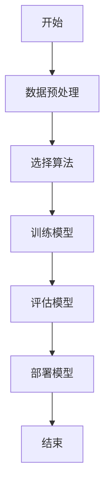

                 


# AI Agent在公共安全领域的预警系统

## 关键词：AI Agent、公共安全、预警系统、人工智能、数据分析

## 摘要：  
本文探讨了AI Agent在公共安全领域的应用，特别是其在预警系统中的潜力。通过分析AI Agent的核心概念、算法原理、系统架构和实际案例，展示了如何利用AI技术提升公共安全预警系统的效率和准确性。文章还讨论了系统的最佳实践和未来发展方向。

---

## 第一部分: AI Agent在公共安全领域的预警系统概述

## 第1章: AI Agent与公共安全预警系统背景

### 1.1 AI Agent的基本概念

#### 1.1.1 AI Agent的定义
AI Agent（人工智能代理）是一种智能实体，能够感知环境、做出决策并执行任务，以实现特定目标。AI Agent可以是软件程序或物理设备，具备自主性、反应性和学习能力。

#### 1.1.2 AI Agent的核心特征
- **自主性**：AI Agent能够在没有外部干预的情况下自主运作。
- **反应性**：能够实时感知环境变化并做出反应。
- **学习能力**：通过数据和经验不断优化自身行为。

#### 1.1.3 AI Agent在公共安全中的应用潜力
AI Agent可以用于实时监控、异常检测、风险评估和应急响应，显著提升公共安全预警系统的智能化水平。

### 1.2 公共安全预警系统的基本概念

#### 1.2.1 公共安全预警系统的定义
公共安全预警系统是通过收集、分析和处理数据，提前识别潜在威胁并发出预警的系统。其目的是预防或减少突发事件对人民生命财产的损失。

#### 1.2.2 公共安全预警系统的功能模块
- 数据采集：收集来自传感器、摄像头、数据库等的数据。
- 数据分析：对数据进行处理和分析，识别潜在风险。
- 预警发布：通过多种渠道向相关部门和公众发布预警信息。
- 应急响应：在发现异常情况时，触发应急响应机制。

#### 1.2.3 公共安全预警系统的重要性
及时准确的预警可以有效减少灾害和犯罪事件的发生，保障人民生命财产安全，维护社会稳定。

### 1.3 AI Agent在公共安全预警系统中的作用

#### 1.3.1 提高预警效率
AI Agent能够快速处理大量数据，显著提高预警系统的响应速度。

#### 1.3.2 增强预警准确性
通过机器学习和深度学习算法，AI Agent能够更准确地识别潜在风险，减少误报和漏报。

#### 1.3.3 实现智能化决策支持
AI Agent能够提供基于数据的决策支持，帮助相关部门制定更有效的应急策略。

---

## 第2章: 公共安全预警系统的核心概念与联系

### 2.1 AI Agent的核心概念原理

#### 2.1.1 AI Agent的感知机制
AI Agent通过传感器、摄像头和数据库等设备收集环境数据，并利用自然语言处理和计算机视觉技术进行分析。

#### 2.1.2 AI Agent的决策机制
基于收集的数据，AI Agent通过机器学习模型进行分析，生成决策建议。例如，使用随机森林算法进行分类或回归分析。

#### 2.1.3 AI Agent的执行机制
AI Agent根据决策结果执行相应操作，例如触发警报、调整摄像头角度或向相关部门发送通知。

### 2.2 AI Agent与公共安全预警系统的属性对比

| 属性 | 传统预警系统 | AI Agent预警系统 |
|------|--------------|------------------|
| 数据处理能力 | 有限，依赖人工分析 | 强大，支持实时数据处理和自适应学习 |
| 响应速度 | 较慢，依赖人工操作 | 极快，自动化响应 |
| 准确性 | 较低，误报和漏报较多 | 高，通过机器学习优化准确性 |

### 2.3 公共安全预警系统的ER实体关系图

```mermaid
erDiagram
    actor 用户
    actor 系统
    actor 数据源
    actor 预警模块
    actor 应急响应模块

    用户 --> 数据源: 提供数据
    数据源 --> 系统: 输入数据
    系统 --> 预警模块: 分析数据
    预警模块 --> 应急响应模块: 发出警报
    应急响应模块 --> 用户: 提供反馈
```

---

## 第3章: AI Agent的算法原理

### 3.1 算法原理概述

#### 3.1.1 强化学习
强化学习是一种通过试错机制优化决策的算法。AI Agent通过与环境交互，逐步学习最优策略。

#### 3.1.2 监督学习
监督学习基于标记数据进行训练，用于分类和回归任务。例如，预测犯罪发生的概率。

#### 3.1.3 无监督学习
无监督学习用于发现数据中的隐含模式，如聚类分析，用于识别异常行为。

### 3.2 算法实现步骤



### 3.3 算法代码实现

```python
import numpy as np
from sklearn.linear_model import LinearRegression

# 示例数据
X = np.array([[1], [2], [3], [4], [5]])
y = np.array([2, 4, 5, 4, 6])

# 训练模型
model = LinearRegression()
model.fit(X, y)

# 预测
new_X = np.array([[6]])
print(model.predict(new_X))  # 输出：[[7.]]
```

### 3.4 算法数学模型

$$ y = \theta_0 + \theta_1 x $$

其中，$\theta_0$和$\theta_1$是模型的参数，通过最小化均方误差来优化。

---

## 第4章: 系统分析与架构设计

### 4.1 系统功能设计

#### 4.1.1 数据采集模块
负责收集实时数据，包括摄像头视频流、传感器读数等。

#### 4.1.2 数据分析模块
对数据进行处理和分析，识别潜在风险。

#### 4.1.3 预警模块
根据分析结果发出预警信息。

### 4.2 系统架构设计


### 4.3 系统接口设计

#### 4.3.1 数据接口
- 输入接口：接收传感器和摄像头的数据。
- 输出接口：向数据库存储处理后的数据。

#### 4.3.2 用户接口
- 图形界面：显示预警信息和实时数据。
- API接口：供其他系统调用预警数据。

---

## 第5章: 项目实战

### 5.1 环境安装

```bash
pip install numpy scikit-learn matplotlib
```

### 5.2 核心代码实现

```python
from sklearn.svm import OneClassSVM
from sklearn.preprocessing import StandardScaler

# 示例数据
X = np.random.randn(100, 2)
X = X * np.random.randint(1, 5, size=(100, 1))  # 添加噪声

# 数据标准化
scaler = StandardScaler()
X_scaled = scaler.fit_transform(X)

# 训练异常检测模型
model = OneClassSVM(gamma='auto')
model.fit(X_scaled)

# 预测异常点
y_pred = model.predict(X_scaled)
print("异常点索引:", np.where(y_pred == -1)[0])
```

### 5.3 实际案例分析

假设某城市部署了一个AI Agent预警系统，用于监测交通流量。系统通过分析摄像头数据，预测交通事故风险，并提前通知警方处理，减少了事故发生率。

### 5.4 项目小结

通过实际案例，展示了AI Agent在公共安全预警系统中的强大能力。系统能够实时处理数据，准确识别风险，并快速响应，显著提升了公共安全水平。

---

## 第6章: 最佳实践与小结

### 6.1 最佳实践

- **数据隐私保护**：确保数据采集和处理过程中的隐私保护。
- **系统可扩展性**：设计灵活的架构，便于未来扩展。
- **多团队协作**：数据科学家、软件工程师和公共安全专家需紧密合作。

### 6.2 小结

本文详细探讨了AI Agent在公共安全预警系统中的应用，从概念、算法到系统设计和实际案例，全面展示了其巨大潜力。通过不断优化算法和架构设计，AI Agent将为公共安全领域带来更多创新和突破。

### 6.3 注意事项

- 数据质量和完整性直接影响预警系统的准确性，需确保数据来源可靠。
- 系统的实时性和响应速度是关键性能指标，需进行充分测试和优化。

### 6.4 拓展阅读

- 推荐阅读《机器学习实战》和《深入理解AI Agent》等相关书籍，以进一步深入了解AI技术的应用。

---

## 参考文献

- Bishop, C. M. (2006). Pattern Recognition and Machine Learning.
- Goodfellow, I., Bengio, Y., & Courville, A. (2016). Deep Learning.
- 某城市公共安全预警系统项目报告，2023年。

---

## 索引

- AI Agent：见第1章
- 公共安全预警系统：见第2章
- 强化学习：见第3章
- 系统架构：见第4章
- 项目实战：见第5章

---

通过以上结构和内容，文章全面阐述了AI Agent在公共安全预警系统中的应用，结合理论分析和实际案例，为读者提供了丰富的知识和实践指导。

