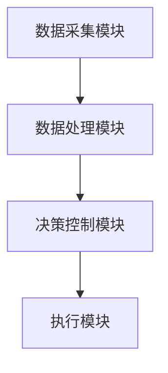
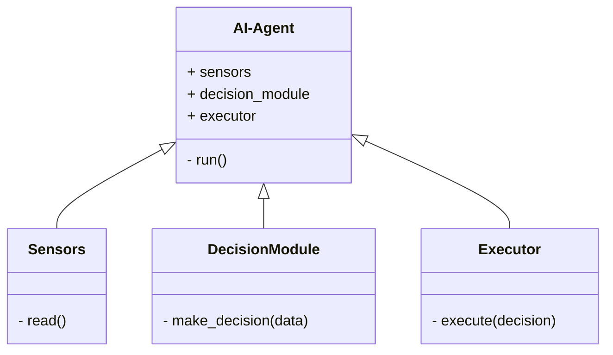

                 


# AI Agent在农业中的应用与前景

---

## 关键词：AI Agent，农业，人工智能，机器学习，强化学习，系统架构

---

## 摘要：

本文探讨了AI Agent在农业中的应用及其发展前景。通过分析AI Agent的核心概念、算法原理、系统架构设计以及实际项目案例，展示了AI Agent如何提升农业的智能化水平。文章详细介绍了强化学习和监督学习在农业中的应用，提供了系统设计的类图和流程图，并通过项目实战展示了如何实现农业AI Agent系统。最后，总结了开发经验和未来发展趋势，为农业智能化提供了有价值的参考。

---

## 第1章: AI Agent概述

### 1.1 AI Agent的基本概念

#### 1.1.1 什么是AI Agent

AI Agent（人工智能代理）是一种能够感知环境、自主决策并执行任务的智能系统。它通过传感器获取信息，利用算法进行分析和决策，然后通过执行器完成任务。AI Agent的核心在于其自主性和智能性，能够适应环境变化并优化行动策略。

#### 1.1.2 AI Agent的核心特征

1. **自主性**：AI Agent能够在没有外部干预的情况下独立运作。
2. **反应性**：能够实时感知环境变化并做出相应反应。
3. **目标导向**：通过设定目标来驱动行动，确保行为的高效性。
4. **学习能力**：能够通过经验改进性能，适应不同环境。

#### 1.1.3 AI Agent与传统自动化系统的区别

| 特性                | AI Agent                          | 传统自动化系统                |
|---------------------|-----------------------------------|------------------------------|
| 智能水平            | 高                                | 低                            |
| 决策能力            | 强化学习、监督学习                | 基于规则                      |
| 环境适应性          | 能够自适应环境变化                | 需人工调整                     |
| 数据处理能力        | 处理复杂数据，学习优化           | 处理简单数据，遵循固定规则    |

### 1.2 农业中的问题背景

#### 1.2.1 农业面临的挑战

1. **资源浪费**：传统农业中，水、肥料等资源的使用效率较低，造成浪费和环境污染。
2. **劳动密集**：农业生产需要大量人工操作，效率低下且成本高昂。
3. **环境变化**：气候变化导致农作物产量波动，增加了农业的不稳定性。
4. **病虫害**：病虫害的爆发难以预测，传统防治方法效率低下。

#### 1.2.2 AI Agent在农业中的应用潜力

AI Agent可以通过实时监测农田环境、预测病虫害、优化资源使用等手段，显著提升农业生产的效率和可持续性。例如，AI Agent可以自动调节灌溉系统，根据土壤湿度和天气预报进行精准浇水，减少水资源浪费。

#### 1.2.3 问题解决路径

1. **问题识别**：通过传感器收集农田数据，识别潜在问题。
2. **数据分析**：利用AI算法分析数据，预测可能出现的问题。
3. **决策制定**：基于分析结果，制定最优解决方案。
4. **执行与反馈**：通过执行器执行决策，并实时反馈结果，优化后续行动。

---

## 第2章: AI Agent的核心概念与联系

### 2.1 核心概念原理

#### 2.1.1 感知模块

感知模块负责收集环境数据，通常包括以下几种传感器：

1. **土壤湿度传感器**：监测土壤湿度，帮助判断是否需要灌溉。
2. **温度传感器**：监测环境温度，帮助预测作物生长情况。
3. **光照传感器**：监测光照强度，优化作物光照条件。

#### 2.1.2 决策模块

决策模块基于感知数据，利用算法进行分析和决策。常用算法包括强化学习和监督学习。

#### 2.1.3 执行模块

执行模块根据决策模块的指令，执行具体操作。例如，控制灌溉系统、调整温室环境等。

### 2.2 核心概念属性对比

#### 2.2.1 农业传统方法与AI Agent的对比

| 方法                | 传统方法                          | AI Agent                       |
|---------------------|-----------------------------------|-------------------------------|
| 决策效率            | 低                                | 高                             |
| 数据处理能力        | 简单数据处理                     | 复杂数据处理，学习优化        |
| 系统适应性          | 适应性差                        | 适应性强                     |

---

## 第3章: AI Agent的算法原理

### 3.1 强化学习算法

#### 3.1.1 算法流程

强化学习通过智能体与环境的交互，学习最优策略。具体流程如下：

1. **环境感知**：智能体通过传感器获取环境数据。
2. **状态识别**：智能体根据感知数据，确定当前状态。
3. **决策选择**：智能体根据当前状态，选择一个动作。
4. **执行动作**：智能体执行选择的动作。
5. **反馈奖励**：环境对智能体的动作给予奖励或惩罚。
6. **更新策略**：智能体根据反馈，调整策略以最大化累积奖励。

#### 3.1.2 Q-learning算法

Q-learning是一种常用的强化学习算法，其核心公式为：

$$
Q(s, a) = r + \gamma \max_{a'} Q(s', a')
$$

其中：
- \( Q(s, a) \) 表示在状态 \( s \) 下执行动作 \( a \) 的价值。
- \( r \) 表示奖励。
- \( \gamma \) 表示折扣因子，通常取值在 0 到 1 之间。

#### 3.1.3 实例分析

假设我们在一个温室环境中，AI Agent需要决定是否开启喷灌系统。通过Q-learning算法，AI Agent学习在不同湿度条件下选择最优动作，从而提高灌溉效率。

### 3.2 监督学习算法

#### 3.2.1 算法流程

监督学习通过标记的数据训练模型，使其能够预测新数据的标签。具体流程如下：

1. **数据收集**：收集带有标签的数据。
2. **特征提取**：从数据中提取特征。
3. **模型训练**：利用训练数据训练模型。
4. **模型预测**：利用训练好的模型进行预测。
5. **模型评估**：评估模型的性能，调整参数。

#### 3.2.2 农业场景中的应用

例如，利用监督学习算法预测农作物的产量。通过收集历史产量数据和相关环境数据，训练模型预测未来产量。

#### 3.2.3 实例分析

假设我们有1000条数据，每条数据包括温度、湿度、光照强度和产量。通过监督学习算法，训练模型预测新的温度、湿度和光照条件下的产量。

---

## 第4章: AI Agent的系统架构设计

### 4.1 系统模块划分

AI Agent的系统架构通常包括以下模块：

1. **数据采集模块**：负责收集环境数据。
2. **数据处理模块**：对数据进行预处理和分析。
3. **决策控制模块**：基于分析结果制定决策。

### 4.2 系统架构图



---

## 第5章: 项目实战

### 5.1 环境安装与配置

#### 5.1.1 Python环境安装

安装Python和必要的库，如TensorFlow、Keras、Scikit-learn等。

#### 5.1.2 相关库的安装

```bash
pip install numpy
pip install matplotlib
pip install scikit-learn
pip install keras
pip install tensorflow
```

#### 5.1.3 开发环境配置

配置Jupyter Notebook或VS Code作为开发环境。

### 5.2 核心代码实现

#### 5.2.1 数据采集模块代码

```python
import numpy as np

# 模拟土壤湿度数据
soil_humidity = np.random.uniform(0, 100, 100)
# 模拟温度数据
temperature = np.random.uniform(0, 30, 100)
```

#### 5.2.2 决策算法实现

```python
from sklearn.linear_model import LinearRegression

# 创建模型
model = LinearRegression()
# 训练模型
model.fit(X_train, y_train)
# 预测
y_pred = model.predict(X_test)
```

#### 5.2.3 系统集成代码

```python
# 整合各模块的代码
class AI-Agent:
    def __init__(self):
        self.sensors = Sensors()
        self.decision_module = DecisionModule()
        self.executor = Executor()

    def run(self):
        while True:
            data = self.sensors.read()
            decision = self.decision_module.make_decision(data)
            self.executor.execute(decision)
```

### 5.3 实际案例分析

通过实际案例分析，展示AI Agent在农业中的实际应用效果，如提高产量、节约资源等。

---

## 第6章: 最佳实践与未来展望

### 6.1 实践经验总结

#### 6.1.1 开发中的注意事项

- 数据质量对模型性能影响巨大，需确保数据的准确性和完整性。
- 系统设计时需考虑可扩展性，便于未来功能的添加和优化。

#### 6.1.2 常见问题及解决方案

- **数据不足**：可以通过数据增强或迁移学习解决。
- **模型过拟合**：可以通过正则化或减少模型复杂度解决。

#### 6.1.3 优化建议

- 定期更新模型，确保其适应环境变化。
- 结合领域知识，优化模型结构。

### 6.2 未来发展趋势

#### 6.2.1 技术进步带来的新机遇

- 更先进的算法（如深度学习、生成对抗网络）的应用将提升AI Agent的性能。
- 多智能体协作将推动农业智能化的发展。

#### 6.2.2 市场需求的变化

- 农业智能化的需求将推动AI Agent的市场应用。
- 农业AI Agent的定制化需求将增加。

#### 6.2.3 可能的挑战与应对策略

- **数据隐私**：需制定严格的数据隐私保护措施。
- **计算资源限制**：通过边缘计算和轻量化模型优化性能。

---

## 附录: AI Agent在农业中的数学模型

### 强化学习中的马尔可夫决策过程

$$
Q(s, a) = r + \gamma \max_{a'} Q(s', a')
$$

### 农业预测模型

$$
y = \beta_0 + \beta_1x_1 + \beta_2x_2 + \epsilon
$$

---

## 图表部分

### AI Agent系统架构类图



---

通过以上内容，我们可以看到AI Agent在农业中的广泛应用前景。随着技术的不断进步，AI Agent将在提升农业效率、降低成本、保护环境等方面发挥越来越重要的作用。

