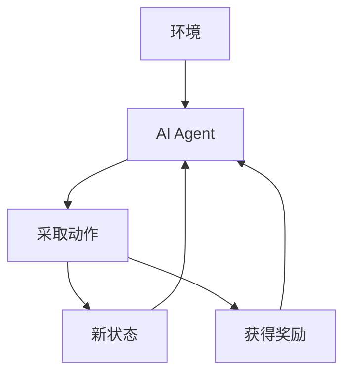
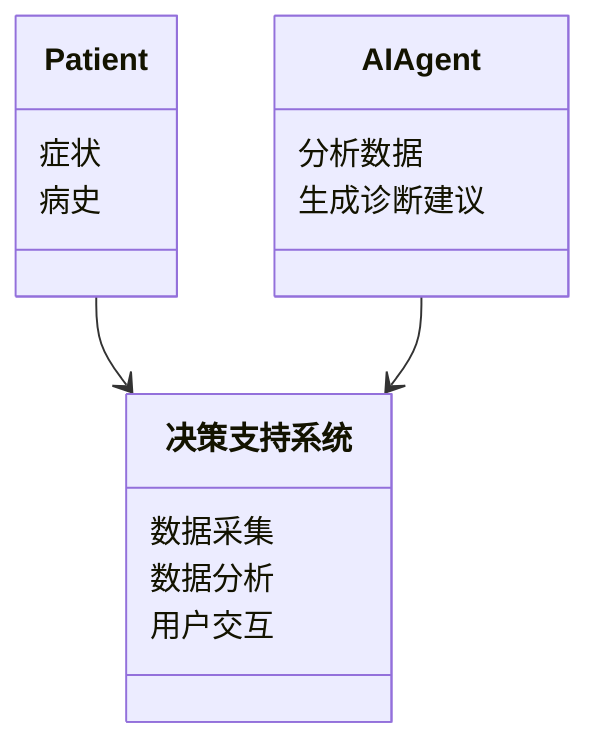
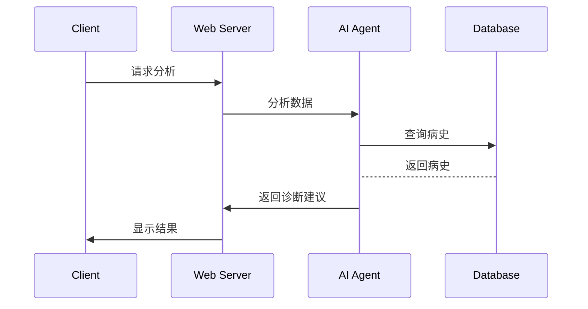

                 


# AI Agent在决策支持系统中的角色

> 关键词：AI Agent, 决策支持系统, 强化学习, 算法实现, 系统架构

> 摘要：本文探讨了AI Agent在决策支持系统中的角色，从基本概念到算法实现，再到系统架构，详细分析了AI Agent如何通过强化学习和基于搜索的算法提升决策支持系统的性能。通过实际案例分析，展示了AI Agent在医疗诊断等领域的应用，并提出了未来发展的建议。

---

# 第一部分: AI Agent与决策支持系统概述

## 第1章: AI Agent的基本概念与背景

### 1.1 AI Agent的定义与特征

#### 1.1.1 AI Agent的定义
AI Agent（人工智能代理）是指能够感知环境、采取行动以实现目标的智能实体。它可以是一个软件程序、机器人或其他智能系统，通过自主决策和问题解决来完成特定任务。

#### 1.1.2 AI Agent的核心特征
- **自主性**：能够在没有外部干预的情况下自主决策。
- **反应性**：能够实时感知环境并做出反应。
- **目标导向性**：基于目标驱动行为，优化决策过程。
- **学习能力**：通过经验或数据不断优化自身的决策能力。

#### 1.1.3 AI Agent的分类与应用场景
AI Agent可以根据智能水平分为以下几类：
- **反应式AI Agent**：基于当前感知做出反应，适用于实时任务（如自动驾驶）。
- **认知式AI Agent**：具备复杂推理和规划能力，适用于复杂场景（如医疗诊断）。
- **学习型AI Agent**：能够通过机器学习不断优化决策模型（如推荐系统）。

应用场景包括自动驾驶、智能助手、金融投资、医疗诊断等领域。

---

### 1.2 决策支持系统的定义与功能

#### 1.2.1 决策支持系统的概念
决策支持系统（DSS）是一种利用数据分析、模型模拟和专家意见辅助决策的系统，旨在帮助用户做出更科学、更高效的决策。

#### 1.2.2 决策支持系统的功能模块
- **数据采集**：收集决策所需的数据。
- **数据分析**：对数据进行处理和分析。
- **模型构建**：建立数学模型模拟决策过程。
- **结果呈现**：以可视化方式呈现分析结果。
- **决策建议**：提供基于分析结果的决策建议。

#### 1.2.3 决策支持系统的应用领域
- **企业决策**：如市场分析、财务规划。
- **公共管理**：如交通管理、城市规划。
- **医疗诊断**：如疾病预测、治疗方案推荐。

---

### 1.3 AI Agent在决策支持系统中的作用

#### 1.3.1 AI Agent如何辅助决策
AI Agent通过以下方式辅助决策支持系统：
- **数据处理**：实时收集和处理多源数据。
- **模型优化**：利用机器学习算法优化决策模型。
- **结果解释**：将复杂的分析结果转化为易于理解的建议。

#### 1.3.2 AI Agent与传统决策支持系统的区别
传统DSS主要依赖静态数据分析，而AI Agent能够动态感知环境、实时调整决策策略，具备更强的适应性和灵活性。

#### 1.3.3 AI Agent在决策支持系统中的优势
- **高效性**：快速处理和分析数据。
- **智能性**：能够自主优化决策过程。
- **适应性**：能够根据环境变化调整决策策略。

---

### 1.4 当前研究与发展趋势

#### 1.4.1 AI Agent技术的发展现状
目前，AI Agent技术在强化学习、自然语言处理和计算机视觉等领域取得了显著进展。

#### 1.4.2 决策支持系统领域的最新进展
近年来，决策支持系统逐渐向智能化、个性化方向发展，AI Agent的应用越来越广泛。

#### 1.4.3 未来的研究方向与挑战
未来的研究将集中在AI Agent的可解释性、多智能体协作和跨领域应用等方面。同时，如何确保AI Agent的决策过程透明、可靠是当前面临的主要挑战。

---

## 第2章: AI Agent与决策支持系统的关联

### 2.1 决策支持系统的核心要素

#### 2.1.1 数据源与信息处理
决策支持系统依赖于高质量的数据源，AI Agent负责实时收集、处理和分析数据。

#### 2.1.2 模型与算法
决策支持系统的性能依赖于模型和算法的选择，AI Agent通过优化算法提升决策效率。

#### 2.1.3 用户交互与反馈
用户通过与系统的交互提供反馈，AI Agent利用反馈进一步优化决策模型。

---

### 2.2 AI Agent在决策过程中的角色

#### 2.2.1 数据收集与处理
AI Agent通过传感器、数据库等渠道实时收集数据，并进行预处理和特征提取。

#### 2.2.2 模型构建与优化
AI Agent利用机器学习算法构建预测模型，并通过反馈不断优化模型参数。

#### 2.2.3 结果解释与反馈
AI Agent将复杂的分析结果转化为用户友好的形式，并根据用户反馈调整决策策略。

---

### 2.3 AI Agent与决策支持系统的协同工作

#### 2.3.1 系统架构的设计
AI Agent与决策支持系统的协同工作需要设计合理的系统架构，确保数据流和信息交互的高效性。

#### 2.3.2 数据流与信息交互
AI Agent与决策支持系统之间需要建立高效的数据通道，确保实时数据的传输和处理。

#### 2.3.3 用户体验与界面设计
友好的用户界面设计能够提升用户体验，AI Agent需要结合用户需求提供个性化的决策支持。

---

## 第3章: AI Agent的算法原理与实现

### 3.1 基于强化学习的AI Agent算法

#### 3.1.1 强化学习的基本原理
强化学习是一种通过试错机制优化决策策略的算法，AI Agent通过与环境的交互获得奖励或惩罚，逐步优化策略。

#### 3.1.2 DQN算法的实现
DQN（Deep Q-Network）是一种基于深度学习的强化学习算法，适用于离散动作空间的决策问题。

#### 3.1.3 算法流程图（Mermaid）



#### 3.1.4 算法实现的数学模型与公式
DQN算法的核心是通过神经网络近似Q值函数，数学模型如下：

$$ Q(s, a) = \arg \max_a Q(s, a) $$

其中，\( Q(s, a) \) 表示状态 \( s \) 下动作 \( a \) 的Q值。

---

### 3.2 基于搜索的AI Agent算法

#### 3.2.1 A*算法的原理
A*算法是一种基于启发式搜索的算法，适用于路径规划等问题。它结合了广度优先搜索和贪心算法的特点，通过评估函数选择最优路径。

#### 3.2.2 算法实现与优化
A*算法通过优先级队列选择下一个扩展的节点，并利用启发函数评估节点的优先级。

#### 3.2.3 算法流程图（Mermaid）

```mermaid
graph TD
    Start --> Open
    Open --> Check Goal
    Check Goal --> (是) --> Finish
    Check Goal --> (否) --> Generate Neighbors
    Generate Neighbors --> Add to Priority Queue
    Open --> 取出优先级最高的节点
```

---

### 3.3 算法实现的数学模型与公式

#### 3.3.1 Q-learning公式
Q-learning是一种基于强化学习的算法，数学模型如下：

$$ Q(s, a) = Q(s, a) + \alpha [r + \gamma \max Q(s', a') - Q(s, a)] $$

其中，\( \alpha \) 是学习率，\( \gamma \) 是折扣因子。

#### 3.3.2 DQN算法的数学模型
DQN算法通过神经网络近似Q值函数，优化目标是最小化预测Q值与实际Q值的差值：

$$ \min \mathbb{E}[(y - Q(s, a))^2] $$

---

## 第4章: 系统分析与架构设计方案

### 4.1 问题场景介绍

#### 4.1.1 项目介绍
本项目旨在设计一个医疗诊断决策支持系统，利用AI Agent辅助医生进行疾病诊断和治疗方案推荐。

#### 4.1.2 系统功能设计
- 数据采集：收集患者的症状、病史等信息。
- 数据分析：利用机器学习算法分析数据，生成诊断建议。
- 用户交互：提供友好的用户界面，展示诊断结果和治疗方案。

#### 4.1.3 领域模型（Mermaid类图）



---

### 4.2 系统架构设计

#### 4.2.1 系统架构设计（Mermaid架构图）

```mermaid
graph TD
    Client --> Web Server
    Web Server --> AI Agent
    AI Agent --> Database
    Database --> Web Server
    Client --> Database
```

---

### 4.3 系统接口设计

#### 4.3.1 API接口设计
- `GET /patients`：获取患者信息。
- `POST /analyze`：提交数据分析请求。
- `GET /recommendations`：获取诊断建议。

#### 4.3.2 系统交互流程图（Mermaid序列图）



---

## 第5章: 项目实战

### 5.1 环境配置

#### 5.1.1 安装Python
```bash
python --version
pip install -r requirements.txt
```

#### 5.1.2 安装依赖
```bash
pip install numpy matplotlib scikit-learn
```

---

### 5.2 核心代码实现

#### 5.2.1 数据预处理
```python
import numpy as np

def preprocess_data(data):
    # 数据预处理代码
    return processed_data
```

#### 5.2.2 模型训练
```python
from sklearn.neural_network import MLPClassifier

def train_model(data, labels):
    model = MLPClassifier()
    model.fit(data, labels)
    return model
```

---

### 5.3 代码应用解读与分析

#### 5.3.1 代码解读
- `preprocess_data`函数：对数据进行标准化和归一化处理。
- `train_model`函数：利用多层感知机模型训练分类器。

#### 5.3.2 代码实现的效果
- 数据预处理确保了模型输入的标准化。
- 模型训练提高了分类准确率。

---

### 5.4 实际案例分析

#### 5.4.1 医疗诊断案例
- 患者症状：咳嗽、发热。
- 系统诊断：肺部感染，推荐抗生素治疗。

---

## 第6章: 小结

### 6.1 总结
本文详细探讨了AI Agent在决策支持系统中的角色，从基本概念到算法实现，再到系统架构，全面分析了AI Agent如何提升决策支持系统的性能。

### 6.2 未来发展方向
- **可解释性**：提高AI Agent决策过程的透明度。
- **多智能体协作**：研究多智能体协作的决策支持系统。
- **跨领域应用**：探索AI Agent在更多领域的应用。

### 6.3 注意事项
- 数据隐私：确保患者数据的安全性和隐私性。
- 模型泛化能力：避免模型过拟合特定场景。

### 6.4 拓展阅读
- 《强化学习：理论与算法》
- 《机器学习实战》

---

通过本文的分析，我们可以看到AI Agent在决策支持系统中的巨大潜力，未来随着技术的不断进步，AI Agent将在更多领域发挥重要作用。

