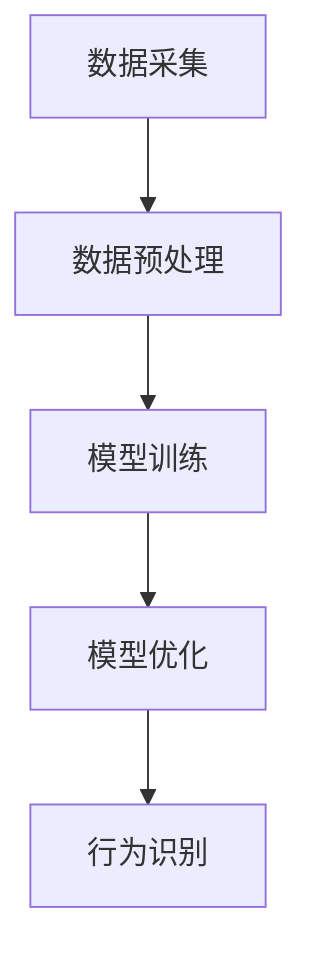
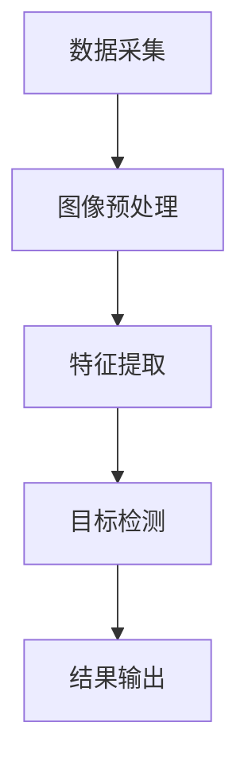
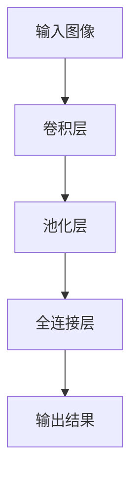
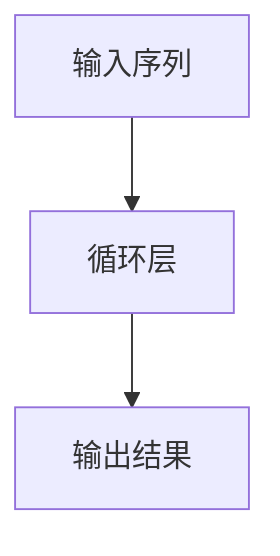

                 

# AI Agent在动物保护中的应用：行为分析与栖息地管理

---

## 关键词：
- AI Agent
- 动物保护
- 行为分析
- 栖息地管理
- 深度学习
- 强化学习
- 图像识别

---

## 摘要：
本文探讨了AI Agent在动物保护中的应用，重点分析了其在动物行为分析和栖息地管理中的作用。通过结合深度学习和强化学习等技术，AI Agent能够有效监测和保护动物，优化栖息地管理，为动物保护提供了新的解决方案。

---

## 目录大纲：

### 第1章: AI Agent与动物保护的背景介绍
1.1 AI Agent的基本概念  
1.2 动物保护的现状与挑战  

### 第2章: AI Agent在动物行为分析中的应用
2.1 动物行为分析的背景与目标  
2.2 基于AI Agent的行为识别模型  

### 第3章: AI Agent在栖息地管理中的应用
3.1 栖息地管理的核心问题  
3.2 基于AI Agent的栖息地监测系统  

### 第4章: AI Agent的行为预测与决策支持
4.1 行为预测的基本原理  
4.2 基于AI Agent的决策支持系统  

### 第5章: AI Agent在动物保护中的算法实现
5.1 基于深度学习的行为识别算法  
5.2 基于强化学习的决策优化算法  

---

## 第1章: AI Agent与动物保护的背景介绍

### 1.1 AI Agent的基本概念

AI Agent（人工智能代理）是一种能够感知环境、自主决策并执行任务的智能实体。它具备以下核心特征：
1. **自主性**：能够在没有外部干预的情况下自主运行。
2. **反应性**：能够实时感知环境变化并做出相应反应。
3. **目标导向**：具有明确的目标，并根据目标优化其行为。
4. **学习能力**：能够通过数据和经验不断优化自身的算法。

AI Agent的应用领域非常广泛，包括自动驾驶、智能助手、机器人控制等。在动物保护领域，AI Agent可以用于监测动物行为、预测栖息地变化等。

---

### 1.2 动物保护的现状与挑战

动物保护是一个全球性的难题，面临着以下主要挑战：
1. **栖息地破坏**：人类活动导致的森林砍伐、城市化等使得动物的栖息地不断缩小。
2. **非法捕猎**：非法捕猎活动严重威胁许多濒危物种的生存。
3. **气候变化**：气候变化导致的环境变化对动物的生存环境造成严重影响。
4. **监测成本高**：传统的动物监测方法需要大量的人力和物力，成本较高。

AI Agent的应用为解决这些问题提供了新的思路。通过部署AI Agent，可以实现对动物行为的实时监测、栖息地的智能管理，从而提高动物保护的效率。

---

## 第2章: AI Agent在动物行为分析中的应用

### 2.1 动物行为分析的背景与目标

动物行为分析是研究动物行为模式和行为特征的科学，旨在理解动物的行为规律，为保护工作提供科学依据。传统的动物行为分析方法依赖于人工观察和记录，效率较低且容易受到主观因素的影响。

AI Agent的应用使得动物行为分析更加高效和精准。通过结合图像识别、深度学习等技术，AI Agent能够自动识别动物的行为模式，帮助研究人员更好地理解动物的行为特征。

---

### 2.2 基于AI Agent的行为识别模型

#### 2.2.1 行为识别的基本流程

1. **数据采集**：通过摄像头、传感器等设备采集动物的行为数据。
2. **数据预处理**：对采集到的数据进行清洗和标注，确保数据的准确性和一致性。
3. **模型训练**：使用深度学习算法（如卷积神经网络）对数据进行训练，构建行为识别模型。
4. **模型优化**：通过调整模型参数和优化算法，提高模型的识别准确率。

#### 2.2.2 基于深度学习的行为识别算法

以下是一个基于深度学习的行为识别算法的流程图：

#### 2.2.3 行为识别模型的训练与优化

在训练行为识别模型时，通常使用卷积神经网络（CNN）作为主干网络。以下是模型训练的主要步骤：

1. **数据增强**：通过旋转、缩放、翻转等操作增加数据集的多样性，防止过拟合。
2. **损失函数**：使用交叉熵损失函数来衡量预测结果与真实标签的差距。
3. **优化算法**：使用Adam优化器来更新模型参数，优化过程如下：

$$ \theta_{t+1} = \theta_t - \eta \frac{\partial L}{\partial \theta_t} $$

其中，$\theta$ 表示模型参数，$\eta$ 表示学习率，$L$ 表示损失函数。

4. **模型评估**：通过准确率、召回率等指标评估模型的性能，并根据评估结果进一步优化模型。

---

## 第3章: AI Agent在栖息地管理中的应用

### 3.1 栖息地管理的核心问题

栖息地管理的目标是保护和恢复动物的栖息地，确保动物种群的生存和繁衍。以下是栖息地管理的核心问题：
1. **栖息地破坏**：人类活动导致的栖息地破坏是动物保护的主要威胁。
2. **栖息地监测**：需要实时监测栖息地的变化，及时发现和处理问题。
3. **栖息地恢复**：通过生态修复等手段恢复被破坏的栖息地。

### 3.2 基于AI Agent的栖息地监测系统

#### 3.2.1 栖息地监测的基本流程

1. **数据采集**：通过卫星遥感、无人机等设备采集栖息地的地理数据。
2. **数据分析**：利用AI Agent对数据进行分析，识别栖息地的变化趋势。
3. **决策支持**：根据分析结果提出栖息地保护和恢复的建议。

#### 3.2.2 基于图像识别的栖息地监测技术

图像识别技术在栖息地监测中发挥着重要作用。以下是基于图像识别的栖息地监测系统的工作流程：

---

## 第4章: AI Agent的行为预测与决策支持

### 4.1 行为预测的基本原理

行为预测的目标是根据动物的历史行为数据，预测其未来的行为模式。以下是行为预测的基本原理：
1. **数据收集**：收集动物的行为数据，包括时间、地点、行为类型等。
2. **特征提取**：从数据中提取有助于预测行为的特征。
3. **模型训练**：使用强化学习算法训练行为预测模型。

### 4.2 基于AI Agent的决策支持系统

#### 4.2.1 决策支持系统的基本概念

决策支持系统是一种利用数据和模型辅助决策的系统。在动物保护中，决策支持系统可以用于优化栖息地管理、制定保护策略等。

#### 4.2.2 AI Agent在决策支持中的作用

AI Agent可以通过实时监测动物行为和栖息地变化，为决策支持系统提供数据支持，帮助制定科学的保护策略。

---

## 第5章: AI Agent在动物保护中的算法实现

### 5.1 基于深度学习的行为识别算法

#### 5.1.1 深度学习的基本原理

深度学习是一种基于人工神经网络的机器学习技术，通过多层神经网络提取数据的特征，实现对数据的分类和识别。

#### 5.1.2 基于卷积神经网络的行为识别

卷积神经网络（CNN）是一种常用的图像识别算法，适用于动物行为识别中的图像分类任务。以下是CNN的基本结构：

#### 5.1.3 基于循环神经网络的行为预测

循环神经网络（RNN）适用于时间序列数据的处理，可以用于动物行为的预测任务。以下是RNN的基本结构：

### 5.2 基于强化学习的决策优化算法

#### 5.2.1 强化学习的基本原理

强化学习是一种通过试错机制优化决策的算法。AI Agent通过与环境的交互，学习最优的决策策略。

#### 5.2.2 基于Q-learning的决策优化

Q-learning是一种常用的强化学习算法，适用于离散动作空间的决策问题。以下是Q-learning的算法流程：

1. **初始化**：设置初始状态和动作值表。
2. **状态感知**：AI Agent感知当前状态。
3. **动作选择**：根据当前状态选择动作。
4. **执行动作**：执行选择的动作，观察新的状态和奖励。
5. **更新Q值**：根据奖励更新Q值表。

---

## 总结

通过上述分析，我们可以看到AI Agent在动物保护中的应用潜力巨大。无论是行为分析还是栖息地管理，AI Agent都能够通过其强大的感知和决策能力，为动物保护提供科学支持。未来，随着AI技术的不断发展，AI Agent在动物保护中的应用将更加广泛和深入。

---

**本文结束**

